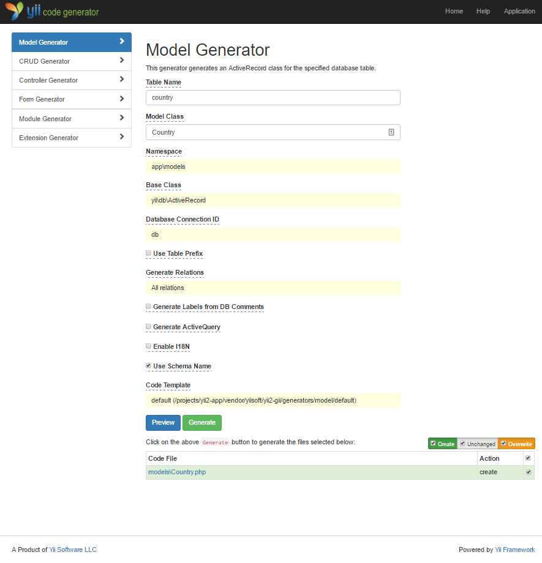

# <div dir="rtl">إنشاء الشيفرة البرمجية من خلال ال gii</div>

<p dir="rtl">
    في هذا الجزء التعليمي سنتعرف على آلية التعامل مع ال <a href="https://www.yiiframework.com/extension/yiisoft/yii2-gii/doc/guide">Gii</a>، والذي يستخدم لإنتاج الشيفرة البرمجية الخاصة بمعظم الميزات والخصائص المشتركة في أغلب المواقع بشكل تلقائي، بالإضافة الى ذلك، فإن استخدام ال Gii لإنشاء الشيفرة البرمجية بشكل تلقائي يمثل مجموعة من المعلومات الصحيحة التي بتم إدخالها إعتمادا على التعليمات الموجودة في ال Gii Web Pages.
</p>

<p dir="rtl">
    من خلال هذا البرنامج التعليمي، ستتعلم كيفية:
</p>

<ul dir="rtl">
    <li>تفعيل ال Gii داخل التطبيق الخاص بك</li>
    <li>إستخدام ال Gii لإنشاء ال Active Record class</li>
    <li>إستخدام ال Gii لإنشاء الشيفرة البرمجية الخاصة بال CRUD إعتمادا على الجداول الموجودة في قاعدة البيانات</li>
    <li>تخصيص (custmize) الشيفرة البرمجية التي سيتم إنتاجها من خلال ال Gii.</li>
</ul>

## <div dir="rtl">البدء باستخدام ال Gii</a> <span id="starting-gii"></span>

<p dir="rtl">
    يتم تقديم ال <a href="https://www.yiiframework.com/extension/yiisoft/yii2-gii/doc/guide">Gii</a> داخل على ال Yii على أنه <a href="../guide/structure-modules.md">module</a>، ويمكنك تفعيله من خلال الإعدادات الخاصة به والتي تجدها داخل ال application، وبالتحديد داخل ال property التالية [[yii\base\Application::modules|modules]]، واعتمادا على كيفية إنشائك للمشروع، فيمكنك إيجاد الشيفرة البرمجية التالية موجودة بشكل مسبق داخل ال <code>config/web.php</code>:  
</p>

```php
$config = [ ... ];

if (YII_ENV_DEV) {
    $config['bootstrap'][] = 'gii';
    $config['modules']['gii'] = [
        'class' => 'yii\gii\Module',
    ];
}
```

<p dir="rtl">
    في الإعدادت الموجودة في الأعلى، فإن التطبيق سيقوم بتضمين وتفعيل ال gii في حال كانت الحالة الخاصة بالتطبيق هي <a href="../guide/concept-configurations.md#environment-constants">development enviroment</a>، بالإضافة الى ذلك، فإنه يجب تضمين واستخدام ال module <code>gii</code>، والموجود ضمن ال class التالي [[yii\gii\Module]]. 
</p>


<p dir="rtl">
    اذا قمت بالتحقق من ال <a href="../guide/structure-entry-scripts.md">entry script</a> وبالتحديد صفحة ال <code>web/index.php</code> في التطبيق الخاص بك، ستجد هذه الأسطر، والتي يجب أن تجعل من ال <code>YII_ENV_DEV</code> ذات قيمة <code>true</code>.
</p>

```php
defined('YII_ENV') or define('YII_ENV', 'dev');
```

<p dir="rtl">
    كل الشكر لهذا السطر البرمجي، التطبيق الآن أصبح بحالة ال development mode، وأصبح لديك ال Gii enabled بالفعل، والآن، يمكنك الوصول الى ال Gii من خلال عنوان ال URL التالي:     
</p>

```
http://hostname/index.php?r=gii
```

<blockquote><p dir="rtl">
    ملاحظة: إذا كنت تحاول الوصول إلى Gii  من جهاز آخر غير ال localhost، فسيتم رفض الوصول افتراضيًا لأغراض أمنية، ولكن، يمكنك إعداد ال Gii لإضافة مجموعة من ال IP Addresses المسموح لها بالوصول وذلك من خلال: 
</p></blockquote>

```php
'gii' => [
    'class' => 'yii\gii\Module',
    'allowedIPs' => ['127.0.0.1', '::1', '192.168.0.*', '192.168.178.20'] // عدل هذه حسب إحتياجاتك
],
```


## <div dir="rtl">إنشاء ال Active Record Class من خلال ال Gii</div> <span id="generating-ar"></span>

<p dir="rtl">
    لإستخدام ال Gii لإنشاء ال Active Record class, قم باختيار ال "Model Generator" (من خلال النقر على الرابط الموجود بالصفحة الرئيسية لل Gii)، ومن ثم قم بتعبئة ال form كما يلي: 
</p>

<ul dir="rtl">
    <li>إسم الجدول: <code>country</code></li>
    <li><code>Country</code> :Model Class</li>
</ul>



<p dir="rtl">
    والآن، قم بالنقر على الزر "Preview"، ستشاهد الآن <code>models/Country.php</code> قد تم إنشائها وإضافتها الى قائمة النتائج، اذا قمت بالنقر على إسم ال class، فإن المحتوى الخاص بهذا ال class سيتم عرضه.
</p>

<p dir="rtl">
    عند استخدام ال Gii، إذا كنت قد قمت بالفعل بإنشاء نفس الملف وستقوم بعمل overwriting عليه، فيمكنك النقر على زر <code>diff</code> الموجود بعد إسم ال class، لتشاهد الفرق بين الشيفرة البرمجية الحالية، والشيفرة البرمجية الجديدة. 
</p>


When overwriting an existing file, check the box next to "overwrite" and then click  the "Generate" button. If creating a new file, you can just click "Generate". 

Next, you will see
a confirmation page indicating the code has been successfully generated. If you had an existing file, you'll also see a message indicating that it was overwritten with the newly generated code.


Generating CRUD Code <span id="generating-crud"></span>
--------------------

CRUD stands for Create, Read, Update, and Delete, representing the four common tasks taken with data on most Web sites. To create CRUD functionality using Gii, select the "CRUD Generator" (by clicking the link on the Gii index page). For the "country" example, fill out the resulting form as follows:

* Model Class: `app\models\Country`
* Search Model Class: `app\models\CountrySearch`
* Controller Class: `app\controllers\CountryController`


Next, click on the "Preview" button. You will see a list of files to be generated, as shown below.


If you previously created the `controllers/CountryController.php` and
`views/country/index.php` files (in the databases section of the guide), check the "overwrite" box to replace them. (The previous versions did not have full CRUD support.)


Trying it Out <span id="trying-it-out"></span>
-------------

To see how it works, use your browser to access the following URL:

```
http://hostname/index.php?r=country%2Findex
```

You will see a data grid showing the countries from the database table. You may sort the grid,
or filter it by entering filter conditions in the column headers.

For each country displayed in the grid, you may choose to view its details, update it, or delete it.
You may also click on the "Create Country" button on top of the grid to be provided with a form for creating a new country.


The following is the list of the files generated by Gii, in case you want to investigate how these features are implemented,
or to customize them:

* Controller: `controllers/CountryController.php`
* Models: `models/Country.php` and `models/CountrySearch.php`
* Views: `views/country/*.php`

> Info: Gii is designed to be a highly customizable and extensible code generation tool. Using it wisely
  can greatly accelerate your application development speed. For more details, please refer to
  the [Gii](https://www.yiiframework.com/extension/yiisoft/yii2-gii/doc/guide) section.


Summary <span id="summary"></span>
-------

In this section, you have learned how to use Gii to generate the code that implements complete
CRUD functionality for content stored in a database table.
