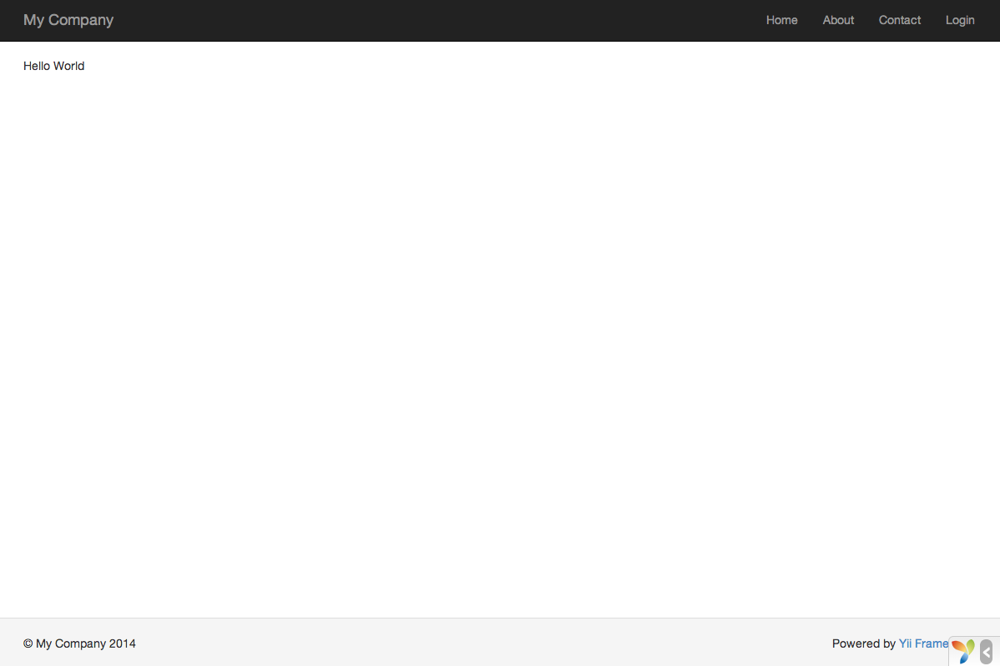

# <div dir="rtl">قل مرحبا - Saying Hello</div>

<p dir="rtl">
    في هذا الموضوع سنتعرف على كيفية إنشاء صفحة "Hello" جديدة في التطبيق الذي قمت بتثبيته، ولتحقيق ذلك، يجب عليك القيام بإنشاء <a href="../guide/structure-controllers.md#creating-actions">action</a> و <a href="../guide/structure-views.md">view</a> لهذه الصفحة:
</p>

<ul dir="rtl">
    <li>سيقوم التطبيق بإرسال ال request الخاص بالصفحة إلى ال action.</li>
    <li>وسيقوم ال action بدوره في جلب ال view التي تعرض كلمة "Hello" إلى المستخدم النهائي.</li>
</ul>

<p dir="rtl">
    من خلال هذا البرنامج التعليمي ، ستتعلم ثلاثة أشياء: 
</p>

<ol dir="rtl">
    <li>كيفية إنشاء <a href="../guide/structure-controllers.md#creating-actions">action</a> ليقوم بإستقبال ال request ومن ثم الرد (respond) عليها.</li>
    <li>كيفية إنشاء <a href="../guide/structure-views.md">view</a> وإضافة المحتوى الى ال respond.</li>
    <li>و كيفية إنشاء التطبيق لل requests التي يوجهها لل <a href="../guide/structure-controllers.md#creating-actions">actions</a>. </li>
</ol>

##  <div dir="rtl">إنشاء ال Action</div> <span id="creating-action"></span>

<p dir="rtl">
    لإنشاء صفحة "Hello"، ستقوم بإنشاء <code>say</code> <a href="../guide/structure-controllers.md#creating-actions">action</a> والذي بدوره سيقوم  بقراءة ال <code>message</code> parameter من ال request، ومن ثم عرض ال <code>message</code> مرة أخرى إلى المستخدم. إذا كان ال request لا يحمل معه ال message parameter فإن ال action سيقوم بطباعة message إفتراضية وهي "Hello".
</p>

<blockquote class="info"><p dir="rtl">
    معلومة: ال <a href="../guide/structure-controllers.md#creating-actions">Actions</a> هي الكائنات(objects) التي يمكن للمستخدمين من الوصول اليها وتنفيذ ما في بداخلها بشكل مباشر.  يتم تجميع هذه ال Actions بواسطة ال <a href="../guide/structure-controllers.md">controllers</a>. ونتيجة لذلك فإن ال response الراجعة للمستخدم ستكون هي نتيجة التنفيذ الخاصة بال action. 
</p></blockquote>

<p dir="rtl">
    يجب تعريف ال actions داخل ال <a href="../guide/structure-controllers.md">controller</a>، ولتبسيط الفكرة، سنقوم بتعريف ال <code>say</code> action داخل أحد ال controller الموجود مسبقا وهو ال <code>siteController</code>. هذا ال controller ستجده داخل المسار <code>controllers/siteController.php</code>. ومن هنا سنبدأ بإضافة ال action الجديد: 
</p>

```php
<?php

namespace app\controllers;

use yii\web\Controller;

class SiteController extends Controller
{
    // ...existing code...

    public function actionSay($message = 'Hello')
    {
        return $this->render('say', ['message' => $message]);
    }
}
```

<p dir="rtl">
    في الشيفرة البرمجية السابقة ، تم تعريف ال <code>say</code> action من خلال إنشاء الدالة <code>actionSay</code> داخل الكلاس  <code>siteController</code>. يستخدم ال Yii كلمة action ك prefix للدوال للتميز بين الدوال ال action و ال non-action في ال controller، كما يستخدم الإسم الخاص بال action مباشرة بعد ال prefix، ويتم عمل mapping بين ال action method name وال action id ليستطيع المستخدم من الوصول للدالة المنشئة من خلال ال action id. 
</p>

<p dir="rtl">
    عندما يتعلق الأمر بتسمية ال action الخاصة بك، يجب عليك  أن تفهم كيف يقوم ال Yii بالتعامل مع ال action id، ال action id يجب أن يكون دائما أحرف lower case، وإذا إحتوى ال action id على عدة كلمات فإن الفاصل بينهم سيكون الداش (dashes)  مثل  <code>create-comment</code>، ويتم ربط ال action id بال action method name من  خلال حذف ال dashes من ال IDs، ويتم عمل capitalizing لأول خرف من كل كلمة، وإضافة ال prefix الى الناتج السابق من التحويل. مثال: ال action id المسمى ب <code>create-comment</code> سيتم تحويله الى ال action method name التالي: <code>actionCreateComment</code>. 
</p>

<p dir="rtl">
    في المثال السابق، يقوم ال action method على إستقبال parameter يسمى ب <code>$message</code>، والذي يملك قيمة إفتراضية وهي <code>"Hello"</code> (وهي مشابة تماما لطريقة وضع القيم الإفتراضية لل argument في ال PHP). عندما يستقبل التطبيق ال request ويحدد أن ال action المطلوب للتعامل مع الطلب (request) هو <code>say</code>، فإن التطبيق سيقوم بإسناد القيمة الموجودة بال request الى ال parameter الموجود بال action بشرط أن يكون الإسم الموجود بال request هو نفسه الموجود في ال action. ولتبسيط الموضوع يمكن القول أن ال request اذا احتوى على كلمة <code>message</code> وقيمة هذا ال parameter هي <code>"GoodBye"</code>، فإن ال <code>$message</code> الموجودة في ال action ستصبح قيمتها <code>"GoodBye"</code>.  
</p>


<p dir="rtl">
    من خلال ال action method، يتم استدعاء ال  [[yii\web\Controller::render()|render()]] لتقديم
الملف الخاص بال view والمسمى هنا ب <code>say</code>. أيضا فإن ال <code>message</code> يتم تمرريرها الى ال view مما يسمح لك باستخدام هذا ال parameter داخل ال view. النتيجة المرجعة لل view تتم معالجتها وإرجاعها من خلال ال action method، وهذه النتائج سيتم إستقبالها من خلال المتصفح الخاص بالمستخدم ليتم عرضها وكأنها (جزء من صفحة Html كاملة). 
</p>

## <div dir="rtl">إنشاء ال View</div> <span id="creating-view"></span>

<p dir="rtl">
    ال <a href="../guide/structure-views.md">Views</a> هي شيفرات برمجية كتبت ﻹنشاء المحتوى المناسب بنائا على ال response الراجع اليها من خلال ال action. 
    بالنسبة إلى مثال "Hello" ، الآن سنقوم بإنشاء view مسمى ب <code>say</code>، والذي سيقوم بدوره بطباعة ال <code>message</code> التي تم إستلامها من ال action، شاهد المثال: 
</p>


```php
<?php
use yii\helpers\Html;
?>
<?= Html::encode($message) ?>
```

<p dir="rtl">
    صفحة ال view <code>say</code> يجب أن يتم حفظها داخل المسار التالي: <code>views/site/say.php</code>. عندما يتم إستدعاء الدالة [[yii\web\Controller::render()|render()]] من قبل ال action، فإنه سينظر للمسار على الشكل التالي: <code>views/ControllerID/ViewName.php</code>، بحيث يكون في مثالنا السابق ال ContollerID هو ال <code>site</code> وال viewName هو <code>say</code>.
</p>

<p dir="rtl">
    ملاحظة:  في الشيفرة البرمجية أعلاه، تكون ال <code>message</code> مضمنة داخل ال  [[yii\helpers\Html::encode()]] قبل أن يتم طباعتها، هذا الأمر ضروري لأن ال parameter التي تأتي من المستخدم النهائي لا يجب الوثوق بها،  فهي يمكن أن تحتوي على شيفرات برمجية تستغل الضعف الحاص بك بموضوع الأمان مثل <a href="https://en.wikipedia.org/wiki/Cross-site_scripting">vulnerable to XSS attack</a> عن طريق دمج JS code مع ال parameter. 
</p>

<p dir="rtl">
    وبطبيعة الحال، يمكنك وضع المزيد من المحتوى في صفحة ال <code>say</code> view. ويمكن أن يتكون هذا المحتوى من HTML tag و plain text وحتى PHP statements.
في الواقع، تعد ال <code>say</code> view مجرد شيفرة برمجية بلغة ال PHP والتي يتم تنفيذها بواسطة [[yii\web\Controller::render()|render()]].
المحتوى الذي سيتم طباعته من خلال ال view سيتم إرجاعه الى التطبيق من خلال ال response، وسيقوم التطبيق بدوره بإخراج هذه النتيجة إلى المستخدم النهائي.
</p>


## <div dir="rtl">تطبيق المثال</div> <span id="trying-it-out"></span>
-------------

<p dir="rtl">
بعد إنشاء ال action وصفحة ال view،  يمكنك الوصول إلى الصفحة الجديدة عن طريق  عنوان URL التالي:    
</p>

```
https://hostname/index.php?r=site%2Fsay&message=Hello+World
```



<p dir="rtl">
    سينتج عن هذا ال URL صفحة تعرض "Hello World". هذه الصفحة لديها نفس ال Header و ال Footer لصفحات التطبيق الأخرى.
</p>

<p dir="rtl">
    إذا قمت بحذف ال <code>message</code> parameter من ال URL ، فسترى الصفحة تعرض كلمة <code>" Hello "</code> فقط. ويرجع ذلك إلى أن "message" يتم تمريرها ك parameter إلى ال  <code>actionSay()</code>، وعندما يتم حذفها، سيتم استخدام القيمة الافتراضية وهي <code>"Hello"</code> بدلاً من ذلك.
</p>

<blockquote class="info"><p dir="rtl">
    معلومة: تتشارك الصفحة الجديدة مع الصفحات الأخرى بالتطبيق بنفس ال Header وال Footer وذلك بسبب الدالة  [[yii\web\Controller::render() | render ()]] والتي ستقوم بشكل تلقائي بتضمين النتيجة الخاصة بصفحة ال view <code>say</code> مع صفحة ال <a href="../guide/structure-views.md#layouts">Layout</a>، والتي يمكنك أن تجدها داخل المسار التالي: <code>views/layouts/main.php</code>
</p></blockquote>

<p dir="rtl">
    ال <code>r</code> الموجودة في ال URL أعلاه يتطلب الكثير من الشرح. ولكن باختصار يمكن القوم أنها اختصار ل <a href="../guide/runtime-routing.md">route</a> ، وهو معرف فريد من نوعه(unique ID) للتطبيق بحيث يقوم بالتأشير على ال action، والصيغة الخاصة بال route هي <code>ControllerID/ActionID</code>. عندما يتلقى التطبيق request، فإنه سيتم التحقق من <code>r</code> parameter، فيقوم باستخدام الجزء <code>ControllerID</code> لتحديد ال controller class المطلوب ليقوم بعمل instance منه، ومن ثم يقوم ال controller باستخدام ال <code>"ActionID"</code> لتحديد ال action المطلوب والذي سيقوم بالعمل الفعلي.
 في المثال الخاص بنا، فإن ال route هو  <code>"site/say"</code>، وهذا ال route يتم معالجته ليستدعي ال controller class المسمى ب <code>SiteController</code> و ال action المسمى ب <code>actionSay</code> داخل هذا ال controller، ونتيجة لذلك سيتم فعليا إستدعاء الدالة  <code>SiteController::actionSay()</code> لتقوم بمعالجة ال request كما يلزم. 
</p>

<blockquote><p dir="rtl">
    معلومة: مثل ال actions، تحتوي ال controllers أيضًا على Uniquely IDs يتم تعريفها واستخدامها من خلال التطبيق. تستخدم ال Controllers IDs نفس قواعد التسمية الخاصة بال action IDs، ويتم ذلك من خلال حذف ال dashes و capitalizing أول حرف من كل كلمة، ثم إضافة كلمة <code>Controller</code> الى الإسم الناتج -وهنا الإختلاف عن ال action ID-. مثال: ال controller ID المسمى ب <code>"post-comment"</code> ستم معالجته ليصبح <code>PostCommentController</code>. 
</p></blockquote>


## <div dir="rtl">الخلاصة</div> <span id="summary"></span>

<p dir="rtl">
    في هذا الموضوع، قمنا بالتعرف على ال controller وال view كأجزاء من MVC architectural pattern، كما قمنا بإنشاء action داخل controller موجود ليستقبل  specific request ويتحكم فيه، وقمنا أيضا بإنشاء view لعرض المحتوى. في هذا المثال البسيط، لم نتطرق الى ال model، وقمنا فقط باستخدام  ال data بشكل مباشر من خلال ال <code>message</code> parameter. 
</p>

<p dir="rtl">
    كما تعرفنا أيضا على ال routes في ال Yii، والتي تعمل بدورها كجسر بين ال user request وال controller actions. 
</p>

<p dir="rtl">
    في الموضوع القادم، ستتعلم كيف يمكنك إنشاء model وكيف يمكنك إنشاء صفحة جديدة تحتوي على Html form.
</p>
