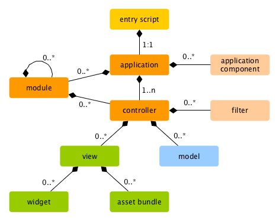

# <div dir="rtl">تشغيل التطبيقات</div>

<p dir="rtl">
بعد تثبيت ال Yii، سيكون لديك تطبيق Yii جاهز للعمل عليه ويمكن الوصول إليه عبر
الرابط التالي:  <code>https://hostname/basic/web/index.php</code>  أو <code>https://hostname/index.php</code> إعتمادا على الإعدادات
الخاصة بك (إعدادت ال web server). في هذا الجزء سنستعرض الوظائف ال built-in الموجودة في التطبيق الإفتراضي لإطار العمل Yii، وكيف يقوم بتنظيم الشيفرة البرمجية، وكيف يعالج (handling) هذا التطبيق الطلبات (requests) بشكل عام.
</p>

<blockquote class="info"><p dir="rtl">
    معلومة: من أجل تبسيط الطرح، ومن خلال هذا البرنامج التعليمي " Getting Started - البداية من هنا"، من المفترض أنك قمت بتعيين <code>basic/web</code> ك <code>document root</code> لل Web server، وقد قمت أيضا بإعداد ال Url الذي يسمح لك بالوصول الى التطبيق المثبت من خلاله ليكون على الشكل التالي: <code>https://hostname/index.php</code> أو ما شابه ذلك.
اذا لم تقم بذلك، ولتلبية إحتياجاتك في هذا البرنامج التعليمي، يرجى ضبط ال Url كما هو موضح في هذه الصفحة.
يمكنك معرفة الضبط الخاص بال Web server من هنا:  <a href="start-installation.md">تثبيت ال Yii </a>
</p></blockquote>

<p dir="rtl">
ملاحظة: بخلاف إطار العمل نفسه(Yii framework)، بعد تثبيت ال template الخاص بالمشروع، يكون كل شيء في هذا التطبيق يخصك أنت، بحيث تملك الحرية في إضافة أو حذف أو تعديل كل ما تحتاج اليه.
</p>


## <div dir="rtl">خصائص / وظائف التطبيق المثبت - Functionality</div> <span id="functionality"></span>

<p dir="rtl">
    يحتوي ال Basic ِApplication Template الذي قمنا بتثبيته على أربع صفحات:
</p>

<ul dir="rtl">
    <li>الصفحة الرئيسية(Homepage): يتم عرض هذه الصفحة من خلال الرابط التالي <code>https://hostname/index.php</code> </li>
    <li>صفحة من نحن(About)</li>
    <li>صفحة اتصل بنا (Contact): في هذه الصفحة يتم عرض form يسمح للأعشاء بالإتصال بك من خلال البريد الإلكتروني.</li>
    <li>صفحة تسجيل الدخول (Login): في هذه الصفحة يتم عرض form يسمح للأعضاء بالحصول على الإذن لإستخدام الخصائص التي لا يجوز لغيرهم من الوصول اليها، قم بتجربة تسجيل الدخول من خلال استخدام <code>admin/admin</code> ولاحظ أن كلمة "Login" ستختفي من القائمة الرئيسية وستظهر محلها الكلمة "Logout"</li>
</ul>

<p dir="rtl">
هذه الصفحات تشترك بامتلاكها common header and footer -الترويسة أعلى الصفحة، والذيل أسفل الصفحة-. ويحتوي ال header على القائمة الرئيسية (main menu) والتي بدورها تسمح لك بالتنقل بين الصفحات المختلفة.
</p>

<p dir="rtl">
    أيضا، يجب عليك أن تنظر الى ال toolbar الموجود في أسفل نافذة المتصفح. ال <a href="https://github.com/yiisoft/yii2-debug/blob/master/docs/guide/README.md">debugger tool</a> هذه تعتبر كأداة مفيدة مقدمة من ال Yii لتسجيل وعرض الكثير من المعلومات وتصحيح الأخطاء، مثل  log messages, response statuses, the database queries run وما إلى ذلك.
</p>

<p dir="rtl">
    بالإضافة إلى ال  web application، يوجد هناك "console script" يسمى ب <code>yii</code>، والذي ستجده في المسار الرئيسي للتطبيق. هذا السكربت يمكن استخدامه لتشغيل المهام التي تعمل في الخفاء (background)  أو لتنفيذ مهام الصيانة (ال maintenance). <br /> ستجد الوصف الخاص بهذا السكربت  
    داخل هذه الصفحة <a href="tutorial-console.md">Console Application Section</a>.
</p>


## <div dir="rtl">هيكلية التطبيق - Application Structure</div> <span id="application-structure"></span>

<p dir="rtl">
    أكثر المسارات والملفات أهمية الموجودة داخل التطبيق (بافتراض أن ال application's root directory هو <code>basic</code>) هي:  
</p>

```
basic/                  application base path
    composer.json       used by Composer, describes package information
    config/             contains application and other configurations
        console.php     the console application configuration
        web.php         the Web application configuration
    commands/           contains console command classes
    controllers/        contains controller classes
    models/             contains model classes
    runtime/            contains files generated by Yii during runtime, such as logs and cache files
    vendor/             contains the installed Composer packages, including the Yii framework itself
    views/              contains view files
    web/                application Web root, contains Web accessible files
        assets/         contains published asset files (javascript and css) by Yii
        index.php       the entry (or bootstrap) script for the application
    yii                 the Yii console command execution script
```

<p dir="rtl">
بشكل عام، يمكن تقسيم الملفات داخل التطبيق إلى نوعين: الاول تجده تحت المسار التالي: <code>basic/web</code> والثاني تجده بالمسارات الأخرى.<br />
وبنائا على ذلك، فإنه من الممكن الوصول إلى النوع الأول مباشرة عبر ال HTTP (أي من خلال المتصفح) ، بينما لا يمكن أن يكون ذلك للنوع الثاني.
</p>

<p dir="rtl">
    يعتمد ال Yii على إستخدام ال MVC، وال MVC هو أحد ال Architectural Pattern، وهي اختصار ل <a href="https://wikipedia.org/wiki/Model-view-controller">model-view-controller</a>،
هذا الأسلوب ينعكس في تنظيم المسارات الخاصة بالملفات كما في الشكل أعلاه. يحتوي المسار <code>models</code> على جميع الكلاس <a href="../guide/structure-models.md">(model classes)</a> ، ويحتوي مسار ال <code>views</code> على جميع الصفحات التي ستستخدم في العرض <a href="../guide/structure-controllers.md">(view scripts)</a>، ويحتوي مسار ال<code>controllers</code> على
    جميع <a href="../guide/structure-views.md">(controller classes)</a> 
</p>

<p dir="rtl">
    يوضح المخطط التالي ال static structure للتطبيق. 
</p>



<p dir="rtl">
    يحتوي كل تطبيق على نص برمجي يستخدم للدخول الى التطبيق (كبوابة بعدها يظهر التطبيق للناظر)، ويسمى هذا الجزء بال entry script، وهو يمثل الصفحة <code>web/index.php</code>، ويعد هذا المدخل النص البرمجي الوحيد الذي يمكن الوصول إليه من خلال ال PHP في التطبيق، ويعمل هذا ال entry script على أخذ ال request ومن ثم إنشاء instance خاص بالتطبيق ليستطيع التعامل معه (التعامل مع التطبيق ومكوناته).
    يقوم <a href="../guide/structure-applications.md">application</a> على معالجة ال request بمساعدة من ال <a href="../guide/concept-components.md">components</a>، ومن ثم بقوم التطبيق بإرسال ال request الى عناصر ال MVC، كما يتم استخدام ال <a href="../guide/structure-widgets.md">Widgets</a> في ال <a href="../guide/structure-views.md">views</a> للمساعدة في إنشاء العناصر المعقدة والمتغيرة (Complex &amp; Dynamic user interface) لواجهة المستخدم.
</p>

## <div dir="rtl">دورة الحياة الخاصة بال request</div> <span id="request-lifecycle"></span>

<p dir="rtl">
يوضح المخطط التالي كيفية معالجة التطبيق ل request معين.
</p>


<ol dir="rtl">
    <li>يقوم المستخدم بعمل request لل <a href="../guide/structure-entry-scripts.md">entry script</a> <code>web/index.php</code>.</li>
    <li>يقوم ال entry script على جلب <a href="../guide/concept-configurations.md">الإعدادات</a> الخاصة بالتطبيق ومن ثم إنشاء ال instance الخاص بالتطبيق ليستطيع التحكم ب request وإدارتها.</li>
    <li>يقوم التطبيق بمعالجة ال <a href="../guide/runtime-routing.md">requested route</a> بمساعدة من ال <a href="../guide/runtime-requests.md">request</a> application component.</li>
    <li>يقوم التطبيق على إنشاء instance من ال <a href="../guide/structure-controllers.md">controller</a> للتحكم بال request.</li>
    <li>يقوم ال controller على إنشاء <a href="../guide/structure-controllers.md">action</a> instance مع مجموعة من الفلاتر(المرشحات) الخاصة بهذا ال action.</li>
    <li>في حالة فشل أي فلتر، يتم إلغاء الإجراء.</li>
    <li>في حال نجاح جميع الفلاتر ، يتم تنفيذ الإجراء.</li>
    <li>يقوم ال action بجلب بعض البيانات الخاصة بال models, وفي الغالب ستكون من قاعدة البيانات إن أمكن ذلك.</li>
    <li>سيقوم ال action بجلب ال view ليقوم بتقديم البيانات التي تم جلبها لل view.</li>
    <li>عملية الجلب السابقة ستقوم على إرجاع النتائج الى <a href="../guide/runtime-responses.md">response</a> application component</li>
    <li>بعد ذلك سيقوم ال response component بإرسال النتيجة النهائية الى المتصفح الخاص بالمستخدم. </li>
</ol>
