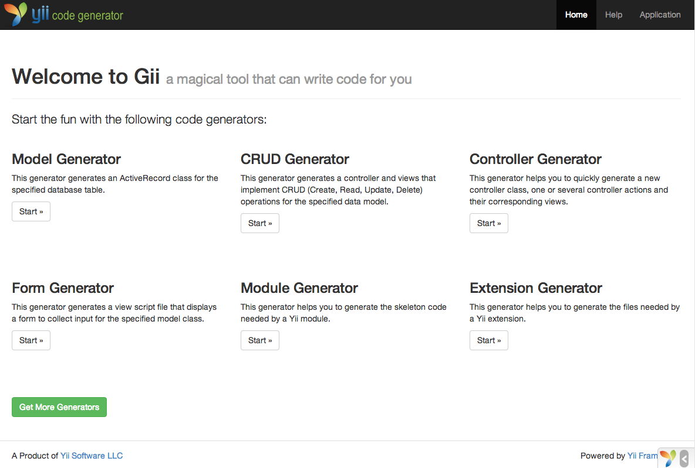
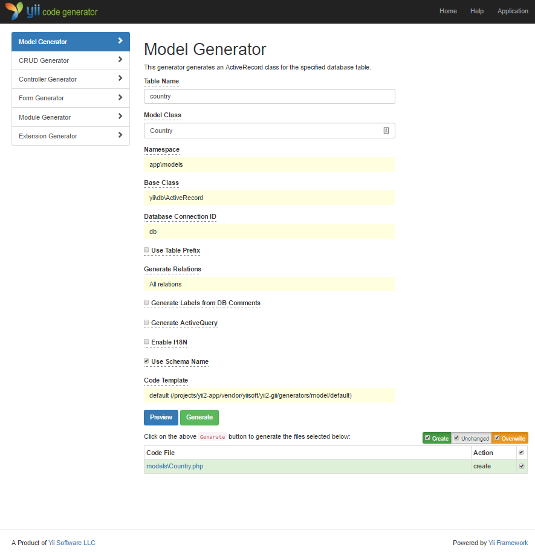
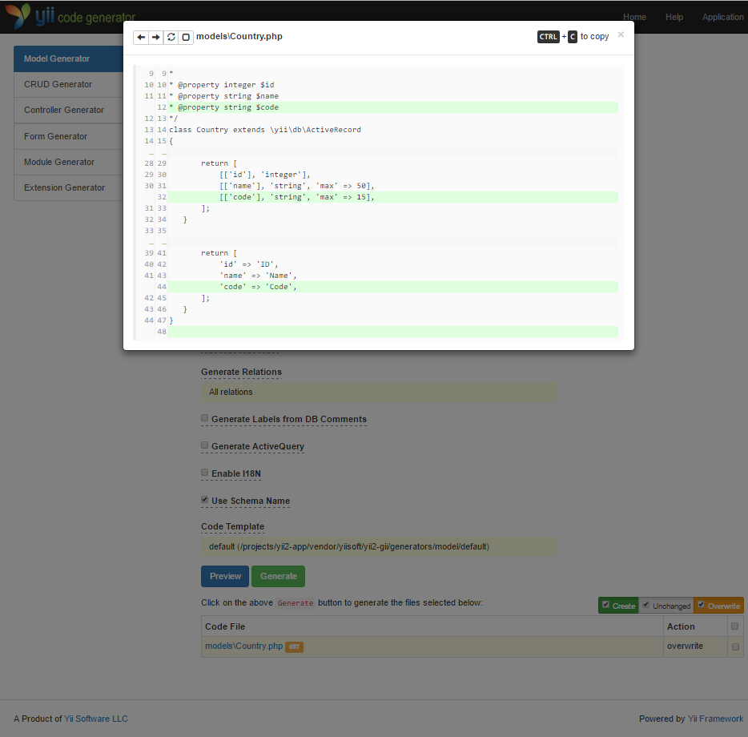
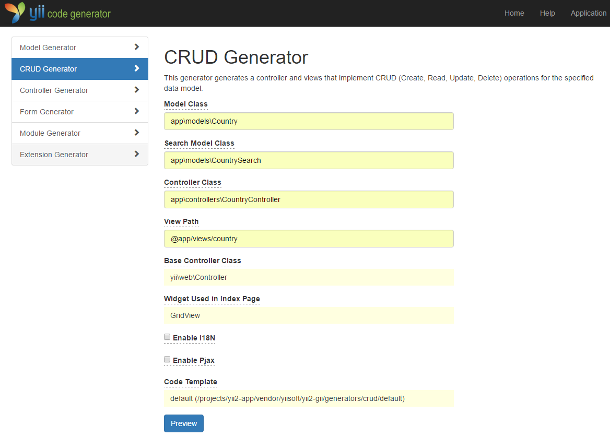
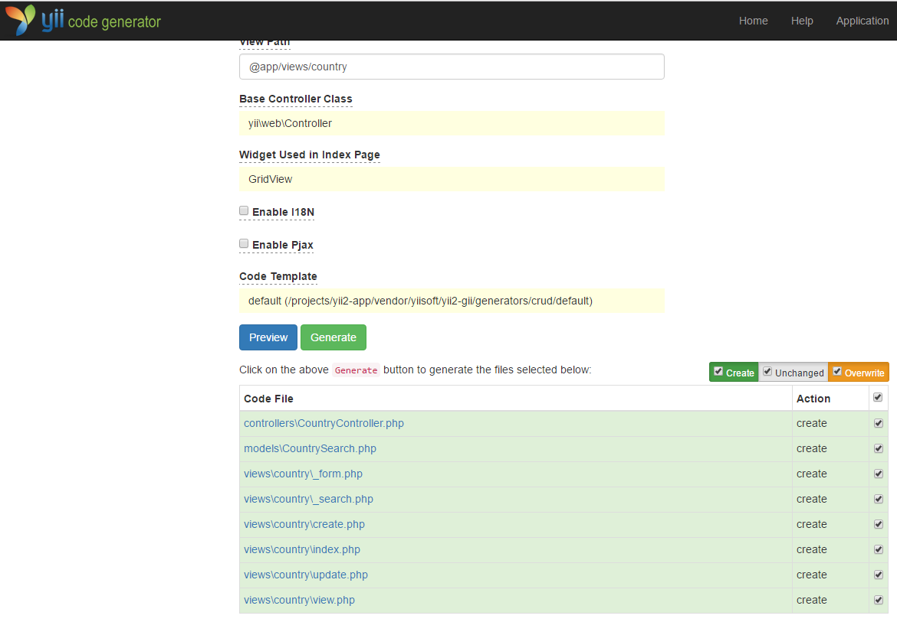
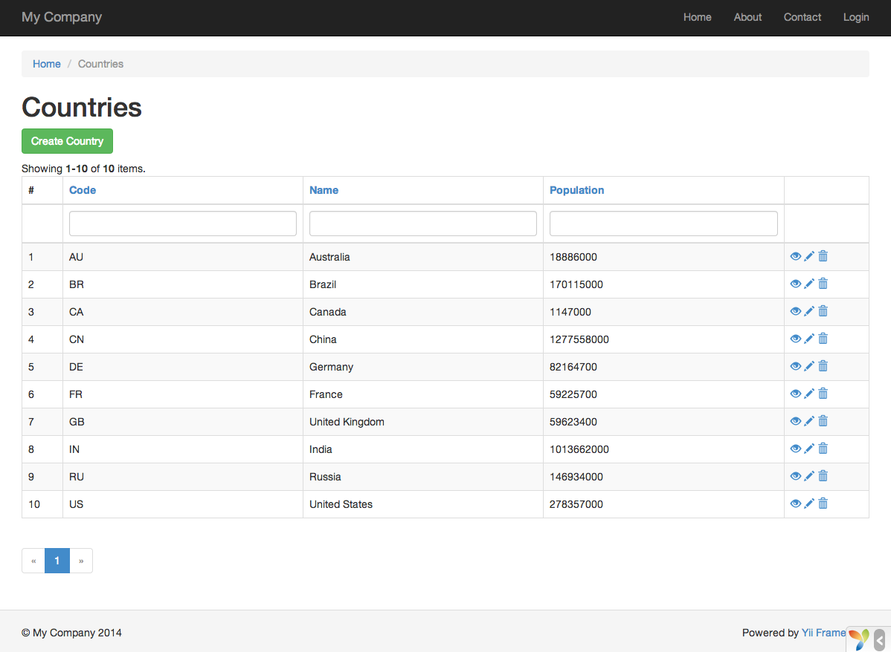
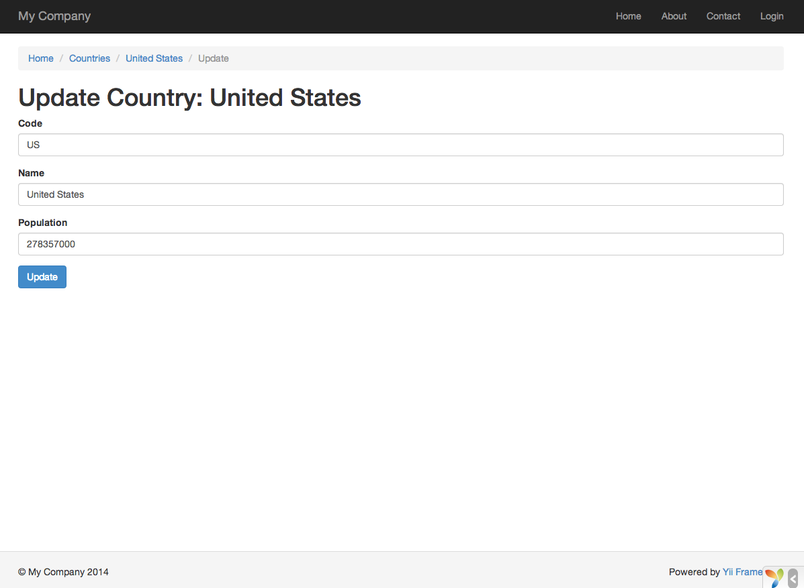

Code generieren mit Gii
=======================

Dieser Abschnitt beschreibt, wie [Gii](https://www.yiiframework.com/extension/yiisoft/yii2-gii/doc/guide) zur
automatischen Generierung von Code verwendet werden kann, der gängige Webseitenfunktionen abdeckt. Die Verwendung von
Gii erfordert nur die Eingabe der richtigen Informationen, wie auf den Gii-Seiten beschrieben.

In diesem Tutorial lernen Sie:

* die Aktivierung von Gii in Ihrer Anwendung
* die Verwendung von Gii zur Generierung einer Active-Record-Klasse
* die Verwendung von Gii zur Generierung des Codes zur Implementierung von CRUD-Operationen für eine Datenbanktabelle
* die individuelle Anpassung des Codes, der von Gii generiert wird


Gii starten <span id="starting-gii"></span>
-----------

[Gii](https://www.yiiframework.com/extension/yiisoft/yii2-gii/doc/guide) wird als [Modul](structure-modules.md) für Yii
angeboten. Sie können Gii durch die Konfiguration der [[yii\base\Application::modules|modules]]-Eigenschaft der
Anwendung aktivieren. Abhängig davon, wie Sie Ihre Anwendung aufgesetzt haben, finden Sie den folgenden Code
möglicherweise bereits in der Konfigurationsdatei `config/web.php`:

```php
$config = [ ... ];

if (YII_ENV_DEV) {
    $config['bootstrap'][] = 'gii';
    $config['modules']['gii'] = [
        'class' => 'yii\gii\Module',
    ];
}
```

Die obenstehende Konfiguration legt fest, dass die Anwendung in der
[Entwicklungsumgebung](concept-configurations.md#environment-constants) ein Modul mit dem Namen `gii` lädt, das durch
die Klasse [[yii\gii\Module]] abgebildet wird.

Prüfen Sie das [Einstiegsskript](structure-entry-scripts.md) `web/index.php` Ihrer Anwendung. Dort finden Sie die
folgende Zeile, die im Wesentlichen bewirkt, dass `YII_ENV_DEV` den Wert `true` hat:

```php
defined('YII_ENV') or define('YII_ENV', 'dev');
```

Aufgrund dieser Zeile befindet sich Ihre Anwendung im Entwicklungsmodus. Dadurch ist sichergestellt, dass Gii mittels
obenstehender Konfiguration aktiviert wird. Sie können nun mittels folgender URL darauf zugreifen:

```
https://hostname/index.php?r=gii
```

> Note: Falls Sie von einem anderen Computer als `localhost` auf Gii zugreifen, wird Ihnen der Zugriff aus
> Sicherheitsgründen standardmäßig verweigert. Fügen Sie Ihre IP-Adresse wie folgt zu den `allowedIPs` hinzu, um den
> Zugriff zu erlauben:
>
```php
'gii' => [
    'class' => 'yii\gii\Module',
    'allowedIPs' => ['127.0.0.1', '::1', '192.168.0.*', '192.168.178.20'] // Passen Sie dies an Ihre Bedürfnisse an
],
```




Generieren einer Active-Record-Klasse <span id="generating-ar"></span>
-------------------------------------

Um mittels Gii eine Active-Record-Klasse zu generieren, klicken Sie auf den "Model Generator"-Link auf der Startseite
von Gii. Füllen Sie das Formular daraufhin wie folgt aus:

* Table Name: `country`
* Model Class: `Country`



Klicken Sie dann auf den "Preview"-Button. Daraufhin sehen Sie in der Ergebnisliste die zu erstellende Datei
`models/Country.php`. Klicken Sie auf den Dateinamen, um sich eine Vorschau des Inhalts der Datei anzusehen.

Wenn bereits eine Datei mit demselben Namen existiert und Sie diese überschreiben würden, können Sie vorher auf den
`diff`-Button neben dem Dateinamen klicken, um sich die Unterschiede zwischen dem zu generierenden Code und der
bestehenden Version anzusehen.



Zum Überschreiben einer existierenden Datei aktivieren Sie die Checkbox neben "overwrite" und klicken Sie dann auf den
"Generate"-Button. Beim Generieren einer neuen Datei können Sie einfach auf den "Generate"-Button klicken.

Daraufhin erscheint eine Seite, die Ihnen bestätigt, dass der Code erfolgreich generiert wurde. Falls die Datei bereits
existierte, erscheint zusätzlich eine Meldung, dass diese mit dem neu generierten Code überschrieben wurde.


Generieren von CRUD-Code <span id="generating-crud"></span>
------------------------

CRUD steht für Create, Read, Update und Delete. Dies sind die englischen Begriffe für die vier Standardaufgaben in der
Datenverarbeitung der meisten Webseiten. Um mittels Gii Code mit CRUD-Funktionalität zu generieren, klicken Sie auf
"CRUD Generator" auf der Startseite von Gii. Im "country"-Beispiel füllen Sie das Formular wie folgt aus:

* Model Class: `app\models\Country`
* Search Model Class: `app\models\CountrySearch`
* Controller Class: `app\controllers\CountryController`



Klicken Sie dann auf den "Preview"-Button. Daraufhin sehen Sie eine Liste der zu generierenden Dateien (siehe Bild
unten).



Falls Sie zuvor den Controller `controllers/CountryController.php` und die Datei `views/country/index.php` erstellt
haben (im Datenbank-Abschnitt des Handbuchs), aktivieren Sie die Checkboxen "overwrite", um die beiden Dateien zu
ersetzen (die bisherigen Versionen bieten keine vollständige CRUD-Unterstützung).


Probieren Sie es aus <span id="trying-it-out"></span>
--------------------

Um die generierten Dateien in Aktion zu sehen, navigieren Sie in Ihrem Browser zu folgender URL:

```
https://hostname/index.php?r=country%2Findex
```

Sie sehen hier eine Datentabelle, die Ihnen die Länder aus der Datenbanktabelle anzeigt. Sie können die Daten sortieren
oder durch die Eingabe von Filterbedingungen im Tabellenkopf filtern.

Für jedes Land in der Tabelle gibt es rechts Aktionslinks zum Anzeigen der Details, zum Bearbeiten oder zum Löschen des
Datensatzes. Sie können auch auf den "Create Country"-Button oberhalb der Tabelle klicken, um ein Formular zum Anlegen
eines neuen Landes zu öffnen.





Für den Fall, dass Sie die Dateien analysieren oder verändern möchten, finden Sie nachfolgend eine Liste der Dateien,
die von Gii generiert wurden:

* Controller: `controllers/CountryController.php`
* Models: `models/Country.php` und `models/CountrySearch.php`
* Views: `views/country/*.php`

> Info: Gii ist so aufgebaut, dass es einfach angepasst und erweitert werden kann. Durch kluges Einsetzen von Gii
> kann sich Ihr Entwicklungsprozess drastisch verkürzen. Weitere Informationen finden Sie im Abschnitt
> [Gii](https://www.yiiframework.com/extension/yiisoft/yii2-gii/doc/guide).


Zusammenfassung <span id="summary"></span>
---------------

In diesem Abschnitt haben Sie gelernt, wie man mit Gii Code generieren kann, der die vollständige CRUD-Funktionalität
für die in einer Datenbanktabelle gespeicherten Inhalte implementiert.
