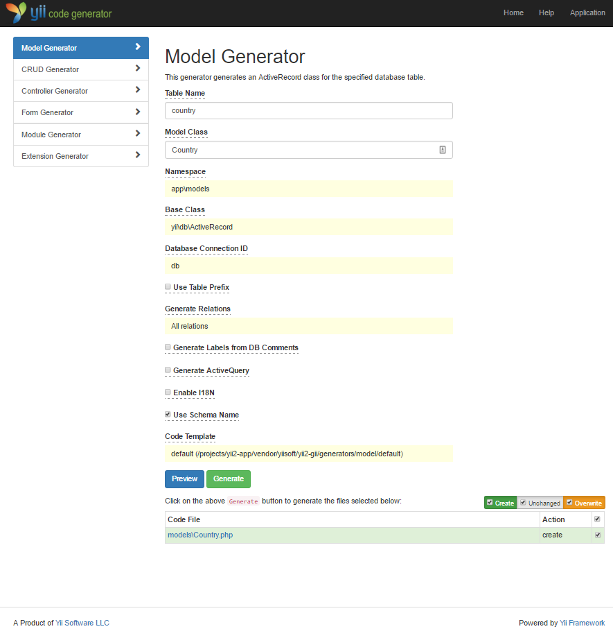

Code-Generierung mit Gii
========================

Dieses Kapitel beschreibt wie [Gii](https://www.yiiframework.com/extension/yiisoft/yii2-gii/doc/guide) verwendet werden kann
zur autmatischen Generierung von Code welcher gängige Webseitenfunktionen abdeckt. Die Verwendung von Gii benötigt nur die
Eingabe der richtigen Informationen wie beschrieben auf den Gii Seiten.

In diesem Tutorial lernen Sie:
* die Aktivierung von Gii in Ihrer Applikation
* die Verwendung von Gii zur Generierung von Active Record Klassen
* die Verwendung von Gii zur Generierung des Codes zur Implementierung von CRUD Operationen
* die indivuelle Anpassung des Codes welcher von Gii generiert wird

Starten mit Gii <span id="starting-gii"></span>
---------------
[Gii](https://www.yiiframework.com/extension/yiisoft/yii2-gii/doc/guide) wird als [Modul](structure-modules.md) für Yii angeboten.
Sie können Gii aktivieren durch die Konfiguration der [[yii\base\Application::modules|modules]]-Eigenschaft der Applikation.
Abhängig davon wie Sie Ihre Applikation aufgesetzt haben, finden Sie den folgenden Code bereits in der Konfigurationsdatei
`config/web.php`:

```php
$config = [ ... ];

if (YII_ENV_DEV) {
    $config['bootstrap'][] = 'gii';
    $config['modules']['gii'] = [
        'class' => 'yii\gii\Module',
    ];
}
```

Die obenstehende Konfigurationsanweisung stellt sicher, dass wenn sich die Applikation im [Entwicklungsstadium](concept-configurations.md#environment-constants)
befindet, das Modul mit dem Namen `gii` geladen wird welches durch die Klasse [[yii\gii\Module]] abgebildet wird.

Prüfen Sie das [Initialskript](structure-entry-scripts.md) `web/index.php` Ihrer Applikation. Dort finden Sie die folgende
Zeile welche Ihre Applikation ins Entwicklunsstadium versetzt (durch das Setzen von `YII_ENV_DEV` auf `true`):

```php
defined('YII_ENV') or define('YII_ENV', 'dev');
```

Aufgrund dieser Zeile befindet sich Ihre Applikation im Entwicklungsstadium. Dadurch ist sichergestellt, dass Gii mittels
obenstehender Konfiguration aktiviert wird. Sie können mittels folgender URL darauf zugreifen:

```
http://hostname/index.php?r=gii
```

> Note: Falls Sie von einem anderen Computer als `localhost` auf Gii zugreifen wird Ihnen der Zugriff aus Sicherheitsgründen
> standardmässig verweigert. Fügen Sie Ihre IP zu den `allowedIPs` wie folgt hinzu, um den Zugriff zu gewährleisten:
>
```php
'gii' => [
    'class' => 'yii\gii\Module',
    'allowedIPs' => ['127.0.0.1', '::1', '192.168.0.*', '192.168.178.20'] // Passen Sie dies an Ihre Bedürfnisse an
],
```


Generieren von Active Record Klassen <span id="generating-ar"></span>
------------------------------------

Um mittels Gii eine Active Record Klasse zu generieren, klicken Sie auf den "Model Generator" Link auf der Startseite von 
Gii. Füllen Sie das Formular daraufhin wie folgt aus:

* Table Name: `country`
* Model Class: `Country`




Klicken Sie dann auf den "Preview" Button. Daraufhin sehen Sie in der Resultatliste die Datei `models/Country.php` zum
Erstellen. Klicken sie auf den Dateinamen um sich eine Vorschau des Inhalts der Datei anzusehen.

Wenn bereits eine Datei mit demselben Namen existiert und Sie möchten Sie überschreiben, können Sie vorgängig auf den 
`diff` Button direkt beim Dateinamen klicken um sich die Unterschiede im Code der existierenden und zu generierenden Datei
anzusehen.


Zum Überschreiben einer existierenden Datei, aktivieren Sie die Checkbox neben der Datei und klicken Sie dann auf den "Generate"
Button. Beim Generieren einer neuen Datei können Sie lediglich auf den "Generate" Button klicken.

Daraufhin erscheint eine Seite welche Ihnen bestätigt dass der Code erfolgreich generiert wurde. Falls die Datei bereits
existierte, erscheint zusätzlich eine Meldung dass diese überschrieben wurde.  


Generieren von CRUD Code <span id="generating-crud"></span>
------------------------

CRUD steht für Create, Read, Update und Delete. Dies sind die englischen Begriffe für die Standardaufgaben in der
Datenverarbeitung der meisten Webseiten. Um mittels Gii Code mit CRUD Funktionalität zu generieren, klicken Sie auf 
"CRUD Generator" auf der Startseite von Gii. Im "Country"-Beispiel füllen Sie das Formular wie folgt aus:

* Model Class: `app\models\Country`
* Search Model Class: `app\models\CountrySearch`
* Controller Class: `app\controllers\CountryController`


Klicken Sie dann auf den "Preview" Button. Draufhin sehen Sie eine Liste von zu generierenden Dateien (siehe Bild unten).


Falls sie vorhin den Controller `controllers/CountryController.php` und die Datei `views/country/index.php` erstellt haben
(im Datenbank-Kapitel des Guides), aktivieren sie die Checkboxen "overwrite" um sie zu ersetzen (die bisherigen Versionen
bieten keinen vollständige CRUD-Unterstützung).

Probieren Sie es aus <span id="trying-it-out"></span>
--------------------

Um die generierten Dateien in Aktion zu sehen, navigieren Sie in Ihrem Browser zu folgender URL:

```
http://hostname/index.php?r=country%2Findex
```

Sie sehen hier eine Datentabelle welche Ihnen die Länder aus der Datenbank anzeigt. Sie können die Daten sortieren oder
filtern durch die Eingabefelder in dem Tabellenkopf.

Für jedes Land in der Tabelle, gibt es rechts Aktionslinks zum Anzeigen der Details, zum Bearbeiten oder Löschen des Datensatzes.
Sie können auch auf den "Create Country" Button oberhalb der Tabelle klicken um ein Land zur Datenbank hinzuzufügen.


Für den Fall dass Sie die Dateien analysieren oder verändern möchten finden Sie untenstehend eine Liste von Dateien die
von Gii generiert wurden:

* Controller: `controllers/CountryController.php`
* Models: `models/Country.php` and `models/CountrySearch.php`
* Views: `views/country/*.php`

> Info: Gii ist so aufgebaut, dass es einfach personalisiert und erweitert werden kann. Durch kluges Einsetzen von Gii
> kann sich Ihr Entwicklungsprozess drastisch verkürzen. Für mehr Informationen konsultieren Sie das
> [Gii](https://www.yiiframework.com/extension/yiisoft/yii2-gii/doc/guide) Kapitel. 

Zusammenfassung <span id="summary"></span>
---------------

In diesem Kapitel haben Sie gelernt, wie man mittel Gii einfach und schnell Code generieren kann, welcher volle
CRUD Funktionalität für die Datenverarbeitung bietet.
