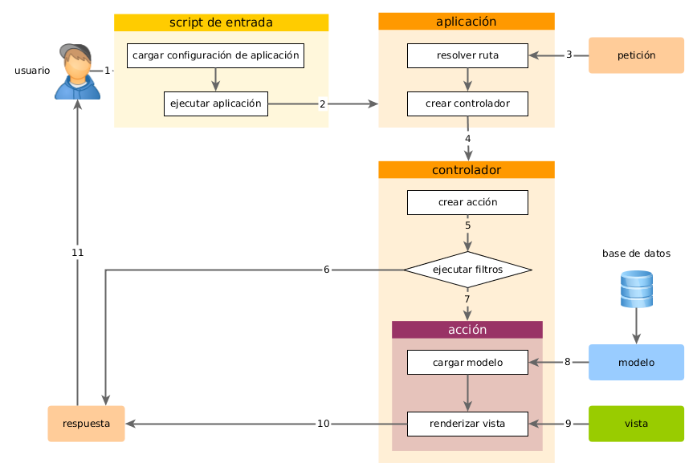

Información General
===============

Cada vez que una aplicación Yii gestiona una petición, se somete a un flujo de trabajo similar.

1. Un usuario hace una petición al [script de entrada](structure-entry-scripts.md) ‘web/index.php’.
2. El script de entrada carga la [configuración](concept-configurations.md) y crea una instancia de la 
   [aplicación](structure-applications.md) para gestionar la petición.
3. La aplicación resuelve la [ruta](runtime-routing.md) solicitada con la ayuda del componente 
   [petición](runtime-requests.md) de la aplicación.
4. La aplicación crea una instancia del [controlador](structure-controllers.md) para gestionar la petición. 
5. El controlador crea una instancia de la [acción](structure-controllers.md) y ejecuta los filtros para la acción.
6. Si algún filtro falla, se cancela la acción.
7. Si pasa todos los filtros, se ejecuta la acción.
8. La acción carga un modelo de datos, posiblemente de la base de datos.
9. La acción renderiza una vista, proporcionándole el modelo de datos.
10. El resultado renderizado se devuelve al componente [respuesta](runtime-responses.md) de la aplicación.
11. El componente respuesta envía el resultado renderizado al navegador del usuario.

El siguiente diagrama muestra como una aplicación gestiona una petición.

En esta sección, se describirá en detalle cómo funcionan algunos de estos pasos.
