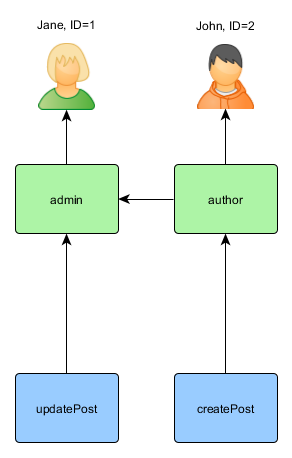
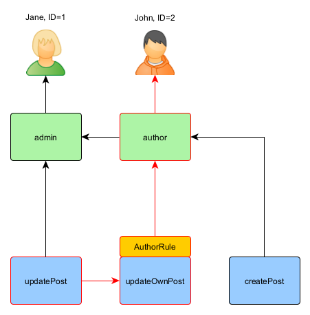
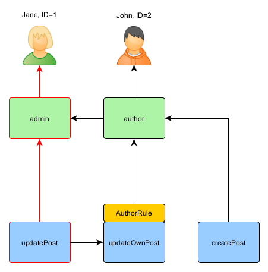

Autorización
============

Autorización esl el proceso de verificación de que un usuario tenga sugifientes permisos para realizar algo. Yii provee
dos métodos de autorización: Filtro de Control de Acceso y Control Basado en Roles (ACF y RBAC por sus siglas en inglés).


## Filtro de Control de Acceso <span id="access-control-filter"></span>

Filtro de Control de Acceso (ACF) es un único método de autorización implementado como [[yii\filters\AccessControl]], el cual
es mejor utilizado por aplicaciones que sólo requieran un control de acceso simple. Como su nombre lo indica, ACF es
un [filtro](structure-filters.md) de acción que puede ser utilizado en un controlador o en un módulo. Cuando un usuario solicita
la ejecución de una acción, ACF comprobará una lista de [[yii\filters\AccessControl::rules|reglas de acceso]]
para determinar si el usuario tiene permitido acceder a dicha acción.

El siguiente código muestra cómo utilizar ACF en el controlador `site`:

```php
use yii\web\Controller;
use yii\filters\AccessControl;

class SiteController extends Controller
{
    public function behaviors()
    {
        return [
            'access' => [
                'class' => AccessControl::class,
                'only' => ['login', 'logout', 'signup'],
                'rules' => [
                    [
                        'allow' => true,
                        'actions' => ['login', 'signup'],
                        'roles' => ['?'],
                    ],
                    [
                        'allow' => true,
                        'actions' => ['logout'],
                        'roles' => ['@'],
                    ],
                ],
            ],
        ];
    }
    // ...
}
```

En el código anterior, ACF es adjuntado al controlador `site` en forma de behavior (comportamiento). Esta es la forma típica de utilizar
un filtro de acción. La opción `only` especifica que el ACF debe ser aplicado solamente a las acciones `login`, `logout` y `signup`.
Las acciones restantes en el controlador `site` no están sujetas al control de acceso. La opción `rules` lista
las [[yii\filters\AccessRule|reglas de acceso]], y se lee como a continuación:

- Permite a todos los usuarios invitados (sin autenticar) acceder a las acciones `login` y `signup`. La opción `roles`
  contiene el signo de interrogación `?`, que es un código especial para representar a los "invitados".
- Permite a los usuarios autenticados acceder a la acción `logout`. El signo `@` es otro código especial que representa
  a los "usuarios autenticados".

ACF ejecuta la comprobación de autorización examinando las reglas de acceso una a una desde arriba hacia abajo hasta que encuentra
una regla que aplique al contexto de ejecución actual. El valor `allow` de la regla que coincida será entonces utilizado
para juzgar si el usuario está autorizado o no. Si ninguna de las reglas coincide, significa que el usuario NO está autorizado,
y el ACF detendrá la ejecución de la acción.

Cuando el ACF determina que un usuario no está autorizado a acceder a la acción actual, toma las siguientes medidas por defecto:

* Si el usuario es un invitado, llamará a [[yii\web\User::loginRequired()]] para redireccionar el navegador a la pantalla de login.
* Si el usuario está autenticado, lanzará una excepeción [[yii\web\ForbiddenHttpException]].

Puedes personalizar este comportamiento configurando la propiedad [[yii\filters\AccessControl::denyCallback]] como a continuación:

```php
[
    'class' => AccessControl::class,
    ...
    'denyCallback' => function ($rule, $action) {
        throw new \Exception('No tienes los suficientes permisos para acceder a esta página');
    }
]
```

Las [[yii\filters\AccessRule|Reglas de Acceso]] soportan varias opciones. Abajo hay un resumen de las mismas.
También puedes extender de [[yii\filters\AccessRule]] para crear tus propias clases de reglas de acceso personalizadas.

 * [[yii\filters\AccessRule::allow|allow]]: especifica si la regla es de tipo "allow" (permitir) o "deny" (denegar).

 * [[yii\filters\AccessRule::actions|actions]]: especifica con qué acciones coinciden con esta regla. Esta debería ser
un array de IDs de acciones. La comparación es sensible a mayúsculas. Si la opción está vacía o no definida,
significa que la regla se aplica a todas las acciones.

 * [[yii\filters\AccessRule::controllers|controllers]]: especifica con qué controladores coincide
esta regla. Esta debería ser un array de IDs de controladores. Cada ID de controlador es prefijado con el ID del módulo (si existe).
La comparación es sensible a mayúsculas. Si la opción está vacía o no definida, significa que la regla se aplica a todos los controladores.

 * [[yii\filters\AccessRule::roles|roles]]: especifica con qué roles de usuarios coincide esta regla.
   Son reconocidos dos roles especiales, y son comprobados vía [[yii\web\User::isGuest]]:

     - `?`: coincide con el usuario invitado (sin autenticar)
     - `@`: coincide con el usuario autenticado

   El utilizar otro nombre de rol invocará una llamada a [[yii\web\User::can()]], que requiere habilitar RBAC
   (a ser descrito en la próxima subsección). Si la opción está vacía o no definida, significa que la regla se aplica a todos los roles.

 * [[yii\filters\AccessRule::ips|ips]]: especifica con qué [[yii\web\Request::userIP|dirección IP del cliente]] coincide esta regla.
Una dirección IP puede contener el caracter especial `*` al final de manera que coincidan todas las IPs que comiencen igual.
Por ejemplo, '192.168.*' coincide con las direcciones IP en el segmento '192.168.'. Si la opción está vacía o no definida,
significa que la regla se aplica a todas las direcciones IP.

 * [[yii\filters\AccessRule::verbs|verbs]]: especifica con qué método de la solicitud (por ej. `GET`, `POST`) coincide esta regla.
La comparación no distingue minúsculas de mayúsculas.

 * [[yii\filters\AccessRule::matchCallback|matchCallback]]: especifica una función PHP invocable que debe ser llamada para determinar
si la regla debe ser aplicada.

 * [[yii\filters\AccessRule::denyCallback|denyCallback]]: especifica una función PHP invocable que debe ser llamada cuando esta regla
deniegue el acceso.

Debajo hay un ejemplo que muestra cómo utilizar la opción `matchCallback`, que te permite escribir lógica de comprabación de acceso
arbitraria:

```php
use yii\filters\AccessControl;

class SiteController extends Controller
{
    public function behaviors()
    {
        return [
            'access' => [
                'class' => AccessControl::class,
                'only' => ['special-callback'],
                'rules' => [
                    [
                        'actions' => ['special-callback'],
                        'allow' => true,
                        'matchCallback' => function ($rule, $action) {
                            return date('d-m') === '31-10';
                        }
                    ],
                ],
            ],
        ];
    }

    // Callback coincidente llamado! Esta página sólo puede ser accedida cada 31 de Octubre
    public function actionSpecialCallback()
    {
        return $this->render('happy-halloween');
    }
}
```


## Control de Acceso Basado en Roles (RBAC) <span id="rbac"></span>

El Control de Acceso Basado en Roles (RBAC) provee una simple pero poderosa manera centralizada de control de acceso. Por favos consulta
la [Wikipedia](https://en.wikipedia.org/wiki/Role-based_access_control) para más detalles sobre comparar RBAC
con otros mecanismos de control de acceso más tradicionales.

Yii implementa una Jerarquía General RBAC, siguiendo el [modelo NIST RBAC](https://csrc.nist.gov/CSRC/media/Publications/conference-paper/1992/10/13/role-based-access-controls/documents/ferraiolo-kuhn-92.pdf).
Esto provee la funcionalidad RBAC a través de [componente de la aplicación](structure-application-components.md) [[yii\rbac\ManagerInterface|authManager]].

Utilizar RBAC envuelve dos cosas. La primera es construir los datos de autorización RBAC, y la segunda
es utilizar esos datos de autorización para comprobar el acceso en los lugares donde se necesite.

Para facilitar la próxima descripción, necesitamos primero instroducir algunos conceptos RBAC básicos.


### Conceptos Básicos <span id="basic-concepts"></span>

Un rol representa una colección de *permisos* (por ej. crear posts, actualizar posts). Un rol puede ser asignado
a uno o varios usuarios. Para comprobar que un usuario cuenta con determinado permiso, podemos comprobar si el usuario tiene asignado
un rol que cuente con dicho permiso.

Asociado a cada rol o permiso, puede puede haber una *regla*. Una regla representa una porción de código que será
ejecutada durante la comprobación de acceso para determinar si el rol o permiso correspondiente aplica al usuario actual.
Por ejemplo, el permiso "actualizar post" puede tener una regla que compruebe que el usuario actual es el autor del post.
Durante la comprobación de acceso, si el usuario NO es el autor del post, se considerará que el/ella no cuenta con el permiso "actualizar post".

Tanto los roles como los permisos pueden ser organizados en una jerarquía. En particular, un rol puede consistir en otros roles o permisos;
y un permiso puede consistir en otros permisos. Yii implementa una jerarquía de *orden parcial*, que incluye
una jerarquía de *árbol* especial. Mientras que un rol puede contener un permiso, esto no sucede al revés.


### Configurar RBAC <span id="configuring-rbac"></span>

Antes de definir todos los datos de autorización y ejecutar la comprobación de acceso, necesitamos configurar el
componente de la aplicación [[yii\base\Application::authManager|authManager]]. Yii provee dos tipos de administradores de autorización:
[[yii\rbac\PhpManager]] y [[yii\rbac\DbManager]]. El primero utiliza un archivo PHP para almacenar los datos
de autorización, mientras que el segundo almacena dichos datos en una base de datos. Puedes considerar utilizar el primero si tu aplicación
no requiere una administración de permisos y roles muy dinámica.


#### Utilizar `PhpManager` <span id="using-php-manager"></span>

El siguiente código muestra cómo configurar `authManager` en la configuración de nuestra aplicación utilizando la clase [[yii\rbac\PhpManager]]:

```php
return [
    // ...
    'components' => [
        'authManager' => [
            'class' => 'yii\rbac\PhpManager',
        ],
        // ...
    ],
];
```

El `authManager` ahora puede ser accedido vía `\Yii::$app->authManager`.

Por defecto, [[yii\rbac\PhpManager]] almacena datos RBAC en archivos bajo el directorio `@app/rbac`. Asegúrate de que el directorio
y todos sus archivos son tienen permiso de escritura para el proceso del servidor Web si la jerarquía de permisos necesita ser modoficada en línea.


#### Utilizar `DbManager` <span id="using-db-manager"></span>

El sigiente código muestra cómo configurar `authManager` en la configuración de la aplicación utilizando la clase [[yii\rbac\DbManager]]:

```php
return [
    // ...
    'components' => [
        'authManager' => [
            'class' => 'yii\rbac\DbManager',
        ],
        // ...
    ],
];
```
> Note: si estás utilizando el template yii2-basic-app, existe el archivo de configuración `config/console.php` donde
  necesita declararse `authManager` adicionalmente a `config/web.php`.
> En el caso de yii2-advanced-app, `authManager` sólo debe declararse en `common/config/main.php`.

`DbManager` utiliza cuatro tablas de la BD para almacenar los datos:

- [[yii\rbac\DbManager::$itemTable|itemTable]]: la tabla para almacenar los ítems de autorización. Por defecto "auth_item".
- [[yii\rbac\DbManager::$itemChildTable|itemChildTable]]: la tabla para almacentar la jerarquía de los ítems de autorización. Por defecto "auth_item_child".
- [[yii\rbac\DbManager::$assignmentTable|assignmentTable]]: la tabla para almacenar las asignaciones de los ítems de autorización. Por defecto "auth_assignment".
- [[yii\rbac\DbManager::$ruleTable|ruleTable]]: la tabla para almacenar las reglas. Por defecto "auth_rule".

Antes de continuar, necesitas crear las tablas respectivas en la base de datos. Para hacerlo, puedes utilizar las migraciones contenidas en `@yii/rbac/migrations`:

`yii migrate --migrationPath=@yii/rbac/migrations`

El `authManager` puede ahora ser accedido vía `\Yii::$app->authManager`.


### Construir los Datos de Autorización <span id="generating-rbac-data"></span>

Construir los datos de autorización implica las siguientes tareas:

- definir roles y permisos;
- establecer relaciones entre roles y permisos;
- definir reglas;
- asociar reglas con roles y permisos;
- asignar roles a usuarios.

Dependiendo de los requerimientos de flexibilidad en la autorización, las tareas se pueden lograr de diferentes maneras.

Si la jerarquía de permisos no cambia en absoluto y tienes un número fijo de usuarios puede crear un
[comando de consola](tutorial-console.md#create-command) que va a inicializar los datos de autorización una vez a través de las API que ofrece por `authManager`:

```php
<?php
namespace app\commands;

use Yii;
use yii\console\Controller;

class RbacController extends Controller
{
    public function actionInit()
    {
        $auth = Yii::$app->authManager;

        // agrega el permiso "createPost"
        $createPost = $auth->createPermission('createPost');
        $createPost->description = 'Create a post';
        $auth->add($createPost);

        // agrega el permiso "updatePost"
        $updatePost = $auth->createPermission('updatePost');
        $updatePost->description = 'Update post';
        $auth->add($updatePost);

        // agrega el rol "author" y le asigna el permiso "createPost"
        $author = $auth->createRole('author');
        $auth->add($author);
        $auth->addChild($author, $createPost);

        // agrega el rol "admin" y le asigna el permiso "updatePost"
        // más los permisos del rol "author"
        $admin = $auth->createRole('admin');
        $auth->add($admin);
        $auth->addChild($admin, $updatePost);
        $auth->addChild($admin, $author);

        // asigna roles a usuarios. 1 y 2 son IDs devueltos por IdentityInterface::getId()
        // usualmente implementado en tu modelo User.
        $auth->assign($author, 2);
        $auth->assign($admin, 1);
    }
}
```

> Note: Si estas utilizando el template avanzado, necesitas poner tu `RbacController` dentro del directorio `console/controllers`
  y cambiar el espacio de nombres a `console\controllers`.

Después de ejecutar el comando `yii rbac/init`, obtendremos la siguiente jerarquía:



"Author" puede crear un post, "admin" puede actualizar posts y hacer todo lo que puede hacer "author".

Si tu aplicación permite el registro de usuarios, necesitas asignar los roles necesarios para cada usuario nuevo. Por ejemplo, para que todos
los usuarios registrados tengan el rol "author", en el template de aplicación avanzada debes modificar `frontend\models\SignupForm::signup()`
como a continuación:

```php
public function signup()
{
    if ($this->validate()) {
        $user = new User();
        $user->username = $this->username;
        $user->email = $this->email;
        $user->setPassword($this->password);
        $user->generateAuthKey();
        $user->save(false);

        // las siguientes tres líneas fueron agregadas
        $auth = Yii::$app->authManager;
        $authorRole = $auth->getRole('author');
        $auth->assign($authorRole, $user->getId());

        return $user;
    }

    return null;
}
```

Para aplicaciones que requieren un control de acceso complejo con una actualización constante en los datos de autorización, puede ser necesario
desarrollar una interfaz especial (por ej. un panel de administración) utilizando las APIs ofrecidas por `authManager`.


### Utilizar Reglas <span id="using-rules"></span>

Como se había mencionado, las reglas agregan restricciones adicionales a los roles y permisos. Una regla es una clase extendida
de [[yii\rbac\Rule]]. Debe implementar al método [[yii\rbac\Rule::execute()|execute()]]. En la jerarquía que creamos
previamente, "author" no puede editar su propio post. Vamos a arreglarlo. Primero necesitamos una regla para comprobar que el usuario actual es el autor del post:

```php
namespace app\rbac;

use yii\rbac\Rule;

/**
 * Comprueba si authorID coincide con el usuario pasado como parámetro
 */
class AuthorRule extends Rule
{
    public $name = 'isAuthor';

    /**
     * @param string|int $user el ID de usuario.
     * @param Item $item el rol o permiso asociado a la regla
     * @param array $params parámetros pasados a ManagerInterface::checkAccess().
     * @return bool un valor indicando si la regla permite al rol o permiso con el que está asociado.
     */
    public function execute($user, $item, $params)
    {
        return isset($params['post']) ? $params['post']->createdBy == $user : false;
    }
}
```

La regla anterior comprueba si el `post` fue creado por `$user`. Crearemos un permiso especial, `updateOwnPost`, en el comando que hemos utilizado
anteriormente:

```php
$auth = Yii::$app->authManager;

// agrega la regla
$rule = new \app\rbac\AuthorRule;
$auth->add($rule);

// agrega el permiso "updateOwnPost" y le asocia la regla.
$updateOwnPost = $auth->createPermission('updateOwnPost');
$updateOwnPost->description = 'Update own post';
$updateOwnPost->ruleName = $rule->name;
$auth->add($updateOwnPost);

// "updateOwnPost" será utilizado desde "updatePost"
$auth->addChild($updateOwnPost, $updatePost);

// permite a "author" editar sus propios posts
$auth->addChild($author, $updateOwnPost);
```

Ahora tenemos la siguiente jerarquía:


### Comprobación de Acceso <span id="access-check"></span>

Con los datos de autorización listos, la comprobación de acceso se hace con una simple llamada al método [[yii\rbac\ManagerInterface::checkAccess()]].
Dado que la mayoría de la comprobación de acceso se hace sobre el usuario actual, para mayor comodidad Yii proporciona el atajo
[[yii\web\User::can()]], que puede ser utilizado como a continuación:

```php
if (\Yii::$app->user->can('createPost')) {
    // crear el post
}
```

Si el usuario actual es Jane con `ID=1`, comenzamos desde `createPost` y tratamos de alcanzar a `Jane`:


Con el fin de comprobar si un usuario puede actualizar un post, necesitamos pasarle un parámetro adicional requerido por `AuthorRule`, descrito antes:

```php
if (\Yii::$app->user->can('updatePost', ['post' => $post])) {
    // actualizar post
}
```

Aquí es lo que sucede si el usuario actual es John:




Comenzamos desde `updatePost` y pasamos por `updateOwnPost`. Con el fin de pasar la comprobación de acceso, `AuthorRule`
debe devolver `true` desde su método `execute()`. El método recive `$params` desde la llamada al método `can()`, cuyo valor es
`['post' => $post]`. Si todo está bien, vamos a obtener `author`, el cual es asignado a John.

En caso de Jane es un poco más simple, ya que ella es un "admin":




### Utilizar Roles por Defecto <span id="using-default-roles"></span>

Un rol por defecto es un rol que esta asignado *implícitamente* a *todos* los usuarios. La llamada a [[yii\rbac\ManagerInterface::assign()]]
no es necesaria, y los datos de autorización no contienen su información de asignación.

Un rol por defecto es usualmente asociado con una regla que determina si el rol aplica al usuario siendo verificado.

Los roles por defecto se utilizan a menudo en aplicaciones que ya tienen algún tipo de asignación de roles. Por ejemplo, una aplicación
puede tener una columna "grupo" en su tabla de usuario para representar a qué grupo de privilegio pertenece cada usuario.
Si cada grupo privilegio puede ser conectado a un rol de RBAC, se puede utilizar la función de rol por defecto para asignar
cada usuario a un rol RBAC automáticamente. Usemos un ejemplo para mostrar cómo se puede hacer esto.

Suponga que en la tabla de usuario, usted tiene una columna `group` que utiliza 1 para representar el grupo administrador y 2 al grupo autor.
Planeas tener dos roles RBAC, `admin` y `author`, para representar los permisos de estos dos grupos, respectivamente.
Puede configurar los datos RBAC de la siguiente manera,


```php
namespace app\rbac;

use Yii;
use yii\rbac\Rule;

/**
 * Comprueba si el grupo coincide
 */
class UserGroupRule extends Rule
{
    public $name = 'userGroup';

    public function execute($user, $item, $params)
    {
        if (!Yii::$app->user->isGuest) {
            $group = Yii::$app->user->identity->group;
            if ($item->name === 'admin') {
                return $group == 1;
            } elseif ($item->name === 'author') {
                return $group == 1 || $group == 2;
            }
        }
        return false;
    }
}

$auth = Yii::$app->authManager;

$rule = new \app\rbac\UserGroupRule;
$auth->add($rule);

$author = $auth->createRole('author');
$author->ruleName = $rule->name;
$auth->add($author);
// ... agrega permisos hijos a $author ...

$admin = $auth->createRole('admin');
$admin->ruleName = $rule->name;
$auth->add($admin);
$auth->addChild($admin, $author);
// ... agrega permisos hijos a $admin ...
```

Tenga en cuenta que en el ejemplo anterior, dado que "author" es agregado como hijo de "admin", cuando implementes el método `execute()`
de la clase de la regla, necesitas respetar esta jerarquía. Esto se debe a que cuando el nombre del rol es "author",
el método `execute()` devolverá `true` si el grupo de usuario es tanto 1 como 2 (lo que significa que el usuario se encuentra en
cualquiera de los dos grupos, "admin" o "author").

Luego, configura `authManager` enumerando los dos roles en [[yii\rbac\BaseManager::$defaultRoles]]:

```php
return [
    // ...
    'components' => [
        'authManager' => [
            'class' => 'yii\rbac\PhpManager',
            'defaultRoles' => ['admin', 'author'],
        ],
        // ...
    ],
];
```

Ahora si realizas una comprobación de acceso, tanto el rol `admin` y como el rol `author` serán comprobados evaluando
las reglas asociadas con ellos. Si la regla devuelve `true`, significa que la regla aplica al usuario actual.
Basado en la implementación de la regla anterior, esto significa que si el valor `group` en un usuario es 1, el rol `admin`
se aplicaría al usuario; y si el valor de `group` es 2, se le aplicaría el rol `author`.
