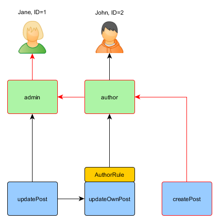

Autorización
=============

La autorización es el proceso para verificar que un usuario tiene permitido realizar algo. Yii provee dos metodos de autorización:
 Filtro de Control de Acceso (Access Control Filter-ACF) y Control de Acceso Basado en Roles (Role-Based Access Control-RBAC).


## Filtro de Control de Acceso (ACF) <span id="access-control-filter"></span>

El Filtro de Control de Acceso (ACF) es un metodo simple de autorizacion implementado como [[yii\filters\AccessControl]] el cual
es la mejor opcion para ser usado en aplicaciones que requieren un control de acceso sencillo. Como su nombre lo indica, ACF es una accion
de [filter](structure-filters.md) que puede ser usada por un controlador o un módulo. Mientras un usuario este solicitando
la ejecucion de una accion, ACF se encargara de verificar en la lista de [[yii\filters\AccessControl::rules|access rules]]
para determinar si el usuario esta autorizado para acceder a la accion solicitada.

El codigo siguiente muestra como utilizar ACF en el controlador `site` :

```php
use yii\web\Controller;
use yii\filters\AccessControl;

class SiteController extends Controller
{
    public function behaviors()
    {
        return [
            'access' => [
                'class' => AccessControl::className(),
                'only' => ['login', 'logout', 'signup'],
                'rules' => [
                    [
                        'allow' => true,
                        'actions' => ['login', 'signup'],
                        'roles' => ['?'],
                    ],
                    [
                        'allow' => true,
                        'actions' => ['logout'],
                        'roles' => ['@'],
                    ],
                ],
            ],
        ];
    }
    // ...
}
```

En el codigo anterior ACF esta unido al controlador `site` como un behavior. Esta es la forma tipica de la utilizacion del filtro en una accion.
La opción `only` especifica como ACF debe aplicarse a las acciones `login`, `logout` y `signup`.
Todas las otras acciones en el controlador `site` no son asunto del control de acceso. La lista de opciones de  `rules`
del [[yii\filters\AccessRule|access rules]], dice lo siguiente:

- Permitir a todos los Invitados (los usuarios que no estan autenticados) acceder a las acciones `login` y `signup`. La opcion `roles`
  contiene un signo de interrogacion `?` el cual es una especia de token que representa a los usuarios que sean  "usuarios invitados".
- Todos los usuarios autenticados pueden acceder a la accion `logout`. El caracter `@` es otro token especial que representa a todos los "usuarios autenticados".

ACF lleva a cabo la verificación de autorización mediante el examen de las reglas de acceso de uno en uno de arriba a abajo hasta que encuentra
una regla que se relaciones con el contexto de ejecucion. El valor `allow` de la regla de coincidencia luego serán utilizados para
juzgar si el usuario esta autorizado o no. Si ninguna de las reglas se relaciona, significa que el usuario no esta autorizado,
y ACF detendra la ejecucion de la accion..

Cuando ACF determina que un usuario no esta autorizado para acceder a una accion, Toma alguna de las siguientes medidas por default:

* Si el usuario es un invitado, llamara a [[yii\web\User::loginRequired()]] y redirigir al usuario mediante el navegador a la pagina de login.
* Si el usuario esta autenticado, arrojara una [[yii\web\ForbiddenHttpException]].

Puedes personalizar este comportamiento (behavior) mediante la configuracion de la propiedad [[yii\filters\AccessControl::denyCallback]], por ejemplo:

```php
[
    'class' => AccessControl::className(),
    ...
    'denyCallback' => function ($rule, $action) {
        throw new \Exception('You are not allowed to access this page');
    }
]
```

[[yii\filters\AccessRule|Access rules]] somporta algunas opciones. A continuacion se muestra un resumen de las opciones soportadas.
Tambien puedes extender [[yii\filters\AccessRule]]  para crear tus propias clases de reglas personalizadas.

 * [[yii\filters\AccessRule::allow|allow]]: Especifica si se trata de una regla para "permitir" ("allow") o de una regla "denegar" ("deny") .

 * [[yii\filters\AccessRule::actions|actions]]: especifica cual de las acciones de esta regla se relaciona. Este deberia ser una matriz de IDs de accion.
 La comparacion entre mayúsculas y minúsculas. Si esta opcion esta vacia (empty) o no esta asignada,
 significa que la regla se aplica a todas las acciones.

 * [[yii\filters\AccessRule::controllers|controllers]]: especifica a cual de los controladores se relaciona esta regla.
 Esta deberia ser un arreglo de IDs de controladores. Cada ID de controlador es prefijado con el modulo ID (si cualquier).
La comparacion se hace entre mayúsculas y minúsculas.Si esta opcion esta vacia o no esta asignada, significa que la regla aplica a todo el controlador.

 * [[yii\filters\AccessRule::roles|roles]]: especifica a que rol de los usuario esta regla se relaciona.
    Dos roles especiales son reconocidos, y ellos son verificados por medio de [[yii\web\User::isGuest]]

     - `?`: Esta relacionado con usuarios invitados (no autenticados).
     - `@`: Esta relacionado a usuarios que estan autenticados.

    Usando otros nombres de rol este disparara la invocacion de [[yii\web\User::can()]], el cual requiere que este habilitado RBAC
   (Sera descrito en la siguiente subsección). Si esta opcion esta vacia o no esta asignada, esta regla aplica para todos los roles.

 * [[yii\filters\AccessRule::ips|ips]]: esta especifica a cual [[yii\web\Request::userIP|client IP addresses]] esta regla se relaciona.
Una direccion IP puede contener el comodin `*` al final para que coincida con las direcciones IP con el mismo prefijo.
Por ejemplo, '192.168.*' se relaciona con todas las direcciones IP con el segmento '192.168.'. Si esta opcion esta vacia o no se asigna,
aplicara para todas las direcciones IP.

 * [[yii\filters\AccessRule::verbs|verbs]]: especifica el metodo de peticion por el cual la regla se relaciona (por ejemplo, `GET`, `POST`).
La comparacion se hace entre mayúsculas y minúsculas.

 * [[yii\filters\AccessRule::matchCallback|matchCallback]]: especifica una llamada a PHP para determinar si esta regla debe aplicar.

 * [[yii\filters\AccessRule::denyCallback|denyCallback]]: especifica una llamada a PHP para determinar cuando esta regla debe negar el acceso.

A continuación se muestra un ejemplo de como hacer uso de la opcion `matchCallback`, el cual permite escribir el acceso arbitrariamente.
comprobar la lógica:

```php
use yii\filters\AccessControl;

class SiteController extends Controller
{
    public function behaviors()
    {
        return [
            'access' => [
                'class' => AccessControl::className(),
                'only' => ['special-callback'],
                'rules' => [
                    [
                        'actions' => ['special-callback'],
                        'allow' => true,
                        'matchCallback' => function ($rule, $action) {
                            return date('d-m') === '31-10';
                        }
                    ],
                ],
            ],
        ];
    }

    // ¡match-callback es llamado! A esta pagina solo se puede acceder cada 31 de octubre
    public function actionSpecialCallback()
    {
        return $this->render('happy-halloween');
    }
}
```


## Control de Acceso Basado en Roles (Role Based Access Control-RBAC) <span id="rbac"></span>

El Control de Acceso Basado en Roles (RBAC) provee un simple pero poderoso control de acceso centralizado. Por favor dirigete a
 [Wikipedia](http://en.wikipedia.org/wiki/Role-based_access_control) para mas detalles acerca de la comparacion de RBAC
con otros mas esquemas de control de acceso.

Yii implementa un RBAC General y Jerarquico, siguiendo el [NIST RBAC model](http://csrc.nist.gov/rbac/sandhu-ferraiolo-kuhn-00.pdf).
Se provee la funcionalidad del RBAC a través de [[yii\rbac\ManagerInterface|authManager]] [application component](structure-application-components.md).

El uso de RBAC implica dos partes del trabajo. La primera parte es la construcción de los datos de la autorización de RBAC, y la segunda
 parte es la de usar esos datos de autorizacion realizar la comprobación de acceso en lugares donde se necesita.

Para facilitar nuestra descripcion proxima, nosotros primero deberemos introducirnos en los conceptos basicos de RBAC


### Conceptos Basicos <span id="basic-concepts"></span>

Un rol representa una coleccion de *permisos* (e.j. creando posts, actualizando posts). Un rol puede ser asignado
a uno o multiples usuarios. Para comprobar si un usuario tiene un permiso específico, podemos comprobar si se ha asignado al usuario
con un rol que contiene este permiso.

Asociado con cada función o permoso, puede haber una *regla*. Una regla representa una pieza de codigo que debera ser
ejecutada durante el chequeo de acceso para determinar si el rol o permiso aplica para el usuario que intenta acceder.
Por ejemplo, el permiso "actualizar post" deberia tener una regla que cheque si el usuario que esta accediendo es el creador del post.
Durante el chequeo de acceso, si el usuario NO  es el creador del post, el/ella se considero que no tienen el permiso "actualizar post".

Ambos, roles y permisos pueden ser organizados en una jerarquia. En particular, un un rol puede contener a otros roles y permisos;
 y un permiso puede contener a otros permisos. Yii implementa un *orden parcial* jerarquico el cual incluye el
jerarquia mas especial en *arbol*. Un rol puede contener a uno o varios permisos,mas no viceversa.


### Configurando RBAC <span id="configuring-rbac"></span>

Antes de partir para definir los datos de autorización y realizar la comprobación de acceso, tenemos que configurar el
componente [[yii\base\Application::authManager|authManager]] de la aplicacion. Yii provee dos tipos de manejadores de autorizacion:
[[yii\rbac\PhpManager]] y [[yii\rbac\DbManager]]. El primero utiliza un archivo de script de PHP para almacenar los datos de autorizacion,
mientras que el segundo almacena los datos de autorizacion en la base de datos. Puedes considerar el uso de la primera si su aplicación
no requiere papel muy dinámico y gestión de permisos.


#### Usando `PhpManager` <span id="using-php-manager"></span>

El codigo siguiente muestra cómo configurar el `authManager` en la configuracion de la aplicacion usando la clase [[yii\rbac\PhpManager]]:

```php
return [
    // ...
    'components' => [
        'authManager' => [
            'class' => 'yii\rbac\PhpManager',
        ],
        // ...
    ],
];
```

El `authManager` (manejador de autenticación) puede accesarse ahora via `\Yii::$app->authManager`.

Por defecto, [[yii\rbac\PhpManager]] almacena los datos de RBAC bajo el directorio `@app/rbac`. Asegurese que el directorio
y todos los archivos en el tienen los permisos suficientes para ser escritor por el proceso del servidor Web y otorgueselos de ser necesarios online.


#### Usando `DbManager` <span id="using-db-manager"></span>

El codigo siguiente muestra como configurar `authManager` in la configuracion de la aplicacion para la clase [yii\rbac\DbManager]]:

```php
return [
    // ...
    'components' => [
        'authManager' => [
            'class' => 'yii\rbac\DbManager',
        ],
        // ...
    ],
];
```
> Nota: Si estas usando yii2-basic-app (aplicacion basica de yii2), deberas configurar el archivo que esta en `config/console.php` para declarar
  `authManager` y necesitas adicionalmente declararlo en `config/web.php`.
> En el caso de yii2-advanced-app el  `authManager` debera ser declarado bajo el directorio `common/config/main.php`.

`DbManager` usa cuatro tablas en la base de datos donde almacena los datos de autorización:

- [[yii\rbac\DbManager::$itemTable|itemTable]]: La tabla para almacenar los items de autorizacion. Por default "auth_item".
- [[yii\rbac\DbManager::$itemChildTable|itemChildTable]]: La tabla donde se almacenan los items de autorizacion por jerarquia. Por defecto es "auth_item_child".
- [[yii\rbac\DbManager::$assignmentTable|assignmentTable]]: La tabla donde se almacenan las asignaciones a los items de autorizacion. Por default "auth_assignment".
- [[yii\rbac\DbManager::$ruleTable|ruleTable]]: La tabla donde se almacenan las reglas. Por defecto "auth_rule".

Antes de que puedas implementar necesitas crear las tablas respectivas en la base de datos. Para hacerlo, tu puedes usar las migraciones contenidas en `@yii/rbac/migrations`:

`yii migrate --migrationPath=@yii/rbac/migrations`

El `authManager` puede ahora ser accedido via `\Yii::$app->authManager`.


### Construyendo los Datos de Autorización <span id="generating-rbac-data"></span>

Construyendo los datos de autorización que tienen que ver con las siguientes tareas:

- definiendo roles y permisos;
- estableciendo relaciones entre roles y permisos;
- definiendo reglas;
- asociando reglas con roles y permisos;
- asignando roles a usuarios.

Dependiendo de la flexibilidad en la autorizacion que se requiera las tareas se pueden cumplir por caminos diferentes

Si la jerarquía de permisos no cambia en absoluto y que tiene un número fijo de usuarios puede crear un
[console command](tutorial-console.md#create-command) que va a inicializar los datos de autorización una vez a través de las API que ofrece via `authManager`:

```php
<?php
namespace app\commands;

use Yii;
use yii\console\Controller;

class RbacController extends Controller
{
    public function actionInit()
    {
        $auth = Yii::$app->authManager;

        // add "createPost" permission
        $createPost = $auth->createPermission('createPost');
        $createPost->description = 'Create a post';
        $auth->add($createPost);

        // add "updatePost" permission
        $updatePost = $auth->createPermission('updatePost');
        $updatePost->description = 'Update post';
        $auth->add($updatePost);

        // add "author" role and give this role the "createPost" permission
        $author = $auth->createRole('author');
        $auth->add($author);
        $auth->addChild($author, $createPost);

        // add "admin" role and give this role the "updatePost" permission
        // as well as the permissions of the "author" role
        $admin = $auth->createRole('admin');
        $auth->add($admin);
        $auth->addChild($admin, $updatePost);
        $auth->addChild($admin, $author);

        // Assign roles to users. 1 and 2 are IDs returned by IdentityInterface::getId()
        // usually implemented in your User model.
        $auth->assign($author, 2);
        $auth->assign($admin, 1);
    }
}
```

> Note: Si estas usando la plantilla avanzada, necesitas poner tu `RbacController` dentro del directorio `console/controllers`
 y cambiar el namespace a `console/controllers`.

Despues, ejecutando el comando `yii rbac/init` obtendremos la siguiente jerarquia:


Autor puede crear un post, admin puede actualizar su mensaje y hacer todo lo posible autor.

Si tu aplicacion permite al usuario el registro necesitas asignar los roles necesarios para cada usuario nuevo registrado. Por ejemplo, en orden para todos los usuarios inscritos para convertirse en autores de si plantilla avanzada tienes que modificar `frontend\models\SignupForm::signup()`
as follows:

```php
public function signup()
{
    if ($this->validate()) {
        $user = new User();
        $user->username = $this->username;
        $user->email = $this->email;
        $user->setPassword($this->password);
        $user->generateAuthKey();
        $user->save(false);

        // the following three lines were added:
        $auth = Yii::$app->authManager;
        $authorRole = $auth->getRole('author');
        $auth->assign($authorRole, $user->getId());

        return $user;
    }

    return null;
}
```

Para aplicaciones que requieren un control de acceso complejo con una actualizacion constante en los datos de autorizacion , interfaces especiales de usuario
(e.j. admin panel) pueden necesitar ser desarrollado utilizando las API que ofrece `authManager`.


### Usando Reglas <span id="using-rules"></span>

Como se habia mencionado, las reglas agregan restricciones adicionales a los roles y permisos. Una regla es una clase extendida desde
[[yii\rbac\Rule]]. Debe implementar al metodo [[yii\rbac\Rule::execute()|execute()]]. En la jerarquia tenemos creado previamente
que autor no puede editar su propio post. Vamos a arreglarlo. Primero necesitamos una regla para comprobar que el usuario es el autor del post:

```php
namespace app\rbac;

use yii\rbac\Rule;

/**
 * Checks if authorID matches user passed via params
 */
class AuthorRule extends Rule
{
    public $name = 'isAuthor';

    /**
     * @param string|integer $user the user ID.
     * @param Item $item the role or permission that this rule is associated with
     * @param array $params parameters passed to ManagerInterface::checkAccess().
     * @return boolean a value indicating whether the rule permits the role or permission it is associated with.
     */
    public function execute($user, $item, $params)
    {
        return isset($params['post']) ? $params['post']->createdBy == $user : false;
    }
}
```

La regla anterior comprueba si el `post` es creado por `$user`. Debemos crear un permiso especial `updateOwnPost` codigo que hemos utilizado
anteriormente:

```php
$auth = Yii::$app->authManager;

// add the rule
$rule = new \app\rbac\AuthorRule;
$auth->add($rule);

// add the "updateOwnPost" permission and associate the rule with it.
$updateOwnPost = $auth->createPermission('updateOwnPost');
$updateOwnPost->description = 'Update own post';
$updateOwnPost->ruleName = $rule->name;
$auth->add($updateOwnPost);

// "updateOwnPost" will be used from "updatePost"
$auth->addChild($updateOwnPost, $updatePost);

// allow "author" to update their own posts
$auth->addChild($author, $updateOwnPost);
```

Now we have got the following hierarchy:


### Comprobación de acceso <span id="access-check"></span>

Con los datos de autorizacion listos, la comprobacion de acceso es una simple llamada a el metodo [[yii\rbac\ManagerInterface::checkAccess()]].
Dado que la mayoría de comprobación de acceso está sobre el usuario actual, para mayor comodidad Yii proporciona un método de acceso directo
[[yii\web\User::can()]], que puede ser utilizado como el siguiente:

```php
if (\Yii::$app->user->can('createPost')) {
    // create post
}
```

Si el usuario actual es Jane con `ID=1` estamos empezando a `createPost` y tratando de obtener a `Jane`:



Con el fin de comprobar si un usuario puede actualizar un anuncio, necesitamos pasar un parámetro adicional que es requerido por `AuthorRule` descrito antes:

```php
if (\Yii::$app->user->can('updatePost', ['post' => $post])) {
    // update post
}
```

Aquí es lo que sucede si el usuario actual es John:


Estamos comenzando con el `updatePost` y pasando por `updateOwnPost`. Con el fin de pasar a la comprobación de acceso, `AuthorRule`
debe devolver `true` desde el metodo `execute()`. el metodo recive estos `$params` desde la llamada al metodo `can()`  por lo que el valor es
`['post' => $post]`. Si todo está bien, vamos a obtener a `author` el cual es asignado a John.

En caso de Jane que es un poco más simple ya que es un admin:


### Usando los roles por defecto <span id="using-default-roles"></span>

Un rol por defecto es un rol que esta asignado *implicitamente* a *todos* los usuarios. La llamada a [[yii\rbac\ManagerInterface::assign()]]
no es necesaria, y los datos de autorización no contiene la información de asignación.

Un rol por defecto es usualmente asociado con una regla la cual determina si el rol aplica al usuario verificado.


Los roles por defecto se utilizan a menudo en aplicaciones que ya tienen algún tipo de asignación de funciones. Por ejemplo, una aplicación
puede tener una columna "grupo" en su tabla de usuario para representar a qué grupo de privilegio cada usuario pertenece.
Si cada grupo privilegio puede ser asignada a un rol de RBAC, se puede utilizar la función de rol por default de forma automática
asignar a cada usuario a una función RBAC. Usemos un ejemplo para mostrar cómo se puede hacer esto.

Suponga que en la tabla de usuario, usted tiene una columna `grupo` que utiliza para representar el grupo administrador y 2 del grupo autor.
Planea tener dos roles RBAC `admin` y `author` para representar los permisos de estos dos grupos, respectivamente.
Puede configurar los datos de la siguiente manera en el RBAC,


```php
namespace app\rbac;

use Yii;
use yii\rbac\Rule;

/**
 * Checks if user group matches
 */
class UserGroupRule extends Rule
{
    public $name = 'userGroup';

    public function execute($user, $item, $params)
    {
        if (!Yii::$app->user->isGuest) {
            $group = Yii::$app->user->identity->group;
            if ($item->name === 'admin') {
                return $group == 1;
            } elseif ($item->name === 'author') {
                return $group == 1 || $group == 2;
            }
        }
        return false;
    }
}

$auth = Yii::$app->authManager;

$rule = new \app\rbac\UserGroupRule;
$auth->add($rule);

$author = $auth->createRole('author');
$author->ruleName = $rule->name;
$auth->add($author);
// ... add permissions as children of $author ...

$admin = $auth->createRole('admin');
$admin->ruleName = $rule->name;
$auth->add($admin);
$auth->addChild($admin, $author);
// ... add permissions as children of $admin ...
```

Tenga en cuenta que en la anterior, porque "author" es agregado como un hijo de "admin", cuando implementes el metodo `execute()`
de la clase de la regla, por lo que necesitas jerarquizar respectivamente bien. Por eso cuando el nombre del rol es "author",
el metodo `execute()` debera regresar true si el grupo de usuario  es cualquiera 1 o 2 (significa que el usuario se encuentra en
cualquiera de los dos grupos "admin" o grupo "author").

Lo mas próximo, configura `authManager` enumerando los dos roles en [[yii\rbac\BaseManager::$defaultRoles]]:

```php
return [
    // ...
    'components' => [
        'authManager' => [
            'class' => 'yii\rbac\PhpManager',
            'defaultRoles' => ['admin', 'author'],
        ],
        // ...
    ],
];
```

Ahora bien, si se realiza una comprobación de acceso, tanto del rol `admin` y  del rol `author` el cual debera ser evaluado bajo
las reglas asociadas con ellas. si la regla devuelve true, esto significa que la regla se aplica al usuario actual.
Basado en la aplicacion de la regla anterior, esto significa que si el valor un grupo `group` de un usuario es 1, el rol `admin`
se aplicaría al usuario; y si el valor de `group` es 2, el rol `author` se aplicaria.
