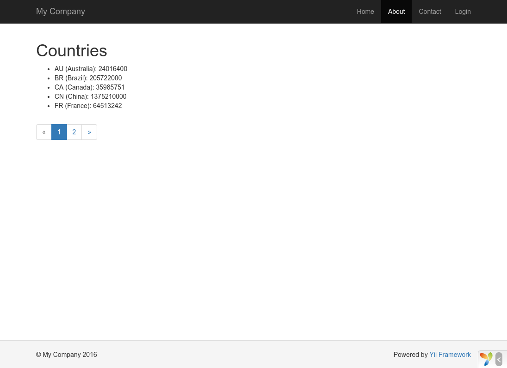

Trabajando con Bases de Datos
=============================

En esta sección, explicaremos cómo crear una nueva página para mostrar datos de países traídos de una tabla de la
base de datos llamada `country`. Para lograr este objetivo, configurarás una conexión a la base de datos,
crearás una clase [Active Record](db-active-record.md), una [acción](structure-controllers.md)
y una [vista](structure-views.md).

A lo largo de este tutorial, aprenderás

* Cómo configurar una conexión a la base de datos;
* Cómo definir una clase Active Record;
* Cómo realizar consultas a la base de datos utilizando la clase Active Record;
* Cómo mostrar datos en una vista con paginación incluida.

Ten en cuenta que para finalizar esta sección, deberás tener al menos conocimientos básicos y experiencia con bases de datos.
En particular, deberás ser capaz de crear una base de datos y saber ejecutar consultas SQL usando alguna herramienta de cliente de 
base de datos.


Preparando una Base de Datos <span id="preparing-database"></span>
----------------------------

Para empezar, crea una base de datos llamada `yii2basic` de la cual tomarás los datos en la aplicación.
Puedes elegir entre una base de datos SQLite, MySQL, PostgreSQL, MSSQL u Oracle. Por simplicidad, usaremos MySQL
en la siguiente descripción.

Crea una tabla llamada `country` e inserta algunos datos de ejemplo. Puedes utilizar las siguientes declaraciones SQL.

```sql
CREATE TABLE `country` (
  `code` char(2) NOT NULL PRIMARY KEY,
  `name` char(52) NOT NULL,
  `population` int(11) NOT NULL DEFAULT '0'
) ENGINE=InnoDB DEFAULT CHARSET=utf8;

INSERT INTO `Country` VALUES ('AU','Australia',18886000);
INSERT INTO `Country` VALUES ('BR','Brazil',170115000);
INSERT INTO `Country` VALUES ('CA','Canada',1147000);
INSERT INTO `Country` VALUES ('CN','China',1277558000);
INSERT INTO `Country` VALUES ('DE','Germany',82164700);
INSERT INTO `Country` VALUES ('FR','France',59225700);
INSERT INTO `Country` VALUES ('GB','United Kingdom',59623400);
INSERT INTO `Country` VALUES ('IN','India',1013662000);
INSERT INTO `Country` VALUES ('RU','Russia',146934000);
INSERT INTO `Country` VALUES ('US','United States',278357000);
```

Al final, tendrás una base de datos llamada `yii2basic`, y dentro de esta, una tabla llamada `country` con diez
registros en ella.


Configurando una conexión a la Base de Datos <span id="configuring-db-connection"></span>
--------------------------------------------

Asegúrate de tener instalado la extensión de PHP [PDO](http://www.php.net/manual/es/book.pdo.php) y el driver
de PDO para el motor que estés utilizando (ej. `pdo_mysql` para MySQL). Este es un requisito básico si tu aplicación
va a utilizar bases de datos relacionales.

Abre el archivo `config/db.php` y ajusta el contenido dependiendo de la configuración a tu base de datos. Por defecto,
el archivo contiene el siguiente contenido:

```php
<?php

return [
    'class' => 'yii\db\Connection',
    'dsn' => 'mysql:host=localhost;dbname=yii2basic',
    'username' => 'root',
    'password' => '',
    'charset' => 'utf8',
];
```

Esta es una típica [configuración](concept-configurations.md) basada en archivos. Especifica los parámetros
necesarios para crear e inicializar una instancia de [[yii\db\Connection]] a través de la cual puedes realizar
consultas SQL contra la base de datos subyacente.

La conexión a la base de datos realizada anteriormente puede ser accedida mediante `Yii::$app->db`.

> Información: El archivo `config/db.php` será incluido en el archivo principal de configuración `config/web.php`,
  el cual especifica cómo la instancia de la [aplicación](structure-applications.md) debe ser inicializada.
  Para más información, consulta la sección [Configuraciones](concept-configurations.md).


Creando un Active Record <span id="creating-active-record"></span>
------------------------

Para representar y extraer datos de la tabla `country`, crea una clase [Active Record](db-active-record.md)
llamada `Country` y guárdala en el archivo `models/Country.php`.

```php
<?php

namespace app\models;

use yii\db\ActiveRecord;

class Country extends ActiveRecord
{
}
```

La clase `Country` extiende de [[yii\db\ActiveRecord]]. No necesitas escribir ningún código dentro de ella.
Yii adivinará la tabla correspondiente a la clase desde su nombre. En caso de que esto no funcione, puedes
sobrescribir el método [[yii\db\ActiveRecord::tableName()]] para especificar la tabla asociada a la clase.

Utilizando la clase `Country`, puedes manipular los datos de la tabla `country` fácilmente. Debajo hay sencillos
ejemplos de código que muestran cómo utilizar la clase `Country`.

```php
use app\models\Country;

// obtiene todos los registros de la tabla country ordenándolos por "name"
$countries = Country::find()->orderBy('name')->all();

// obtiene el registro cuya clave primaria es "US"
$country = Country::findOne('US');

// muestra "United States"
echo $country->name;

// cambia el nombre del país a "U.S.A." y lo guarda en la base de datos
$country->name = 'U.S.A.';
$country->save();
```

> Información: Active Record es una potente forma de acceder y manipular datos de una base de datos de una manera
orientada a objetos.
Puedes encontrar información más detallada acerca de [Active Record](db-active-record.md). Además de Active Record,
puedes utilizar un método de acceso de bajo nivel llamado [Data Access Objects](db-dao.md).


Creando una Acción <span id="creating-action"></span>
------------------

Para mostrar el país a los usuarios, necesitas crear una acción. En vez de hacerlo en el controlador `site`
como lo hiciste en las secciones previas, tiene más sentido crear un nuevo controlador que englobe todas las
acciones de manipulación de datos de la tabla country. Llama a este nuevo controlador `CountryController` y define
una acción `index` en él, como se muestra a continuación:

```php
<?php

namespace app\controllers;

use yii\web\Controller;
use yii\data\Pagination;
use app\models\Country;

class CountryController extends Controller
{
    public function actionIndex()
    {
        $query = Country::find();

        $pagination = new Pagination([
            'defaultPageSize' => 5,
            'totalCount' => $query->count(),
        ]);

        $countries = $query->orderBy('name')
            ->offset($pagination->offset)
            ->limit($pagination->limit)
            ->all();

        return $this->render('index', [
            'countries' => $countries,
            'pagination' => $pagination,
        ]);
    }
}
```

Guarda el código anterior en el archivo `controllers/CountryController.php`.

La acción `index` llama a `Country::find()` para generar una consulta a la base de datos y traer todos los datos
de la tabla `country`.
Para limitar la cantidad de registros traídos en cada petición, la consulta es paginada con la ayuda de un objeto
[[yii\data\Pagination]]. El objeto `Pagination` sirve para dos propósitos:

* Define las cláusulas `offset` y `limit` de la consulta SQL para así sólo devolver una sola página de datos
  (5 registros por página como máximo).
* Es utilizado en la vista para mostrar un paginador que consiste en una lista de botones que representan a cada página,
  tal como será explicado en la siguiente sub-sección.

Al final, la acción `index` renderiza una vista llamada `index` y le pasa los datos de países así como la información
de paginación relacionada.


Creando una Vista <span id="creating-view"></span>
-----------------

Bajo el directorio `views`, crea primero un sub-directorio llamado `country`. Este será usado para contener
todas las vistas renderizadas por el controlador `country`. 
Dentro del directorio `views/country`, crea un archivo llamado `index.php` con el siguiente contenido:

```php
<?php
use yii\helpers\Html;
use yii\widgets\LinkPager;
?>
<h1>Países</h1>
<ul>
<?php foreach ($countries as $country): ?>
    <li>
        <?= Html::encode("{$country->name} ({$country->code})") ?>:
        <?= $country->population ?>
    </li>
<?php endforeach; ?>
</ul>

<?= LinkPager::widget(['pagination' => $pagination]) ?>
```

La vista consiste en dos partes. En la primera, los datos de países son recorridos y renderizados como una lista HTML.
En la segunda parte, un widget [[yii\widgets\LinkPager]] es renderizado usando la información de paginación
pasada desde la acción.
El widget `LinkPager` muestra una lista de botones que representan las páginas disponibles. Haciendo click en cualquiera
de ellas mostrará los datos de países de la página correspondiente.


Probándolo <span id="trying-it-out"></span>
----------

Para ver cómo funciona, utiliza a la siguiente URL en tu navegador:

```
http://hostname/index.php?r=country/index
```



Verás una página que muestra cinco países. Y debajo de todos los países, verás un paginador con cuatro botones.
Si haces click en el botón "2", verás que la página muestra otros cinco países de la base de datos.
Observa más cuidadosamente y verás que la URL en el navegador cambia a

```
http://hostname/index.php?r=country/index&page=2
```

Entre bastidores, [[yii\data\Pagination|Pagination]] está realizando su magia.

* Inicialmente, [[yii\data\Pagination|Pagination]] representa la primera página, que agrega a la consulta SQL
  a la base de datos con la cláusula `LIMIT 5 OFFSET 0`. Como resultado, los primeros cinco países serán traídos y mostrados.
* El widget [[yii\widgets\LinkPager|LinkPager]] renderiza los botones de páginas usando las URLs
  creadas por [[yii\data\Pagination::createUrl()|Pagination]]. Las URLs contendrán el parámetro `page`
  representando los números de páginas.
* Si haces click en el botón "2", se lanza y maneja una nueva petición a la ruta `country/index`.
  [[yii\data\Pagination|Pagination]] lee el parámetro `page` y define el número de página actual como "2".
  Por consiguiente, la consulta a la base de datos tendrá la cláusula `LIMIT 5 OFFSET 5` y devolverá los
  siguientes cinco países para mostrar.


Resumen <span id="summary"></span>
-------

En esta sección has aprendido cómo trabajar con una base de datos. También has aprendido cómo traer y mostrar
datos paginados con la ayuda de [[yii\data\Pagination]] y [[yii\widgets\LinkPager]].

En la siguiente sección, aprenderás a utilizar la poderosa herramienta de generación de código llamada [Gii](tool-gii.md),
para ayudarte a implementar rápidamente algunas características comunes, como crear operaciones de Alta-Baja-Modificación
(ABM, o CRUD en inglés) de los datos guardados en la base de datos. De hecho, el código que acabas de escribir fue 
generado automáticamente a través de esta herramienta.
