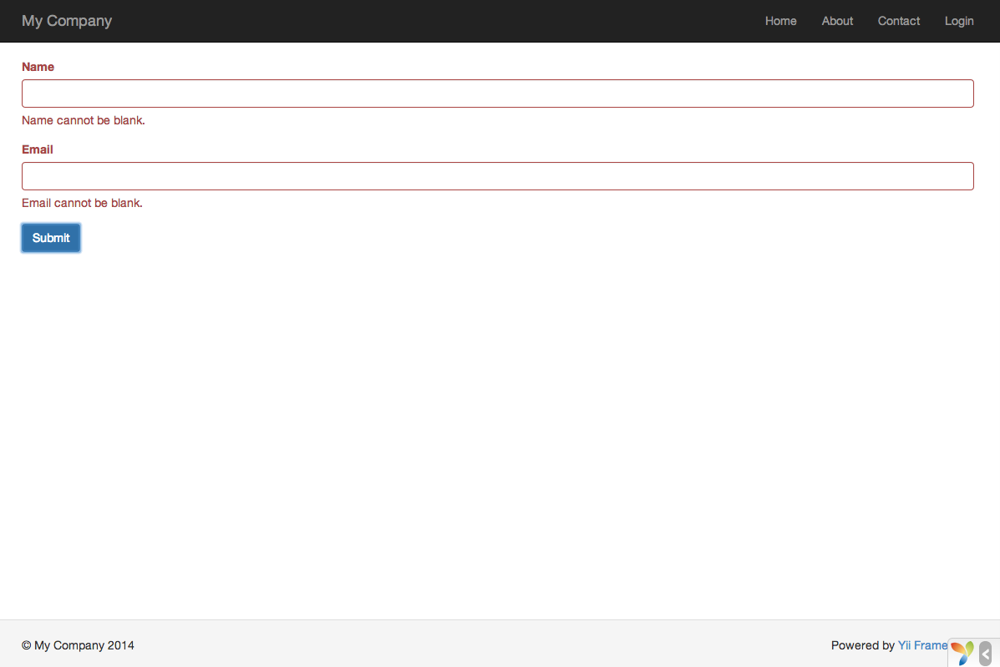

Trabajando con Formularios
==========================

En esta sección, describiremos como crear una nueva página para solicitar información de los usuarios.
La página mostrará un formulario con un campo de input para el nombre y un campo de input para el email.
Después de recibir estos datos del usuario, la página le mostrará la información de vuelta al usuario para la confirmación.

Para lograr este objetivo, además de crear un [action](structure-controllers.md) (acción) y
dos [views](structure-views.md) (vistas), también crearás un [model](structure-models.md) (modelo).

A través de este tutorial, aprenderás

* Cómo crear un [model](structure-models.md) para representar los datos ingresados por un usuario;
* Cómo declarar reglas para validar los datos ingresado por los usuarios;
* Cómo construir un formulario HTML en un [view](structure-views.md).


Creando un Modelo <a name="creating-model"></a>
-----------------

Para representar los datos ingresados por un usuario, crea una clase modelo `EntryForm` cómo se muestra abajo y
guarda la clase en el archivo `models/EntryForm.php`. Por favor ver la sección [Class Autoloading](concept-autoloading.md)
para más detalles acerca de la convención de como nombrar los archivos de clase.

```php
<?php

namespace app\models;

use yii\base\Model;

class EntryForm extends Model
{
    public $name;
    public $email;

    public function rules()
    {
        return [
            [['name', 'email'], 'required'],
            ['email', 'email'],
        ];
    }
}
```

La clase se extiende a partir de [[yii\base\Model]], que es una clase base que provee Yii y es comúnmente utilizada
para representar datos de formularios.

La clase contiene dos miembros públicos, `name` y `email`, que son utilizas para mantener
los datos ingresados por el usuario. También contiene el método llamado `rules()` que regresa un conjunto
de reglas utilizadas para validar los datos. Las reglas de validación declaradas arriba indican que

* que ambos datos tanto el `name` como el `email` son requeridos;
* el dato `email` debe ser una dirección de correo válida.

Si tienes un objeto `EntryForm` llenado con los datos ingresados por el usuario, puedes llamar
su [[yii\base\Model::validate()|validate()]] para disparar (trigger) la validación de los datos. Un fallo en la validación
de los datos se mostrará en la propiedad [[yii\base\Model::hasErrors|hasErrors]], y a través de
[[yii\base\Model::getErrors|errors]] puedes aprender cuales son los errores de validación que tiene el modelo.


Creando una Acción <a name="creating-action"></a>
------------------

Luego, crea una acción `entry` en el controlador `site`, como lo hiciste en la sección anterior.

```php
<?php

namespace app\controllers;

use Yii;
use yii\web\Controller;
use app\models\EntryForm;

class SiteController extends Controller
{
    // ...código existente...

    public function actionEntry()
    {
        $model = new EntryForm;

        if ($model->load(Yii::$app->request->post()) && $model->validate()) {
            // validar los datos recibidos en el modelo

            // aquí haz algo significativo con el modelo ...

            return $this->render('entry-confirm', ['model' => $model]);
        } else {
            // La página es mostrada inicialmente o hay algún error de validación
            return $this->render('entry', ['model' => $model]);
        }
    }
}
```

La acción primero crea un objeto `EntryForm`. Luego intenta poblar el modelo
con los datos del `$_POST` que es proporcionado por Yii a través de [[yii\web\Request::post()]].
Si el modelo es llenado satisfactoriamente (p.e., el usuario ha enviado (submit) el formulario HTML),
llamará [[yii\base\Model::validate()|validate()]] para asegurarse que los datos ingresados
son válidos.

Si todo está bien, la acción mostrará (render) una vista llamada `entry-confirm` para confirmar
con el usuario que acepta los datos que ha ingresado. De otra manera, la vista `entry` será
mostrada, y mostrará el formulario HTML junto con los mensajes de error de validación (si es que hay alguno).

> Info: La expresión `Yii::$app` representa la instancia de la [application](structure-applications.md) (aplicación)
  que es un singleton globalmente accesible. También es un [service locator](concept-service-locator.md) (localizador de servicio)
  que provee los componentes, tales como `request`, `response`, `db`, etc. para soportar funcionalidades específicas.
  En el código de arriba, el componente `request` es utilizado para acceder los datos `$_POST`.


Creando Vistas <a name="creating-views"></a>
--------------

Finalmente, crea dos vistas llamadas `entry-confirm` y `entry` que son mostradas por la acción `entry`,
como fue descrito en la última sub-sección.

La vista `entry-confirm` simplemente muestra los datos de name y email. Debe ser guardada como el archivo `views/site/entry-confirm.php`.

```php
<?php
use yii\helpers\Html;
?>
<p>You have entered the following information:</p>

<ul>
    <li><label>Name</label>: <?= Html::encode($model->name) ?></li>
    <li><label>Email</label>: <?= Html::encode($model->email) ?></li>
</ul>
```

La vista `entry` muestra un formulario HTML. Debe ser guardado como el archivo `views/site/entry.php`.

```php
<?php
use yii\helpers\Html;
use yii\widgets\ActiveForm;
?>
<?php $form = ActiveForm::begin(); ?>

    <?= $form->field($model, 'name') ?>

    <?= $form->field($model, 'email') ?>

    <div class="form-group">
        <?= Html::submitButton('Submit', ['class' => 'btn btn-primary']) ?>
    </div>

<?php ActiveForm::end(); ?>
```

La vista utiliza un poderoso [widget](structure-widgets.md) llamado [[yii\widgets\ActiveForm|ActiveForm]] para
construir el formulario HTML. Los métodos `begin()` y `end()` del widget muestran, respectivamente, las etiquetas de 
apertura y cierre del formulario. Entre las llamadas de los dos métodos, los campos de input son creados por el
método [[yii\widgets\ActiveForm::field()|field()]]. El primer campo input es del dato "name",
y el segundo del dato "email". Después de los campos de input, el método [[yii\helpers\Html::submitButton()]] 
es llamado para general el botón de submit (enviar).


Probando <a name="trying-it-out"></a>
--------

Para ver como funciona, utiliza tu navegador para ir al siguiente URL:

```
http://hostname/index.php?r=site/entry
```

Verás una página que muestra un formulario con dos campos de input. Adelante de cada campo de input, será mostrada también 
una etiqueta indicando que dato necesitas ingresar. Si haces click en el botón de submit sin ingresar nada, 
o si ingresas una dirección de correo inválida, verás un mensaje de error que
se mostrará al lado del campo que tiene problemas.



Después de ingresar un nombre y dirección de correo válidos y haciendo click en el botón de submit, verás una nueva página
mostrando los datos que acabas de ingresar.


### Magia Explicada <a name="magic-explained"></a>

Te puedes preguntar como el formulario HTML funciona detrás de cámara, porque parece casi mágico que pueda 
mostrar una etiqueta para cada campo de input y mostrar los mensajes de error si no ingresas los datos correctamente
sin recargar la página.

Si, la validación de los datos es realmente realizada en el lado del cliente utilizando JavaScript así como también en el lado del servidor.
[[yii\widgets\ActiveForm]] es lo suficientemente inteligente para extraer las reglas de validación que has declarado en `EntryForm`,
convertirlas en código Javascript, y utilizar el JavaScript para realizar la validación de los datos. En caso de que hayas deshabilitado 
JavaScript en tu navegador, la validación igual se realizará en el lado del servidor, como se muestra en 
el método `actionEntry()`. Esto garantiza la validez de los datos en todas las circunstancias.

Las etiquetas de los campos de input son generados por el método `field()` basado en los nombres de las propiedades del modelo.
Por ejemplo, la etiqueta `Name` será generada de la propiedad `name`. Puedes personalizar una etiqueta con
el siguiente código:

```php
<?= $form->field($model, 'name')->label('Tu Nombre') ?>
<?= $form->field($model, 'email')->label('Tu Email') ?>
```

> Info: Yii provee muchos widgets para ayudarte a construir rápidamente vistas complejas y dinámicas.
  Como aprenderás más adelante, escribir un nuevo  widget es extremadamente fácil. Puedes convertir mucho del
  código de tus vistas en widgets reutilizables para simplificar el desarrollo de las vistas en un futuro.


Resumen <a name="summary"></a>
-------

En esta sección, has tocado cada parte del patrón de diseño MVC. Ahora has aprendido
a crear una clase modelo para representar los datos del usuario y validarlos.

También has aprendido como obtener datos de los usuarios y como mostrarlos de vuelta. Esta es una tarea que
puede tomarte mucho tiempo cuando estás desarrollando una aplicación. Yii provee poderosos widgets 
para hacer muy fácil esta tarea.

En la próxima sección, aprenderás como trabajar con bases de datos que son necesarias en casi cualquier aplicación.
