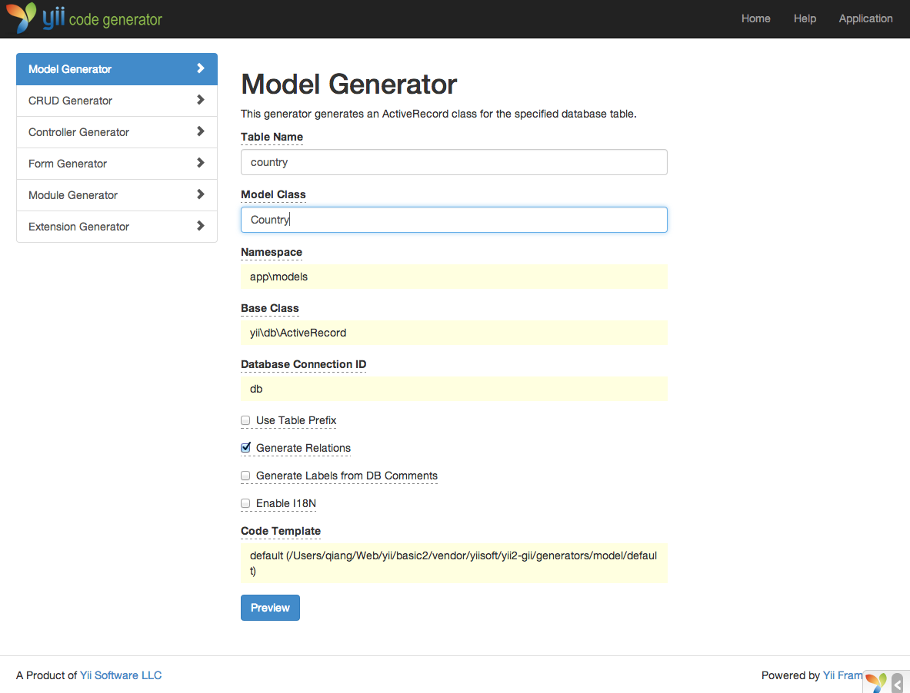
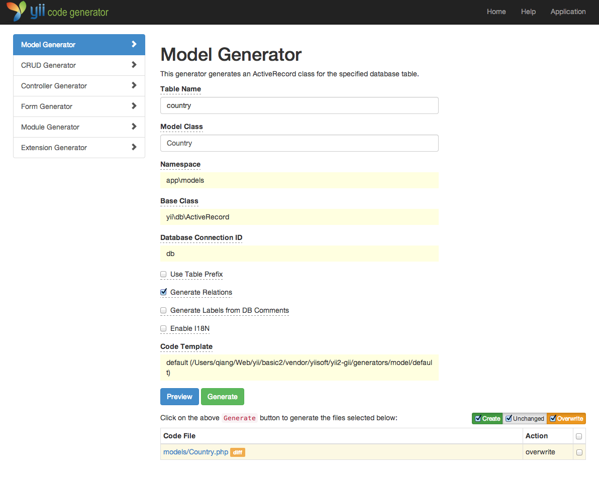
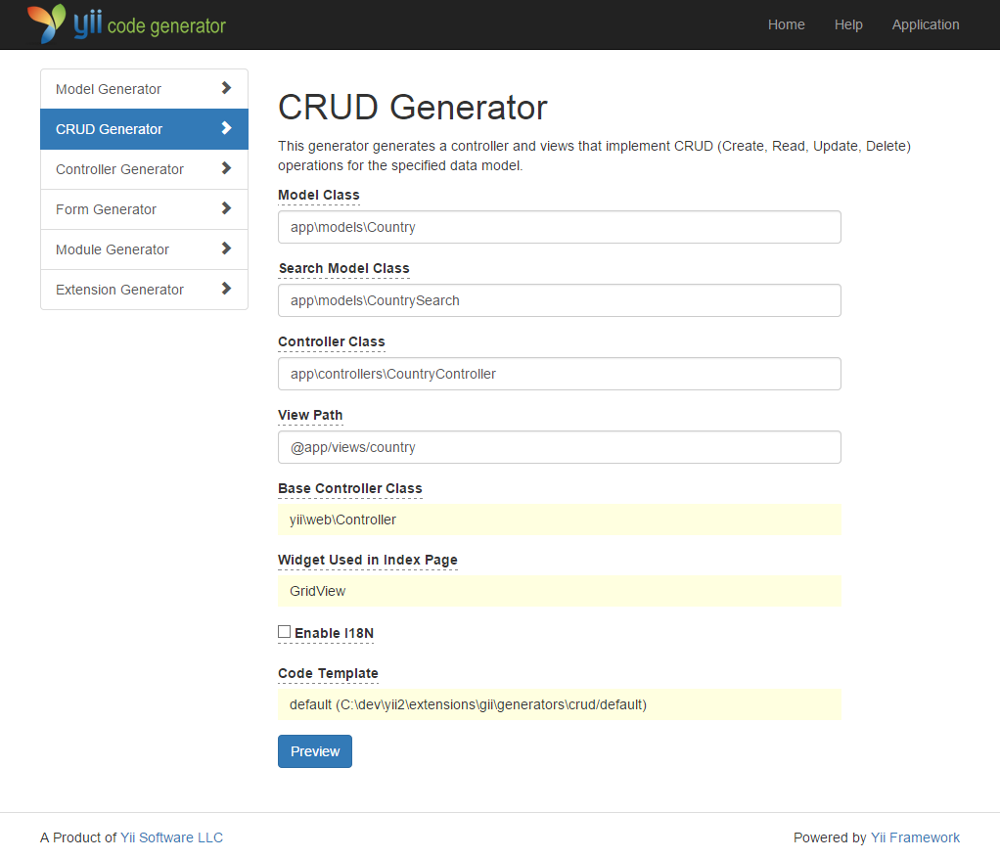
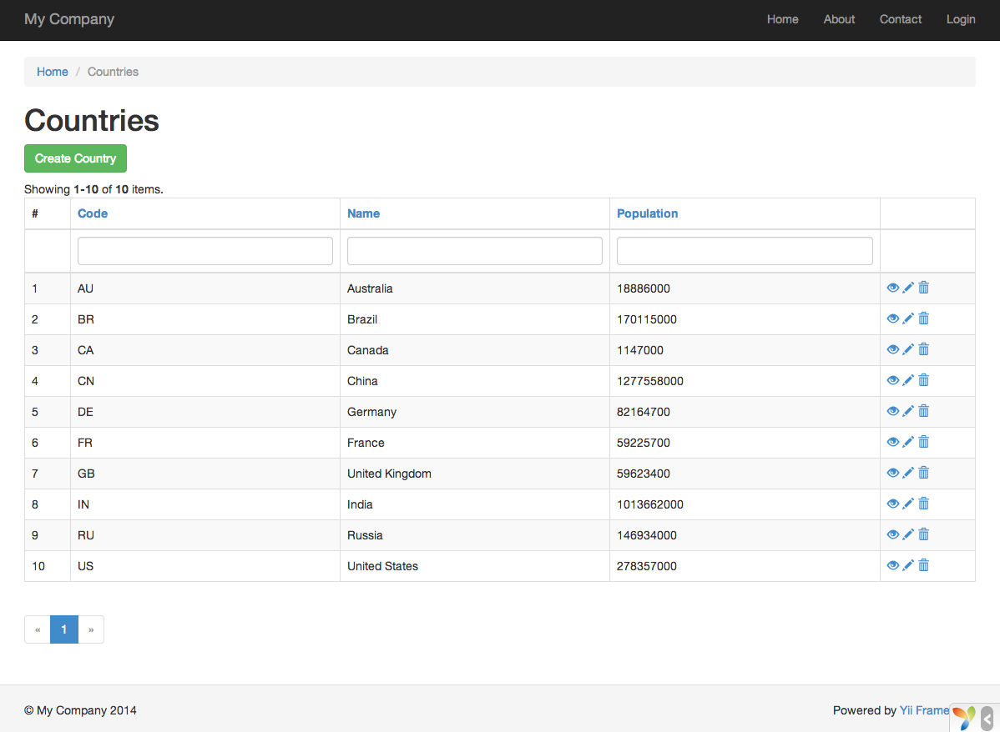
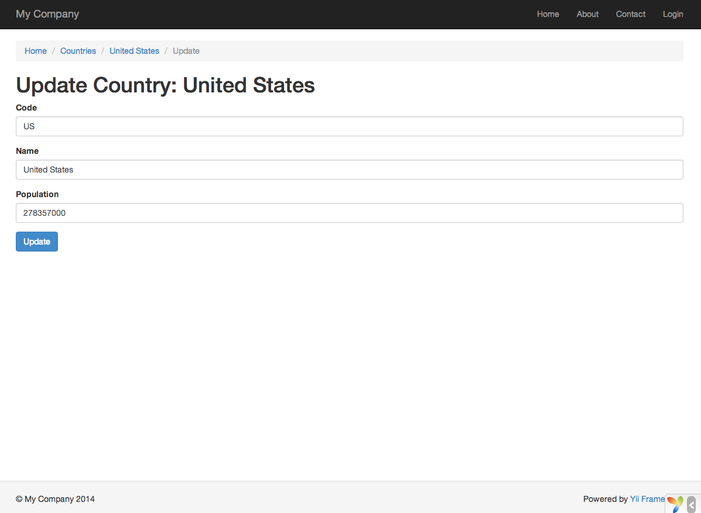

Generando Código con Gii
========================

En esta sección, explicaremos cómo utilizar [Gii](tool-gii.md) para generar código que automáticamente
implementa algunas de las características más comunes de una aplicación. Para lograrlo, todo lo que tienes que hacer es
ingresar la información de acuerdo a las instrucciones mostradas en la páginas web de Gii.

A lo largo de este tutorial, aprenderás

* Cómo activar Gii en tu aplicación;
* Cómo utilizar Gii para generar una clase Active Record;
* Cómo utilizar Gii para generar el código que implementa las operaciones ABM de una tabla de la base de datos.
* Cómo personalizar el código generado por Gii.


Comenzando con Gii <span id="starting-gii"></span>
------------------

[Gii](tool-gii.md) está provisto por Yii en forma de [módulo](structure-modules.md). Puedes habilitar Gii
configurándolo en la propiedad [[yii\base\Application::modules|modules]] de la aplicación. Dependiendo de cómo hayas creado tu aplicación, podrás encontrar que el siguiente código ha sido ya incluido en el archivo de configuración `config/web.php`:

```php
$config = [ ... ];

if (YII_ENV_DEV) {
    $config['bootstrap'][] = 'gii';
    $config['modules']['gii'] = [
        'class' => 'yii\gii\Module',
    ];
}
```

La configuración dice que al estar en el [entorno de desarrollo](concept-configurations.md#environment-constants),
la aplicación debe incluir el módulo llamado `gii`, cuya clase es [[yii\gii\Module]].

Si chequeas el [script de entrada](structure-entry-scripts.md) `web/index.php` de tu aplicación, encontrarás la línea
que esencialmente define la constante `YII_ENV_DEV` como verdadera -`true`.

```php
defined('YII_ENV') or define('YII_ENV', 'dev');
```

De esta manera, tu aplicación habrá habilitado Gii, y puedes acceder al módulo a través de la siguiente URL:

```
http://hostname/index.php?r=gii
```


Generando una Clase Active Record <span id="generating-ar"></span>
---------------------------------

Para poder generar una clase Active Record con Gii, selecciona "Model Generator" (haciendo click en el vínculo que existe en la página inicial del modulo Gii). Después, completa el formulario de la siguiente manera,

* Table Name: `country`
* Model Class: `Country`



Haz click el el botón "Preview". Verás que `models/Country.php` está mostrado listado como la clase resultante que ha de ser creada. Puedes hacer click en el nombre de la clase para previsualizar su contenido.

Al utilizar Gii, si habías creado previamente el mismo archivo y puede ser sobrescrito, si haces click
en el botón `diff` cercano al nombre del archivo, verás las diferencias entre el código a ser generado
y la versión existente del mismo.



Para sobrescribir un archivo existente, marca el checkbox que se encuentra al lado de "overwrite" y posteriormente haz click en el botón "Generate".

Después, verás una página de confirmación indicando que el código ha sido generado correctamente y tu archivo `models/Country.php`
ha sido sobrescrito con el nuevo código generado.


Generando código de ABM (CRUD en inglés) <span id="generating-crud"></span>
----------------------------------------

En computación, CRUD es el acrónimo de Crear, Obtener, Actualizar y Borrar (del inglés: Create, Read, Update y Delete) 
representando la cuatro funciones con datos más comunes en la mayoría de sitios Web. 
El acrónimo ABM es Altas, Bajas y Modificaciones. Para generar un ABM, selecciona "CRUD Generator" y completa el formulario de esta manera:

* Model Class: `app\models\Country`
* Search Model Class: `app\models\CountrySearch`
* Controller Class: `app\controllers\CountryController`



Al hacer click en el botón "Preview" verás la lista de archivos a ser generados.

Si has creado previamente los archivos `controllers/CountryController.php` y
`views/country/index.php` (en la sección sobre bases de datos de esta guía), asegúrate de seleccionar el checkbox "overwrite" para reemplazarlos. (Las versiones anteriores no disponían de un soporte ABM (CRUD) completo.)


Probándolo <span id="trying-it-out"></span>
----------

Para ver cómo funciona, accede desde tu navegador a la siguiente URL:

```
http://hostname/index.php?r=country/index
```

Verás una grilla de datos mostrando los países de la base de datos. Puedes ordenar la grilla
o filtrar los resultados escribiendo alguna condición en los encabezados de las columnas.

Por cada país mostrado en la grilla, puedes elegir entre visualizar el registro, actualizarlo o eliminarlo.
Puedes incluso hacer click en el botón "Create Country" que se encuentra sobre la grilla y así cargar
un nuevo país en la base de datos.





La siguiente es la lista de archivos generados por Gii, en el caso de que quieras inspeccionar cómo el ABM ha sido generado,
o por si desearas personalizarlos:

* Controlador: `controllers/CountryController.php`
* Modelos: `models/Country.php` y `models/CountrySearch.php`
* Vistas: `views/country/*.php`

> Info: Gii está diseñado para ser una herramienta altamente configurable. Utilizándola con sabiduría
  puede acelerar enormemente la velocidad de desarrollo de tu aplicación. Para más detalles, consulta la
  sección [Gii](tool-gii.md).


Resumen <span id="summary"></span>
-------

En esta sección, has aprendido a utilizar Gii para generar el código que implementa completamente las características
de un ABM de acuerdo a una determinada tabla de la base de datos.
