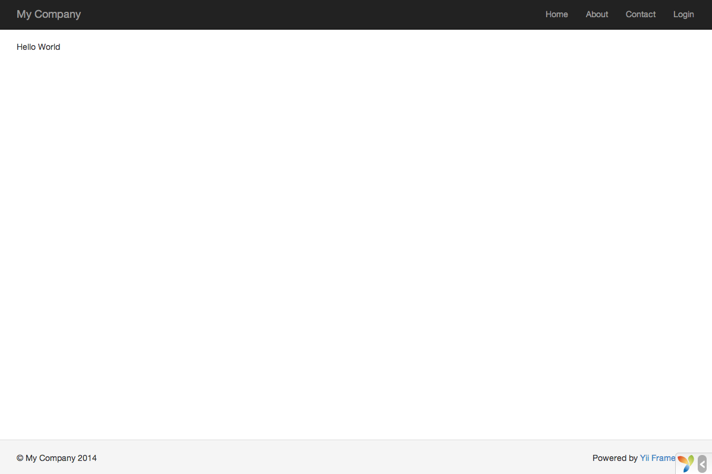

Diciendo Hola
=============

Esta sección describe cómo crear la típica página "Hola Mundo" (Hello World en inglés) en tu aplicación.
Para lograr este objetivo, vas a crear una [acción](structure-controllers.md#creating-actions) y 
una [vista](structure-views.md):

* La aplicación enviará la petición de la página a la acción
* y la acción regresará el render de la vista que muestra la palabra "Hola" al usuario final.

A lo largo de este tutorial, aprenderás tres cosas:

1. Cómo crear una [acción](structure-controllers.md) para responder peticiones (request),
2. Cómo crear una [vista](structure-views.md) para armar el contenido de la respuesta, y
3. Cómo una aplicación envía peticiones a las [acciones](structure-controllers.md#creating-actions).


Creando una Acción <span id="creating-action"></span>
------------------

Para la tarea "Hola", crearás una [acción](structure-controllers.md#creating-actions) `say` que lee
un parámetro `message` de la petición y muestra este mensaje de vuelta al usuario. Si la petición
no provee un parámetro `message`, la acción mostrará el mensaje por defecto "Hola".

> Info: Las [acciones](structure-controllers.md#creating-actions) son objetos que los usuarios finales pueden utilizar directamente para
  su ejecución. Las acciones están agrupadas por [controladores](structure-controllers.md) (controllers). El resultado de la ejecución de
  una acción es la respuesta que el usuario final recibirá.

Las acciones deben ser declaradas en [controladores](structure-controllers.md). Para simplificar, puedes
declarar la acción `say` en el controlador `SiteController` existente. Este controlador está definido
en el archivo de clase `controllers/SiteController.php`. Aquí está el inicio de la nueva acción:

```php
<?php

namespace app\controllers;

use yii\web\Controller;

class SiteController extends Controller
{
    // ...código existente...

    public function actionSay($message = 'Hola')
    {
        return $this->render('say', ['message' => $message]);
    }
}
```

En el código de arriba, la acción `say` está definida por un método llamado `actionSay` en la clase `SiteController`.
Yii utiliza el prefijo `action` para diferenciar los métodos de acciones de otros métodos en las clases de los controladores.
El nombre que le sigue al prefijo `action` se mapea al ID de la acción.

Cuando se trata de nombrar las acciones, debes entender como Yii trata los ID de las acciones. Los ID de las acciones siempre son 
referenciados en minúscula. Si un ID de acción requiere múltiples palabras, estas serán concatenadas con guiones
(ej., `crear-comentario`). Los nombres de los métodos de las acciones son mapeados a los ID de las acciones 
removiendo los guiones, colocando en mayúscula la primera letra de cada palabra, y colocando el prefijo `action` al resultado. Por ejemplo,
el ID de la acción `crear-comentario` corresponde al nombre de método de acción `actionCrearComentario`.

El método de acción en nuestro ejemplo toma un parámetro `$message`, el cual tiene como valor por defecto `"Hola"` (de la misma manera 
que se coloca un valor por defecto a un argumento en cualquier función o método en PHP). Cuando una aplicación 
recibe una petición y determina que la acción `say` es responsable de manejar dicha petición, la aplicación llenará 
el parámetro con el parámetro que tenga el mismo nombre en la petición. En otras palabras, si la petición incluye un 
parámetro `message` con el valor de `"Adios"`, la variable `$message` dentro de la acción será sustituida por este valor.

Dentro del método de acción, [[yii\web\Controller::render()|render()]] es llamado para hacer render (mostrar o visualizar) un 
archivo [vista](structure-views.md) (template) llamado `say`. El parámetro `message` tambien es pasado al  view para que pueda ser utilizado ahí. 
El resultado es devuelto al método de la acción. Ese resultado será recibido por la aplicación y mostrado al usuario final en el
navegador (como parte de una página HTML completa).


Creando una Vista <span id="creating-view"></span>
-----------------

Las [vistas](structure-views.md) son scripts que escribes para generar una respuesta de contenido.
Para la tarea "Hola", vas a crear una vista `say` que imprime el parámetro `message` recibido desde el método action, y pasado por la acción a la vista:

```php
<?php
use yii\helpers\Html;
?>
<?= Html::encode($message) ?>
```

La vista `say` debe ser guardada en el archivo `views/site/say.php`. Cuando el método [[yii\web\Controller::render()|render()]]
es llamado en una acción, buscará un archivo PHP llamado `views/ControllerID/NombreVista.php`.

Nota que en el código de arriba, el parámetro `message` es procesado por [[yii\helpers\Html::encode()|HTML-encoded]]
antes de ser impreso. Esto es necesario ya que el parámetro viene de un usuario final, haciéndolo vulnerable a 
[ataques cross-site scripting (XSS)](https://es.wikipedia.org/wiki/Cross-site_scripting) pudiendo inyectar código de Javascript malicioso dentro del parámetro.

Naturalmente, puedes colocar mas contenido en la vista `say`. El contenido puede consistir de etiquetas HTML, texto plano, e inclusive código PHP.
De hecho, la vista `say` es sólo un script PHP que es ejecutado por el método [[yii\web\Controller::render()|render()]].
El contenido impreso por el script de la vista será regresado a la aplicación como la respuesta del resultado. La aplicación a cambio mostrará el resultado al usuario final.


Probándolo <span id="trying-it-out"></span>
----------

Después de crear la acción y la vista, puedes acceder a la nueva página abriendo el siguiente URL:

```
https://hostname/index.php?r=site%2Fsay&message=Hello+World
```



Esta URL resultará en una página mostrando "Hello World". La página comparte el mismo encabezado y pie de página de las otras páginas de la aplicación. 

Si omites el parámetro `message` en el URL, verás que la página muestra sólo "Hola". Esto es porque `message` es pasado como un parámetro al método `actionSay()`, 
y cuando es omitido, el valor por defecto `"Hola"` será utilizado.

> Info: La nueva página comparte el mismo encabezado y pie de página que otras páginas porque el método [[yii\web\Controller::render()|render()]]
  automáticamente inyectará el resultado de la vista `say` en el [layout](structure-views.md#layouts), que en este 
  caso está localizada en `views/layouts/main.php`.

El parámetro `r` en el URL de arriba requiere más explicación. Se refierea a [route](runtime-routing.md) (ruta), y es el ID amplio y único de una aplicación
que refiere a una acción. El formato de las rutas es `ControllerID/ActionID`. Cuando la aplicación recibe una petición, revisará este parámetro,
utilizando la parte del `ControllerID` para determinar cual clase de controlador será inicializado para manejar la petición. Entonces, el controlador utilizará
la parte `ActionID` para determinar cual acción debe ser inizializada para hacer realmente el trabajo. 
En este ejemplo, la ruta  `site/say` será respondida por la clase controlador `SiteController` y la acción `say`. Como resultado, 
el método `SiteController::actionSay()` será llamado para manejar el requerimiento.

> Info: Al igual que las acciones, los controladores tambien tienen ID únicos que los identifican en una aplicación.
  Los ID de los Controladores utilizan las mismas reglas de nombrado que los ID de las acciones. Los nombres de las clases de los controladores son derivados de los ID de los controladores removiendo los guiones de los ID, colocando la primera letra en mayúscula en cada palabra, y colocando el sufijo `Controller` al resultado. Por ejemplo, el ID del controlador `post-comentario` corresponde
  al nombre de clase del controlador `PostComentarioController`.


Resumen <span id="summary"></span>
-------

En esta sección, has tocado las partes del controlador y la vista del patrón de diseño MVC.
Has creado una acción como parte de un controlador para manejar una petición específica. Y también has creado una vista para armar el contenido de la respuesta. 
En este simple ejemplo, ningún modelo ha sido involucrado ya que el único dato que fue utilizado fue el parámetro `message`.

También has aprendido acerca de las rutas en Yii, que actúan como puentes entre la petición del usuario y las acciones del controlador.

En la próxima sección, aprenderás como crear un modelo, y agregar una nueva página que contenga un formulario HTML.
