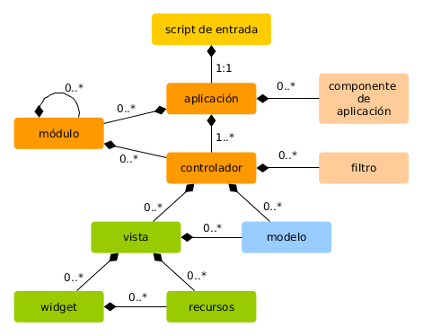

Corriendo Aplicaciones
======================

Después de haber instalado Yii, tienes una aplicación totalmente funcional a la que se puede acceder a través de
la URL `https://hostname/basic/web/index.php` o `https://hostname/index.php`, dependiendo de tu configuración.
Esta sección será una introducción a la funcionalidad incluida de la aplicación, cómo se organiza el código,
y cómo la aplicación maneja los requests en general.

> Info: Por simplicidad, en el transcurso de este tutorial "Para Empezar", se asume que has definido `basic/web`
  como el document root de tu servidor Web, y configurado la URL de acceso a tu aplicación para que sea `https://hostname/index.php`
  o similar.
  Dependiendo de tus necesidades, por favor ajusta dichas URLs.
  
Ten en cuenta que a diferencia del framework en sí, después de que el template de proyecto es instalado, este es todo tuyo. Eres libre de agregar o eliminar
código modificar todo según tu necesidad.


Funcionalidad <span id="functionality"></span>
-------------

La aplicación básica contiene 4 páginas:

* página principal, mostrada cuando se accede a la URL `https://hostname/index.php`,
* página "Acerca de (About)",
* la página "Contacto (Contact)", que muestra un formulario de contacto que permite a los usuarios finales contactarse vía email,
* y la página "Login", que muestra un formulario para loguearse que puede usarse para autenticar usuarios. 
  Intenta loguearte con "admin/admin", y verás que el elemento "Login" del menú principal cambiará a "Logout".

Estas páginas comparten un encabezado y un pie. El encabezado contiene una barra con el menú principal que permite
la navegación entre las diferentes páginas.

También deberías ver una barra en la parte inferior de la ventana del navegador.
Esta es la útil [herramienta de depuración](tool-debugger.md) provista por Yii para registrar y mostrar mucha información de depuración, tal como los mensajes de log, response status, las consultas ejecutadas a la base de datos, y más.

Adicionalmente a la aplicación web, hay un script de consola llamado `yii`, localizado en el directorio base de la aplicación.
El script puede ser utilizado para ejecutar tareas de fondo y tareas de mantenimiento de la aplicación, las cuales son descritas
en la [Sección de Aplicación de Consola](tutorial-console.md).

  
Estructura de la aplicación <span id="application-structure"></span>
---------------------------

Los archivos y directorios más importantes en tu aplicación son (asumiendo que la raíz de la aplicación es `basic`):

```
basic/                  base path de la aplicación
    composer.json       archivo utilizado por Composer, describe información de sus paquetes y librerías
    config/             contiene la configuración de las aplicaciones (y otras)
        console.php     configuración de la aplicación de consola
        web.php         configuración de la aplicación web
    commands/           contiene las clases de comandos de consola
    controllers/        contiene las clases de los controladores
    models/             contienes las clases del modelo
    runtime/            contiene archivos generados por Yii en tiempo de ejecución, como archivos de log y cache
    vendor/             contiene los paquetes y librerías instalados por Composer, incluyendo el propio núcleo de Yii
    views/              contiene los archivos de vistas (templates)
    web/                raíz web de la aplicación, contiene los archivos accesibles vía Web
        assets/         contiene los assets publicados (javascript y css) por Yii
        index.php       el script de entrada (o bootstrap) de la aplicación
    yii                 el script de ejecución de los comandos de consola de Yii
```

En general, los archivos de la aplicación pueden ser divididos en dos: aquellos bajo `basic/web` y aquellos bajo otros directorios.
Los primeros pueden accederse directo por HTTP (ej., en un navegador), mientras que los últimos no pueden ni deben ser accedidos así.

Yii implementa el patrón de diseño [modelo-vista-controlador (MVC)](https://wikipedia.org/wiki/Model-view-controller),
que es reflejado en la estructura de directorios utilizada. El directorio `models` contiene todas las [clases del modelo](structure-models.md),
el directorio `views` contiene todas las [vistas (templates)](structure-views.md), y el directorio `controllers` contiene
todas las [clases de controladores](structure-controllers.md).

El siguiente diagrama muestra la estructura estática de una aplicación.



Cada aplicación tiene un script de entrada `web/index.php` que es el único script PHP accesible vía web.
El script de entrada toma una petición (request) entrante y crea una instancia de una [aplicación](structure-applications.md) para manejarlo.
La [aplicación](structure-applications.md) resuelve la petición (request) con la ayuda de sus [componentes](concept-components.md),
y la envía al resto de los elementos MVC. Los [widgets](structure-widgets.md) son usados en las [vistas](structure-views.md)
para ayudar a construir elementos de interfaz complejos y dinámicos.


Ciclo de Vida de una Petición (Request) <span id="request-lifecycle"></span>
---------------------------------------

El siguiente diagrama muestra cómo una aplicación maneja una petición.


1. Un usuario realiza una petición al [script de entrada](structure-entry-scripts.md) `web/index.php`.
2. El script de entrada carga la [configuración](concept-configurations.md) de la aplicación y crea
   una instancia de la [aplicación](structure-applications.md) para manejar la consulta.
3. La aplicación resuelve la [ruta](runtime-routing.md) solicitada con la ayuda del
   componente [request](runtime-requests.md) de la aplicación.
4. La aplicación crea una instancia de un [controlador](structure-controllers.md) para manejar la petición.
5. El controlador crea una instancia de una [acción](structure-controllers.md) y ejecuta los filtros de dicha acción.
6. Si alguno de los filtros falla, la acción es cancelada.
7. Si todos los filtros pasan, la acción es ejecutada.
8. La acción carga datos del modelo, posiblemente de la base de datos.
9. La acción renderiza una vista, pasándole los datos del modelo cargado.
10. El resultado de la renderización es pasado al componente [response](runtime-responses.md) de la aplicación.
11. El componente response envía el resultado de la renderización al navegador del usuario.

