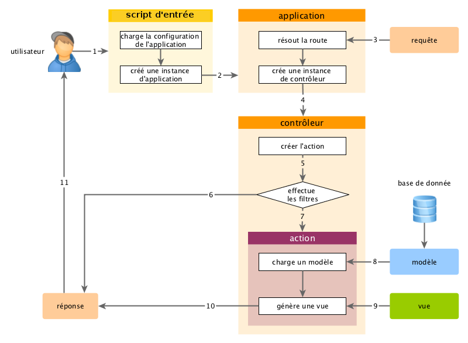

Vue d'ensemble
==============

À chaque fois qu'une application Yii prend en charge une requête, elle entreprend un flux de travail similaire. 

1. Un utilisateur effectue une requête auprès du [script d'entrée](structure-entry-scripts.md) `web/index.php`.
2. Le script d'entrée charge la [configuration](concept-configurations.md) de l'application et crée une instance d'[application](structure-applications.md) pour prendre en charge la requête.
3. L'application résoud la [route](runtime-routing.md) requise avec l'aide du composant d'application [request](runtime-requests.md).
4. L'application crée une instance de [contrôleur](structure-controllers.md) pour prendre en charge le requête.
5. Le contrôleur crée une instance d'[action](structure-controllers.md) et exécute les filtres de l'action.
6. Si un [filtre](structure-filters.md) échoue, l'exécution de l'action est annulée.
7. Si tous les filtres réussissent l'action est exécutée.
8. L'action charge un [modèle](structure-models.md) de données, possiblement à partir d'une base de données.
9. L'action rend une [vue](structure-views.md), en lui passant le modèle de données.
10. Le résultat rendu est retourné au composant d'application [response](runtime-responses.md).
11. Le composant *response* envoye le résultat rendu au navigateur de l'utilisateur. 
Le diagramme ci-dessous illustre comment une application prend une requête en charge. 

Dans cette section, nous décrivons en détails comment se déroulent quelques unes de ces étapes. 
