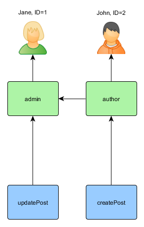
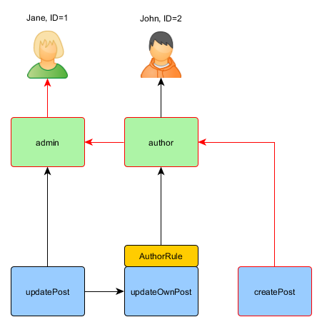

Autorisation
=============

L'autorisation est le processus qui vérifie si un utilisateur dispose des permissions suffisantes pour faire quelque chose. Yii fournit deux méthodes d'autorisation : le filtre de contrôle d'accès (ACF — Access Control Filter) et le contrôle d'accès basé sur les rôles (RBAC — Role-Based Access Control).


## Filtre de contrôle d'accès <span id="access-control-filter"></span>

Le filtre de contrôle d'accès (ACF) est une simple méthode d'autorisation mise en œuvre sous le nom [[yii\filters\AccessControl]] qui trouve son meilleur domaine d'application dans les applications qui n'ont besoin que d'un contrôle d'accès simplifié. Comme son nom l'indique, le filtre de contrôle d'accès est un [filtre](structure-filters.md) d'action qui peut être utilisé dans un contrôleur ou dans un module. Quand un utilisateur requiert l'exécution d'une action, le filtre de contrôle d'accès vérifie une liste de [[yii\filters\AccessControl::rules|règles d'accès]] pour déterminer si l'utilisateur est autorisé à accéder à l'action requise.

Le code ci-dessous montre comment utiliser le filtre de contrôle d'accès dans le contrôleur `site` :

```php
use yii\web\Controller;
use yii\filters\AccessControl;

class SiteController extends Controller
{
    public function behaviors()
    {
        return [
            'access' => [
                'class' => AccessControl::class,
                'only' => ['login', 'logout', 'signup'],
                'rules' => [
                    [
                        'allow' => true,
                        'actions' => ['login', 'signup'],
                        'roles' => ['?'],
                    ],
                    [
                        'allow' => true,
                        'actions' => ['logout'],
                        'roles' => ['@'],
                    ],
                ],
            ],
        ];
    }
    // ...
}
```

Dans le code précédent, le filtre de contrôle d'accès est attaché au contrôleur `site` en tant que comportement (*behavior*). C'est la manière typique d'utiliser un filtre d'action. L'option `only` spécifie que le filtre de contrôle d'accès doit seulement être appliqué aux actions `login`, `logout` et `signup`. Toutes les autres actions dans le contrôleur `site`ne sont pas sujettes au contrôle d'accès. L'option `rules` liste les [[yii\filters\AccessRule|règles d'accès]], qui se lisent comme suit :

- Autorise tous les visiteurs (non encore authentifiés) à accéder aux actions `login` et `signup`. l'option `roles` contient un point d'interrogation `?` qui est un signe particulier représentant les « visiteurs non authentifiés ».
- Autorise les utilisateurs authentifiés à accéder à l'action `logout`. L'arobase `@` est un autre signe particulier représentant les « utilisateurs authentifiés ».

Le filtre de contrôle d'accès effectue les vérifications d'autorisation en examinant les règles d'accès une par une en commençant par le haut, jusqu'à ce qu'il trouve une règle qui correspond au contexte d'exécution courant. La valeur `allow` de la règle correspondante est utilisée ensuite pour juger si l'utilisateur est autorisé ou pas. Si aucune des règles ne correspond, cela signifie que l'utilisateur n'est PAS autorisé, et  le filtre de contrôle d'accès arrête la suite de l'exécution de l'action.

Quand le filtre de contrôle d'accès détermine qu'un utilisateur n'est pas autorisé à accéder à l'action courante, par défaut, il prend les mesures suivantes :

* Si l'utilisateur est un simple visiteur, il appelle [[yii\web\User::loginRequired()]] pour rediriger le navigateur de l'utilisateur sur la page de connexion.
* Si l'utilisateur est déjà authentifié, il lève une exception [[yii\web\ForbiddenHttpException]].

Vous pouvez personnaliser ce comportement en configurant la propriété [[yii\filters\AccessControl::denyCallback]] comme indiqué ci-après :

```php
[
    'class' => AccessControl::class,
    ...
    'denyCallback' => function ($rule, $action) {
        throw new \Exception('You are not allowed to access this page');
    }
]
```

Les [[yii\filters\AccessRule|règles d'accès]] acceptent beaucoup d'options. Ci-dessous, nous présentons un résumé des options acceptées. Vous pouvez aussi étendre la classe  [[yii\filters\AccessRule]] pour créer vos propres classe de règles d'accès.

 * [[yii\filters\AccessRule::allow|allow]]: spécifie s'il s'agit d'une règle "allow" (autorise) ou "deny" (refuse).

 * [[yii\filters\AccessRule::actions|actions]]: spécifie à  quelles actions cette règle correspond. Ce doit être un tableau d'identifiants d'action. La comparaison est sensible à la casse. Si cette option est vide ou non définie, cela signifie que la règle s'applique à toutes les actions.

 * [[yii\filters\AccessRule::controllers|controllers]]: spécifie à quels contrôleurs cette règle correspond. Ce doit être un tableau d'identifiants de contrôleurs. Si cette option est vide ou non définie, la règle s'applique à tous les contrôleurs.

 * [[yii\filters\AccessRule::roles|roles]]: spécifie à quels rôles utilisateur cette règle correspond. Deux rôles spéciaux sont reconnus, et ils sont vérifiés via [[yii\web\User::isGuest]]:

     - `?`: correspond à un visiteur non authentifié.
     - `@`: correspond à un visiteur authentifié.

   L'utilisation d'autres noms de rôle déclenche l'appel de [[yii\web\User::can()]], qui requiert l'activation du contrôle d'accès basé sur les rôles qui sera décrit dans la prochaine sous-section. Si cette option est vide ou non définie, cela signifie que la règle s'applique à tous les rôles.

 * [[yii\filters\AccessRule::ips|ips]]: spécifie à quelles [[yii\web\Request::userIP|adresses IP de client]] cette règle correspond. Une adresse IP peut contenir le caractère générique `*` à la fin pour indiquer que la règle correspond à des adresses IP ayant le même préfixe. Par exemple, '192.168.*' correspond à toutes les adresse IP dans le segment '192.168.'. Si cette option est vide ou non définie, cela signifie que la règle s'applique à toutes les adresses IP.

 * [[yii\filters\AccessRule::verbs|verbs]]: spécifie à quelles méthodes de requête (p. ex. `GET`, `POST`) cette règle correspond. La comparaison est insensible à la casse.

 * [[yii\filters\AccessRule::matchCallback|matchCallback]]: spécifie une fonction de rappel PHP qui peut être appelée pour déterminer si cette règle s'applique.

 * [[yii\filters\AccessRule::denyCallback|denyCallback]]: spécifie une fonction de rappel PHP qui peut être appelée lorsqu'une règle refuse l'accès.

Ci-dessous nous présentons un exemple qui montre comment utiliser l'option `matchCallback`, qui vous permet d'écrire une logique d'accès arbitraire :

```php
use yii\filters\AccessControl;

class SiteController extends Controller
{
    public function behaviors()
    {
        return [
            'access' => [
                'class' => AccessControl::class,
                'only' => ['special-callback'],
                'rules' => [
                    [
                        'actions' => ['special-callback'],
                        'allow' => true,
                        'matchCallback' => function ($rule, $action) {
                            return date('d-m') === '31-10';
                        }
                    ],
                ],
            ],
        ];
    }

    // Fonction de rappel appelée ! Cette page ne peut être accédée que chaque 31 octobre
    public function actionSpecialCallback()
    {
        return $this->render('happy-halloween');
    }
}
```


## Contrôle d'accès basé sur les rôles <span id="rbac"></span>

Le contrôle d'accès basé sur les rôles (Role-Based Access Control – RBAC) fournit un contrôle d'accès centralisé simple mais puissant. Reportez-vous à [Wikipedia](http://en.wikipedia.org/wiki/Role-based_access_control) pour des détails comparatifs entre le contrôle d'accès basé sur les rôles et d'autres schéma de contrôle d'accès plus traditionnels.

Yii met en œuvre un contrôle d'accès basé sur les rôles général hiérarchisé, qui suit le  [modèle NIST RBAC](http://csrc.nist.gov/rbac/sandhu-ferraiolo-kuhn-00.pdf). Il fournit la fonctionnalité de contrôle d'accès basé sur les rôles via le [composant d'application](structure-application-components.md)[[yii\RBAC\ManagerInterface|authManager]].

L'utilisation du contrôle d'accès basé sur les rôles implique deux partie de travail. La première partie est de construire les données d'autorisation du contrôle d'accès basé sur les rôles, et la seconde partie est d'utiliser les données d'autorisation pour effectuer les vérifications d'autorisation d'accès là où elles sont nécessaires.

Pour faciliter la description qui suit, nous allons d'abord introduire quelques concepts sur le contrôle d'accès basé sur les rôles.


### Concepts de base <span id="basic-concepts"></span>

Un rôle représente une collection de  *permissions* (p. ex. créer des articles, mettre des articles à jour). Un rôle peut être assigné à un ou plusieurs utilisateurs. Pour vérifier qu'un utilisateur dispose d'une permission spécifiée, nous pouvons vérifier si un rôle contenant cette permission a été assigné à l'utilisateur.

Associée à chacun des rôles, il peut y avoir une *règle*. Une règle représente un morceau de code à exécuter lors de l'accès pour vérifier si le rôle correspondant, ou la permission correspondante, s'applique à l'utilisateur courant. Par exemple, la permission « mettre un article à jour » peut disposer d'une règle qui  vérifie si l'utilisateur courant est celui qui a créé l'article. Durant la vérification de l'accès, si l'utilisateur n'est PAS le créateur de l'article, il est considéré comme ne disposant pas la permission « mettre un article à jour ».

À la fois les rôles et les permissions peuvent être organisés en une hiérarchie. En particulier, un rôle peut être constitué d'autres rôles ou permissions ; Yii met en œuvre une hiérarchie *d'ordre partiel* qui inclut la hiérarchie plus spécifique dite *en arbre*. Tandis qu'un rôle peut contenir une permission, l'inverse n'est pas vrai.

### Configuration du contrôle d'accès basé sur les rôles <span id="configuring-rbac"></span>

Avant que nous ne nous lancions dans la définition des données d'autorisation et effectuions la vérification d'autorisation d'accès, nous devons configurer le composant d'application [[yii\base\Application::authManager|gestionnaire d'autorisations (*authManager*)]]. Yii fournit deux types de gestionnaires d'autorisations : [[yii\rbac\PhpManager]] et  [[yii\rbac\DbManager]]. Le premier utilise un script PHP pour stocker les données d'autorisation, tandis que le second stocke les données d'autorisation dans une base de données. Vous pouvez envisager d'utiliser le premier si votre application n'a pas besoin d'une gestion des rôles et des permissions très dynamique.


#### Utilisation de `PhpManager` <span id="using-php-manager"></span>

Le code qui suit montre comment configurer la propriété `authManager` dans la configuration de l'application en utilisant la classe  [[yii\rbac\PhpManager]] :

```php
return [
    // ...
    'components' => [
        'authManager' => [
            'class' => 'yii\rbac\PhpManager',
        ],
        // ...
    ],
];
```

Le gestionnaire  `authManager` peut désormais être obtenu via `\Yii::$app->authManager`.

Par défaut, [[yii\rbac\PhpManager]] stocke les données du contrôle d'accès basé sur les rôles dans des fichiers du dossier `@app/rbac`. Assurez-vous que le dossier et tous les fichiers qui sont dedans sont accessibles en écriture par le processus du serveur Web si la hiérarchie des permissions a besoin d'être changée en ligne.


#### Utilisation de  `DbManager` <span id="using-db-manager"></span>

Le code qui suit monte comment configurer la propriété `authManager`  dans la configuration de l'application en utilisant la classe [[yii\rbac\DbManager]] :

```php
return [
    // ...
    'components' => [
        'authManager' => [
            'class' => 'yii\rbac\DbManager',
        ],
        // ...
    ],
];
```
> Note: si vous utilisez le modèle d'application yii2-basic-app, il y a un fichier de configuration `config/console.php` où la propriété `authManager` doit être également déclarée en plus de  `config/web.php`.

> Dans le cas du modèle  yii2-advanced-app, la propriété `authManager` doit être déclarée seulement une fois dans `common/config/main.php`.

`DbManager` utilise quatre tables de base de données pour stocker ses données :

- [[yii\rbac\DbManager::$itemTable|itemTable]]: la table pour stocker les items d'autorisation. Valeur par défaut « auth_item ».
- [[yii\rbac\DbManager::$itemChildTable|itemChildTable]]: la table pour stocker la hiérarchie des items d'autorisation. Valeur par défaut « auth_item_child ».
- [[yii\rbac\DbManager::$assignmentTable|assignmentTable]]: la table pour stocker les assignations d'items d'autorisation. Valeur par défaut « auth_assignment ».
- [[yii\rbac\DbManager::$ruleTable|ruleTable]]: la table pour stocker les règles. Valeur par défaut « auth_rule ».

Avant de continuer vous devez créer ces tables dans la base de données. Pour le faire , vous pouvez utiliser la migration stockée dans  `@yii/rbac/migrations`:

`yii migrate --migrationPath=@yii/rbac/migrations`

Le gestionnaire d'autorisations  `authManager` peut désormais être obtenu par  `\Yii::$app->authManager`.


### Construction des données d'autorisation  <span id="generating-rbac-data"></span>

Construire les donnés d'autorisation consiste à effectuer les tâches suivantes :

- définir les rôles et les permissions ;
- établir les relations entre les rôles et les permissions ;
- définir les règles ;
- associer les règles avec les rôles et les permissions ;
- assigner des rôles aux utilisateurs.

Selon les exigences de flexibilité des autorisations, les tâches énumérées ci-dessus peuvent être accomplies de différentes manières :

Si la hiérarchie de vos permissions ne change pas du tout et que vous avez un nombre fixé d'utilisateurs, vous pouvez créer une [commande de console](tutorial-console.md#create-command) qui initialise les données d'autorisation une fois via l'API que fournit `authManager`:

```php
<?php
namespace app\commands;

use Yii;
use yii\console\Controller;

class RbacController extends Controller
{
    public function actionInit()
    {
        $auth = Yii::$app->authManager;

        // ajoute une permission  "createPost"
        $createPost = $auth->createPermission('createPost');
        $createPost->description = 'Créer un article';
        $auth->add($createPost);

        // ajoute une permission  "updatePost"
        $updatePost = $auth->createPermission('updatePost');
        $updatePost->description = 'Mettre à jour un article';
        $auth->add($updatePost);

        // ajoute un rôle  "author" et donne à ce rôle la permission "createPost"
        $author = $auth->createRole('author');
        $auth->add($author);
        $auth->addChild($author, $createPost);

        // ajoute un rôle "admin" role et donne à ce rôle la permission "updatePost"
        // aussi bien que les permissions du rôle "author"
        $admin = $auth->createRole('admin');
        $auth->add($admin);
        $auth->addChild($admin, $updatePost);
        $auth->addChild($admin, $author);

        // Assigne des rôles aux utilisateurs. 1 et 2 sont des identifiants retournés par IdentityInterface::getId()
        // ordinairement mis en œuvre dans votre modèle  User .
        $auth->assign($author, 2);
        $auth->assign($admin, 1);
    }
}
```

> Note: si vous utilisez le modèle avancé, vous devez mettre votre `RbacController` dans le dossier  `console/controllers` et changer l'espace de noms en `console\controllers`.

Après avoir exécuté la commande `yii rbac/init` vous vous retrouverez avec la hiérarchie suivante :



Le rôle *Author* peut créer des articles, le rôle *admin* peut mettre les articles à jour et faire tout ce que le rôle *author* peut faire.

Si votre application autorise l'enregistrement des utilisateurs, vous devez assigner des rôles à ces nouveaux utilisateurs une fois. Par exemple, afin que tous les utilisateurs enregistrés deviennent des auteurs (rôle *author*) dans votre modèle de projet avancé, vous devez modifier la méthode `frontend\models\SignupForm::signup()` comme indiqué ci-dessous :

```php
public function signup()
{
    if ($this->validate()) {
        $user = new User();
        $user->username = $this->username;
        $user->email = $this->email;
        $user->setPassword($this->password);
        $user->generateAuthKey();
        $user->save(false);

        // Ces trois lignes ont été ajoutées
        $auth = Yii::$app->authManager;
        $authorRole = $auth->getRole('author');
        $auth->assign($authorRole, $user->getId());

        return $user;
    }

    return null;
}
```

Pour les applications qui requièrent un contrôle d'accès complexe avec des autorisations mises à jour dynamiquement, des interfaces utilisateur spéciales (c.-à-d. un panneau d'administration) doivent être  développées en utilisant l'API offerte par `authManager`.


### Utilisation des règles <span id="using-rules"></span>

Comme mentionné plus haut, les règles ajoutent des contraintes supplémentaires aux rôles et aux permissions. Une règle est une classe qui étend la classe [[yii\rbac\Rule]]. Elle doit implémenter la méthode [[yii\rbac\Rule::execute()|execute()]]. Dans la hiérarchie, que nous avons créée précédemment le rôle *author* ne peut pas modifier ses propres articles. Essayons de régler ce problème. Tout d'abord, nous devons vérifier que l'utilisateur courant est l'auteur de l'article :

```php
namespace app\rbac;

use yii\rbac\Rule;

/**
 * Vérifie si l'identifiant de l'auteur correspond à celui passé en paramètre
 */
class AuthorRule extends Rule
{
    public $name = 'isAuthor';

    /**
     * @param string|int $user l'identifiant de l'utilisateur.
     * @param Item $item le rôle ou la permission avec laquelle cette règle est associée
     * @param array $params les paramètres passés à ManagerInterface::checkAccess().
     * @return bool une valeur indiquant si la règles autorise le rôle ou la permission qui lui est associé.
     */
    public function execute($user, $item, $params)
    {
        return isset($params['post']) ? $params['post']->createdBy == $user : false;
    }
}
```

La règles ci-dessus vérifie si l'article `post` a été créé par l'utilisateur `$user`. Nous allons créer une permission spéciale  `updateOwnPost` dans la commande que nous avons utilisée précédemment :

```php
$auth = Yii::$app->authManager;

// ajoute la règle
$rule = new \app\rbac\AuthorRule;
$auth->add($rule);

// ajoute la permission "updateOwnPost" et associe lui la règle
$updateOwnPost = $auth->createPermission('updateOwnPost');
$updateOwnPost->description = 'Mettre à jour un des ses propres articles';
$updateOwnPost->ruleName = $rule->name;
$auth->add($updateOwnPost);

// "updateOwnPost" sera utilisé depuis  "updatePost"
$auth->addChild($updateOwnPost, $updatePost);

// autorise les utilisateurs ayant le rôle  "author" à mettre à jour leurs propres articles.
$auth->addChild($author, $updateOwnPost);
```

Nous nous retrouvons avec la hiérarchie suivante :


### Vérification de l'autorisation d'accès <span id="access-check"></span>

Avec les données d'autorisation préparées, la vérification de l'autorisation d'accès est aussi simple que d'appeler la méthode [[yii\rbac\ManagerInterface::checkAccess()]]. Étant donné que la plupart des vérification d'autorisation d'accès concernent l'utilisateur courant, pour commodité, Yii procure une méthode raccourcie [[yii\web\User::can()]], qui peut être utilisée comme suit :

```php
if (\Yii::$app->user->can('createPost')) {
    // create post
}
```

Si l'utilisateur courant est  Jane avec l'identifiant `ID=1`, nous commençons à `createPost` et essayons d'arriver à `Jane`:



Afin de vérifier sur un utilisateur peut mettre un article à jour, nous devons passer un paramètre supplémentaire qui est requis par la règle `AuthorRule` décrite précédemment :

```php
if (\Yii::$app->user->can('updatePost', ['post' => $post])) {
    // met à jour l'article
}
```

Ici que se passe-t-il si l'utilisateur courant est John:


Nous commençons à  `updatePost` et passons par `updateOwnPost`. Afin d'obtenir l'autorisation,  la méthode `execute()` de `AuthorRule` doit retourner  `true` (vrai). La méthode reçoit ses paramètres `$params` de l'appel à la  méthode `can()` et sa valeur est ainsi `['post' => $post]`. Si tout est bon, nous arrivons à `author` auquel John est assigné.

Dans le cas de Jane, c'est un peu plus simple puisqu'elle a le rôle admin:


Dans votre contrôleur, il y a quelques façons de mettre en œuvre les autorisations. Si vous voulez des permission granulaires qui séparent l'accès entre ajouter et supprimer, alors vous devez vérifier l'accès pour chacune des actions. Vous pouvez soit utiliser la condition ci-dessus dans chacune des méthodes d'action, ou utiliser [[yii\filters\AccessControl]] :

```php
public function behaviors()
{
    return [
        'access' => [
            'class' => AccessControl::class,
            'rules' => [
                [
                    'allow' => true,
                    'actions' => ['index'],
                    'roles' => ['managePost'],
                ],
                [
                    'allow' => true,
                    'actions' => ['view'],
                    'roles' => ['viewPost'],
                ],
                [
                    'allow' => true,
                    'actions' => ['create'],
                    'roles' => ['createPost'],
                ],
                [
                    'allow' => true,
                    'actions' => ['update'],
                    'roles' => ['updatePost'],
                ],
                [
                    'allow' => true,
                    'actions' => ['delete'],
                    'roles' => ['deletePost'],
                ],
            ],
        ],
    ];
}
```

Si toutes les opérations CRUD sont gérées ensemble, alors c'est une bonne idée que d'utiliser une permission unique comme  `managePost` (gérer article), et de la vérifier dans [[yii\web\Controller::beforeAction()]].

### Utilisation des rôles par défaut <span id="using-default-roles"></span>

Un rôle par défaut est un rôle qui est assigné *implicitement* à tous les *utilisateurs*. L'appel de la méthode [[yii\rbac\ManagerInterface::assign()]] n'est pas nécessaire, et les données d'autorisations ne contiennent pas ses informations d'assignation.

Un rôle par défaut est ordinairement associé à une règle qui détermine si le rôle s'applique à l'utilisateur en cours de vérification.

Les rôles par défaut sont souvent utilisés dans des applications qui ont déjà une sorte d'assignation de rôles. Par  exemple, un application peut avoir une colonne « group » dans sa table des utilisateurs pour représenter à quel groupe de privilèges chacun des utilisateurs appartient. Si chaque groupe de privilèges peut être mis en correspondance avec un rôle du contrôle d'accès basé sur les rôles, vous pouvez utiliser la fonctionnalité de rôle par défaut pour assigner automatiquement un rôle du contrôle d'accès basé sur les rôles à chacun des utilisateurs. Prenons un exemple pour montrer comment cela se fait.

Supposons que dans la table des utilisateurs, il existe en colonne `group` qui utilise la valeur 1 pour représenter le groupe des administrateurs et la valeur 2 pour représenter le groupe des auteurs. Vous envisagez d'avoir deux rôles dans le contrôle d'accès basé sur les rôles `admin` et`author` pour représenter les permissions de ces deux groupes respectivement. Vous pouvez configurer le contrôle d'accès basé sur les rôles comme suit :


```php
namespace app\rbac;

use Yii;
use yii\rbac\Rule;

/**
 * Vérifie si le groupe utilisateurs correspond
 */
class UserGroupRule extends Rule
{
    public $name = 'userGroup';

    public function execute($user, $item, $params)
    {
        if (!Yii::$app->user->isGuest) {
            $group = Yii::$app->user->identity->group;
            if ($item->name === 'admin') {
                return $group == 1;
            } elseif ($item->name === 'author') {
                return $group == 1 || $group == 2;
            }
        }
        return false;
    }
}

$auth = Yii::$app->authManager;

$rule = new \app\rbac\UserGroupRule;
$auth->add($rule);

$author = $auth->createRole('author');
$author->ruleName = $rule->name;
$auth->add($author);
// ... ajoute les  permissions en tant qu'enfant de  $author ...

$admin = $auth->createRole('admin');
$admin->ruleName = $rule->name;
$auth->add($admin);
$auth->addChild($admin, $author);
// ... ajoute les  permissions en tant qu'enfant de  $admin ...
```

Notez que dans ce qui est présenté ci-dessus, comme « author » est ajouté en tant qu'enfant de « admin », lorsque vous implémentez la méthode `execute()` de la classe de règle, vous devez respecter cette hiérarchie elle aussi. C'est pourquoi, lorsque le nom de rôle est « author », la méthode `execute()` retourne `true` (vrai) si le groupe de l'utilisateur est soit 1, soit 2 (ce qui signifie que l'utilisateur est soit dans le groupe « admin », soit dans le groupe « author »).

Ensuite, configurez `authManager` en listant les deux rôles dans  [[yii\rbac\BaseManager::$defaultRoles]]:

```php
return [
    // ...
    'components' => [
        'authManager' => [
            'class' => 'yii\rbac\PhpManager',
            'defaultRoles' => ['admin', 'author'],
        ],
        // ...
    ],
];
```

Désormais, si vous effectuez une vérification d'autorisation d'accès, les deux rôles `admin` et `author` seront vérifiés en évaluant les règles qui leur sont associées. Si les règles retournent `true` (vrai), cela signifie que le rôle s'applique à l'utilisateur courant. En se basant sur la mise en œuvre des règles ci-dessus, cela signifie que si la valeur du `group` d'un utilisateur est 1, le rôle `admin` s'applique à l'utilisateur, si la valeur du `group` est  2, le rôle `author` s'applique.
