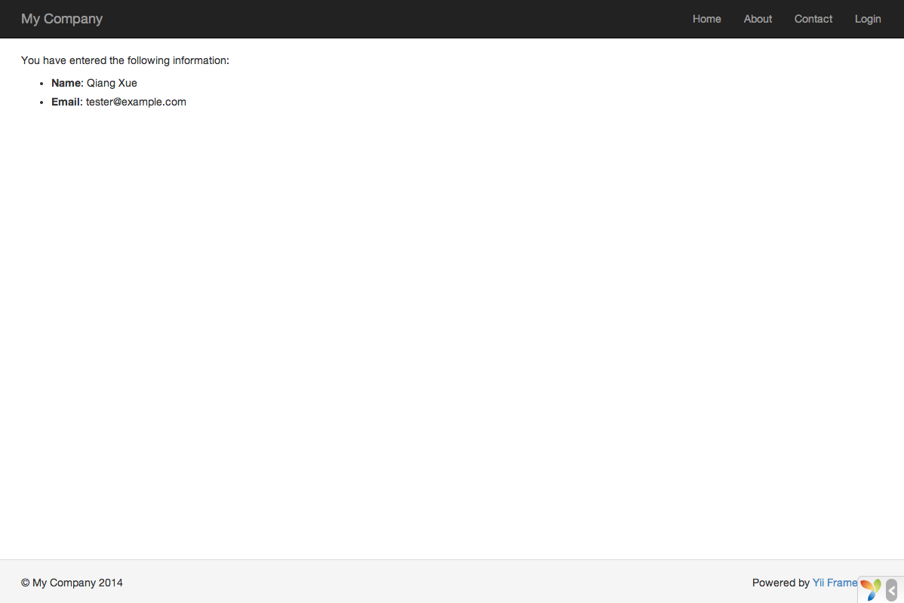

Travailler avec les formulaires
==================

Cette section décrit la création d'une nouvelle page comprenant un formulaire pour recevoir des données des 
utilisateurs.
La page affichera un formulaire composé d'un champ de saisie nom et un champ de saisie email.
Une fois ces deux informations reçues de l'utilisateur, la page affichera les valeurs entrées pour confirmation.

Pour atteindre ce but, vous créerez non seulement une [action](structure-controllers.md) et deux 
[vues](structure-views.md), mais aussi un [modèle](structure-models.md).

Au long de ce tutoriel, vous apprendrez à :

* Créer un [modèle](structure-models.md) pour représenter les données saisies par un utilisateur à travers un 
formulaire
* Déclarer des règles pour valider les données entrées
* Construire un formulaire HTML dans une [vue](structure-views.md)


Créer un Modèle <span id="creating-model"></span>
----------------

Les données demandées à l'utilisateur seront représentées par une classe de modèle `EntryForm` comme montrée ci-dessous
enregistrée dans le fichier `models/EntryForm.php`. Merci de vous référer à la section 
[Auto-chargement de Classes](concept-autoloading.md) pour plus de détails sur la convention de nommage de fichiers
classes.

```php
<?php

namespace app\models;

use yii\base\Model;

class EntryForm extends Model
{
    public $nom;
    public $email;

    public function rules()
    {
        return [
            [['nom', 'email'], 'required'],
            ['email', 'email'],
        ];
    }
}
```

La classe étend [[yii\base\Model]], une classe de base fournie par Yii, communément utilisée pour représenter des
données de formulaire.

> Info: [[yii\base\Model]] est utilisée en tant que parent pour des classes modèles qui ne sont *pas* associées à des
tables de base de données.
[[yii\db\ActiveRecord]] est normalement le parent pour les classes modèles qui correspondent à des tables de bases de
données.

La classe `EntryForm` contient deux membres publics, `nom` et `email`, qui sont utilisés pour stocker les données
saisies par l'utilisateur. Elle contient également une méthode nommée `rules()`, qui renvoie un assortiment de règles
pour valider les données. Les règles de validation déclarées ci-dessus énoncent que

* à la fois les valeurs de `nom` et `email` sont requises
* la donnée `email` doit être une adresse email syntaxiquement valide

Si vous avez un objet `EntryForm` peuplé par les données saisies par un utilisateur, vous pouvez appeler sa méthode
[[yii\base\Model::validate()|validate()]] pour déclencher les routines de validation de données. Un échec de validation
de données affectera la valeur true à la propriété [[yii\base\Model::hasErrors|hasErrors]], et vous pourrez connaître
quelles erreurs de validations sont apparues via [[yii\base\Model::getErrors|errors]].

```php
<?php
$model = new EntryForm();
$model->nom = 'Qiang';
$model->email = 'mauvais';
if ($model->validate()) {
    // Bien!
} else {
    // Echec!
    // Use $model->getErrors()
}
```


Créer une Action <span id="creating-action"></span>
------------------

Maintenant, vous allez créer une action `entry` dans le contrôleur `site` qui utilisera le nouveau modèle. Le processus
de création et d'utilisation d'actions a été expliqué dans la section [Hello World](start-hello.md).

```php
<?php

namespace app\controllers;

use Yii;
use yii\web\Controller;
use app\models\EntryForm;

class SiteController extends Controller
{
    // ...code existant...

    public function actionEntry()
    {
        $model = new EntryForm;

        if ($model->load(Yii::$app->request->post()) && $model->validate()) {
            // données valides reçues dans $model

            // faire quelque chose de significatif ici avec $model ...

            return $this->render('entry-confirm', ['model' => $model]);
        } else {
            // soit la page est affichée au début soit il y a des erreurs de validation
            return $this->render('entry', ['model' => $model]);
        }
    }
}
```

L'action commence par créer un objet `EntryForm`. Puis, elle tente de peupler le modèle avec les données de `$_POST`,
fournies dans yii par [[yii\web\Request::post()]].
Si le modèle est peuplé avec succès (c'est à dire, si l'utilisateur a soumis le formulaire HTML), l'action appellera
[[yii\base\Model::validate()|validate()]] pour s'assurer de la validité de toutes les valeurs.

> Info: L'expression `Yii::$app` représente l'instance d'[application](structure-applications.md), qui est un singleton
accessible de manière globale. C'est aussi un [annuaire de services](concept-service-locator.md) qui  fournit des
composants tels que `request`, `response`, `db`, etc. pour assister des fonctionnalités spécifiques. Dans le code 
ci-dessus, le composant `request` de l'instance d'application est utilisé pour accéder aux données `$_POST`.

Si tout se passe bien, l'action effectuera le rendu d'une vue nommée `entry-confirm` pour confirmer le succès de la 
soumission à l'utilisateur. Si aucune donnée n'est soumise ou si les données contiennent des erreurs, la vue `entry` 
sera générée, dans laquelle le formulaire HTML sera affiché, ainsi que tout message d'erreur de validation.

> Note: Dans cet exemple très simple, nous effectuons le rendu de la page de confirmation après soumission de données
valides. En pratique, vous devriez envisager d'utiliser [[yii\web\Controller::refresh()|refresh()]] ou 
[[yii\web\Controller::redirect()|redirect()]] pour éviter les 
[problèmes de multiple soumission de formulaire](http://fr.wikipedia.org/wiki/Post-Redirect-Get).


Créer des Vues <span id="creating-views"></span>
--------------

Enfin, créez deux fichiers de vue nommés `entry-confirm` et `entry`. Ceux-ci seront rendus par l'action `entry`,
comme décrit précédemment.

La vue `entry-confirm` affiche simplement les données de nom et email. Elle doit être placée dans le fichier 
`views/site/entry-confirm.php`.

```php
<?php
use yii\helpers\Html;
?>
<p>Vous avez entré les informations suivantes :</p>

<ul>
    <li><label>Nom</label>: <?= Html::encode($model->nom) ?></li>
    <li><label>Email</label>: <?= Html::encode($model->email) ?></li>
</ul>
```

La vue `entry` affiche un formulaire HTML. Elle doit être stockée dans le placée `views/site/entry.php`.

```php
<?php
use yii\helpers\Html;
use yii\widgets\ActiveForm;
?>
<?php $form = ActiveForm::begin(); ?>

    <?= $form->field($model, 'nom') ?>

    <?= $form->field($model, 'email') ?>

    <div class="form-group">
        <?= Html::submitButton('Soumettre', ['class' => 'btn btn-primary']) ?>
    </div>

<?php ActiveForm::end(); ?>
```

La vue utilise un [widget](structure-widgets.md) puissant appelé [[yii\widgets\ActiveForm|ActiveForm]] pour construire
le formulaire HTML. Les méthodes `begin()` et `end()` du widget effectuent respectivement le rendu des tags ouvrant et
fermant du formulaire. Entre les deux appels de méthode, des champs de saisie sont créés par la méthode 
[[yii\widgets\ActiveForm::field()|field()]]. Le premier champ de saisie concerne la donnée "nom", et le second la
donnée "email". Après les champs de saisie, la méthode [[yii\helpers\Html::submitButton()]] est appelée pour générer un
bouton de soumission.


Essayer <span id="trying-it-out"></span>
-------------

Pour voir comment ça fonctionne, utilisez votre navigateur pour accéder à l'URL suivante :

```
http://hostname/index.php?r=site/entry
```

Vous verrez une page affichant un formulaire comportant deux champs de saisie. Devant chaque champ de saisie, une
étiquette indique quelle donnée est attendue. Si vous cliquez sur le bouton de soumission sans entrer quoi que ce soit,
ou si vous ne fournissez pas d'adresse email valide, vous verrez un message d'erreur s'afficher à coté de chaque champ
de saisie posant problème.


Après avoir saisi un nom et une adresse email valide et cliqué sur le bouton de soumission, vous verrez une nouvelle
page affichant les données que vous venez de saisir.




### La Magie expliquée <span id="magic-explained"></span>

Vous vous demandez peut-être comment le formulaire HTML fonctionne en coulisse, parce qu'il semble presque magique
qu'il puisse afficher une étiquette pour chaque champ de saisie et afficher sans rafraichir la page des messages 
d'erreur si vous n'entrez pas les données correctement.

Oui, la validation de données est initialement faite coté client en Javascript, et ensuite effectuée coté serveur en 
PHP.
[[yii\widgets\ActiveForm]] est suffisamment intelligent pour extraire les règles de validation que vous avez déclarées 
dans `EntryForm`, le transformer en code Javascript exécutable, et utiliser le Javascript pour effectuer la validation
des données. Dans le cas où vous auriez désactivé le Javascript sur votre navigateur, la validation sera tout de même 
effectuée coté serveur, comme montré dans la méthode `actionEntry()`. Cela garantit la validité des données en toutes 
circonstances.

> Attention : La validation coté client est un confort qui permet une meilleure expérience utilisateur. La validation coté serveur est toujours nécessaire, que la validation coté client soit ou non en place.

Les étiquettes des champs de saisie sont générés par la méthode `field()`, en utilisant les noms des propriété du
modèle.
Par exemple, l'étiquette `Nom` sera générée à partir de la propriété `nom`. 

Vous pouvez personnaliser une étiquette dans une vue en employant le code suivant :

```php
<?= $form->field($model, 'nom')->label('Votre Nom') ?>
<?= $form->field($model, 'email')->label('Votre Email') ?>
```

> Info: Yii fournit ne nombreux widgets pour vous aider à construire rapidement des vues complexes et dynamiques.
  Comme vous l'apprendrez plus tard, écrire un widget et aussi extrêmement simple. Vous voudrez sans doute transformer   une grande partie de votre code de vues en widgets réutilisables pour simplifier les développements de vues futurs.


Résumé <span id="summary"></span>
-------

Dans cette section du guide, vous avez touché toutes les parties du patron de conception MVC. Vous avez appris à créer 
une classe modèle pour représenter les données utilisateur et valider lesdites données.

Vous avez également appris comment recevoir des données des utilisateurs et comment les réafficher dans le navigateur. 
C'est une tâche qui peut prendre beaucoup de temps lors du développement d'une application, mais Yii propose des 
widgets puissants pour rendre cette tâche très facile.

Dans la prochaine section, vous apprendrez comment travailler avec des bases de données, qui sont nécessaires dans presque toutes les applications.
