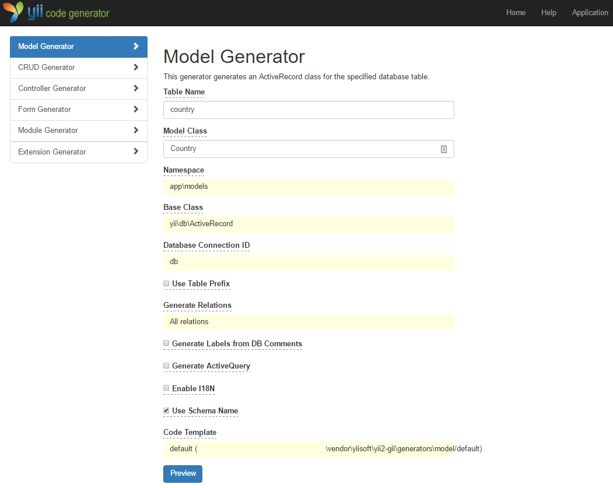
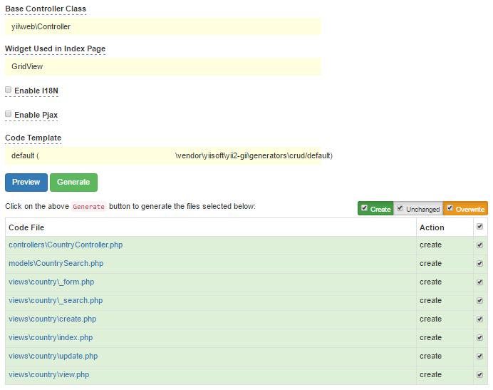
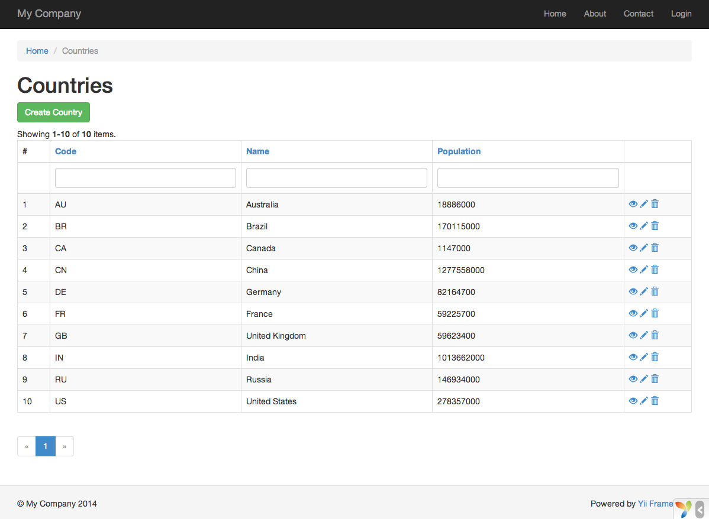

Générer du code avec Gii
========================

Cette section décrit comment utiliser [Gii](tool-gii.md) pour générer du code qui implémente des fonctionnalités
courantes de sites Web automatiquement. Utiliser Gii pour auto-générer du code consiste simplement à saisir les
bonnes informations en suivant les instructions affichées sur les pages Web Gii.

Au long de ce tutoriel, vous apprendrez comment :

* Activer Gii dans votre application
* Utiliser Gii pour générer des classes Active Record
* Utiliser Gii pour générer du code implémentant les opérations CRUD pour une table de BDD
* Personnaliser le code généré par Gii


Démarrer Gii <span id="starting-gii"></span>
------------

[Gii](tool-gii.md) est fourni dans Yii en tant que [module](structure-modules.md). Vous pouvez activer Gii en le 
configurant dans la propriété [[yii\base\Application::modules|modules]] de l’application. En fonction de la manière 
dont vous avez créé votre application, vous trouverez peut être que le code suivant est déjà fourni dans le fichier de 
configuration `config/web.php`:

```php
$config = [ ... ];

if (YII_ENV_DEV) {
    $config['bootstrap'][] = 'gii';
    $config['modules']['gii'] = 'yii\gii\Module';
}
```

La configuration ci-dessus établit que dans un [environnement de développement](concept-configurations.md#environment-constants), 
l’application doit inclure un module appelé `gii`, qui est de classe [[yii\gii\Module]].

Si vous vérifiez le [script de démarrage](structure-entry-scripts.md) `web/index.php` de votre application, vous 
les lignes suivantes, qui en gros, font que `YII_ENV_DEV` est vrai.

```php
defined('YII_ENV') or define('YII_ENV', 'dev');
```

Grâce à cette ligne, votre application est en mode développement, et aura déjà active Gii, suivant la configuration 
ci-dessus. Vous pouvez maintenant accéder à Gii via l’URL suivante :

```
http://hostname/index.php?r=gii
```

> Note : Si vous accède à Gii depuis une machine autre que localhost, l’accès sera refuse par défaut pour des raisons 
> de sécurité. Vous pouvez configurer Gii pour ajouter les adresses IP autorisées comme suit,
>
```php
'gii' => [
    'class' => 'yii\gii\Module',
    'allowedIPs' => ['127.0.0.1', '::1', '192.168.0.*', '192.168.178.20'] // ajustez cela suivant vos besoins
],
```


Générer une Classe Active Record <span id="generating-ar"></span>
---------------------------------

Pour utiliser Gii pour générer une classe Active Record, sélectionnez le "Model Generator" (en cliquant sur le lien 
dans la page index de Gii). Puis complétez le formulaire comme suit :

* Table Name: `country`
* Model Class: `Country`



Ensuite, cliquez sur le bouton "Preview". Vous verrez que `models/Country.php` est listé comme fichier de classe à être créé. Vous pouvez cliquer sur le nom du fichier de classe pour pré visualiser son contenu.

Quand vous utilisez Gii, si vous aviez déjà créé le même fichier et que vous l’écraseriez, cliquez sur le bouton `diff`
à côté du nom de fichier pour voir les différences entre le code à être généré et la version existant.


Quand vous écrasez un fichier existant, cochez la case située à côté de "overwrite" et ensuite, cliquez sur le bouton
"Generate". Si vous créez un nouveau fichier, il suffit de cliquer sur "Generate". 

Ensuite, vous verrez une page de confirmation indiquant que le code a été généré avec succès. Si vous aviez un fichier 
existant, vous verrez également un message indiquant qu’il a été écrasé par le code nouvellement généré.


Générer du Code CRUD <span id="generating-crud"></span>
--------------------

CRUD signifie Create, Read, Update, and Delete (Créer, Lire, Mettre à Jour et Supprimer), représentant le quatre tâches
communes entreprises avec des données sur la plupart des sites Web. Pour créer les fonctionnalités CRUD en utilisant
Gii, sélectionnez le "CRUD Generator" (en cliquant sur le lien dans la page index de Gii). Pour l’exemple de "country",
remplissez le formulaire résultant comme suit :

* Model Class: `app\models\Country`
* Search Model Class: `app\models\CountrySearch`
* Controller Class: `app\controllers\CountryController`


Ensuite, cliquez sur le bouton "Preview". Vous verrez une liste de fichiers à générer, comme ci-dessous.



Si vous aviez précédemment créé les fichiers  `controllers/CountryController.php` et
`views/country/index.php` (dans la section bases de données du guide), cochez la case "overwrite" pour les remplacer.
(Les versions précédentes n’avaient pas de fonctionnalités CRUD).


Essayer <span id="trying-it-out"></span>
-------------

Pour voir comment ça fonctionne, utilisez votre navigateur pour accéder à l’URL suivant :

```
http://hostname/index.php?r=country/index
```

Vous verrez une grille de données montrant les pays de la table de la base de données. Vous pouvez trier la table, ou
lui appliquer des filtres en entrant des conditions de filtrage dans les entêtes de colonnes.


Pour chaque pays affiché dans la grille, vous pouvez choisir de visualiser les détails, le mettre à jour ou le
supprimer.
Vous pouvez aussi cliquer sur le bouton "Create Country" en haut de la grille pour que Yii vous fournisse un formulaire
permettant de créer un nouveau pays.




Ce qui suit est la liste des fichiers générés par Gii, au cas où vous souhaiteriez investiguer la manière dont ces
fonctionnalités sont implémentées, ou les personnaliser :

* Contrôleur: `controllers/CountryController.php`
* Modèles: `models/Country.php` et `models/CountrySearch.php`
* Vues: `views/country/*.php`

> Info: Gii est conçu pour être un outil de génération de code hautement personnalisable et extensible. L’utiliser avec
  sagesse peut grandement accélérer le développement de vos applications. Pour plus de détails, merci de vous référer 
  à la section [Gii](tool-gii.md).


Résumé <span id="summary"></span>
-------

Dans cette section, vous avez appris à utiliser Gii pour générer le code qui implémente une fonctionnalité CRUD 
complète pour les contenus stockés dans une table de base de données.

