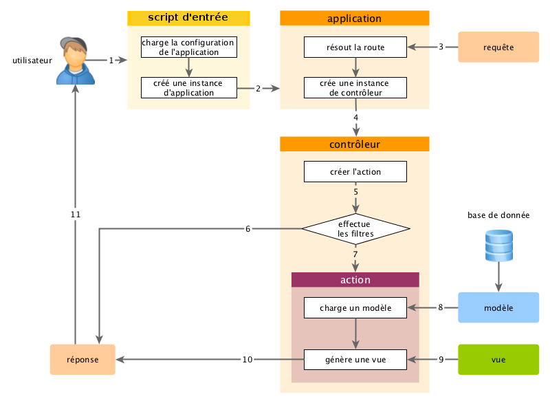

Fonctionnement des applications
===============================

Après avoir installé Yii, vous obtenez une application Yii fonctionnelle accessible via l'URL `https://hostname/basic/web/index.php` ou `https://hostname/index.php`, en fonction
de votre configuration. Cette section vous initiera aux fonctionnalités intégrées à l'application,
à la manière dont le code est organisé et à la gestion des requêtes par l'application.

> Info: pour simplifier, au long de ce tutoriel de démarrage, nous supposerons que `basic/web` est la racine de votre 
 serveur Web, et que vous avez configuré l'URL pour accéder à votre application comme suit ou de façon similaire : 
  `https://hostname/index.php`.
  Pour vos besoins, merci d'ajuster les URLs dans notre description comme il convient.

Notez que contrairement au framework lui-même, après avoir installé un modèle de projet, vous êtes entièrement libre d'en disposer. Vous êtes libre d'ajouter ou de supprimer du code selon vos besoins. 

Fonctionnalité <span id="Functionality"></span>
--------------

L'application basique installée contient quatre pages :

* La page d'accueil, affichée quand vous accédez à l'URL `https://hostname/index.php`,
* la page "About" (À Propos),
* la page "Contact", qui présente un formulaire de contact permettant aux utilisateurs finaux de vous contacter par courriel,
* et la page "Login" (Connexion), qui présente un formulaire de connexion qui peut être utilisé pour authentifier des utilisateurs finaux. Essayez de vous connecter
 avec "admin/admin", et vous verrez l'élément "Login" du menu principal être remplacé par "Logout" (Déconnexion).

Ces pages ont en commun une entête et un pied de page. L'entête contient une barre de menu principal qui permet la navigation
entre les différentes pages.

Vous devriez également voir une barre d'outils en bas de votre fenêtre de navigation.
C'est un [outil de débogage](https://github.com/yiisoft/yii2-debug/blob/master/docs/guide/README.md) utile fourni par Yii pour enregistrer et afficher de nombreuses informations de débogage, telles que des messages de journaux, les statuts de réponses, les requêtes lancées vers la base de données, etc.

En plus de l'application Web, il existe,dans le dossier de base de l'application, un script en console appelé `yii`. Ce script peut être utilisé pour exécuter des tâches de fond et de maintenance pour l'application; ces tâches sont décrites à la section [Applications en console](tutorial-console.md).


Structure de l'application <span id="application-structure"></span>
---------------------

Les répertoires et fichiers les plus importants de votre application sont (en supposant que le répertoire racine de l'application est `basic`) :

```
basic/                  chemin de base de l'application
    composer.json       utilisé par Composer, décrit les information de paquets
    config/             contient les configurations de l'application et autres
        console.php     configuration de l'application console
        web.php         configuration de l'application Web
    commands/           contient les classes de commandes console
    controllers/        contient les classes de contrôleurs
    models/             contient les classes de modèles
    runtime/            contient les fichiers générés par Yii au cours de l'exécution, tels que les fichiers de logs ou de cache and cache
    vendor/             contient les paquets Composer installés, y compris le framework Yii
    views/              contient les fichiers de vues
    web/                racine Web de l'application, contient les fichiers accessibles via le Web
        assets/         contient les fichiers assets (javascript et css) publiés par Yii
        index.php       le script de démarrage (ou bootstrap) pour l'application
    yii                 le script d'exécution de Yii en commande console
```

Dans l'ensemble, les fichiers de l'application peuvent être séparés en deux types : ceux situés dans `basic/web` et ceux situés dans d'autres répertoires. Les premiers peuvent être atteints directement en HTTP (c'est à dire dans un navigateur), tandis que les seconds ne peuvent et ne doivent pas l'être.

Yii est mis en œuvre selon le modèle de conception [modèle-vue-contrôleur (MVC)](https://wikipedia.org/wiki/Model-view-controller),
ce qui se reflète dans l'organisation des répertoires ci-dessus. Le répertoire `models` contient toutes les [classes modèles](structure-models.md),
le répertoire `views` contient tous les [scripts de vue](structure-views.md), et le répertoire `controllers` contient toutes les [classes contrôleurs](structure-controllers.md).

Le schéma suivant présente la structure statique d'une application.


Chaque application dispose d'un script de démarrage `web/index.php` qui est le seul script PHP de l'application accessible depuis le Web.
Le script de démarrage reçoit une requête entrante et crée une instance d'[application](structure-applications.md) pour la traiter.
L'[application](structure-applications.md) résout la requête avec l'aide de ses [composants](concept-components.md),
et distribue la requête aux éléments MVC. Les [composants graphiques (widgets)](structure-widgets.md) sont utilisés dans les [vues](structure-views.md)
pour aider à créer des éléments d'interface complexes et dynamiques.


Cycle de vie d'une requête <span id="request-lifecycle"></span>
-----------------

Le diagramme suivant présente la manière dont une application traite une requête.



1. Un utilisateur fait une requête au [script de démarrage](structure-entry-scripts.md) `web/index.php`.
2. Le script de démarrage charge la [configuration](concept-configurations.md) de l'application et crée une instance d'[application](structure-applications.md) pour traiter la requête.
3. L'application résout la [route](runtime-routing.md) requise avec l'aide du composant d'application [requête](runtime-requests.md).
4. L'application créé une instance de [contrôleur](structure-controllers.md) pour traiter la requête.
5. Le contrôleur crée une instance d'[action](structure-controllers.md) et applique les filtres pour l'action.
6. Si un filtre échoue, l'action est annulée.
7. Si tous les filtres sont validés, l'action est exécutée.
8. L'action charge un modèle de données, potentiellement depuis une base de données.
9. L'action génère une vue, lui fournissant le modèle de données.
10. Le résultat généré est renvoyé au composant d'application [response](runtime-responses.md).
11. Le composant « response » (réponse) envoie le résultat généré au navigateur de l'utilisateur.
