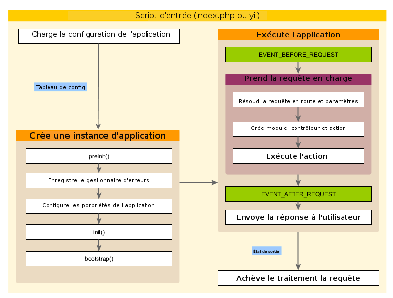

Applications
============

Les Applications sont des objets qui gouvernent la structure d'ensemble et le cycle de vie des systèmes mettant en œuvre Yii. 
Chacun des systèmes mettant en œuvre Yii contient un objet *Application* unique qui est créé par le [Script d'entrée](structure-entry-scripts.md) et est globalement accessible à l'aide de l'expression `\Yii::$app`.


> Info: selon le contexte, lorsque nous utilisons le terme « application », cela peut signifier soit un objet *Application*, soit un système mettant en œuvre Yii. 

Il existe deux types d'application :  [[yii\web\Application|les applications Web]] et
[[yii\console\Application|les applications de console]]. Comme leur nom l'indique, les premières prennent en charge des requêtes Web tandis que les deuxièmes prennent en charge des requêtes de la console. 


## Configurations d'application <span id="application-configurations"></span>

Lorsqu'un [script d'entrée](structure-entry-scripts.md) crée une application, il charge une [configuration](concept-configurations.md) et l'applique à cette application de la manière suivante :

```php
require __DIR__ . '/../vendor/autoload.php';
require __DIR__ . '/../vendor/yiisoft/yii2/Yii.php';

// charger la configuration de l'application
$config = require __DIR__ . '/../config/web.php';

// instancier et configurer l'application
(new yii\web\Application($config))->run();
```

Tout comme les [configurations](concept-configurations.md) habituelles, les configurations d'application spécifient comment initialiser les propriétés des objets *Application*. Comme les configurations d'application sont souvent très complexes, elles sont ordinairement conservées dans des  [fichiers de configuration](concept-configurations.md#configuration-files),
tels que le fichier `web.php` de l'exemple précédent.


## Propriétés des applications <span id="application-properties"></span>

Il y a de nombreuses propriétés importantes des applications que vous devez spécifier dans les configurations d'application. 
Ces propriétés décrivent l'environnement dans lequel ces applications sont exécutées. Par exemple, les applications doivent savoir comment charger les [contrôleurs](structure-controllers.md), où ranger les fichiers temporaires, etc. Nous allons passer en revue ces propriétés.


### Propriétés requises <span id="required-properties"></span>

Dans toute application, vous devez au moins spécifier deux propriétés :: [[yii\base\Application::id|id]] et [[yii\base\Application::basePath|basePath]].


#### [[yii\base\Application::id|id]] <span id="id"></span>

La propriété [[yii\base\Application::id|id]] spécifie un identifiant unique qui distingue une application des autres. On l'utilise principalement dans des instructions. Bien que cela ne soit pas une exigence, l'utilisation des seuls caractères alphanumériques, pour spécifier cet identifiant, est recommandée pour assurer une meilleure interopérabilité. 


#### [[yii\base\Application::basePath|basePath]] <span id="basePath (chemin du dossier racine)"></span>

La propriété [[yii\base\Application::basePath|basePath]] spécifie le dossier racine d'une application. Il s'agit du dossier qui contient tout le code source protégé d'une application mettant en œuvre Yii. Dans ce dossier, on trouve généralement des sous-dossiers tels que `models`, `views` et`controllers`, qui contiennent le code source correspondant au modèle de conception MVC.

Vous pouvez configurer la propriété  [[yii\base\Application::basePath|basePath]] en utilisant un chemin de dossier
ou un [alias de chemin](concept-aliases.md). Dans les deux cas, le dossier correspondant doit exister,
 sinon une exception est levée. Le chemin doit être normalisé à l'aide de la fonction `realpath()`.

La propriété [[yii\base\Application::basePath|basePath]] est souvent utilisée pour dériver d'autres chemins importants
(p. ex. le chemin runtime ). À cette fin, un alias nommé `@app` est prédéfini pour représenter ce chemin.
Les chemins dérivés peuvent être formés à l'aide de cet alias (p. ex. `@app/runtime` pour faire référence au dossier `runtime`).


### Propriétés importantes <span id="important-properties"></span>

Les propriétés décrites dans cette sous-section doivent souvent être spécifiées car elles différent à travers les différentes applications.


#### [[yii\base\Application::aliases|alias]] <span id="aliases"></span>

Cette propriété vous permet de définir un jeu d' [alias](concept-aliases.md) sous forme de tableau associatif.
Les clés du tableau représentent les noms des alias, tandis que les valeurs représentent la définition des chemins. 
Par exemple :

```php
[
    'aliases' => [
        '@name1' => 'chemin/vers/dossier1',
        '@name2' => 'chemin/vers/dossier2',
    ],
]
```

Cette propriété est mise à votre disposition pour vous éviter d'avoir à définir les alias par programme en appelant la méthode [[Yii::setAlias()]].


#### [[yii\base\Application::bootstrap|bootstrap (amorçage)]] <span id="bootstrap"></span>

Cette propriété est très utile. Elle vous permet de spécifier un tableau de composants qui devraient être exécutés lors du [[yii\base\Application::bootstrap()|processus d'amorçage]].
Par exemple, si vous désirez utiliser un [module](structure-modules.md) pour personnaliser les  [règles d'URL](runtime-routing.md),
vous pouvez indiquer son identifiant (ID) en tant qu'élément de cette propriété. 

Chacun des composants listés dans cette propriété peut être spécifié sous une des formes suivantes :

- un identifiant (ID) de composant d'application comme vous le spécifieriez via [components](#components),
- un identifiant (ID) de  module comme vous le spécifieriez via [modules](#modules),
- un nom de classe,
- un tableau de configuration,
- une fonction anonyme qui crée et retourne un composant.

Par exemple:

```php
[
    'bootstrap' => [
        // un identifiant de composant d'application ou de module
        'demo',

        // un nom de classe
        'app\components\Profiler',

        // un tableau de configuration
        [
            'class' => 'app\components\Profiler',
            'level' => 3,
        ],

        // une fonction anonyme
        function () {
            return new app\components\Profiler();
        }
    ],
]
```

> Info: si un identifiant (ID) de module est identique à celui d'un composant d'application, le composant d'application est utilisé lors du processus de démarrage. Si vous désirez utiliser le module, vous pouvez le spécifier via une fonction anonyme comme le montre l'exemple suivant : 
>
> ```php
> [
>     function () {
>         return Yii::$app->getModule('user');
>     },
> ]
> ```


Los du processus d'amorçage, chaque composant est instancié. Si la classe du composant implémente  [[yii\base\BootstrapInterface]], sa méthode [[yii\base\BootstrapInterface::bootstrap()|bootstrap()]] est également appelée.

Un autre exemple pratique se trouve dans la configuration de l'application du [Modèle du projet Basic](start-installation.md), 
où les modules `debug` et `gii` sont configurés en tant que composants d'amorçage lorsque l'application est dans l'environnement de développement.

```php
if (YII_ENV_DEV) {
    // réglages de configuration pour l'environnement 'dev'
    $config['bootstrap'][] = 'debug';
    $config['modules']['debug'] = 'yii\debug\Module';

    $config['bootstrap'][] = 'gii';
    $config['modules']['gii'] = 'yii\gii\Module';
}
```

> Note: placer trop de composants dans `bootstrap` dégrade la performance de votre application car, à chaque requête, le même jeu de composants doit être exécuté. C'est pourquoi vous devez utiliser les composants de démarrage avec discernement. 


#### [[yii\web\Application::catchAll|catchAll (ramasse tout)]] <span id="catchAll"></span>

Cette propriété est prise en charge par les [[yii\web\Application|applications Web]] uniquement. Elle spécifie une 
[action de contrôleur](structure-controllers.md) qui prend en charge toutes les requêtes de l'utilisateur. Cela est essentiellement utilisé lorsque l'application est dans le mode maintenance et doit prendre en charge toutes les requêtes avec une action unique.
La configuration est un tableau dont le premier élément spécifie la route de l'action. Le reste des éléments du tableau (paires clé-valeur) spécifie les paramètres à associer à l'action. Par exemple :

```php
[
    'catchAll' => [
        'offline/notice',
        'param1' => 'valeur1',
        'param2' => 'valeur2',
    ],
]
```

> Info: le panneau de débogage dans l'environnement de développement ne fonctionne pas lorsque cette propriété est activée. 

#### [[yii\base\Application::components|components (composants)]] <span id="components"></span>

Il s'agit de la seule plus importante propriété. Elle vous permet d'enregistrer par leur nom une liste de composants appelés  [composants d'application](structure-application-components.md) que vous pouvez utiliser partout ailleurs. Par exemple : 

```php
[
    'components' => [
        'cache' => [
            'class' => 'yii\caching\FileCache',
        ],
        'user' => [
            'identityClass' => 'app\models\User',
            'enableAutoLogin' => true,
        ],
    ],
]
```

Chaque composant d'application est spécifié sous la forme  d'un couple clé-valeur dans le tableau. La clé représente l'identifiant (ID) du composant, tandis que la valeur représente le nom de la classe du composant ou un tableau de [configuration](concept-configurations.md).

Vous pouvez enregistrer n'importe quel composant dans une application, et vous pouvez ensuite y accéder globalement via l'expression `\Yii::$app->componentID`.

Reportez-vous à la section  [Composants d'application](structure-application-components.md) pour plus de détails.


#### [[yii\base\Application::controllerMap|controllerMap (Table de mise en correspondance des contrôleurs)]] <span id="controllerMap"></span>

Cette propriété vous permet de faire correspondre un identifiant (ID) de contrôleur avec une classe de contrôleur arbitraire. Par défaut, Yii fait correspondre un identifiant de contrôleur avec une classe de contrôleur selon une [convention](#controllerNamespace) (p. ex.  l'identifiant `post` correspond à `app\controllers\PostController`). En configurant cette propriété, vous passez outre la convention pour les contrôleurs spécifiés. Dans l'exemple qui suit,  `account` correspond à 
`app\controllers\UserController`, tandis que `article` correspond à  `app\controllers\PostController`.

```php
[
    'controllerMap' => [
        'account' => 'app\controllers\UserController',
        'article' => [
            'class' => 'app\controllers\PostController',
            'enableCsrfValidation' => false,
        ],
    ],
]
```

Les clés du tableau de cette propriété représentent les identifiants des contrôleurs, tandis que les valeurs représentent les noms des classes mises en correspondance ou les tableaux de [configurations](concept-configurations.md).


#### [[yii\base\Application::controllerNamespace|controllerNamespace (espaces de noms des contrôleurs]] <span id="controllerNamespace"></span>

Cette propriété spécifie l'espace de noms par défaut sous lequel les classes des contrôleurs sont situées. Par défaut, il s'agit de 
`app\controllers`. Si l'identifiant d'un contrôleur est `post`, par convention le contrôleur correspondant (sans l'espace de noms) est  `PostController`, et le nom de classe totalement qualifié est `app\controllers\PostController`.

Les classes de contrôleur peuvent aussi résider dans des sous-dossiers du dossier correspondant à cet espace de noms. 
Par exemple, étant donné un identifiant de contrôleur`admin/post`, le nom de classe de contrôleur totalement qualifié est  `app\controllers\admin\PostController`.

Il est important que la classe de contrôleur totalement qualifiée puisse être [auto-chargée](concept-autoloading.md) et que l'espace de noms réel de votre classe de contrôleur corresponde à la valeur de cette propriété. Autrement, vous obtenez une erreur « Page non trouvée » quand vous accédez à votre application. 

Si vous désirez passer outre la convention décrite précédemment, vous devez configurer la propriété [controllerMap](#controllerMap).


#### [[yii\base\Application::language|language (langue)]] <span id="language"></span>

Cette propriété spécifie la langue dans laquelle l'application présente les contenus aux utilisateurs finaux. 
La valeur par défaut de cette propriété est  `en`, pour anglais. Vous devez configurer cette propriété si votre application doit prendre en charge plusieurs langues. 

La valeur de cette propriété détermine des aspects variés de l'[internationalisation](tutorial-i18n.md) tels que la traduction des messages, le formatage des dates et des nombres, etc. Par exemple, l'objet graphique [[yii\jui\DatePicker]] utilise la valeur de cette propriété pour déterminer dans quelle langue le calendrier doit être affiché et comment les dates doivent être formatées. 

La spécification de la langue par une  [étiquette IETF d'identification de langue ](https://fr.wikipedia.org/wiki/%C3%89tiquette_d%27identification_de_langues_IETF) est recommandée. Par exemple, `en` signifie anglais, tandis que `en-US` signifie anglais (États-Unis)..

Pour plus d'informations sur cette propriété, reportez-vous à la section [Internationalisation](tutorial-i18n.md).


#### [[yii\base\Application::modules|modules]] <span id="modules"></span>

Cette propriété spécifie les [modules](structure-modules.md) que comprend l'application.

Cette propriété accepte un tableau de classes de module ou de tableaux de [configurations](concept-configurations.md) dans lequel les clés sont les identifiants (ID) des modules. Par exemple :

```php
[
    'modules' => [
        // un module "booking" (réservations) spécifié par sa classe
        'booking' => 'app\modules\booking\BookingModule',

        // un module  "comment" (commentaires) spécifié par un tableau de configuration
        'comment' => [
            'class' => 'app\modules\comment\CommentModule',
            'db' => 'db',
        ],
    ],
]
```

Reportez-vous à la section [Modules](structure-modules.md) pour des informations complémentaires.


#### [[yii\base\Application::name|name (nom]] <span id="name"></span>

Cette propriété spécifie le nom de l'application qui est présenté à l'utilisateur final. Contrairement à la propriété
[[yii\base\Application::id|id]] qui ne peut prendre qu'une valeur unique, la valeur de cette propriété, qui n'intervient que pour l'affichage, n'a pas besoin d'être unique.
Vous n'avez pas besoin de configurer cette propriété si vous ne l'utilisez pas dans votre code.


#### [[yii\base\Application::params|params (paramètres)]] <span id="params"></span>

Cette propriété spécifie un tableau de paramètres de l'application accessibles globalement. Plutôt que de parsemer votre code des mêmes nombres et chaînes de caractères formulées `en dur`, une bonne pratique consiste à les définir une fois pour toute sous forme de paramètres et à utiliser ces paramètres ici et là, ce qui évite, si vous devez en modifier la valeur, d'intervenir en de multiples endroits de votre code. À titre d'exemple, vous pouvez définir la taille des vignettes d'images en tant que paramètre de la façon suivante :

```php
[
    'params' => [
        'thumbnail.size' => [128, 128],
    ],
]
```

puis dans votre code, là où vous devez utiliser cette taille, procéder de la façon suivante :

```php
$size = \Yii::$app->params['thumbnail.size'];
$width = \Yii::$app->params['thumbnail.size'][0];
```

Plus tard, si vous changez d'avis à propos de la taille de ces vignettes, il vous suffit de modifier la valeur du paramètre dans la configuration de l'application sans avoir à toucher à votre code.

#### [[yii\base\Application::sourceLanguage|sourceLanguage (langue source)]] <span id="sourceLanguage"></span>

Cette propriété spécifie la langue dans laquelle l'application est écrite. La valeur par défaut est  `'en-US'`,
pour (anglais — États-Unis). Vous devriez configurer cette propriété si les textes dans votre code ne sont pas en anglais US. 

Comme pour la propriété [language (langue)](#language), vous devez configurer cette propriété à l'aide d'une [étiquette IETF d'identification de langue](https://fr.wikipedia.org/wiki/%C3%89tiquette_d%27identification_de_langues_IETF). Par exemple, `en` signifie `anglais`,
tandis que `en-US` signifie for `anglais-États-Unis`).

Pour plus d'informations sur cette propriété, reportez-vous à la section [Internationalisation](tutorial-i18n.md).


#### [[yii\base\Application::timeZone|timeZone (fuseau horaire)]] <span id="timeZone"></span>

Cette propriété est fournie comme une manière alternative de définir le fuseau horaire par défaut au moment de l'exécution du script PHP. 
En configurant cette propriété, vous ne faites essentiellement qu'appeler la fonction PHP 
[date_default_timezone_set()](https://www.php.net/manual/fr/function.date-default-timezone-set.php). Par exemple :

```php
[
    'timeZone' => 'America/Los_Angeles',
]
```


#### [[yii\base\Application::version|version]] <span id="version"></span>

Cette propriété spécifie la version de l'application. Sa valeur par défaut est  `'1.0'`. Il n'est pas nécessaire que vous définissiez cette propriété si vous ne l'utilisez pas dans votre code.


### Propriétés utiles <span id="useful-properties"></span>

Les propriétés décrites dans cette sous-section ne sont en général pas  spécifiées car leur valeur par défaut dérive de conventions ordinaires. Néanmoins, vous pouvez les spécifier pour outrepasser les conventions.


#### [[yii\base\Application::charset|charset (jeu de caractères)]] <span id="charset"></span>

Cette propriété spécifie le jeu de caractères que l'application utilise. La valeur par défaut est `'UTF-8'`, qui devrait être gardée telle quelle dans la plupart des applications sauf si vous travaillez avec un système ancien qui utilise de nombreuses données non Unicode. 


#### [[yii\base\Application::defaultRoute|defaultRoute (route par défaut) ]] <span id="defaultRoute"></span>

Cette propriété spécifie la [route](runtime-routing.md) qu'une application devrait utiliser lorsqu'une requête n'en spécifie aucune. La route peut être constituée à partir d'un identifiant de module, d'un identifiant de contrôleur et/ou d'un identifiant d'action. Par exemple, `help`, `post/create` ou `admin/post/create`. Si un identifiant d'action n'est pas fourni, cette propriété prend la valeur par défaut spécifiée dans [[yii\base\Controller::defaultAction]]

Pour les [[yii\web\Application|applications Web]], la valeur par défaut de cette propriété est `'site'`, ce qui donne le contrôleur 
`SiteController` et son action par défaut est utilisée. En conséquence, si vous accédez à l'application sans spécifier de route, vous aboutissez à ce que retourne l'action `app\controllers\SiteController::actionIndex()`.

Pour les [[yii\console\Application|applications de console]], la valeur par défaut est `'help'` (aide), ce qui conduit à
[[yii\console\controllers\HelpController::actionIndex()]]. Par conséquent, si vous exécutez la commande `yii` sans lui fournir d'argument, l'application affiche l'information d'aide.


#### [[yii\base\Application::extensions|extensions]] <span id="extensions"></span>

Cette propriété spécifie la liste des [extensions](structure-extensions.md) installées et utilisées par l'application.
Par défaut, elle reçoit le tableau retourné par le fichier `@vendor/yiisoft/extensions.php`. Le fichier `extensions.php` est généré et maintenu automatiquement lorsque vous faites appel à [Composer](https://getcomposer.org) pour installer des extensions. Ainsi, dans la plupart des cas, vous n'avez pas besoin de spécifier cette propriété. 

Dans le cas particulier où vous souhaitez maintenir les extensions à la main, vous pouvez configurer cette propriété de la manière suivante :


```php
[
    'extensions' => [
        [
            'name' => 'extension name', //nom de l'extension
            'version' => 'version number',//numéro de version
            'bootstrap' => 'BootstrapClassName',  // facultatif, peut aussi être un tableau de configuration
            'alias' => [  // facultatif
                '@alias1' => 'vers/chemin1',
                '@alias2' => 'vers/chemin2',
            ],
        ],

        // ... configuration d'autres extensions similaires à ce qui précède ...

    ],
]
```

Comme vous pouvez le constater,  la propriété reçoit un tableau de spécifications d'extension. Chacune des extensions est spécifiée par un tableau constitué du 
nom  (`name`) et de la `version` de l'extension. Si une extension doit être exécutée durant le processus d'[amorçage](runtime-bootstrapping.md), un élément  `bootstrap` doit être spécifié par un nom de classe d'amorçage (`bootstrap`) ou un tableau de [configuration](concept-configurations.md). Une extension peut aussi définir quelques [alias](concept-aliases.md).


#### [[yii\base\Application::layout|layout (disposition de page)]] <span id="layout"></span>

Cette propriété spécifie le nom de la disposition  de page par défaut (`layout`) qui doit être utilisée lors du rendu d'une [vue](structure-views.md). La valeur par défaut est `'main'`, ce qui signifie que le fichier de disposition de page `main.php` sous le chemin [layout path](#layoutPath) est utilisé.
Si, à la fois, le chemin  de la disposition de page [layout path](#layoutPath)  et le chemin de la vue [view path](#viewPath) prennent leur valeur par défaut, le fichier de disposition de page par défaut peut être représenté par l'alias `@app/views/layouts/main.php`.

Vous pouvez définir cette propriété à la valeur  `false` pour désactiver la disposition de page par défaut, bien que cela se fasse rarement.


#### [[yii\base\Application::layoutPath|layoutPath (chemin de la disposition de page)]] <span id="layoutPath"></span>

Cette propriété spécifie le chemin du dossier où rechercher les fichiers de disposition de page. La valeur par défaut  `layouts` correspond à un sous-dossier de [view path](#viewPath). Si [view path](#viewPath) prend sa valeur par défaut, le chemin de la disposition de page par défaut peut être représenté par l'alias `@app/views/layouts`.

Vous pouvez le définir comme un dossier ou un [alias](concept-aliases.md) de chemin.


#### [[yii\base\Application::runtimePath|runtimePath (chemin du dossier d'exécution)]] <span id="runtimePath"></span>

Cette propriété spécifie le chemin du dossier où les fichiers temporaires, tels que les journaux et les fichiers de cache, sont placés. La valeur par défaut est `@app/runtime`.

Vous pouvez configurer cette propriété comme un dossier ou un [alias](concept-aliases.md) de chemin. Notez que le dossier d'exécution `runtimePath`  doit être accessible en écriture par le processus qui exécute l'application et rendu inaccessible aux utilisateurs finaux, parce que les fichiers temporaires qu'il contient peuvent contenir des informations sensibles. 

Pour simplifier l'accès à ce chemin, Yii a prédéfini un alias de chemin nommé `@runtime`.


#### [[yii\base\Application::viewPath|viewPath (chemin des vues)]] <span id="viewPath"></span>

Cette propriété spécifie le dossier racine des fichiers de vues. La valeur par défaut est le dossier représenté par l'alias  `@app/views`. Vous pouvez le définir sous forme de dossier ou comme un [alias](concept-aliases.md) de chemin.


#### [[yii\base\Application::vendorPath|vendorPath (chemin des vendeurs)]] <span id="vendorPath"></span>

Cette propriété spécifie le dossier des vendeurs gérés par [Composer](https://getcomposer.org). Il contient toutes les bibliothèques de tierces parties utilisées par l'application, y compris le *framework* Yii. La valeur par défaut est le dossier représenté par  `@app/vendor`.

Vous pouvez configurer cette propriété comme un dossier ou un [alias](concept-aliases.md) de chemin. Lorsque vous modifiez cette propriété, assurez-vous d'ajuster la configuration de Composer en conséquence. 

Pour simplifier l'accès à ce chemin, Yii a prédéfini un alias de chemin nommé  `@vendor`.


#### [[yii\console\Application::enableCoreCommands|enableCoreCommands (activer les commandes du noyau)]] <span id="enableCoreCommands"></span>

Cette propriété est prise en charge par les [[yii\console\Application|applications de console]] uniquement. Elle spécifie si les commandes du noyau de la version de Yii sont activées ou pas. La valeur par défaut est  `true` (vrai).


## Événements d'application <span id="application-events"></span>

Une application déclenche plusieurs événements tout au long de son cycle de vie pour prendre en compte une requête. Vous pouvez attacher des gestionnaires d'événement à ces événements dans la configuration de l'application de la manière suivante : 

```php
[
    'on beforeRequest' => function ($event) {
        // ...
    },
]
```

L'utilisation de la syntaxe `on eventName` (on Non d'événement) est décrite dans la section [Configurations](concept-configurations.md#configuration-format).

En alternative, vous pouvez attacher les gestionnaires d'événement lors du [processus d'amorçage](runtime-bootstrapping.md) après que l'objet Application a été instancié. Par exemple :

```php
\Yii::$app->on(\yii\base\Application::EVENT_BEFORE_REQUEST, function ($event) {
    // ...
});
```

### [[yii\base\Application::EVENT_BEFORE_REQUEST|EVENT_BEFORE_REQUEST]] <span id="beforeRequest"></span>

Cette événement est déclenché *avant* que l'application ne prenne la requête en charge. Le nom réel de l'événement est `beforeRequest`.

Lorsque cet événement est déclenché, l'objet Application a été configuré et initialisé. C'est donc un bon endroit pour insérer votre code personnalisé via le mécanisme événementiel pour intercepter le processus de prise en charge de la requête. Par exemple, dans le gestionnaire d'événement, vous pouvez définir dynamiquement la propriété  [[yii\base\Application::language (langue)]] en fonction de certains paramètres.


### [[yii\base\Application::EVENT_AFTER_REQUEST|EVENT_AFTER_REQUEST]] <span id="afterRequest"></span>

Cet événement est déclenché *après* que l'application a fini de prendre la requête en charge mais *avant* que la réponse ne soit envoyée. Le nom réel de l'événement est `afterRequest`.

Lorsque cet événement est déclenché, la prise en charge de la requête est terminée et vous pouvez profiter de cette opportunité pour effectuer quelques post-traitements de la requête  et personnaliser la réponse.

Notez que le composant [[yii\web\Response|response (réponse)]] déclenche également quelques événements tandis qu'il envoie la réponse au navigateur. Ces événements sont déclenchés *après* cet événement. 

### [[yii\base\Application::EVENT_BEFORE_ACTION|EVENT_BEFORE_ACTION]] <span id="beforeAction"></span>

Cet événement est déclenché *avant* d'exécuter toute [action de contrôleur](structure-controllers.md).
Le nom réel de l'événement est  `beforeAction`.
Le paramètre de l'événement est une instance de [[yii\base\ActionEvent]]. Un gestionnaire d'événement peut définir la propriété [[yii\base\ActionEvent::isValid (est valide)]] à `false` pour arrêter l'exécution de l'action.
Par exemple:

```php
[
    'on beforeAction' => function ($event) {
        if (some condition) {
            $event->isValid = false;
        } else {
        }
    },
]
```

Notez que le même événement `beforeAction` est  également déclenché par les [modules](structure-modules.md)
et les  [contrôleurs](structure-controllers.md).L'objet *Application* est le premier à déclencher cet événement, suivis des modules (s'il en existe) et, pour finir, des contrôleurs. Si un gestionnaire d'événement défini la propriété [[yii\base\ActionEvent::isValid]] à `false`, tous les événements qui devraient suivre ne sont PAS déclenchés.

### [[yii\base\Application::EVENT_AFTER_ACTION|EVENT_AFTER_ACTION]] <span id="afterAction"></span>

Cet événement est déclenché *après* que chacune des [actions de contrôleur](structure-controllers.md) a été exécutée. 
Le paramètre de l'événement est [[yii\base\ActionEvent]]. Un gestionnaire d'événement peut accéder au résultat de l'action et le modifier via la propriété [[yii\base\ActionEvent::result]].
Par exemple:

```php
[
    'on afterAction' => function ($event) {
        if (some condition) {
            // modify $event->result
        } else {
        }
    },
]
```

Notez que le même événement `afterAction` est également déclenché par les [modules](structure-modules.md)
et les  [contrôleurs](structure-controllers.md). Ces objets déclenchent ces événements dans l'ordre inverse de celui des événements déclenchés par `beforeAction`. En clair, les contrôleurs sont les premiers objets à déclencher cet événement, suivis des modules (s'il en existe) et, finalement, de l'application.


## Cycle de vie d'une application<span id="application-lifecycle"></span>



Lorsqu'un [script d'entrée](structure-entry-scripts.md) est exécuté pour prendre en compte une requête, une application entame le cycle de vie suivant :

1. Le script d'entrée charge la configuration de l'application sous forme de tableau.
2. Le script d'entrée crée un nouvel objet *Application* :
  * Sa méthode [[yii\base\Application::preInit()|preInit()]] est appelée pour configurer quelques propriétés de haute priorité de cette application, comme [[yii\base\Application::basePath|basePath]].
  * Il enregistre [[yii\base\Application::errorHandler|le gestionnaire d'erreurs]].
  * Il configure les propriétés de l'application.
  * Sa méthode [[yii\base\Application::init()|init()]]  est appelée qui appelle ensuite la méthode
    [[yii\base\Application::bootstrap()|bootstrap()]] pour exécuter les composants du processus d'amorçage.
3. Le script d'entrée appelle la méthode [[yii\base\Application::run()]] pour exécuter l'application qui :
  * déclenche l'événement [[yii\base\Application::EVENT_BEFORE_REQUEST|EVENT_BEFORE_REQUEST]] ;
  * prend en charge la requête: résout la requête en une [route](runtime-routing.md) et ses paramètres associés ;
  * crée le  module, le contrôleur et l'action spécifiés par la route et exécute l'action ;
  * déclenche l'événement [[yii\base\Application::EVENT_AFTER_REQUEST|EVENT_AFTER_REQUEST]] ;
  * renvoie la réponse au navigateur.
4. Le script d'entrée reçoit l'état de sortie de l'exécution de l'application et complète le processus de prise en charge de la requête.
