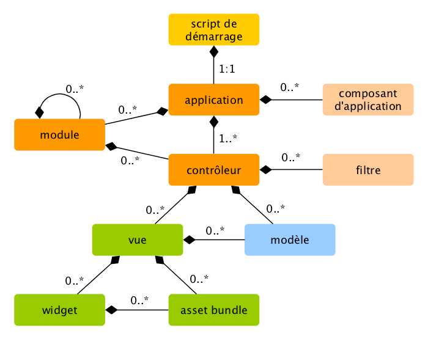

Vue d'ensemble
========

Les applications Yii sont organisées suivant le modèle de conception 
[model-view-controller (MVC)](http://wikipedia.org/wiki/Model-view-controller). Les [Modèles](structure-models.md) 
représentent les données, la logique métier et les règles; les [vues](structure-views.md) sont les représentations
visuelles des modèles, et les [contrôleurs](structure-controllers.md) prennent une entrée et la convertissent en 
commandes pour les [modèles](structure-models.md) et les [vues](structure-views.md).

En plus du MVC, les applications Yii ont les entités suivantes :

* [scripts d'entrée](structure-entry-scripts.md): ce sont des scripts PHP qui sont directement accessibles aux 
  utilisateurs. Ils sont responsables de l'amorçage d'un cycle de gestion de requête.
* [applications](structure-applications.md): ce sont des objets globalement accessibles qui gèrent les composants
  d'application et les coordonnent pour satisfaire des requêtes.
* [composants d'application](structure-application-components.md): ce sont des objets enregistrés avec des applications et 
  qui fournissent différents services pour satisfaire des requêtes.
* [modules](structure-modules.md): ce sont des paquets auto-contenus qui contiennent du MVC complet. Une application peut
  être organisée en de multiples modules.
* [filtres](structure-filters.md): ils représentent du code qui doit être invoqué avant et après la gestion effective 
  de chaque requête par des contrôleurs.
* [objets graphiques](structure-widgets.md): ce sont des objets qui peuvent être intégrés dans des [vues](structure-views.md). Ils
  peuvent contenir de la logique contrôleur et peuvent être réutilisés dans différentes vues.

Le diagramme suivant montre la structure statique d'une application :

