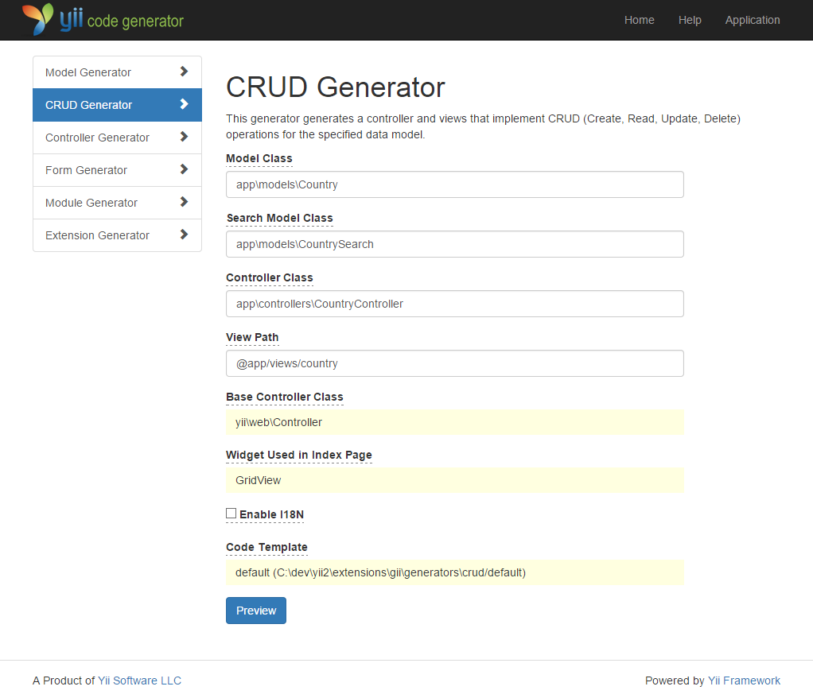

Membuat Kode menggunakan Gii
========================

Bagian ini akan menjelaskan bagaimana cara menggunakan [Gii](https://github.com/yiisoft/yii2-gii/blob/master/docs/guide/README.md) untuk membuat kode secara otomatis
yang mengimplementasikan fitur-fitur yang bersifat umum dalam sebuah web site. Menggunakan Gii untuk membuat kode sesederhana menginput informasi yang sesuai per satu instruksi seperti yang diterangkan pada halaman web Gii.

Sepanjang bagian ini, anda akan mempelajari bagaimana cara untuk:

* Mengaktifkan Gii pada aplikasi anda,
* Menggunakan Gii untuk membuat _class ActiveRecord_
* Menggunakan Gii untuk membuat kode yang mengoperasikan CRUD untuk database,
* Memodifikasi kode yang sudah dibuat oleh Gii.


Memulai Gii <span id="starting-gii"></span>
------------

[Gii](https://github.com/yiisoft/yii2-gii/blob/master/docs/guide/README.md) telah disediakan oleh Yii sebagai [module](structure-modules.md). Anda dapat mengaktifkan Gii
dengan mengatur konfigurasi Gii pada properti [[yii\base\Application::modules|modules]] dari objek aplikasi. Tergantung bagaimana anda mengatur aplikasi anda, kode di bawah ini sudah disediakan pada file konfigurasi `config/web.php`:

```php
$config = [ ... ];

if (YII_ENV_DEV) {
    $config['bootstrap'][] = 'gii';
    $config['modules']['gii'] = [
        'class' => 'yii\gii\Module',
    ];
}
```

Konfigurasi di atas menyatakan bahwa, ketika mode [development environment](concept-configurations.md#environment-constants) aktif,
maka aplikasi harus mengikutkan module yang bernama `gii`, dimana objek tersebut merupakan class [[yii\gii\Module]].

Jika anda melihat [_entry script_](structure-entry-scripts.md) `web/index.php` pada aplikasi anda, anda akan
menemukan baris dibawah ini, yang menyatakan secara explisit bahwa `YII_ENV_DEV` sama dengan `true`.

```php
defined('YII_ENV') or define('YII_ENV', 'dev');
```

Karna baris tersebut, aplikasi anda harusnya sudah berada pada mode _development_, dan secara otomatis mengaktifkan Gii karena konfigurasi sebelumnya. Anda dapat mengakses Gii melalui URL di bawah ini:

```
https://hostname/index.php?r=gii
```

> Note: Jika anda mengakses Gii melalui komputer diluar komputer localhost anda, secara default akses tidak akan diperbolehkan
> karna alasan keamanan. Anda dapat mengatur Gii untuk menambah alamat IP yang di perbolehkan seperti ini,
>
```php
'gii' => [
    'class' => 'yii\gii\Module',
    'allowedIPs' => ['127.0.0.1', '::1', '192.168.0.*', '192.168.178.20'] // adjust this to your needs
],
```


Membuat class _Active Record_ <span id="generating-ar"></span>
---------------------------------

Untuk menggunakan Gii dalam membuat class Active Record, pilih "Model Generator" (dengan cara mengklik link pada halaman index Gii). Kemudian isi form dengan data berikut:

* Table Name: `country`
* Model Class: `Country`


Selanjutnya, klik pada tombol "Preview". Anda akan melihat `models/Country.php` pada daftar class yang akan dibuat. Anda bisa mengklik nama dari class tersebut untuk melihat isi kodenya.

Pada saat menggunakan Gii, jika anda sudah membuat file dengan nama yang sama sebelumnya dan akan menimpanya, klik
tombol `diff` disebelah nama file untuk melihat perbedaan antara kode yang akan dibuat
dengan kode yang ada saat ini.


Jika akan menimpa file yang sudah ada, centang kotak di sebelah tulisan "overwrite" dan kemudian klik tombol "Generate". Jika anda membuat file baru, anda cukup mengklik tombol "Generate".

Selanjutnya, anda akan melihat
halaman konfirmasi yang memberitahui bahwa kode berhasil dibuat. Jika sebelumnya anda sudah mempunyai file yang sama, anda juga akan melihat pesan yang memberitahukan bahwa file tersebut sudah ditimpa dengan file yang baru.


Membuat CRUD <span id="generating-crud"></span>
--------------------

_CRUD_ adalah _Create, Read, Update,_ dan _Delete_, yang merepresentasikan empat tugas umum yang melibatkan website secara umum. Untuk membuat _CRUD_ menggunakan Gii, pilih tombol "CRUD Generator" (dengan cara mengklik pada halaman index Gii). Untuk contoh "negara", isi form yang ditampilkan dengan data berikut:

* Model Class: `app\models\Country`
* Search Model Class: `app\models\CountrySearch`
* Controller Class: `app\controllers\CountryController`



Selanjutnya, klik tombol "Preview". Anda akan melihat daftar file-file yang akan dibuat, seperti gambar dibawah ini.


Jika anda sebelumnya sudah membuat file `controllers/CountryController.php` dan
`views/country/index.php` (pada bagian bekerja dengan database), centang kotak "overwrite" untuk menimpa file tersebut. (File pada bagian bekerja dengan database tidak memiliki dukungan CRUD secara penuh.)


Mari kita coba <span id="trying-it-out"></span>
-------------

Untuk melihat bagaimana proses kerjanya, gunakan browser anda untuk mengakses URL dibawah ini:

```
https://hostname/index.php?r=country%2Findex
```

Anda akan melihat tabel data yang menampilkan negara dari tabel pada database. Anda dapat mengurutkan tabel,
atau memfilter dengan menginput pencarian filter pada baris judul kolom.

Disetiap negara yang tampil pada tabel, anda dapat memilih apakah akan melihat (_view_) detail, memperbaharui (_update_), atau menghapus (_delete_) data tersebut,
anda juga dapat mengklik tombol "Create Country" yang berada di atas tabel tersebut untuk menampilkan form untuk membuat data negara yang baru.


Dibawah ini adalah daftar file yang dihasilkan oleh Gii, mungkin saja anda ingin melakukan observasi bagaimana fitur-fitur ini di implementasikan,
atau melakukan modifikasi terhadap file-file yang dihasilkan:

* Controller: `controllers/CountryController.php`
* Model: `models/Country.php` dan `models/CountrySearch.php`
* View: `views/country/*.php`

> Info: Gii di desain agar mudah di modifikasi, dan dikembangkan. Menggunakan Gii
  dapat membuat pengembangan aplikasi anda menjadi lebih cepat. Untuk informasi lebih lanjut, silahkan melihat
  bagian [Gii](https://github.com/yiisoft/yii2-gii/blob/master/docs/guide/README.md).


Penutup <span id="summary"></span>
-------

Pada bagian ini, anda telah mengetahui bagaimana cara menggunakan Gii untuk membuat kode yang mengimplementasikan
fungsi CRUD secara lengkap dalam mengelola data yang tersimpan pada database.
