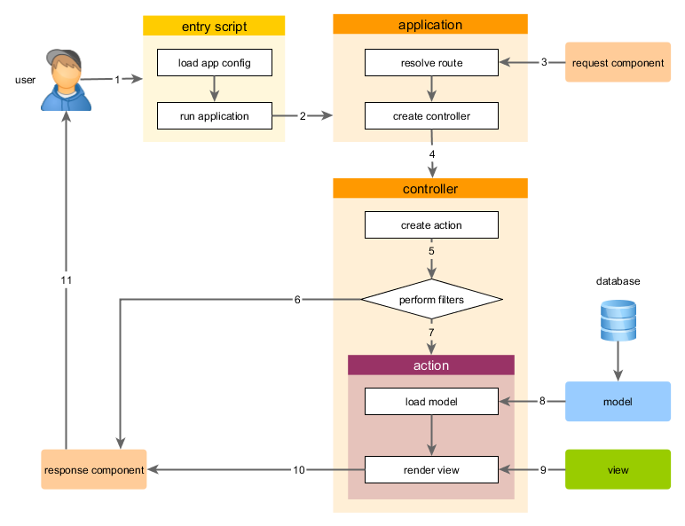

Menjalankan Aplikasi
====================

Setelah menginstal Yii, Anda memiliki aplikasi Yii yang dapat diakses melalui
URL `https://hostname/basic/web/index.php` atau `https://hostname/index.php`, tergantung
pada konfigurasi Anda. Bagian ini akan memperkenalkan fungsi built-in aplikasi,
bagaimana kode ini disusun, dan bagaimana aplikasi menangani permintaan secara umum.

> Info: Untuk mempermudah, selama tutorial "Mulai", itu diasumsikan bahwa Anda telah menetapkan `basic/web`
  sebagai root dokumen server Web Anda, dan URL dikonfigurasi untuk mengakses
  aplikasi Anda untuk menjadi `https://hostname/index.php` atau sesuatu yang serupa.
  Untuk kebutuhan Anda, silakan menyesuaikan URL sesuai deskripsi kami.
  
Perhatikan bahwa tidak seperti framework itu sendiri, setelah template proyek diinstal, itu semua milikmu. Anda bebas untuk menambah atau menghapus
kode dan memodifikasi keseluruhannya sesuai yang Anda butuhkan.


Fungsi <span id="functionality"></span>
-------------

Aplikasi dasar diinstal berisi empat halaman:

* Homepage, ditampilkan saat Anda mengakses URL `https://hostname/index.php`,
* Halaman "About",
* Halaman "Contact", yang menampilkan formulir kontak yang memungkinkan pengguna akhir untuk menghubungi Anda melalui email,
* Dan halaman "Login", yang menampilkan form login yang dapat digunakan untuk otentikasi pengguna akhir. Cobalah masuk
  dengan "admin/admin", dan Anda akan menemukan item "Login" di menu utama akan berubah menjadi "Logout".

Halaman ini berbagi header umum dan footer. header berisi menu bar utama untuk memungkinkan navigasi
antara halaman yang berbeda.

Anda juga harus melihat toolbar di bagian bawah jendela browser.
Ini adalah [debugger tool](https://github.com/yiisoft/yii2-debug/blob/master/docs/guide/README.md) yang disediakan oleh Yii 
untuk merekam dan menampilkan banyak informasi debug, seperti log pesan, status respon, query database berjalan, dan sebagainya.

Selain itu untuk aplikasi web, ada script konsol yang disebut `yii`, yang terletak di direktori aplikasi dasar.
Script ini dapat digunakan untuk menjalankan aplikasi background dan tugas pemeliharaan untuk aplikasi, yang diuraikan
di bagian [Console Application](tutorial-console.md).


Struktur aplikasi <span id="application-structure"></span>
---------------------

Direktori yang paling penting dan file dalam aplikasi Anda (dengan asumsi direktori root aplikasi adalah `basic`):

```
basic/                  path aplikasi dasar
    composer.json       digunakan oleh Composer, package information
    config/             berisi konfigurasi aplikasi dan yang lain
        console.php     konfigurasi aplikasi konsole
        web.php         konfigurasi aplikasi web
    commands/           contains console command classes
    controllers/        contains controller classes
    models/             contains model classes
    runtime/            contains files generated by Yii during runtime, such as logs and cache files
    vendor/             contains the installed Composer packages, including the Yii framework itself
    views/              contains view files
    web/                application Web root, contains Web accessible files
        assets/         contains published asset files (javascript and css) by Yii
        index.php       the entry (or bootstrap) script for the application
    yii                 the Yii console command execution script
```

Secara umum, file dalam aplikasi dapat dibagi menjadi dua jenis: mereka yang di bawah `basic/web` dan mereka yang
di bawah direktori lain. Yang pertama dapat langsung diakses melalui HTTP (yaitu, di browser), sedangkan yang kedua tidak dapat dan tidak seharusnya boleh.

Yii mengimplementasikan pola arsitektur [model-view-controller (MVC)](https://wikipedia.org/wiki/Model-view-controller),
yang tercermin dalam organisasi direktori di atas. Direktori `models` berisi semua [Model kelas](structure-models.md),
direktori `views` berisi semua [view script] structure-views.md), dan direktori `controllers` mengandung
semua [kelas kontroler](structure-controllers.md).

Diagram berikut memperlihatkan struktur statis dari sebuah aplikasi.


Setiap aplikasi memiliki naskah entri `web/index.php` yang merupakan satu-satunya PHP skrip dalam aplikasi yang dapat diakses web.
Naskah entri mengambil permintaan masuk dan menciptakan [aplikasi](structure-applications.md) untuk menanganinya.
[Aplikasi](structure-applications.md) menyelesaikan permintaan dengan bantuan [komponen](concept-components.md)nya,
dan mengirimkan permintaan ke elemen MVC. [Widget](structure-widgets.md) digunakan dalam [view](structure-views.md)
untuk membantu membangun elemen antarmuka pengguna yang kompleks dan dinamis.


Daur Hidup Request <span id="request-lifecycle"></span>
-----------------

Diagram berikut menunjukkan bagaimana aplikasi menangani permintaan.



1. Pengguna membuat permintaan ke [skrip entri](structure-entry-scripts.md) `web/index.php`.
2. Naskah entri memuat [konfigurasi](concept-configurations.md) aplikasi dan menciptakan
   [aplikasi](structure-applications.md) untuk menangani permintaan.
3. Aplikasi menyelesaikan [route](runtime-routing.md) yang diminta dengan bantuan
   komponen [request](runtime-requests.md) aplikasi.
4. Aplikasi ini menciptakan [kontroler](structure-controllers.md) untuk menangani permintaan.
5. Controller menciptakan [action](structure-controllers.md) dan melakukan filter untuk action.
6. Jika filter gagal, aksi dibatalkan.
7. Jika semua filter lulus, aksi dieksekusi.
8. Action memuat model data, mungkin dari database.
9. Aksi meyiapkan view, menyediakannya dengan model data.
10. Hasilnya diberikan dikembalikan ke komponen aplikasi [respon](runtime-responses.md).
11. Komponen respon mengirimkan hasil yang diberikan ke browser pengguna.
