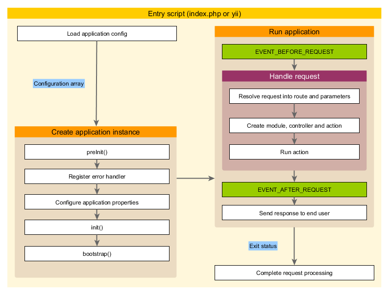

Aplikasi
========

Aplikasi _(Application)_ adalah objek yang mengelola semua struktur dan siklus dari sistem aplikasi Yii.
Setiap aplikasi sistem Yii mengandung satu objek aplikasi yang dibuat dalam
[skrip masuk](structure-entry-scripts.md) dan mampu diakses secara global melalui _expression_ `\Yii::$app`.

> Info: Jika kami mengatakan "sebuah aplikasi", itu bisa diartikan sebagai sebuah objek aplikasi
  atau sebuah sistem aplikasi, tergantung bagaimana konteksnya.

Terdapat dua tipe aplikasi: [[yii\web\Application|Aplikasi Web]] dan
[[yii\console\Application|Aplikasi Konsol]]. Sesuai dengan namanya, yang pertama bertujuan untuk menangani
_web request_, sedangkan yang kedua menangani _request_ perintah pada konsol.


## Konfigurasi Aplikasi <span id="application-configurations"></span>

Ketika [skrip masuk](structure-entry-scripts.md) membuat objek aplikasi, objek ini akan mengambil dan memuat
sebuah [array konfigurasi](concept-configurations.md) dan menerapkannya pada objek aplikasi seperti berikut ini:

```php
require __DIR__ . '/../vendor/autoload.php';
require __DIR__ . '/../vendor/yiisoft/yii2/Yii.php';

// memuat konfigurasi aplikasi
$config = require __DIR__ . '/../config/web.php';

// membuat objek aplikasi & menerapkan konfigurasi
(new yii\web\Application($config))->run();
```

Seperti layaknya [konfigurasi](concept-configurations.md) normal, konfigurasi aplikasi menentukan bagaimana
proses inisialisasi _property_ dari objek aplikasi. Karena konfigurasi aplikasi pada umumnya
sangat kompleks, oleh karena itu konfigurasi tersebut di simpan dalam [file konfigurasi](concept-configurations.md#configuration-files),
seperti file `web.php` pada contoh di atas.


## _Property_ Aplikasi <span id="application-properties"></span>

Terdapat cukup banyak _property_ aplikasi penting yang harus anda atur dalam konfigurasi aplikasi.
_Property_ ini secara khusus menjelaskan _environment_ yang sedang dijalankan oleh aplikasi.
Sebagai contoh, aplikasi ingin mengetahui bagaimana cara memuat [controller](structure-controllers.md),
dimana seharusnya aplikasi menyimpan file-file yang bersifat sementara _(temporary files)_, dll. Kami akan meringkas _property_ tersebut dibawah ini:


### _Property_ Wajib <span id="required-properties"></span>

Dalam aplikasi apapun, anda harus menentukan setidaknya dua _property_:[[yii\base\Application::id|id]]
dan [[yii\base\Application::basePath|basePath]].


#### [[yii\base\Application::id|id]] <span id="id"></span>

_Property_ [[yii\base\Application::id|id]] menentukan ID unik yang membedakan objek aplikasi
dengan yang lainnya. Ini pada umumnya digunakan secara programatik. Walaupun hal ini bukanlah sebuah keharusan, karena persoalan pertukaran informasi,
anda sangat direkomendasikan hanya menggunakan karakter alfanumerik ketika menentukan ID dari sebuah aplikasi.


#### [[yii\base\Application::basePath|basePath]] <span id="basePath"></span>

_Property_ [[yii\base\Application::basePath|basePath]] menentukan direktori _root_ dari sebuah aplikasi.
Yaitu direktori yang menyimpan semua sumber kode aplikasi sistem, dan aksesnya diproteksi dari luar. Didalam direktori ini,
anda akan melihat sub-direktori seperti `models`, `views`, dan `controllers` yang menyimpan sumber kode
dari pola MVC.

Anda dapat menentukan _property_ [[yii\base\Application::basePath|basePath]] menggunakan _directory path_
atau [path alias](concept-aliases.md). Kedua bentuk ini, direktori yang dimaksud harus benar-benar ada, jika tidak maka sebuah _exception_
akan di-_throw_. _Path_ akan dinormalkan dengan memanggil _function_ `realpath()`.

_Property_ [[yii\base\Application::basePath|basePath]] pada umumnya digunakan untuk mengambil _path_ penting
lainnya (contoh _runtime path_). Karna itulah _alias path_ yang dinamakan `@app` disediakan untuk merepresentasikan _path_
ini. _Path-path_ lainnya boleh dipanggil menggunakan alias ini (contoh: `@app/runtime` untuk merujuk ke direktori runtime).


### _Property_ Penting <span id="important-properties"></span>

_Property_ yang dijelaskan di sub-bagian ini cenderung harus di tentukan karena mereka digunakan secara berbeda
di lintas aplikasi.


#### [[yii\base\Application::aliases|Alias]] <span id="aliases"></span>

_Property_ ini memungkinkan anda untuk menentukan seperangkat [alias](concept-aliases.md) dalam bentuk _array_.
_Array Key_ merupakan nama alias, dan _Array Value_ adalah definisi path yang dimaksud.
Sebagai contoh:

```php
[
    'aliases' => [
        '@nama1' => 'path/menuju/ke/path1',
        '@nama2' => 'path/menuju/ke/path2',
    ],
]
```

Karna tersedianya _property_ ini, anda bisa menentukan beberapa alias pada konfigurasi aplikasi dibanding
dengan memanggil _method_ [[Yii::setAlias()]].


#### [[yii\base\Application::bootstrap|bootstrap]] <span id="bootstrap"></span>

_Property_ ini merupakan _property_ yang bermanfaat. _Property_ ini memungkinkan anda untuk menentukan _component_ berbentuk _array_ yang harus
dijalankan dalam [[yii\base\Application::bootstrap()|proses bootstrap]].
Sebagai contoh, jika anda memerintahkan sebuah [module](structure-modules.md) untuk merubah [pengaturan URL](runtime-routing.md),
anda dapat menyusun ID-nya sebagai elemen dari _property_ ini.

Setiap _component_ yang terdaftar pada _property_ ini dapat ditentukan berdasarkan salah satu dari format berikut ini:

- ID dari _Component_ aplikasi yang ditentukan melalui [component](#components),
- ID dari _module_ yang ditentukan melalui [module](#modules),
- Nama _class_,
- Konfigurasi _array_,
- _anonymous function_ yang membuat dan mengembalikan _(return)_ sebuah _component_.

Sebagai contoh:

```php
[
    'bootstrap' => [
        // Component ID atau Module ID
        'demo',

        // Nama Class
        'app\components\Profiler',

        // Konfigurasi dalam bentuk array
        [
            'class' => 'app\components\Profiler',
            'level' => 3,
        ],

        // anonymous function
        function () {
            return new app\components\Profiler();
        }
    ],
]
```

> Info: Jika ID _module_ tersebut sama dengan ID _component_ aplikasi, _component_ aplikasi tersebut yang akan dipakai
> pada saat proses _boostrap_. Jika anda ingin menggunakan _module_, anda dapat menentukannya melalui _anonymous function_
> seperti berikut ini:
>
> ```php
> [
>     function () {
>         return Yii::$app->getModule('user');
>     },
> ]
> ```


Sepanjang proses _bootstrap_, setiap _component_ akan dibuat objeknya. Jika _class component_
mengimplementasikan _method interface_ [[yii\base\BootstrapInterface]], _method_ [[yii\base\BootstrapInterface::bootstrap()|bootstrap()]] dari class tersebut
juga akan dipanggil.

Salah satu contoh praktis lainnya adalah konfigurasi aplikasi untuk [Template Proyek Dasar](start-installation.md),
dimana _module_ `debug` dan `gii` ditentukan sebagai _component bootstrap_ ketika aplikasi sedang dijalankan
dalam mode pengembangan:

```php
if (YII_ENV_DEV) {
    // penyesuaian konfigurasi untuk environment 'dev'
    $config['bootstrap'][] = 'debug';
    $config['modules']['debug'] = 'yii\debug\Module';

    $config['bootstrap'][] = 'gii';
    $config['modules']['gii'] = 'yii\gii\Module';
}
```

> Note: Menentukan terlalu banyak _component_ pada `bootstrap` akan menurunkan performa dari aplikasi anda, dikarenakan
  _component_ yang sama tersebut harus dijalakan dalam setiap _request_. Jadi gunakanlah _component bootstrap_ dengan bijaksana.

#### [[yii\web\Application::catchAll|catchAll]] <span id="catchAll"></span>

_Property_ ini hanya dikenali oleh [[yii\web\Application|Web applications]]. _Property_ ini menentukan
sebuah [action dari controller](structure-controllers.md) yang ditugaskan menangani semua _request_ dari pengguna. _Property_ ini biasanya
digunakan ketika aplikasi dalam mode pemeliharaan _(maintenance)_ yang mengarahkan semua _request_ menuju satu _action_.

Konfigurasinya yaitu sebuah _array_ dimana elemen pertama menentukan _route_ dari _action_.
Element lainnya _(sepasang key-value)_ menentukan parameter yang akan diteruskan ke _action_. Sebagai contoh:

```php
[
    'catchAll' => [
        'offline/notice',
        'param1' => 'value1',
        'param2' => 'value2',
    ],
]
```

> Info: Panel _Debug_ pada _development environment_ tidak akan berfungsi ketika _property_ ini diisi.

#### [[yii\base\Application::components|components]] <span id="components"></span>

_Property_ ini adalah salah satu _property_ yang sangat penting. _Property_ ini memperbolehkan anda mendaftarkan beberapa _component_
yang disebut [_component_ aplikasi](structure-application-components.md) yang bisa anda gunakan di tempat lain. Sebagai contoh:

```php
[
    'components' => [
        'cache' => [
            'class' => 'yii\caching\FileCache',
        ],
        'user' => [
            'identityClass' => 'app\models\User',
            'enableAutoLogin' => true,
        ],
    ],
]
```

Setiap _component_ aplikasi ditentukan dengan sepasang _key-value_ ke dalam _array_. _Key_ merepresentasikan ID _component_,
dimana _value_ merepresentasikan nama class dari _component_ atau [konfigurasi _array_](concept-configurations.md).

Anda dapat mendaftaran _component_ apapun ke dalam objek aplikasi, dan nantinya _component_ tersebut dapat diakses secara global
menggunakan _expression_ `\Yii::$app->componentID`.

Harap membaca bagian [_Component_ Aplikasi](structure-application-components.md) untuk penjelasan lebih lanjut.


#### [[yii\base\Application::controllerMap|controllerMap]] <span id="controllerMap"></span>

_Property_ ini memperbolehkan anda untuk melakukan _mapping_ sebuah ID _controller_ ke class _controller_ yang anda inginkan. Secara default, Yii melakukan mapping
ID _controller_ ke _class controller_ berdasarkan [kaidah yang ditentukan](#controllerNamespace) (Contoh: ID `post` akan di _mapping_
ke `app\controllers\PostController`). Dengan menentukan _property_ ini, anda diperbolehkan untuk tidak mengikuti kaidah untuk
spesifik _controller_. Pada contoh dibawah ini, `account` akan di _mapping_ ke
`app\controllers\UserController`, sedangkan `article` akan di _mapping_ ke `app\controllers\PostController`.

```php
[
    'controllerMap' => [
        'account' => 'app\controllers\UserController',
        'article' => [
            'class' => 'app\controllers\PostController',
            'enableCsrfValidation' => false,
        ],
    ],
]
```

_Key array_ dari _property_ ini merepresentasikan ID _controller_, sedangkan _value_ merepresentasikan nama _class
yang dimaksud atau [konfigurasi _array_](concept-configurations.md).


#### [[yii\base\Application::controllerNamespace|controllerNamespace]] <span id="controllerNamespace"></span>

_Property_ ini menentukan _namespace_ default dimana _class controller_ tersebut harus dicari. Default ke
`app\controllers`. Jika ID _controller_ adalah `post`, secara kaidah,  nama _class controller_-nya (tanpa
_namespace_) adalah `PostController`, dan `app\controllers\PostController` adalah nama class lengkapnya _(Fully Qualified Class Name)_.

_class controller_ juga boleh disimpan dalam sub-direktori dari direktori yang dimaksud _namespace_ ini.
Sebagai contoh, jika ada ID _controller_ `admin/post`, nama class lengkap yang dimaksud adalah
`app\controllers\admin\PostController`.

Sangatlah penting bahwa nama class lengkap dari _controller_ tersebut [bisa di-autoload](concept-autoloading.md)
dan _namespace_ dari _class controller_ anda cocok dengan nilai dari _property_ ini. Jika tidak,
anda akan melihat error "Halaman tidak ditemukan" ketika mengakses aplikasi.

Jika saja anda tidak ingin mengikut kaidah-kaidah yang dijelaskan di atas, anda boleh menentukan _property_
[controllerMap](#controllerMap).


#### [[yii\base\Application::language|language]] <span id="language"></span>

_Property_ ini menentukan bahasa apa yang seharusnya ditampilkan pada konten aplikasi ke pengguna.
Nilai default dari _property_ ini adalah `en`, yang merupakan Bahasa Inggris. Anda harus menentukan _property_ ini
jika aplikasi anda menyediakan konten dalam berbagai bahasa.

Nilai dari _property_ ini menentukan banyak aspek dari [internasionalisasi](tutorial-i18n.md),
termasuk penerjemahan pesan, format tanggal, format penomoran, dll. Sebagai contoh, _widget_ [[yii\jui\DatePicker]]
akan menggunakan _property_ ini secara _default_ untuk menentukan bahasa apa yang digunakan pada kalender yang ditampilkan dan bagaimana
format tanggal pada kalender tersebut.

Disarankan agar anda menentukan bahasa dalam format [Tag Bahasa IETF](http://en.wikipedia.org/wiki/IETF_language_tag).
Sebagai contoh, `en` berarti Bahasa Inggris, sedangkan `en-US` berarti Bahasa Inggris yang digunakan di Amerika Serikat.

Informasi selengkapnya mengenai _property_ ini dapat dipelajari di bagian [Internasionalisasi](tutorial-i18n.md).


#### [[yii\base\Application::modules|modules]] <span id="modules"></span>

_Property_ ini menentukan [module](structure-modules.md) apa yang akan digunakan oleh aplikasi.

_Property_ ini ditentukan menggunakan _array_ dari _class class modul_ atau [konfigurasi _array_](concept-configurations.md) dimana _array key_
merupakan ID dari _module_ tersebut. Berikut contohnya:

```php
[
    'modules' => [
        // modul "booking" dengan class module yang ditentukan
        'booking' => 'app\modules\booking\BookingModule',

        // modul "comment" yang ditentukan menggunakan konfigurasi array
        'comment' => [
            'class' => 'app\modules\comment\CommentModule',
            'db' => 'db',
        ],
    ],
]
```

Silahkan melihat bagian [Modules](structure-modules.md) untuk informasi lebih lanjut.


#### [[yii\base\Application::name|name]] <span id="name"></span>

_Property_ ini menentukan nama aplikasi yang bisa ditampilkan ke pengguna. Berbeda dengan
_property_ [[yii\base\Application::id|id]], yang mengharuskan nilainya unik, nilai dari _property_ ini secara umum bertujuan untuk
keperluan tampilan saja; tidak perlu unik.

Anda tidak perlu menentukan _property_ ini jika memang tidak ada kode anda yang akan menggunakannya.


#### [[yii\base\Application::params|params]] <span id="params"></span>

_Property_ ini menentukan parameter berbentuk _array_ yang bisa diakses secara global oleh aplikasi. Dibanding menuliskan secara manual
angka dan _string_ di kode anda, merupakan hal yang bagus jika anda menentukan hal tersebut sebagai parameter-parameter aplikasi
di satu tempat yang sama, dan menggunakannya pada tempat dimana dia dibutuhkan. Sebagai contoh, anda mungkin menentukan ukuran _thumbnail_
sebagai parameter seperti contoh dibawah ini:

```php
[
    'params' => [
        'thumbnail.size' => [128, 128],
    ],
]
```

Kemudian, pada kode dimana anda akan menggunakan ukuran tersebut, anda cukup menggunakannya seperti kode dibawah ini:

```php
$size = \Yii::$app->params['thumbnail.size'];
$width = \Yii::$app->params['thumbnail.size'][0];
```

Jika di suatu hari anda memutuskan untuk mengganti ukuran _thumbnail_ tersebut, anda cukup menggantinya di konfigurasi aplikasi;
anda tidak perlu mengganti di semua kode dimana anda menggunakannya.


#### [[yii\base\Application::sourceLanguage|sourceLanguage]] <span id="sourceLanguage"></span>

_Property_ ini menentukan bahasa apa yang digunakan dalam menulis kode aplikasi. Nilai default-nya adalah `'en-US'`,
yang berarti Bahasa Inggris (Amerika Serikat). Anda sebaiknya menentukan _property_ ini jika teks pada kode anda bukanlah Bahasa Inggris.

Seperti layaknya _property_ [language](#language), anda seharusnya menentukan _property_ ini dalam
format [Tag Bahasa IETF](http://en.wikipedia.org/wiki/IETF_language_tag). Sebagai contoh, `en` berarti Bahasa Inggris,
sedangkan `en-US` berarti Bahasa Inggris (Amerika Serikat).

Untuk informasi lebih lanjut mengenai _property_ ini bisa anda pelajari pada bagian [Internasionalisasi](tutorial-i18n.md).


#### [[yii\base\Application::timeZone|timeZone]] <span id="timeZone"></span>

_Property_ ini disediakan sebagai cara alternatif untuk menentukan zona waktu default dari _PHP runtime_.
Dengan menentukan _property_ ini, pada dasarnya anda memanggil _function_ PHP
[date_default_timezone_set()](http://php.net/manual/en/function.date-default-timezone-set.php). Sebagi contoh:

```php
[
    'timeZone' => 'America/Los_Angeles',
]
```


#### [[yii\base\Application::version|version]] <span id="version"></span>

_Property_ ini menentukan versi dari aplikasi anda. Secara default nilainya adalah `'1.0'`. Anda tidak harus menentukan
_property_ ini jika tidak ada kode anda yang akan menggunakannya.


### _Property_ yang Bermanfaat <span id="useful-properties"></span>

_Property_ yang dijelaskan pada sub-bagian ini tidak secara umum digunakan karena nilai default-nya
sudah ditentukan berdasarkan kaidah-kaidah yang umum digunakan. Tetapi anda boleh menentukannya sendiri jikalau anda tidak ingin mengikuti kaidah-kaidah tersebut.


#### [[yii\base\Application::charset|charset]] <span id="charset"></span>

_Property_ ini menentukan _charset_ yang digunakan oleh aplikasi. Nilai default-nya adalah `'UTF-8'`, dimana harus
digunakan sebisa mungkin pada kebanyakan aplikasi, kecuali anda sedang membangun sistem lama yang banyak menggunakan data yang tidak termasuk dalam _Unicode_.


#### [[yii\base\Application::defaultRoute|defaultRoute]] <span id="defaultRoute"></span>

_Property_ ini menentukan [route](runtime-routing.md) yang harus aplikasi gunakan ketika sebuah _request_
tidak memiliki _route_. _Route_ dapat terdiri dari ID _child module_, ID _controller_, dan/atau ID _action_.
Sebagai contoh, `help`, `post/create`, atau `admin/post/create`. Jika ID _action_ tidak diberikan, maka _property_ ini akan mengambil
nilai default yang ditentukan di [[yii\base\Controller::defaultAction]].

Untuk [[yii\web\Application|aplikasi Web]], nilai default dari _property_ ini adalah `'site'`, yang berarti
_controller_ `SiteController` dan default _action_-nya yang akan digunakan. Hasilnya, jika anda mengakses
aplikasi tanpa menentukan _route_ yang spesifik, maka akan menampilkan output dari `app\controllers\SiteController::actionIndex()`.

Untuk [[yii\console\Application|aplikasi konsol]], nilai default-nya adalah `'help'`, yang berarti akan menggunakan
[[yii\console\controllers\HelpController::actionIndex()]] sebagai perintah utamanya. Hasilnya, jika anda menjalankan perintah `yii`
tanpa memasukkan argumen, maka akan menampilkan informasi bantuan penggunaan.


#### [[yii\base\Application::extensions|extensions]] <span id="extensions"></span>

_Property_ ini menentukan daftar dari [extension](structure-extensions.md) yang terpasang dan digunakan oleh aplikasi.
Secara default, akan mengambil _array_ yang dikembalikan oleh file `@vendor/yiisoft/extensions.php`. File `extensions.php`
dibuat dan dikelola secara otomatis jika anda menggunakan [Composer](https://getcomposer.org) untuk memasang _extensions_.
Secara umum, anda tidak perlu menentukan _property_ ini.

Dalam kasus khusus jika anda ingin mengelola _extension_ secara manual, anda boleh menentukan _property_ ini seperti kode dibawah ini:

```php
[
    'extensions' => [
        [
            'name' => 'extension name',
            'version' => 'version number',
            'bootstrap' => 'BootstrapClassName',  // Tidak wajib, bisa juga berupa konfigurasi array
            'alias' => [  // Tidak Wajib
                '@alias1' => 'to/path1',
                '@alias2' => 'to/path2',
            ],
        ],

        // ... extension lain yang ditentukan seperti kode di atas ...

    ],
]
```

Seperti yang anda lihat, _property_ ini menerima spesifikasi _extension_ dalam bentuk _array_. Setiap _extension_ ditentukan dengan _array_
yang terdiri dari elemen `name` dan `version`. Jika _extension_ harus dijalankan ketika proses [bootstrap](runtime-bootstrapping.md)
, elemen `bootstrap` dapat dispesifikasikan dengan nama _class bootstrap_-nya atau [konfigurasi array](concept-configurations.md)
. _Extension_ juga dapat menentukan beberapa [alias](concept-aliases.md).


#### [[yii\base\Application::layout|layout]] <span id="layout"></span>

_Property_ ini menentukan nama dari default layout yang akan digunakan ketika me-render sebuah [view](structure-views.md).
Nilai default-nya adalah `'main'`, yang berarti akan menggunakan file layout `main.php` yang disimpan di [layout path](#layoutPath).
Jika kedua dari [layout path](#layoutPath) dan [view path](#viewPath) mengambil nilai default,
maka representasi file layoutnya adalah _path alias_ `@app/views/layouts/main.php`.

Anda dapat menentukan nilai _property_ ini menjadi `false` jika anda ingin menonaktifkan layout secara default, tetapi anda seharusnya tidak memerlukannya.


#### [[yii\base\Application::layoutPath|layoutPath]] <span id="layoutPath"></span>

_Property_ ini menentukan path dimana sistem akan mencari file layout. Nilai default-nya adalah
sub-direktori `layouts` di dalam [view path](#viewPath). Jika [view path](#viewPath) mengambil
nilai defaultnya, maka path layout defaultnya adalah path alias `@app/views/layouts`.

Anda dapat menentukannya sebagai direktori atau path [alias](concept-aliases.md).


#### [[yii\base\Application::runtimePath|runtimePath]] <span id="runtimePath"></span>

_Property_ ini menentukan dimana path file yang bersifat sementara, seperti file _log_ dan _cache_.
Nilai default-nya adalah direktori yang direpresentasikan oleh alias `@app/runtime`.

Anda dapat menentukan nilainya dengan direktori atau path [alias](concept-aliases.md). Sebagai catatan, _path runtime_ wajib
memiliki akses tulis _(writeable)_ oleh _web server_ yang menjalankan aplikasi. Dan path tersebut sebaiknya diproteksi aksesnya dari
pengguna, karena file yang bersifat sementara di dalamnya mungkin mengandung informasi sensitif.

Untuk menyederhanakan akses ke path ini, Yii sudah menentukan path alias dengan nama `@runtime`.


#### [[yii\base\Application::viewPath|viewPath]] <span id="viewPath"></span>

_Property_ ini menentukan direktori _root_ dimana file-file _view_ akan disimpan. Nilai default-nya adalah direktori
yang di representasikan oleh alias `@app/views`. Anda dapat menentukan nilainya dengan direktori atau path [alias](concept-aliases.md).


#### [[yii\base\Application::vendorPath|vendorPath]] <span id="vendorPath"></span>

_Property_ ini menentukan direktori _vendor_ yang di kelola oleh [Composer](https://getcomposer.org). Direktori ini akan
menyimpan semua _library_ pihak ketiga yang digunakan oleh aplikasi anda, termasuk Yii _framework_. Nilai default-nya adalah
direktori yang di representasikan oleh alias `@app/vendor`.

Anda dapat menentukan nilai _property_ ini dengan direktori atau path [alias](concept-aliases.md). Jika anda mengganti
nilai _property_ ini, pastikan anda juga menyesuaikan konfigurasi Composer.

Untuk memudahkan akses ke path ini, Yii sudah menentukan path alias dengan nama `@vendor`.


#### [[yii\console\Application::enableCoreCommands|enableCoreCommands]] <span id="enableCoreCommands"></span>

_Property_ ini hanya dikenali oleh [[yii\console\Application|console applications]]. _Property_ ini menentukan
apakah perintah inti yang dibawa oleh rilisan Yii harus diaktifkan. Nilai default-nya adalah `true`.


## _Event_ Aplikasi <span id="application-events"></span>

Sebuah objek _aplikasi_ menjalankan beberapa _event_ sepanjang siklus penanganan _request_. Anda dapat menempelkan penanganan _event_
untuk _event-event_ ini di dalam konfigurasi aplikasi seperti di bawah ini:

```php
[
    'on beforeRequest' => function ($event) {
        // ...
    },
]
```

Penggunaan dari sintaks `on eventName` akan dijelaskan pada bagian
[Konfigurasi](concept-configurations.md#configuration-format).

Sebagai alternatif, anda dapat menempelkan penanganan _event_ ke dalam [proses bootstrap](runtime-bootstrapping.md)
setelah objek aplikasi telah dibuat. Sebagai contoh:

```php
\Yii::$app->on(\yii\base\Application::EVENT_BEFORE_REQUEST, function ($event) {
    // ...
});
```

### [[yii\base\Application::EVENT_BEFORE_REQUEST|EVENT_BEFORE_REQUEST]] <span id="beforeRequest"></span>

_Event_ ini dijalankan *sebelum* objek aplikasi menangani sebuah _request_. Nama _event_-nya adalah `beforeRequest`.

Ketika _event_ ini dijalankan, objek aplikasi sudah dibuat dan di inisialisasi. Jadi waktu ini merupakan waktu yang tepat
untuk memasukkan kode anda melalui mekanisme _event_ untuk mengintervensi penanganan _request_. Sebagai contoh,
di penanganan _event_, anda dapat menentukan _property_ [[yii\base\Application::language]] secara dinamis berdasarkan parameter tertentu.


### [[yii\base\Application::EVENT_AFTER_REQUEST|EVENT_AFTER_REQUEST]] <span id="afterRequest"></span>

_Event_ ini dijalankan *setelah* objek aplikasi menyelesaikan penanganan sebuah _request_ tetapi *sebelum* mengirimkan _response_.

Ketika _event_ ini dijalankan, proses penanganan _request_ sudah selesai dan anda dapat menggunakan kesempatan untuk melakukan beberapa tugas
untuk memodifikasi _request_ atau _response_.

Sebagai catatan, _component_ [[yii\web\Response|response]] juga menjalankan beberapa _event_ pada saat mengirim
isi _response_ ke pengguna. _Event_ tersebut akan dijalankan *setelah* _event_ ini.


### [[yii\base\Application::EVENT_BEFORE_ACTION|EVENT_BEFORE_ACTION]] <span id="beforeAction"></span>

_Event_ ini dijalankan *sebelum* semua [action dari controller](structure-controllers.md) diproses.
Nama _event_-nya adalah `beforeAction`.

Parameter _event_ merupakan objek dari [[yii\base\ActionEvent]]. Sebuah penanganan _event_ boleh menentukan
_property_ [[yii\base\ActionEvent::isValid]] menjadi `false` untuk memberhentikan proses jalannya _action_.
Sebagai contoh:

```php
[
    'on beforeAction' => function ($event) {
        if (kondisi tertentu) {
            $event->isValid = false;
        } else {
        }
    },
]
```

Sebagai catatan, _event_ `beforeAction` yang sama juga dijalankan oleh [module](structure-modules.md)
dan [controller](structure-controllers.md). _Event_ pada objek aplikasi yang menjalankan _event_ ini
untuk pertama kali, dilanjutkan oleh _module_ (jika ada), dan terakhir oleh _controller_. Jika sebuah penanganan _event_
menentukan _property_ [[yii\base\ActionEvent::isValid]] menjadi `false`, semua _event_ selanjutnya TIDAK akan dijalankan.


### [[yii\base\Application::EVENT_AFTER_ACTION|EVENT_AFTER_ACTION]] <span id="afterAction"></span>

_Event_ ini dijalankan *setelah* menjalankan seluruh [action dari controller](structure-controllers.md).
Nama _event_-nya adalah `afterAction`.

Parameter _event_ adalah objek dari [[yii\base\ActionEvent]]. Menggunakan
_property_ [[yii\base\ActionEvent::result]], _method_ penanganan _event_ dapat mengakses atau merubah hasil dari _action_.
Sebagai contoh:

```php
[
    'on afterAction' => function ($event) {
        if (kondisi tertentu) {
            // rubah nilai dari $event->result
        } else {
        }
    },
]
```

Sebagai catatan, _event_ `afterAction` yang sama juga dijalankan oleh [module](structure-modules.md)
dan [controllers](structure-controllers.md). Objek-objek ini menjalankan _event_ ini sama seperti `beforeAction`,
hanya saja urutannya merupakan kebalikan dari urutan di _event_ `beforeAction`. _Controller_ adalah objek pertama yang menjalankan _event_ ini,
setelah itu _module_ (jika ada), dan terakhir di level aplikasi.


## Application Lifecycle <span id="application-lifecycle"></span>



Ketika [skrip masuk](structure-entry-scripts.md) sedang dijalankan untuk menangani sebuah _request_,
aplikasi akan melewati proses siklus dibawah ini:

1. Skrip masuk mengambil konfigurasi aplikasi dalam bentuk array.
2. Skrip masuk membuat objek aplikasi:
   * [[yii\base\Application::preInit()|preInit()]] dipanggil, dimana akan mengatur beberapa _property_ aplikasi
     yang sangat penting seperti [[yii\base\Application::basePath|basePath]].
   * Mendaftarkan [[yii\base\Application::errorHandler|penanganan error]].
   * Mengatur _property_ aplikasi.
   * [[yii\base\Application::init()|init()]] dipanggil, yang selanjutnya memanggil
     [[yii\base\Application::bootstrap()|bootstrap()]] untuk menjalankan proses _bootstrap component_.
3. Skrip masuk memanggil [[yii\base\Application::run()]] untuk menjalankan aplikasi:
   * Menjalankan _event_ [[yii\base\Application::EVENT_BEFORE_REQUEST|EVENT_BEFORE_REQUEST]].
   * Menangani _request_: memproses _request_ menjadi [route](runtime-routing.md) dan parameter-parameternya;
     membuat objek _module_, _controller_, dan _action_ yang dispesifikasikan oleh _route_; dan menjalankan _action_.
   * Menjalankan _event_ [[yii\base\Application::EVENT_AFTER_REQUEST|EVENT_AFTER_REQUEST]].
   * Mengirim _response_ ke pengguna.
4. Skrip masuk mendapatkan _status exit_ dari aplikasi dan menyelesaikan proses penanganan _request_.
