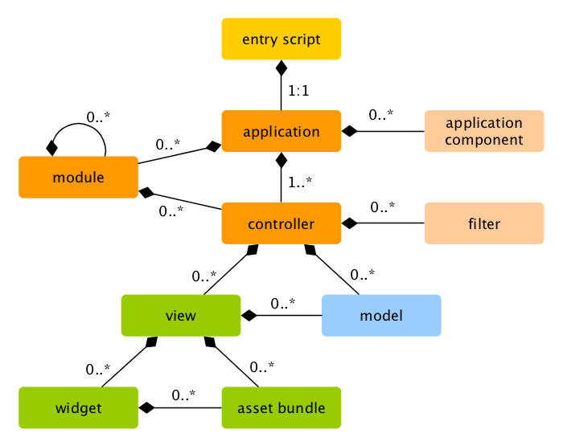

Tinjauan
========

Aplikasi Yii diorganisir berdasarkan pola arsitektur [model-view-controller (MVC)](http://wikipedia.org/wiki/Model-view-controller).
[Model](structure-models.md) merepresentasikan data, pengaturan dan proses bisnis; [view](structure-views.md)
adalah output yang merepresentasikan model; dan [controller](structure-controllers.md) mengelola input dan merubahnya
menjadi perintah-perintah untuk [model](structure-models.md) dan [view](structure-views.md).

Selain MVC, aplikasi Yii juga memiliki entitas berikut:

* [entry scripts](structure-entry-scripts.md): Ini adalah skrip PHP yang diakses secara langsung oleh pengguna.
  Ini bertugas untuk memulai siklus penanganan _request_.
* [applications](structure-applications.md): Ini adalah objek yang dapat diakses secara global, yang mengelola _component_ aplikasi
  dan mengaturnya untuk memenuhi sebuah _request_.
* [application components](structure-application-components.md): Ini adalah objek-objek yang didaftarkan pada objek _application_ dan
  menyediakan beragam layanan untuk memenuhi _request_.
* [modules](structure-modules.md): Ini adalah paket _(package)_ mandiri yang berisikan MVC lengkap.
  Sebuah aplikasi boleh diistilahkan sebagai module-module yang telah diorganisir.
* [filters](structure-filters.md): Ini merepresentaikan kode yang mutlak untuk dijalakan sebelum dan sesudah
  penanganan dari tiap-tiap _request_ yang dikelola oleh _controller_.
* [widgets](structure-widgets.md): Ini adalah objek-objek yang dapat ditanam kedalam [views](structure-views.md). Ini
  dapat mengandung logika _controller_ dan dapat digunakan berulang-ulang pada _view_ yang berbeda.

Diagram dibawah ini menunjukkan struktur statis dari sebuah aplikasi:

