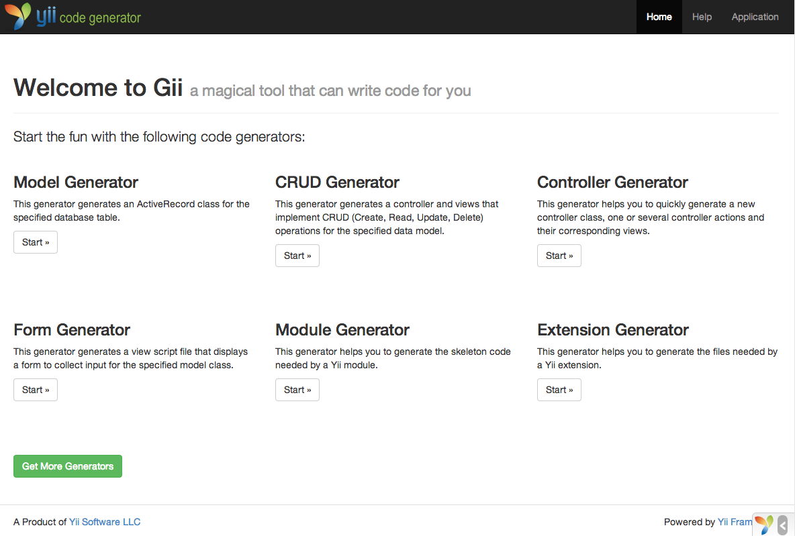
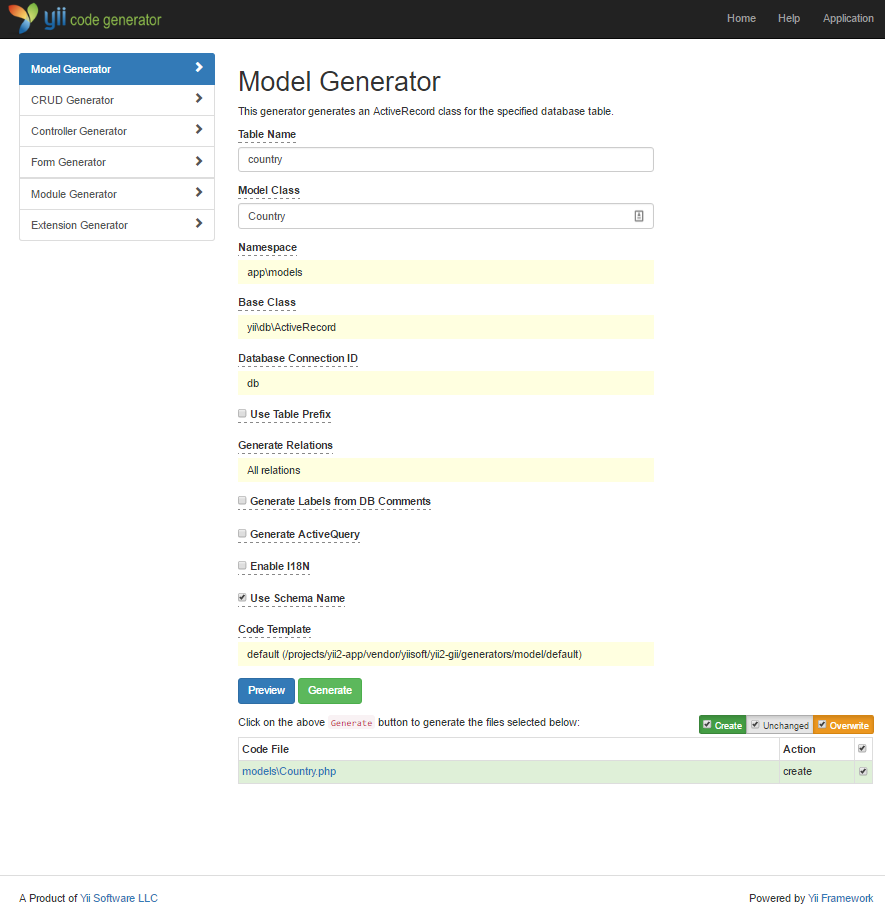
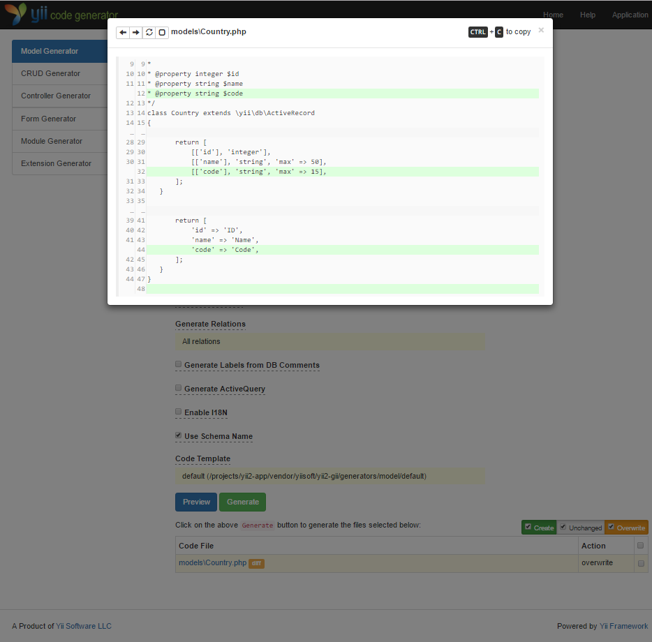
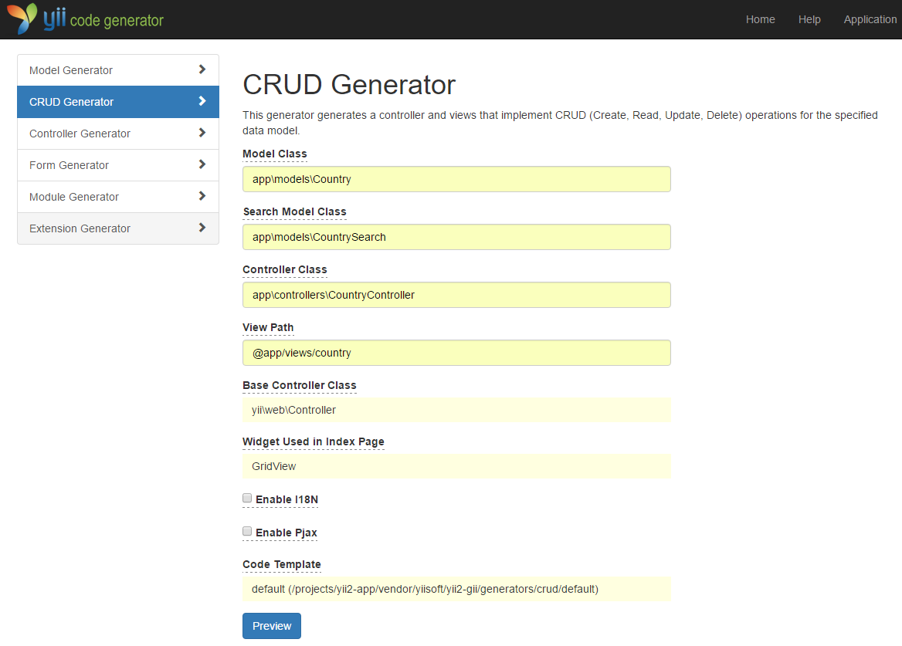
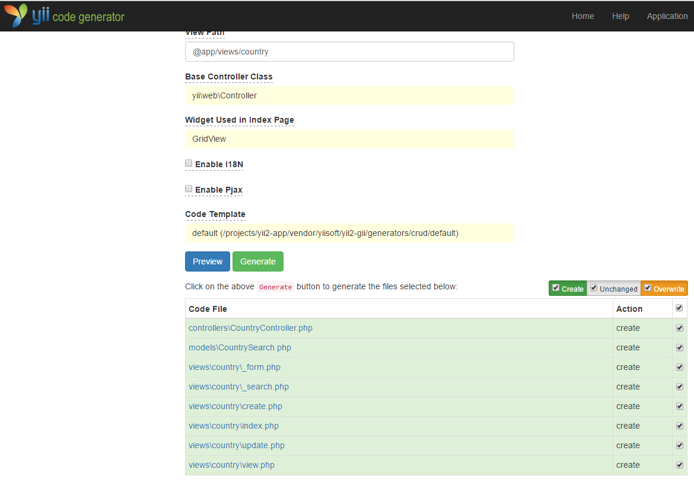
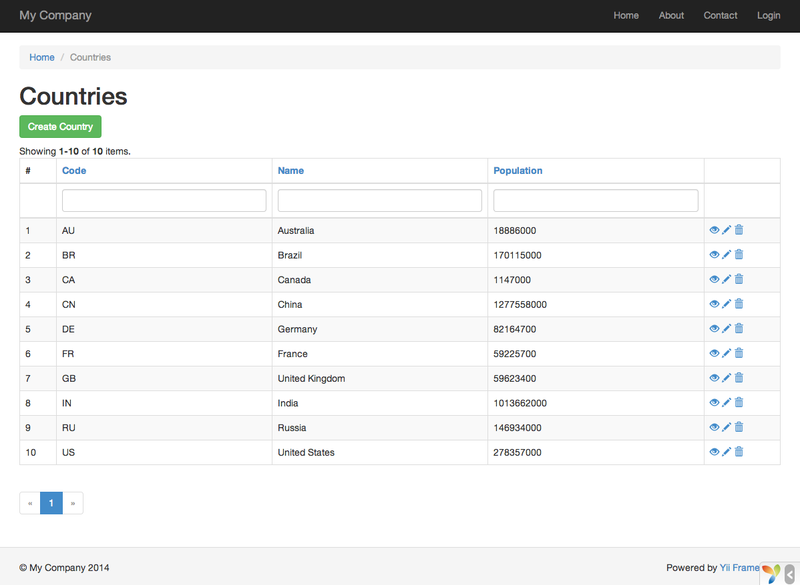
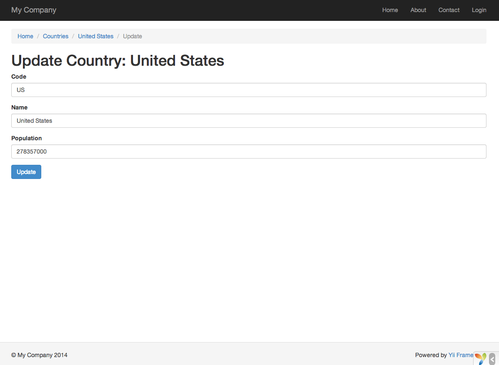

Generare codice con Gii
=======================

Questa sezione descrive come usare [Gii](https://www.yiiframework.com/extension/yiisoft/yii2-gii/doc/guide) per
generare automaticamente il codice che implementa alcune funzionalità comuni dei siti web. Usare Gii per generare codice
è semplicemente questione di inserire le informazioni corrette, seguendo le istruzioni mostrate nelle pagine web di Gii.

In questo tutorial imparerai come:

* abilitare Gii nella tua applicazione,
* usare Gii per generare una classe Active Record,
* usare Gii per generare il codice che implementa le operazioni CRUD per una tabella del database,
* personalizzare il codice generato da Gii.


Avviare Gii <span id="starting-gii"></span>
-----------

[Gii](https://www.yiiframework.com/extension/yiisoft/yii2-gii/doc/guide) è fornito in Yii come
[modulo](structure-modules.md). Puoi abilitare Gii configurandolo nella proprietà
[[yii\base\Application::modules|modules]] dell'applicazione. A seconda di come hai creato la tua applicazione, potresti
trovare il codice seguente già presente nel file di configurazione `config/web.php`:

```php
$config = [ ... ];

if (YII_ENV_DEV) {
    $config['bootstrap'][] = 'gii';
    $config['modules']['gii'] = [
        'class' => 'yii\gii\Module',
    ];
}
```

La configurazione precedente stabilisce che, in [ambiente di sviluppo](concept-configurations.md#environment-constants),
l'applicazione deve includere un modulo di nome `gii`, che appartiene alla classe [[yii\gii\Module]].

Se controlli l'[entry script](structure-entry-scripts.md) `web/index.php` della tua applicazione, troverai la riga
seguente, che in sostanza fa sì che `YII_ENV_DEV` sia `true`.

```php
defined('YII_ENV') or define('YII_ENV', 'dev');
```

Grazie a questa riga, la tua applicazione è in modalità di sviluppo e, secondo la configurazione precedente, avrà già
Gii abilitato. Ora puoi accedere a Gii tramite il seguente URL:

```
https://hostname/index.php?r=gii
```

> Note: Se accedi a Gii da una macchina diversa da localhost, l'accesso viene negato per impostazione predefinita
> per motivi di sicurezza. Puoi configurare Gii aggiungendo gli indirizzi IP consentiti come segue:
>
```php
'gii' => [
    'class' => 'yii\gii\Module',
    'allowedIPs' => ['127.0.0.1', '::1', '192.168.0.*', '192.168.178.20'] // adatta questo alle tue esigenze
],
```




Generare una classe Active Record <span id="generating-ar"></span>
---------------------------------

Per generare una classe Active Record con Gii, seleziona il "Model Generator" (cliccando sul link nella pagina
iniziale di Gii). Poi compila il form come segue:

* Table Name: `country`
* Model Class: `Country`



Quindi clicca sul pulsante "Preview". Vedrai che `models/Country.php` è elencato tra i file di classe che verranno
creati. Puoi cliccare sul nome del file di classe per visualizzarne l'anteprima del contenuto.

Quando usi Gii, se hai già creato lo stesso file e lo sovrascriveresti, clicca sul pulsante `diff` accanto al nome del
file per vedere le differenze tra il codice che verrà generato e la versione esistente.



Per sovrascrivere un file esistente, seleziona la casella accanto a "overwrite" e poi clicca sul pulsante "Generate".
Se stai creando un nuovo file, puoi semplicemente cliccare su "Generate".

Successivamente vedrai una pagina di conferma che indica che il codice è stato generato con successo. Se avevi un file
esistente, vedrai anche un messaggio che indica che è stato sovrascritto con il nuovo codice generato.


Generare codice CRUD <span id="generating-crud"></span>
--------------------

CRUD è l'acronimo di Create, Read, Update e Delete, che rappresentano le quattro operazioni comuni eseguite sui dati
nella maggior parte dei siti web. Per creare le funzionalità CRUD con Gii, seleziona il "CRUD Generator" (cliccando
sul link nella pagina iniziale di Gii). Per l'esempio "country", compila il form risultante come segue:

* Model Class: `app\models\Country`
* Search Model Class: `app\models\CountrySearch`
* Controller Class: `app\controllers\CountryController`



Quindi clicca sul pulsante "Preview". Vedrai un elenco dei file che verranno generati, come mostrato di seguito.



Se in precedenza hai creato i file `controllers/CountryController.php` e `views/country/index.php` (nella sezione della
guida dedicata ai database), seleziona la casella "overwrite" per sostituirli. (Le versioni precedenti non avevano il
supporto CRUD completo.)


Proviamolo <span id="trying-it-out"></span>
----------

Per vedere come funziona, usa il tuo browser per accedere al seguente URL:

```
https://hostname/index.php?r=country%2Findex
```

Vedrai una griglia di dati che mostra i paesi presenti nella tabella del database. Puoi ordinare la griglia oppure
filtrarla inserendo le condizioni di filtro nelle intestazioni delle colonne.

Per ogni paese visualizzato nella griglia puoi scegliere di vederne i dettagli, aggiornarlo o eliminarlo. Puoi anche
cliccare sul pulsante "Create Country" in cima alla griglia per ottenere un form per la creazione di un nuovo paese.





Di seguito è riportato l'elenco dei file generati da Gii, nel caso tu voglia approfondire come sono implementate queste
funzionalità o personalizzarle:

* Controller: `controllers/CountryController.php`
* Modelli: `models/Country.php` e `models/CountrySearch.php`
* Viste: `views/country/*.php`

> Info: Gii è progettato per essere uno strumento di generazione del codice altamente personalizzabile ed estensibile.
> Usarlo con criterio può accelerare notevolmente lo sviluppo della tua applicazione. Per maggiori
> dettagli fai riferimento alla sezione [Gii](https://www.yiiframework.com/extension/yiisoft/yii2-gii/doc/guide).


Riepilogo <span id="summary"></span>
---------

In questa sezione hai imparato come usare Gii per generare il codice che implementa la funzionalità CRUD completa per i
contenuti memorizzati in una tabella del database.
