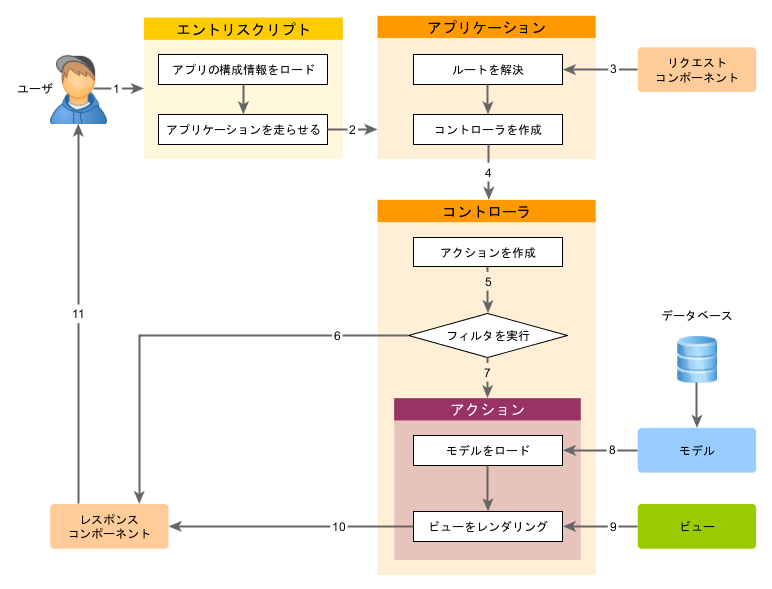

概要
====

Yii のアプリケーションがリクエストを処理するときは、毎回、同じようなワーク・フローになります。

1. ユーザが [エントリ・スクリプト](structure-entry-scripts.md) `web/index.php` にリクエストをします。
2. エントリ・スクリプトは、アプリケーションの [構成情報](concept-configurations.md) をロードして、
   リクエストを処理するための [アプリケーション](structure-applications.md) のインスタンスを作成します。
3. アプリケーションは、[リクエスト](runtime-requests.md) アプリケーション・コンポーネントの助けを借りて、
   リクエストされた [ルート](runtime-routing.md) を解決します。
4. アプリケーションはリクエストを処理するための [コントローラ](structure-controllers.md) のインスタンスを作成します。
5. コントローラは [アクション](structure-controllers.md) のインスタンスを作成して、アクションのためのフィルタを実行します。
6. [フィルタ](structure-filters.md)のどれかが失敗すると、アクションはキャンセルされます。
7. すべてのフィルタを無事に通ったら、アクションが実行されます。
8. アクションはデータ[モデル](structure-models.md)を、おそらくはデータベースから、ロードします。
9. アクションはデータ・モデルを[ビュー](structure-views.md)に提供して、ビューをレンダリングします。
10. レンダリングの結果は [レスポンス](runtime-responses.md) アプリケーション・コンポーネントに返されます。
11. レスポンス・コンポーネントがレンダリングの結果をユーザのブラウザに送信します。

次の図は、アプリケーションがどのようにしてリクエストを処理するかを示すものです。

このセクションでは、これらのステップのいくつかについて、どのように動作するかを詳細に説明します。
