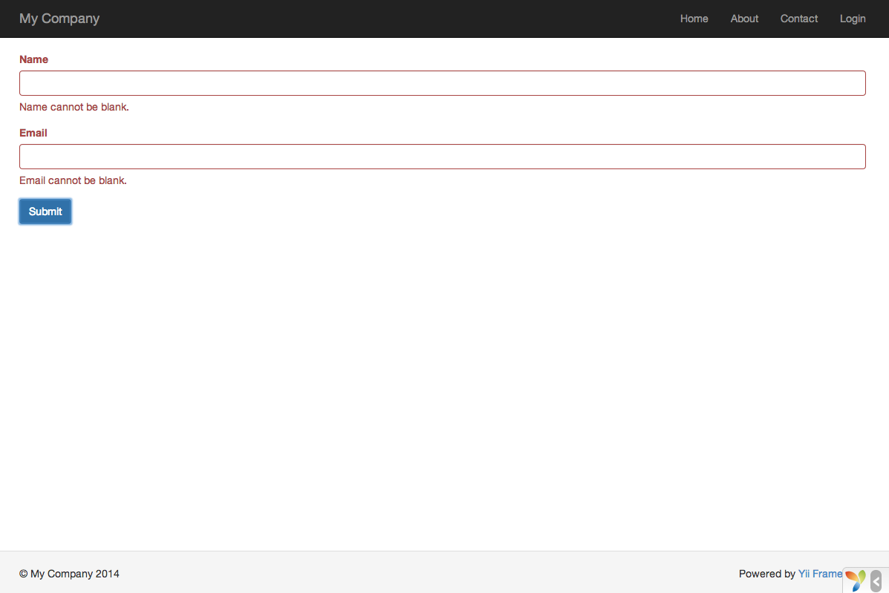

フォームを扱う
==============

このセクションでは、ユーザからデータを取得するためのフォームを持つ新しいページを作る方法を説明します。
このページは名前のインプット・フィールドとメールのインプット・フィールドを持つフォームを表示します。
ユーザからこれら二つの情報を受け取った後、ウェブ・ページは確認のために入力された値をエコー・バックします。

この目的を達するために、一つの [アクション](structure-controllers.md) と 二つの [ビュー](structure-views.md) を作成する以外に、
一つの [モデル](structure-models.md) をも作成します。

このチュートリアルを通じて、次の方法を学びます。

* フォームを通じてユーザによって入力されるデータを表す [モデル](structure-models.md) を作成する方法
* 入力されたデータを検証する規則を宣言する方法
* [ビュー](structure-views.md) の中で HTML フォームを構築する方法


モデルを作成する <span id="creating-model"></span>
----------------

ユーザに入力してもらうデータは、下に示されているように `EntryForm` モデル・クラスとして表現され、
`models/EntryForm.php` というファイルに保存されます。
クラス・ファイルの命名規約についての詳細は [クラスのオートロード](concept-autoloading.md) のセクションを参照してください。

```php
<?php

namespace app\models;

use Yii;
use yii\base\Model;

class EntryForm extends Model
{
    public $name;
    public $email;

    public function rules()
    {
        return [
            [['name', 'email'], 'required'],
            ['email', 'email'],
        ];
    }
}
```

このクラスは、Yii によって提供される基底クラス [[yii\base\Model]] を拡張するものです。
通常、この基底クラスがフォーム・データを表現するのに使われます。

> Info: [[yii\base\Model]] はデータベース・テーブルと関連*しない*モデル・クラスの親として使われます。
データベース・テーブルと対応するモデル・クラスでは、通常は [[yii\db\ActiveRecord]] が親になります。

`EntryForm` クラスは二つのパブリック・メンバー、`name` と `email` を持っており、これらがユーザによって入力されるデータを保管するのに使われます。
このクラスはまた `rules()` という名前のメソッドを持っています。このメソッドがデータを検証する一連の規則を返します。
上記で宣言されている検証規則は次のことを述べています。

* `name` と `email` は、ともに値を要求される
* `email` のデータは構文的に有効なメール・アドレスでなければならない

ユーザによって入力されたデータを `EntryForm` オブジェクトに投入した後、[[yii\base\Model::validate()|validate()]] メソッドを呼んでデータ検証ルーチンを始動することが出来ます。
データ検証が失敗すると [[yii\base\Model::hasErrors|hasErrors]] プロパティが `true` に設定されます。
そして、[[yii\base\Model::getErrors|errors]] を通じて、どのような検証エラーが発生したかを知ることが出来ます。


```php
<?php
$model = new EntryForm();
$model->name = 'Qiang';
$model->email = 'bad';
if ($model->validate()) {
    // 良し!
} else {
    // 失敗!
    // $model->getErrors() を使う
}
```


アクションを作成する <span id="creating-action"></span>
--------------------

次に、この新しいモデルを使う `entry` アクションを `site` コントローラに作る必要があります。
アクションを作成して使うプロセスについては、[こんにちは、と言う](start-hello.md) のセクションで既に説明されています。

```php
<?php

namespace app\controllers;

use Yii;
use yii\web\Controller;
use app\models\EntryForm;

class SiteController extends Controller
{
    // ... 既存のコード ...

    public function actionEntry()
    {
        $model = new EntryForm();

        if ($model->load(Yii::$app->request->post()) && $model->validate()) {
            // $model に有効なデータを受け取った場合

            // ここで $model について何か意味のあることをする ...

            return $this->render('entry-confirm', ['model' => $model]);
        } else {
            // ページの初期表示か、または、何か検証エラーがある場合
            return $this->render('entry', ['model' => $model]);
        }
    }
}
```

アクションは最初に `EntryForm` オブジェクトを生成します。
次に、モデルに `$_POST` のデータ、Yii においては [[yii\web\Request::post()]] によって提供されるデータを投入しようと試みます。
モデルへのデータ投入が成功した場合（つまり、ユーザが HTML フォームを送信した場合)、アクションは[[yii\base\Model::validate()|validate()]] を呼んで、
入力された値が有効なものであるかどうかを確認します。

> Info: `Yii::$app` という式は [アプリケーション](structure-applications.md) インスタンスを表現します。
  これはグローバルにアクセス可能なシングルトンです。
  これは、また、特定の機能性をサポートする `request`、`response`、`db` などのコンポーネントを提供する [サービス・ロケータ](concept-service-locator.md) でもあります。
  上記のコードでは、アプリケーション・インスタンスの `request` コンポーネントが `$_POST` データにアクセスするために使われています。

すべてが適正である場合、アクションは `entry-confirm` という名前のビューを表示して、データの送信が成功したことをユーザに確認させます。
データが送信されなかったり、データがエラーを含んでいたりする場合は、`entry` ビューが表示され、
その中で HTML フォームが (もし有れば) 検証エラーのメッセージとともに表示されます。

> Note: この簡単な例では、有効なデータ送信に対して単純に確認ページを表示しています。
  実際の仕事では、[フォーム送信の諸問題](http://en.wikipedia.org/wiki/Post/Redirect/Get) を避けるために、
  [[yii\web\Controller::refresh()|refresh()]] または [[yii\web\Controller::redirect()|redirect()]] を使うことを考慮すべきです。


ビューを作成する <span id="creating-views"></span>
----------------

最後に、`entry-confirm` と `entry` という名前の二つのビュー・ファイルを作成します。
今まさに説明したように、これらが `entry` アクションによって表示されます。

`entry-confirm` ビューは単純に名前とメールのデータを表示するものです。このビューは `views/site/entry-confirm.php` というファイルに保存しなければなりません。

```php
<?php
use yii\helpers\Html;
?>
<p>あなたは次の情報を入力しました</p>

<ul>
    <li><label>名前</label>: <?= Html::encode($model->name) ?></li>
    <li><label>メール</label>: <?= Html::encode($model->email) ?></li>
</ul>
```

`entry` ビューは HTML フォームを表示します。これは `views/site/entry.php` というファイルに保存しなければなりません。

```php
<?php
use yii\helpers\Html;
use yii\widgets\ActiveForm;
?>
<?php $form = ActiveForm::begin(); ?>

    <?= $form->field($model, 'name') ?>

    <?= $form->field($model, 'email') ?>

    <div class="form-group">
        <?= Html::submitButton('送信', ['class' => 'btn btn-primary']) ?>
    </div>

<?php ActiveForm::end(); ?>
```

このビューは HTML フォームを構築するのに、[[yii\widgets\ActiveForm|ActiveForm]] と呼ばれる強力な
[ウィジェット](structure-widgets.md) を使います。
ウィジェットの `begin()` メソッドと `end()` メソッドが、それぞれ、フォームの開始タグと終了タグをレンダリングします。
この二つのメソッドの呼び出しの間に、[[yii\widgets\ActiveForm::field()|field()]] メソッドによってインプット・フィールドが作成されます。
最初のインプット・フィールドは "name" のデータ、第二のインプット・フィールドは "email" のデータのためのものです。
インプット・フィールドの後に、[[yii\helpers\Html::submitButton()]] メソッドが呼ばれて、送信ボタンを生成しています。


試してみる <span id="trying-it-out"></span>
----------

どのように動作するかを見るために、ブラウザで下記の URL にアクセスしてください。

```
http://hostname/index.php?r=site%2Fentry
```

二つのインプット・フィールドを持つフォームを表示するページが表示されるでしょう。それぞれのインプット・フィールドの前には、どんなデータを入力すべきかを示すラベルがあります。
何も入力せずに、あるいは、無効なメール・アドレスを入力して送信ボタンをクリックすると、それぞれ問題のあるインプット・フィールドの後ろにエラー・メッセージが表示されます。



有効な名前とメール・アドレスを入力してから送信ボタンをクリックすると、
たった今入力したデータを表示する新しいページが表示されます。


### 魔法の説明<span id="magic-explained"></span>

あなたは、舞台裏で HTML フォームがどのように動いているのか、不思議に思うかも知れません。
なぜなら、フォームが、ほとんど魔法のように、各インプット・フィールドのラベルを表示し、データを正しく入力しなかった場合には、
ページをリロードすることなく、エラー・メッセージを表示するからです。

そう、データの検証は、最初に JavaScript を使ってクライアント・サイドで実行され、次に PHP によってサーバ・サイドで実行されます。
[[yii\widgets\ActiveForm]] は、賢いことに、`EntryForm` で宣言した検証規則を抽出し、それを実行可能な JavaScript コードに変換して、
JavaScript を使ってデータ検証を実行します。
ブラウザで JavaScript を無効にした場合でも、`actionEntry()` メソッドで示されているように、サーバ・サイドでの検証は引き続き実行されます。
これにより、どのような状況であっても、データの有効性が保証されます。

> Warning: クライアント・サイドの検証は、ユーザにとってのより良い使い心地のために利便性を提供するものです。
  クライアント・サイドの検証の有無にかかわらず、サーバ・サイドの検証は常に必要です。

インプット・フィールドのラベルは、モデルのプロパティ名を使用して、`field()` メソッドによって生成されます。
例えば、`name` というプロパティから `Name` というラベルが生成されます。

ビューの中で、下記のコードのように、
ラベルをカスタマイズすることも出来ます。

```php
<?= $form->field($model, 'name')->label('お名前') ?>
<?= $form->field($model, 'email')->label('メール・アドレス') ?>
```

> Info: Yii はこのようなウィジェットを数多く提供して、複雑で動的なビューを素速く作成することを手助けしてくれます。
  後で学ぶように、新しいウィジェットを書くことも非常に簡単です。
  あなたは、将来のビュー開発を単純化するために、多くのビュー・コードを再利用可能なウィジェットに変換したいと思うことでしょう。


まとめ <span id="summary"></span>
------

ガイドのこのセクションにおいては、MVC アーキテクチャ・パターンの全ての部分に触れました。
そして、ユーザ・データを表現し、当該データを検証するモデル・クラスを作成する方法を学びました。

また、ユーザからデータを取得する方法と、ブラウザにデータを表示して返す方法も学びました。
この作業は、アプリケーションを開発するときに、多大な時間を必要とするものになり得るものです。
しかし、Yii はこの作業を非常に容易にする強力なウィジェットを提供しています。

次のセクションでは、ほとんど全てのアプリケーションで必要とされるデータベースを取り扱う方法を学びます。
