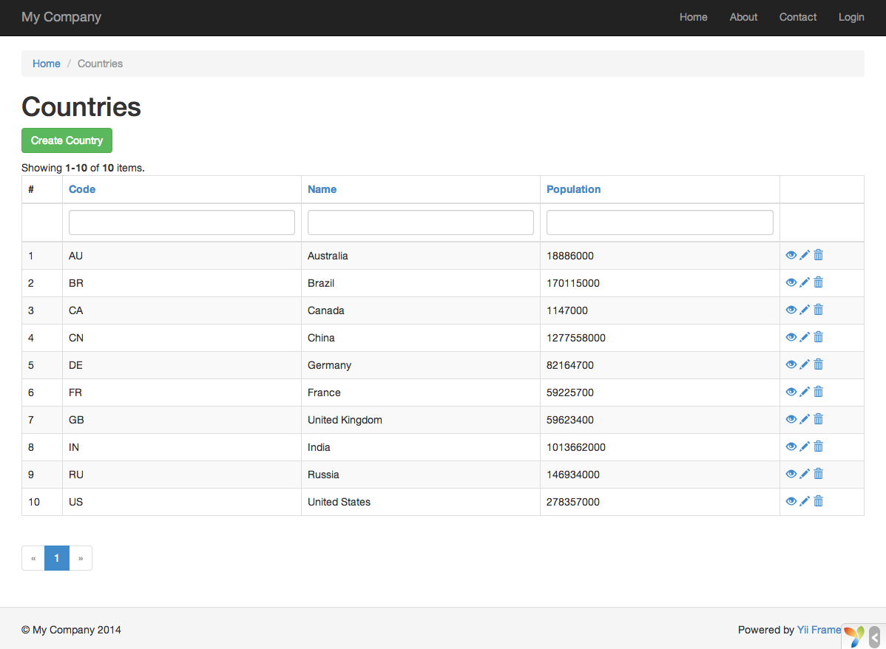

Gii でコードを生成する
======================

このセクションでは、[Gii](https://www.yiiframework.com/extension/yiisoft/yii2-gii/doc/guide) を使って、ウェブ・サイトの一般的な機能のいくつかを実装するコードを自動的に生成する方法を説明します。
Gii を使ってコードを自動生成することは、Gii のウェブ・ページに表示される指示に対して正しい情報を入力するだけのことです。

このチュートリアルを通じて、次のことを学びます。

* アプリケーションで Gii を有効にする方法
* Gii を使って、アクティブ・レコードのクラスを生成する方法
* Gii を使って、DB テーブルの CRUD 操作を実装するコードを生成する方法
* Gii によって生成されるコードをカスタマイズする方法


Gii を開始する <span id="starting-gii"></span>
--------------

[Gii](https://www.yiiframework.com/extension/yiisoft/yii2-gii/doc/guide) は Yii の [モジュール](structure-modules.md) として提供されています。
Gii は、アプリケーションの [[yii\base\Application::modules|modules]] プロパティの中で構成することで有効にすることが出来ます。アプリケーションを生成した仕方にもよりますが、`config/web.php` の構成情報ファイルの中に、多分、下記のコードが既に提供されているでしょう。

```php
$config = [ ... ];

if (YII_ENV_DEV) {
    $config['bootstrap'][] = 'gii';
    $config['modules']['gii'] = [
        'class' => 'yii\gii\Module',
    ];
}
```

上記の構成情報は、[開発環境](concept-configurations.md#environment-constants) において、アプリケーションは `gii` という名前のモジュールをインクルードすべきこと、
そして `gii` は [[yii\gii\Module]] というクラスであることを記述しています。

アプリケーションの [エントリ・スクリプト](structure-entry-scripts.md) である `web/index.php` をチェックすると、次の行があることに気付くでしょう。
これは本質的には `YII_ENV_DEV` を `true` に設定するものです。

```php
defined('YII_ENV') or define('YII_ENV', 'dev');
```

この行のおかげで、アプリケーションは開発モードになっており、上記の構成情報によって、Gii が既に有効になっています。これで、下記の URL によって Gii にアクセスすることが出来ます。

```
http://hostname/index.php?r=gii
```

> Note: ローカルホスト以外のマシンから Gii にアクセスしようとすると、デフォルトではセキュリティ上の理由でアクセスが拒否されます。
> 下記のように Gii を構成して、許可される IP アドレスを追加することが出来ます。
>
```php
'gii' => [
    'class' => 'yii\gii\Module',
    'allowedIPs' => ['127.0.0.1', '::1', '192.168.0.*', '192.168.178.20'] // 必要に応じて調整
],
```


アクティブ・レコードのクラスを生成する <span id="generating-ar"></span>
------------------------------------

Gii を使ってアクティブ・レコードのクラスを生成するためには、"Model Generator" を選びます (Gii のインデックス・ページのリンクをクリックして下さい)。そして、次のようにフォームに入力します。

* Table Name: `country`
* Model Class: `Country`


次に、"Preview" ボタンをクリックします。そうすると、結果として作成されるクラス・ファイルのリストに `models/Country.php` が挙ってきます。クラス・ファイルの名前をクリックすると、内容をプレビューすることが出来ます。

Gii を使うときに、既に同じファイルを作成していて、それを上書きしようとしている場合は、
ファイル名の隣の `diff` ボタンをクリックして、
生成されようとしているコードと既存のバージョンの違いを見てください。


既存のファイルを上書きするときは、"overwrite" の隣のチェックボックスをチェックしてから "Generate" ボタンをクリックします。新しいファイルを作成するときは、単に "Generate" をクリックすれば十分です。

次に、コードの生成が成功したことを示す確認ページが表示されます。
既存のファイルがあった場合は、それが新しく生成されたコードで上書きされたことを示すメッセージも同じく表示されます。


CRUD コードを生成する <span id="generating-crud"></span>
---------------------

CRUD は Create(作成)、Read(読出し)、Update(更新)、そして Delete(削除) を意味しており、ほとんどのウェブ・サイトでデータを扱うときによく用いられる4つのタスクを表しています。Gii を使って CRUD 機能を作成するためには、"CRUD Generator" を選びます (Gii のインデックス・ページのリンクをクリックしてください) 。「国リスト」のサンプルのためには、表示されたフォームに以下のように入力します。

* Model Class: `app\models\Country`
* Search Model Class: `app\models\CountrySearch`
* Controller Class: `app\controllers\CountryController`


次に、"Preview" ボタンをクリックします。生成されるファイルのリストは、次のようになります。


以前に（ガイドのデータベースのセクションで）`controllers/CountryController.php` と `views/country/index.php` のファイルを作成していた場合は、それらを置き換えるために "overwrite" のチェックボックスをチェックしてください。
(以前のバージョンは フル機能の CRUD をサポートしていません。)


試してみる <span id="trying-it-out"></span>
----------

どのように動作するかを見るために、ブラウザを使って下記の URL にアクセスしてください。

```
http://hostname/index.php?r=country%2Findex
```

データ・グリッドがデータベース・テーブルから取得した国を表示しているページが表示されます。
グリッドをソートしたり、カラムのヘッダに検索条件を入力してグリッドにフィルタを適用したりすることが出来ます。

グリッドに表示されているそれぞれの国について、詳細を見たり、更新したり、または削除したりすることが出来ます。
また、グリッドの上にある "Create Country" ボタンをクリックすると、新しい国データを作成するためのフォームが利用に供されます。




下記が Gii によって生成されるファイルのリストです。
これらの機能がどのように実装されているかを調査したい場合、また、これらの機能をカスタマイズしたいときに参照してください。

* Controller: `controllers/CountryController.php`
* Models: `models/Country.php` と `models/CountrySearch.php`
* Views: `views/country/*.php`

> Info: Gii は非常にカスタマイズしやすく拡張しやすいコード生成ツールとして設計されています。
  これを賢く使うと、アプリケーションの開発速度を大いに高めることが出来ます。
  詳細については、[Gii](https://www.yiiframework.com/extension/yiisoft/yii2-gii/doc/guide) のセクションを参照してください。


まとめ <span id="summary"></span>
------

このセクションでは、Gii を使ってコードを生成して、データベース・テーブルに保存されているコンテントのための
完全な CRUD 機能を実装する方法を学びました。
