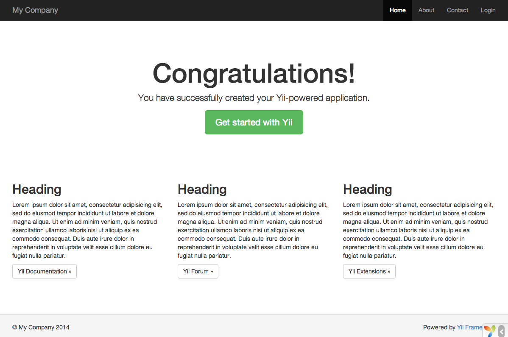

Yii をインストールする
======================

Yii は二つの方法でインストールすることが出来ます。すなわち、[Composer](https://getcomposer.org/) を使うか、アーカイブ・ファイルをダウンロードするかです。
前者がお薦めの方法です。と言うのは、一つのコマンドを走らせるだけで、新しい [エクステンション](structure-extensions.md) をインストールしたり、Yii をアップデートしたりすることが出来るからです。

Yii の標準的なインストールを実行すると、フレームワークとプロジェクト・テンプレートの両方がダウンロードされてインストールされます。
プロジェクト・テンプレートは、いくつかの基本的な機能、例えば、ログインやコンタクト・フォームなどを実装した、動作する Yii アプリケーションです。
そのコードは推奨される方法に従って編成されています。そのため、プロジェクト・テンプレートは、あなたのプロジェクトのための良い開始点としての役割を果たしうるものです。

ここから続くいくつかのセクションにおいては、いわゆる *ベーシック・プロジェクト・テンプレート* とともに Yii をインストールする方法、
および、このテンプレートの上に新しい機能を実装する方法を説明します。
Yii はもう一つ、[アドバンスト・プロジェクト・テンプレート](https://www.yiiframework.com/extension/yiisoft/yii2-app-advanced/doc/guide) と呼ばれるテンプレートも提供しています。
こちらは、チーム開発環境において多層構造のアプリケーションを開発するときに使用する方が望ましいものです。

> Info: ベーシック・プロジェクト・テンプレートは、ウェブ・アプリケーションの 90 パーセントを開発するのに適したものです。
  アドバンスト・プロジェクト・テンプレートとの主な違いは、コードがどのように編成されているかという点にあります。
  あなたが Yii は初めてだという場合は、シンプルでありながら十分な機能を持っているベーシック・プロジェクト・テンプレートに留まることを強く推奨します。


Composer によるインストール <span id="installing-via-composer"></span>
---------------------------

### Composer をインストールする

まだ Composer をインストールしていない場合は、[getcomposer.org](https://getcomposer.org/download/) の指示に従ってインストールすることが出来ます。
Linux や Mac OS X では、次のコマンドを実行します。

```bash
curl -sS https://getcomposer.org/installer | php
sudo mv composer.phar /usr/local/bin/composer
```

Windows では、[Composer-Setup.exe](https://getcomposer.org/Composer-Setup.exe) をダウンロードして実行します。

何か問題が生じたときは、[Composer ドキュメントのトラブル・シューティングのセクション](https://getcomposer.org/doc/articles/troubleshooting.md)
を参照してください。
Composer は初めてだという場合は、少なくとも、Composer ドキュメントの [基本的な使い方のセクション](https://getcomposer.org/doc/01-basic-usage.md)
も参照することを推奨します。

このガイドでは、composer のコマンドの全ては、あなたが composer を [グローバル](https://getcomposer.org/doc/00-intro.md#globally) にインストールし、
`composer` コマンドとして使用できるようにしているものと想定しています。
そうではなく、ローカル・ディレクトリにある `composer.phar` を使おうとする場合は、例に出てくるコマンドをそれに合せて修正しなければなりません。

以前に Composer をインストールしたことがある場合は、確実に最新のバージョンを使うようにしてください。
Composer は `composer self-update` コマンドを実行してアップデートすることが出来ます。

> Note: Yii のインストールを実行する際に、Composer は大量の情報を Github API から要求する必要が生じます。
> リクエストの数は、あなたのアプリケーションが持つ依存の数によりますが、**Github API レート制限** より大きくなることがあり得ます。
> この制限にかかった場合、Composer は Github API アクセス・トークンを取得するために、あなたの Github ログイン認証情報を要求するでしょう。
> 高速な接続においては、Composer が対処できるよりも早い段階でこの制限にかかることもありますので、
> Yii のインストールの前に、このアクセス・トークンを構成することを推奨します。
> アクセス・トークンの構成の仕方については、[Github API トークンに関する Composer ドキュメント](https://getcomposer.org/doc/articles/troubleshooting.md#api-rate-limit-and-oauth-tokens)
> の指示を参照して下さい。

### Yii をインストールする <span id="installing-from-composer"></span>

Composer がインストールされたら、ウェブ・アクセス可能なフォルダで下記のコマンドを実行することによって
Yii アプリケーション・テンプレートをインストールすることが出来ます。

```bash
composer create-project --prefer-dist yiisoft/yii2-app-basic basic
```

このコマンドが `basic` という名前のディレクトリに Yii アプリケーション／テンプレートの最新の安定版をインストールします。
必要なら別のディレクトリ名を選ぶことも出来ます。

> Info: `composer create-project` コマンドが失敗するときは、
> よくあるエラーについて [Composer ドキュメントのトラブル・シューティングのセクション](https://getcomposer.org/doc/articles/troubleshooting.md) を参照して下さい。
> エラーを修正した後は、`basic` ディレクトリの中で `composer update` を実行して、
> 中断されたインストールを再開することが出来ます。

> Tip: Yii の最新の開発バージョンをインストールしたい場合は、[stability option](https://getcomposer.org/doc/04-schema.md#minimum-stability)
> を追加した次のコマンドを代りに使うことが出来ます。
>
> ```bash
> composer create-project --prefer-dist --stability=dev yiisoft/yii2-app-basic basic
> ```
>
> 開発バージョンは動いているあなたのコードを動かなくするかもしれませんので、本番環境では使うべきでないことに注意してください。


アーカイブ・ファイルからインストールする <span id="installing-from-archive-file"></span>
----------------------------------------

アーカイブ・ファイルから Yii をインストールするには、三つの手順を踏みます。

1. [yiiframework.com](https://www.yiiframework.com/download/) からアーカイブ・ファイルをダウンロードします。
2. ダウンロードしたファイルをウェブ・アクセス可能なフォルダに展開します。
3. `config/web.php` ファイルを編集して、`cookieValidationKey` という構成情報の項目に秘密キーを入力します
   (Composer を使って Yii をインストールするときは、これは自動的に実行されます)。

   ```php
   // !!! 下記に(もし空白なら)秘密キーを入力する - これはクッキー検証のために必要
   'cookieValidationKey' => '秘密キーをここに入力',
   ```


他のインストール・オプション <span id="other-installation-options"></span>
----------------------------

上記のインストール方法の説明は Yii のインストールの仕方を示すものですが、それは同時に、直ちに動作する基本的なウェブ・アプリケーションを作成するものでもあります。
これは、規模の大小に関わらず、ほとんどのプロジェクトを開始するのに良い方法です。
特に、Yii の学習を始めたばかりの場合には、この方法が適しています。

しかし、他のインストール・オプションも利用可能です。

* コア・フレームワークだけをインストールし、アプリケーション全体を一から構築したい場合は、[アプリケーションを一から構築する](tutorial-start-from-scratch.md)
  で説明されている指示に従うことが出来ます。
* もっと洗練された、チーム開発環境により適したアプリケーションから開始したい場合は、 
  [アドバンスト・プロジェクト・テンプレート](https://github.com/yiisoft/yii2-app-advanced/blob/master/docs/guide-ja/README.md) をインストールすることを考慮することが出来ます。


アセットをインストールする <span id="installing-assets"></span>
--------------------------

Yii は、アセット (CSS および JavaScript) ライブラリのインストールについて [Bower](https://bower.io/) および/または [NPM](https://www.npmjs.com/) のパッケージに依存しています。
Yii はこれらのライブラリを取得するのに Composer を使って、PHP と CSS/JavaScript のパッケージ・バージョンを同時に解決できるようにしています。
このことは、[asset-packagist.org](https://asset-packagist.org) または [composer asset plugin](https://github.com/fxpio/composer-asset-plugin) を使用することによって達成されます。
詳細は [アセットのドキュメント](structure-assets.md) を参照して下さい。

あなたは、アセットの管理をネイティブの Bower/NPM クライアントで行ったり、CND を使ったり、アセットのインストールを完全に避けたりしたいかも知れません。
Composer によるアセットのインストールを抑止するためには、`composer.json` に次の記述を追加して下さい。

```json
"replace": {
    "bower-asset/jquery": ">=1.11.0",
    "bower-asset/inputmask": ">=3.2.0",
    "bower-asset/punycode": ">=1.3.0",
    "bower-asset/yii2-pjax": ">=2.0.0"
},
```

> Note: Composer によるアセットのインストールをバイパスする場合は、アセットのインストールとバージョン衝突の解決についてあなたが責任を持たなければなりません。
> さまざまなエクステンションに由来するアセット・ファイル間で不整合が生じうることを覚悟して下さい。


インストールを検証する <span id="verifying-installation"></span>
----------------------

インストール完了後、あなたのウェブ・サーバを構成してください (次のセクションを参照してください)。
あるいは、プロジェクトの `web` ディレクトリで次のコマンドを実行して、
[PHP の内蔵ウェブ・サーバ](https://www.php.net/manual/ja/features.commandline.webserver.php) を使ってください。

```bash
php yii serve
```

> Note: デフォルトでは、この HTTP サーバは 8080 ポートをリスンします。しかし、このポートがすでに使われていたり、複数のアプリケーションをこの方法で動かしたい場合は、
  どのポートを使うかを指定したいと思うでしょう。単に --port 引数を追加して下さい。

```bash
php yii serve --port=8888
```

下記の URL によって、インストールされた Yii アプリケーションにブラウザを使ってアクセスすることが出来ます。

```
http://localhost:8080/
```



ブラウザに上のような "おめでとう!" のページが表示されるはずです。もし表示されなかったら、PHP のインストールが Yii の必要条件を満たしているかどうか、チェックしてください。
最低限の必要条件を満たしているかどうかは、次の方法のどちらかによってチェックすることが出来ます。

* `/requirements.php` を `/web/requirements.php` としてコピーし、ブラウザを使って URL `http://localhost/requirements.php` にアクセスする。
* 次のコマンドを実行する。

  ```bash
  cd basic
  php requirements.php
  ```

Yii の最低必要条件を満たすように PHP のインストールを構成しなければなりません。
最も重要なことは、PHP 5.4 以上でなければならないということです。最新の PHP 7 なら理想的です。
また、アプリケーションがデータベースを必要とする場合は、[PDO PHP 拡張](https://www.php.net/manual/ja/pdo.installation.php) および対応するデータベース・ドライバ (MySQL データベースのための `pdo_mysql` など) をインストールしなければなりません。


ウェブ・サーバを構成する <span id="configuring-web-servers"></span>
------------------------

> Info: もし Yii の試運転をしているだけで、本番サーバに配備する意図がないのであれば、
  当面、この項は飛ばしても構いません。

上記の説明に従ってインストールされたアプリケーションは、[Apache HTTP サーバ](https://httpd.apache.org/)
と [Nginx HTTP サーバ](https://nginx.org/) のどちらでも、また、Windows、Mac OS X、Linux のどれでも、
PHP 5.4 以上を走らせている環境であれば、そのままの状態で動作するはずです。
Yii 2.0 は、また、facebook の [HHVM](https://hhvm.com/) とも互換性があります。
ただし HHVM がネイティブの PHP とは異なる振舞いをする特殊なケースもいくつかありますので、HHVM を使うときはいくらか余分に注意を払う必要があります。

本番用のサーバでは、`https://www.example.com/basic/web/index.php` の代りに `https://www.example.com/index.php` という
URL でアプリケーションにアクセス出来るようにウェブ・サーバを設定したいでしょう。
そういう設定をするためには、ウェブ・サーバのドキュメント・ルートを `basic/web` フォルダに向けることが必要になります。
また、[ルーティングと URL 生成](runtime-routing.md) のセクションで述べられているように、URL から `index.php` を隠したいとも思うでしょう。
この項では、これらの目的を達するために Apache または Nginx サーバをどのように設定すれば良いかを学びます。

> Info: `basic/web` をドキュメント・ルートに設定することは、`basic/web` の兄弟ディレクトリに保存されたプライベートなアプリケーション・コードや
公開できないデータ・ファイルにエンド・ユーザがアクセスすることを防止することにもなります。
`basic/web` 以外のフォルダに対するアクセスを拒否することはセキュリティ強化の一つです。

> Info: あなたがウェブ・サーバの設定を修正する権限を持たない共用ホスティング環境でアプリケーションが走る場合であっても、
セキュリティ強化のためにアプリケーションの構造を調整することがまだ出来ます。
詳細については、[共有ホスティング環境](tutorial-shared-hosting.md) のセクションを参照してください。

> Info: あなたのアプリケーションをリバース・プロキシの背後で動かそうとする場合は、
> リクエスト・コンポーネントの [信頼できるプロキシとヘッダ](runtime-requests.md#trusted-proxies) を構成する必要があるかもしれません。

### 推奨される Apache の構成 <span id="recommended-apache-configuration"></span>

下記の設定を Apache の `httpd.conf` ファイルまたはバーチャル・ホスト設定の中で使います。
`path/to/basic/web` の部分を `basic/web` の実際のパスに置き換えなければならないことに注意してください。

```apache
# ドキュメント・ルートを "basic/web" に設定
DocumentRoot "path/to/basic/web"

<Directory "path/to/basic/web">
    # 綺麗な URL をサポートするために mod_rewrite を使う
    RewriteEngine on

    # UrlManager の $showScriptName が false の場合は、スクリプト名で URL にアクセスすることを許さない
    RewriteRule ^index.php/ - [L,R=404]

    # ディレクトリかファイルが存在する場合は、リクエストをそのまま通す
    RewriteCond %{REQUEST_FILENAME} !-f
    RewriteCond %{REQUEST_FILENAME} !-d

    # そうでなければ、リクエストを index.php に送付する
    RewriteRule . index.php

    # ... 他の設定 ...
</Directory>
```


### 推奨される Nginx の構成 <span id="recommended-nginx-configuration"></span>

[Nginx](https://www.nginx.com/resources/wiki/) を使うためには、PHP を [FPM SAPI](https://www.php.net/manual/ja/install.fpm.php) としてインストールしなければなりません。
下記の Nginx の設定を使うことができます。
`path/to/basic/web` の部分を `basic/web` の実際のパスに置き換え、`mysite.test` を実際のサーバのホスト名に置き換えてください。

```nginx
server {
    charset utf-8;
    client_max_body_size 128M;

    listen 80; ## listen for ipv4
    #listen [::]:80 default_server ipv6only=on; ## listen for ipv6

    server_name mysite.test;
    root        /path/to/basic/web;
    index       index.php;

    access_log  /path/to/basic/log/access.log;
    error_log   /path/to/basic/log/error.log;

    location / {
        # 本当のファイルでないものは全て index.php にリダイレクト
        try_files $uri $uri/ /index.php$is_args$args;
    }

    # 存在しない静的ファイルの呼び出しを Yii に処理させたくない場合はコメントを外す
    #location ~ \.(js|css|png|jpg|gif|swf|ico|pdf|mov|fla|zip|rar)$ {
    #    try_files $uri =404;
    #}
    #error_page 404 /404.html;

    # /assets ディレクトリの php ファイルへのアクセスを拒否する
    location ~ ^/assets/.*\.php$ {
        deny all;
    }

    location ~ \.php$ {
        include fastcgi_params;
        fastcgi_param SCRIPT_FILENAME $document_root$fastcgi_script_name;
        fastcgi_pass 127.0.0.1:9000;
        #fastcgi_pass unix:/var/run/php5-fpm.sock;
        try_files $uri =404;
    }

    location ~* /\. {
        deny all;
    }
}
```

この構成を使う場合は、多数の不要な `stat()` システム・コールを避けるために、
`php.ini` ファイルで `cgi.fix_pathinfo=0` を同時に設定しておくべきです。

また、HTTPS サーバを走らせている場合には、安全な接続であることを Yii が正しく検知できるように、
`fastcgi_param HTTPS on;` を追加しなければならないことにも注意を払ってください。

### 推奨される NGINX Unit の構成<span id="recommended-nginx-unit-configuration"></span>

[NGINX Unit](https://unit.nginx.org/) と PHP 言語モジュールを使って Yii ベースのアプリを走らせることが出来ます。
その構成のサンプルです。

```json
{
    "listeners": {
        "*:80": {
            "pass": "routes/yii"
        }
    },

    "routes": {
        "yii": [
            {
                "match": {
                    "uri": [
                        "!/assets/*",
                        "*.php",
                        "*.php/*"
                    ]
                },

                "action": {
                    "pass": "applications/yii/direct"
                }
            },
            {
                "action": {
                    "share": "/path/to/app/web/",
                    "fallback": {
                        "pass": "applications/yii/index"
                    }
                }
            }
        ]
    },

    "applications": {
        "yii": {
            "type": "php",
            "user": "www-data",
            "targets": {
                "direct": {
                    "root": "/path/to/app/web/"
                },

                "index": {
                    "root": "/path/to/app/web/",
                    "script": "index.php"
                }
            }
        }
    }
}
```

また、自分の PHP 環境を [セットアップ](https://unit.nginx.org/configuration/#php) したり、この同じ構成でカスタマイズした `php.ini` を提供したりすることも出来ます。

### IIS の構成 <span id="iis-configuration"></span>

ドキュメント・ルートが `path/to/app/web` フォルダを指し、PHP を実行するように構成された仮想ホスト (ウェブ・サイト) でアプリケーションをホストすることを推奨します。その `web` フォルダに `web.config` という名前のファイル、すなわち `path/to/app/web/web.config` を配置しなければなりません。ファイルの内容は以下の通りです。

```xml
<?xml version="1.0" encoding="UTF-8"?>
<configuration>
<system.webServer>
<directoryBrowse enabled="false" />
  <rewrite>
    <rules>
      <rule name="Hide Yii Index" stopProcessing="true">
        <match url="." ignoreCase="false" />
        <conditions>
        <add input="{REQUEST_FILENAME}" matchType="IsFile" 
              ignoreCase="false" negate="true" />
        <add input="{REQUEST_FILENAME}" matchType="IsDirectory" 
              ignoreCase="false" negate="true" />
        </conditions>
        <action type="Rewrite" url="index.php" appendQueryString="true" />
      </rule> 
    </rules>
  </rewrite>
</system.webServer>
</configuration>
```
また、IIS 上で PHP を構成するためには、以下にリストした Microsoft の公式リソースが有用でしょう。
 1. [IIS の最初の Web サイトを構成する方法](https://support.microsoft.com/ja-jp/help/323972/how-to-set-up-your-first-iis-web-site)
 2. [Configure a PHP Website on IIS](https://docs.microsoft.com/en-us/iis/application-frameworks/scenario-build-a-php-website-on-iis/configure-a-php-website-on-iis)
