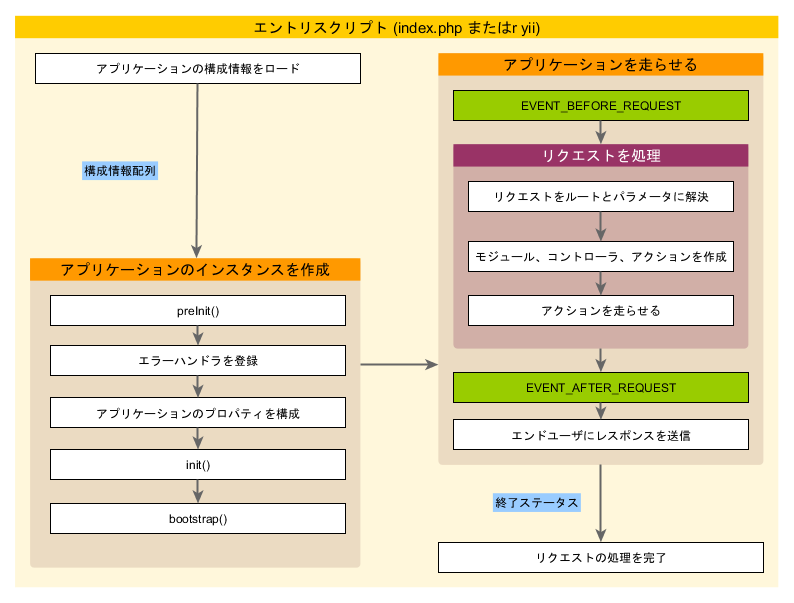

アプリケーション
================

アプリケーションは Yii アプリケーションシステム全体の構造とライフサイクルを統制するオブジェクトです。
全ての Yii アプリケーションシステムは、それぞれ、単一のアプリケーションオブジェクトを持ちます。
アプリケーションオブジェクトは、[エントリスクリプト](structure-entry-scripts.md) において作成され、`\Yii::$app` という式でグローバルにアクセスすることが出来るオブジェクトです。

> Info|情報: ガイドの中で「アプリケーション」という言葉は、文脈に応じて、アプリケーションオブジェクトを意味したり、アプリケーションシステムを意味したりします。

二種類のアプリケーション、すなわち、[[yii\web\Application|ウェブアプリケーション]] と [[yii\console\Application|コンソールアプリケーション]] があります。
名前が示すように、前者は主にウェブのリクエストを処理し、後者はコンソールコマンドのリクエストを処理します。


## アプリケーションの構成情報 <span id="application-configurations"></span>

[エントリスクリプト](structure-entry-scripts.md) は、アプリケーションを作成するときに、下記のように、[構成情報](concept-configurations.md) を読み込んで、それをアプリケーションに適用します。

```php
require(__DIR__ . '/../vendor/autoload.php');
require(__DIR__ . '/../vendor/yiisoft/yii2/Yii.php');

// アプリケーションの構成情報を読み込む
$config = require(__DIR__ . '/../config/web.php');

// アプリケーションのインスタンスを作成し、構成情報を適用する
(new yii\web\Application($config))->run();
```

通常の [構成情報](concept-configurations.md) と同じように、アプリケーションの構成情報は、アプリケーションオブジェクトのプロパティをどのように初期化するかを指定するものです。
アプリケーションの構成情報は、たいていは非常に複雑なものですから、通常は、上記の例の `web.php` ファイルのように、[構成情報ファイル](concept-configurations.md#configuration-files) に保管されます。


## アプリケーションのプロパティ <span id="application-properties"></span>

アプリケーションの構成情報で構成すべき重要なアプリケーションのプロパティは数多くあります。
それらのプロパティの典型的なものは、アプリケーションが走る環境を記述するものです。
例えば、アプリケーションは、どのようにして [コントローラ](structure-controllers.md) をロードするか、また、どこにテンポラリファイルを保存するかなどを知らなければなりません。
以下において、それらのプロパティを要約します。


### 必須のプロパティ <span id="required-properties"></span>

どのアプリケーションでも、最低二つのプロパティは構成しなければなりません。
すなわち、[[yii\base\Application::id|id]] と [[yii\base\Application::basePath|basePath]] です。


#### [[yii\base\Application::id|id]] <span id="id"></span>

[[yii\base\Application::id|id]] プロパティは、アプリケーションを他のアプリケーションから区別するユニークな ID を指定するものです。
このプロパティは主としてプログラム内部で使われます。
必須ではありませんが、最良の相互運用性を確保するために、アプリケーション ID を指定するときには英数字だけを使うことが推奨されます。


#### [[yii\base\Application::basePath|basePath]] <span id="basePath"></span>

[[yii\base\Application::basePath|basePath]] プロパティは、アプリケーションのルートディレクトリを指定するものです。
これは、アプリケーションシステムの全ての保護されたソースコードを収容するディレクトリです。
通常、このディレクトリの下に、MVC パターンに対応するソースコードを収容した `models`、`views`、`controllers` などのサブディレクトリがあります。

[[yii\base\Application::basePath|basePath]] プロパティの構成には、ディレクトリパスを使っても、[パスエイリアス](concept-aliases.md) を使っても構いません。
どちらの形式においても、対応するディレクトリが存在しなければなりません。
さもなくば、例外が投げられます。
パスは `realpath()` 関数を呼び出して正規化されます。

[[yii\base\Application::basePath|basePath]] プロパティは、しばしば、他の重要なパス (例えば、runtime のパス) を派生させるために使われます。
このため、`basePath` を示す `@app` というパスエイリアスが、あらかじめ定義されています。
その結果、派生的なパスはこのエイリアスを使って形成することが出来ます
(例えば、runtime ディレクトリを示す `@app/runtime` など)。


### 重要なプロパティ<span id="important-properties"></span>

この項で説明するプロパティは、アプリケーションごとに異なってくるものであるため、たいてい、構成する必要が生じます。


#### [[yii\base\Application::aliases|aliases]] <span id="aliases"></span>

このプロパティを使って、配列形式で一連の [エイリアス](concept-aliases.md) を定義することが出来ます。
配列のキーがエイリアスの名前であり、配列の値が対応するパスの定義です。
例えば、

```php
[
    'aliases' => [
        '@name1' => 'path/to/path1',
        '@name2' => 'path/to/path2',
    ],
]
```

このプロパティが提供されているのは、[[Yii::setAlias()]] メソッドを呼び出す代りに、アプリケーションの構成情報を使ってエイリアスを定義することが出来るようにするためです。


#### [[yii\base\Application::bootstrap|bootstrap]] <span id="bootstrap"></span>

これは非常に有用なプロパティです。
これによって、アプリケーションの [[yii\base\Application::bootstrap()|ブートストラップの過程]] において走らせるべきコンポーネントを配列として指定することが出来ます。
例えば、ある [モジュール](structure-modules.md) に [URL 規則](runtime-routing.md) をカスタマイズさせたいときに、モジュールの ID をこのプロパティの要素として挙げることが出来ます。

このプロパティにリストする各コンポーネントは、以下の形式のいずれかによって指定することが出来ます。

- [components](#components) によって指定されているアプリケーションコンポーネントの ID
- [modules](#modules) によって指定されているモジュールの ID
- クラス名
- 構成情報の配列
- コンポーネントを作成して返す無名関数

例えば、

```php
[
    'bootstrap' => [
        // アプリケーションコンポーネント ID、または、モジュール ID
        'demo',

        // クラス名
        'app\components\Profiler',

        // 構成情報の配列
        [
            'class' => 'app\components\Profiler',
            'level' => 3,
        ],

        // 無名関数
        function () {
            return new app\components\Profiler();
        }
    ],
]
```

> Info|情報: モジュール ID と同じ ID のアプリケーションコンポーネントがある場合は、ブートストラップの過程ではアプリケーションコンポーネントが使われます。
  代りにモジュールを使いたいときは、次のように、無名関数を使って指定することが出来ます。
> ```php
[
    function () {
        return Yii::$app->getModule('user');
    },
]
```

ブートストラップの過程で、各コンポーネントのインスタンスが作成されます。
そして、コンポーネントクラスが [[yii\base\BootstrapInterface]] を実装している場合は、その [[yii\base\BootstrapInterface::bootstrap()|bootstrap()]] メソッドも呼び出されます。

もう一つの実用的な例が [ベーシックプロジェクトテンプレート](start-installation.md) のアプリケーションの構成情報の中にあります。
そこでは、アプリケーションが開発環境で走るときには `debug` モジュールと `gii` モジュールがブートストラップコンポーネントとして構成されています。

```php
if (YII_ENV_DEV) {
    // 'dev' 環境のための構成情報の修正
    $config['bootstrap'][] = 'debug';
    $config['modules']['debug'] = 'yii\debug\Module';

    $config['bootstrap'][] = 'gii';
    $config['modules']['gii'] = 'yii\gii\Module';
}
```

> Note|注意: あまり多くのコンポーネントを `bootstrap` に置くと、アプリケーションのパフォーマンスを劣化させます。
  なぜなら、リクエストごとに同じ一連のコンポーネントを走らせなければならないからです。
  ですから、ブートストラップコンポーネントは賢く使ってください。


#### [[yii\web\Application::catchAll|catchAll]] <span id="catchAll"></span>

このプロパティは [[yii\web\Application|ウェブアプリケーション]] においてのみサポートされます。
これは、全てのユーザリクエストを処理すべき [コントローラアクション](structure-controllers.md) を指定するものです。
これは主としてアプリケーションがメンテナンスモードにあって、入ってくる全てのリクエストを単一のアクションで処理する必要があるときに使われます。

構成情報は配列の形を取り、最初の要素はアクションのルートを指定します。
そして、配列の残りの要素 (キー・値のペア) は、アクションに渡されるパラメータを指定します。
例えば、

```php
[
    'catchAll' => [
        'offline/notice',
        'param1' => 'value1',
        'param2' => 'value2',
    ],
]
```


#### [[yii\base\Application::components|components]] <span id="components"></span>

これこそが、唯一の最も重要なプロパティです。
これによって、[アプリケーションコンポーネント](structure-application-components.md) と呼ばれる一連の名前付きのコンポーネントを登録して、それらを他の場所で使うことが出来るようになります。
例えば、

```php
[
    'components' => [
        'cache' => [
            'class' => 'yii\caching\FileCache',
        ],
        'user' => [
            'identityClass' => 'app\models\User',
            'enableAutoLogin' => true,
        ],
    ],
]
```

全てのアプリケーションコンポーネントは、それぞれ、配列の中で「キー・値」のペアとして指定されます。
キーはコンポーネントの ID を示し、値はコンポーネントのクラス名または [構成情報](concept-configurations.md) を示します。

どのようなコンポーネントでもアプリケーションに登録することが出来ます。
そして登録されたコンポーネントは、後で、`\Yii::$app->componentID` という式を使ってグローバルにアクセスすることが出来ます。

詳細は [アプリケーションコンポーネント](structure-application-components.md) の節を読んでください。


#### [[yii\base\Application::controllerMap|controllerMap]] <span id="controllerMap"></span>

このプロパティは、コントローラ ID を任意のコントローラクラスに割り付けることを可能にするものです。
デフォルトでは、Yii は [規約](#controllerNamespace) に基づいてコントローラ ID をコントローラクラスに割り付けます
(例えば、`post` という ID は `app\controllers\PostController` に割り付けられます)。
このプロパティを構成することによって、特定のコントローラに対する規約を破ることが出来ます。
下記の例では、`account` は `app\controllers\UserController` に割り付けられ、`article` は `app\controllers\PostController` に割り付けられることになります。

```php
[
    'controllerMap' => [
        [
            'account' => 'app\controllers\UserController',
            'article' => [
                'class' => 'app\controllers\PostController',
                'enableCsrfValidation' => false,
            ],
        ],
    ],
]
```

このプロパティの配列のキーはコントローラ ID を表し、配列の値は対応するコントローラクラスの名前または [構成情報](concept-configurations.md) を表します。


#### [[yii\base\Application::controllerNamespace|controllerNamespace]] <span id="controllerNamespace"></span>

このプロパティは、コントローラクラスが配置されるべきデフォルトの名前空間を指定するものです。
デフォルト値は `app\controllers` です。
コントローラ ID が `post` である場合、規約によって対応するコントローラの (名前空間を略した) クラス名は `PostController` となり、完全修飾クラス名は `app\controllers\PostController` となります。

コントローラクラスは、この名前空間に対応するディレクトリのサブディレクトリに配置されても構いません。
例えば、コントローラ ID として `admin/post` を仮定すると、対応するコントローラの完全修飾クラス名は `app\controllers\admin\PostController` となります。

重要なことは、完全修飾されたコントローラクラスが [オートロード可能](concept-autoloading.md) でなければならず、コントローラクラスの実際の名前空間がこのプロパティと合致していなければならない、ということです。
そうでないと、アプリケーションにアクセスしたときに "ページがみつかりません" というエラーを受け取ることになります。

上で説明された規約を破りたい場合は、[controllerMap](#controllerMap) プロパティを構成することが出来ます。


#### [[yii\base\Application::language|language]] <span id="language"></span>

このプロパティは、アプリケーションがコンテントをエンドユーザに表示するときに使うべき言語を指定するものです。
このプロパティのデフォルト値は `en` であり、英語を意味します。
アプリケーションが多言語をサポートする必要があるときは、このプロパティを構成しなければなりません。

このプロパティの値が、メッセージの翻訳、日付の書式、数字の書式などを含む [国際化](tutorial-i18n.md) のさまざまな側面を決定します。
例えば、[[yii\jui\DatePicker]] ウィジェットは、どの言語でカレンダーを表示すべきか、そして日付をどのように書式設定すべきかを、デフォルトでは、このプロパティを使用して決定します。

言語を指定するのには、[IETF 言語タグ](http://ja.wikipedia.org/wiki/IETF%E8%A8%80%E8%AA%9E%E3%82%BF%E3%82%B0) に従うことが推奨されます。
例えば、`en` は英語を意味し、`en-US` はアメリカ合衆国の英語を意味します。

このプロパティに関する詳細は [国際化](tutorial-i18n.md) の節で読むことが出来ます。


#### [[yii\base\Application::modules|modules]] <span id="modules"></span>

このプロパティはアプリケーションが含む [モジュール](structure-modules.md) を指定するものです。

このプロパティは、モジュールの ID をキーとする、モジュールのクラスまたは [構成情報](concept-configurations.md) の配列です。
例えば、

```php
[
    'modules' => [
        // モジュールクラスで指定された "booking" モジュール
        'booking' => 'app\modules\booking\BookingModule',

        // 構成情報の配列で指定された "comment" モジュール
        'comment' => [
            'class' => 'app\modules\comment\CommentModule',
            'db' => 'db',
        ],
    ],
]
```

詳細は [モジュール](structure-modules.md) の節を参照してください。


#### [[yii\base\Application::name|name]] <span id="name"></span>

このプロパティは、エンドユーザに対して表示されるアプリケーション名を指定するものです。
[[yii\base\Application::id|id]] プロパティがユニークな値を取らなければならないのとは違って、このプロパティの値は主として表示目的であり、ユニークである必要はありません。

コードのどこにも使わないのであれば、このプロパティは必ずしも構成する必要はありません。


#### [[yii\base\Application::params|params]] <span id="params"></span>

このプロパティは、グローバルにアクセス可能なアプリケーションパラメータの配列を指定するものです。
コードの中のいたる処でハードコードされた数値や文字列を使う代りに、それらをアプリケーションパラメータとして一ヶ所で定義し、必要な場所ではそのパラメータを使うというのが良いプラクティスです。
例えば、次のように、サムネール画像のサイズをパラメータとして定義することが出来ます。

```php
[
    'params' => [
        'thumbnail.size' => [128, 128],
    ],
]
```

そして、このサイズの値を使う必要があるコードにおいては、下記のようなコードを使うだけで済ませることが出来ます。

```php
$size = \Yii::$app->params['thumbnail.size'];
$width = \Yii::$app->params['thumbnail.size'][0];
```

後でサムネールのサイズを変更すると決めたときは、アプリケーションの構成情報においてのみサイズを修正すればよく、これに依存するコードには少しも触れる必要がありません。


#### [[yii\base\Application::sourceLanguage|sourceLanguage]] <span id="sourceLanguage"></span>

このプロパティはアプリケーションコードが書かれている言語を指定するものです。
デフォルト値は `'en-US'`、アメリカ合衆国の英語です。
あなたのコードのテキストのコンテントが英語以外で書かれているときは、このプロパティを構成しなければなりません。

[language](#language) プロパティと同様に、このプロパティは [IETF 言語タグ](http://ja.wikipedia.org/wiki/IETF%E8%A8%80%E8%AA%9E%E3%82%BF%E3%82%B0) に従って構成しなければなりません。
例えば、`en` は英語を意味し、`en-US` はアメリカ合衆国の英語を意味します。

このプロパティに関する詳細は [国際化](tutorial-i18n.md) の節で読むことが出来ます。


#### [[yii\base\Application::timeZone|timeZone]] <span id="timeZone"></span>

このプロパティは、PHP ランタイムのデフォルトタイムゾーンを設定する代替手段として提供されています。
このプロパティを構成することによって、本質的には PHP 関数 [date_default_timezone_set()](http://php.net/manual/ja/function.date-default-timezone-set.php) を呼び出すことになります。
例えば、

```php
[
    'timeZone' => 'Asia/Tokyo',
]
```


#### [[yii\base\Application::version|version]] <span id="version"></span>

このプロパティはアプリケーションのバージョンを指定するものです。デフォルト値は `'1.0'` です。
コードの中で全く使わないのであれば、必ずしも構成する必要はありません。


### 有用なプロパティ <span id="useful-properties"></span>

この項で説明されるプロパティは通常は構成されません。というのは、そのデフォルト値が通常の規約を指定しているからです。
しかしながら、規約を破る必要がある場合には、これらのプロパティを構成することが出来ます。


#### [[yii\base\Application::charset|charset]] <span id="charset"></span>

このプロパティはアプリケーションが使う文字セットを指定するものです。
デフォルト値は `'UTF-8'` であり、あなたのアプリケーションが多数の非ユニコードデータを使うレガシーシステムと連携するのでなければ、たいていのアプリケーションでは、そのままにしておくべきです。


#### [[yii\base\Application::defaultRoute|defaultRoute]] <span id="defaultRoute"></span>

このプロパティは、リクエストがルートを指定していないときにアプリケーションが使用すべき [ルート](runtime-routing.md) を指定するものです。
ルートは、チャイルドモジュール ID、コントローラ ID、および/または アクション ID を構成要素とすることが出来ます。
例えば、`help`、`post/create`、`admin/post/create` などです。
アクション ID が与えられていない場合は、[[yii\base\Controller::defaultAction]] で指定されるデフォルト値を取ります。

[[yii\web\Application|ウェブアプリケーション]] では、このプロパティのデフォルト値は `'site'` であり、その意味するところは、`SiteController` コントローラとそのデフォルトアクションが使用されるべきである、ということです。
結果として、ルートを指定せずにアプリケーションにアクセスすると、`app\controllers\SiteController::actionIndex()` の結果が表示されます。

[[yii\console\Application|コンソールアプリケーション]] では、デフォルト値は `'help'` であり、コアコマンドの [[yii\console\controllers\HelpController::actionIndex()]] が使用されるべきであるという意味です。
結果として、何も引数を与えずに `yii` というコマンドを実行すると、ヘルプ情報が表示されることになります。


#### [[yii\base\Application::extensions|extensions]] <span id="extensions"></span>

このプロパティは、アプリケーションにインストールされて使われている [エクステンション](structure-extensions.md) のリストを指定するものです。
デフォルトでは、`@vendor/yiisoft/extensions.php` というファイルによって返される配列を取ります。
`extensions.php` は、[Composer](https://getcomposer.org) を使ってエクステンションをインストールすると、自動的に生成され保守されます。
ですから、たいていの場合、このプロパティをあなたが構成する必要はありません。

エクステンションを手作業で保守したいという特殊なケースにおいては、次のようにしてこのプロパティを構成することが出来ます。

```php
[
    'extensions' => [
        [
            'name' => 'extension name',
            'version' => 'version number',
            'bootstrap' => 'BootstrapClassName',  // オプション、構成情報の配列でもよい
            'alias' => [  // optional
                '@alias1' => 'to/path1',
                '@alias2' => 'to/path2',
            ],
        ],

        // ... 上記と同じように、更にエクステンションを構成 ...

    ],
]
```

ご覧のように、このプロパティはエクステンションの仕様を示す配列を取ります。
それぞれのエクステンションは、`name` と `version` の要素を含む配列によって指定されます。
エクステンションが [ブートストラップ](runtime-bootstrapping.md) の過程で走る必要がある場合には、`bootstrap` 要素をブートストラップのクラス名または [構成情報](concept-configurations.md) の配列によって指定することが出来ます。
また、エクステンションはいくつかの [エイリアス](concept-aliases.md) を定義することも出来ます。


#### [[yii\base\Application::layout|layout]] <span id="layout"></span>

このプロパティは、[ビュー](structure-views.md) をレンダリングするときに使われるべきデフォルトのレイアウトを指定するものです。
デフォルト値は `'main'` であり、[レイアウトパス](#layoutPath) の下にある `main.php` というファイルが使われるべきことを意味します。
[レイアウトパス](#layoutPath) と [ビューパス](#viewPath) の両方がデフォルト値を取る場合、デフォルトのレイアウトファイルは `@app/views/layouts/main.php` というパスエイリアスとして表すことが出来ます。

滅多には無いことですが、レイアウトをデフォルトで無効にしたい場合は、このプロパティを `false` として構成することが出来ます。


#### [[yii\base\Application::layoutPath|layoutPath]] <span id="layoutPath"></span>

このプロパティは、レイアウトファイルが捜されるべきパスを指定するものです。
デフォルト値は、[ビューパス](#viewPath) の下の `layouts` サブディレクトリです。
[ビューパス](#viewPath) がデフォルト値を取る場合、デフォルトのレイアウトパスは `@app/views/layouts` というパスエイリアスとして表すことが出来ます。

このプロパティはディレクトリまたはパス [エイリアス](concept-aliases.md) として構成することが出来ます。


#### [[yii\base\Application::runtimePath|runtimePath]] <span id="runtimePath"></span>

このプロパティは、ログファイルやキャッシュファイルなどの一時的ファイルを生成することが出来るパスを指定するものです。
デフォルト値は、`@app/runtime` というエイリアスで表現されるディレクトリです。

このプロパティはディレクトリまたはパス [エイリアス](concept-aliases.md) として構成することが出来ます。
ランタイムパスは、アプリケーションを実行するプロセスによって書き込みが可能なものでなければならないことに注意してください。
そして、この下にある一時的ファイルは秘匿を要する情報を含みうるものですので、ランタイムパスはエンドユーザによるアクセスから保護されなければなりません。

このパスに簡単にアクセスできるように、Yii は `@runtime` というパスエイリアスを事前に定義しています。


#### [[yii\base\Application::viewPath|viewPath]] <span id="viewPath"></span>

このプロパティはビューファイルが配置されるルートディレクトリを指定するものです。
デフォルト値は、`@app/views` というエイリアスで表現されるディレクトリです。
このプロパティはディレクトリまたはパス [エイリアス](concept-aliases.md) として構成することが出来ます。


#### [[yii\base\Application::vendorPath|vendorPath]] <span id="vendorPath"></span>

このプロパティは、[Composer](https://getcomposer.org) によって管理される vendor ディレクトリを指定するものです。
Yii フレームワークを含めて、あなたのアプリケーションによって使われる全てのサードパーティライブラリを格納するディレクトリです。
デフォルト値は、`@app/vendor` というエイリアスで表現されるディレクトリです。

このプロパティはディレクトリまたはパス [エイリアス](concept-aliases.md) として構成することが出来ます。
このプロパティを修正するときは、必ず、Composer の構成もそれに合せて修正してください。

このパスに簡単にアクセスできるように、Yii は `@vendor` というパスエイリアスを事前に定義しています。


#### [[yii\console\Application::enableCoreCommands|enableCoreCommands]] <span id="enableCoreCommands"></span>

このプロパティは [[yii\console\Application|コンソールアプリケーション]] においてのみサポートされています。
Yii リリースに含まれているコアコマンドを有効にすべきか否かを指定するものです。デフォルト値は `true` です。


## アプリケーションのイベント <span id="application-events"></span>

アプリケーションはリクエストを処理するライフサイクルの中でいくつかのイベントをトリガします。
これらのイベントに対して、下記のようにして、アプリケーションの構成情報の中でイベントハンドラをアタッチすることが出来ます。

```php
[
    'on beforeRequest' => function ($event) {
        // ...
    },
]
```

`on eventName` という構文の使い方については、[構成情報](concept-configurations.md#configuration-format) の節で説明されています。

別の方法として、アプリケーションのインスタンスが生成された後、[ブートストラップの過程](runtime-bootstrapping.md) の中でイベントハンドラをアタッチすることも出来ます。
例えば、

```php
\Yii::$app->on(\yii\base\Application::EVENT_BEFORE_REQUEST, function ($event) {
    // ...
});
```

### [[yii\base\Application::EVENT_BEFORE_REQUEST|EVENT_BEFORE_REQUEST]] <span id="beforeRequest"></span>

このイベントは、アプリケーションがリクエストを処理する *前* にトリガされます。
実際のイベント名は `beforeRequest` です。

このイベントがトリガされるときには、アプリケーションのインスタンスは既に構成されて初期化されています。
ですから、イベントメカニズムを使って、リクエスト処理のプロセスに干渉するカスタムコードを挿入するのには、ちょうど良い場所です。
例えば、このイベントハンドラの中で、何らかのパラメータに基づいて [[yii\base\Application::language]] プロパティを動的にセットすることが出来ます。


### [[yii\base\Application::EVENT_AFTER_REQUEST|EVENT_AFTER_REQUEST]] <span id="afterRequest"></span>

このイベントは、アプリケーションがリクエストの処理を完了した *後*、レスポンスを送信する *前* にトリガされます。
実際のイベント名は `afterRequest` です。

このイベントがトリガされるときにはリクエストの処理は完了していますので、この機をとらえて、リクエストに対する何らかの後処理をしたり、レスポンスをカスタマイズしたりすることが出来ます。

[[yii\web\Response|response]] コンポーネントも、エンドユーザにレスポンスのコンテントを送出する間にいくつかのイベントをトリガすることに注意してください。
それらのイベントは、このイベントの *後* にトリガされます。


### [[yii\base\Application::EVENT_BEFORE_ACTION|EVENT_BEFORE_ACTION]] <span id="beforeAction"></span>

このイベントは、[コントローラアクション](structure-controllers.md) を実行する *前* に毎回トリガされます。
実際のイベント名は `beforeAction` です。

イベントのパラメータは [[yii\base\ActionEvent]] のインスタンスです。
イベントハンドラは、[[yii\base\ActionEvent::isValid]] プロパティを `false` にセットして、アクションの実行を中止することが出来ます。
例えば、

```php
[
    'on beforeAction' => function ($event) {
        if (何らかの条件) {
            $event->isValid = false;
        } else {
        }
    },
]
```

同じ `beforeAction` イベントが、[モジュール](structure-modules.md) と [コントローラ](structure-controllers.md) からもトリガされることに注意してください。
アプリケーションオブジェクトが最初にこのイベントをトリガし、次に (もし有れば) モジュールが、そして最後にコントローラがこのイベントをトリガします。
イベントハンドラが [[yii\base\ActionEvent::isValid]] を `false` にセットすると、後続のイベントはトリガされません。


### [[yii\base\Application::EVENT_AFTER_ACTION|EVENT_AFTER_ACTION]] <span id="afterAction"></span>

このイベントは、[コントローラアクション](structure-controllers.md) を実行した *後* に毎回トリガされます。
実際のイベント名は `afterAction` です。

イベントのパラメータは [[yii\base\ActionEvent]] のインスタンスです。
[[yii\base\ActionEvent::result]] プロパティを通じて、イベントハンドラはアクションの結果にアクセスしたり、またはアクションの結果を修正したり出来ます。
例えば、

```php
[
    'on afterAction' => function ($event) {
        if (何らかの条件) {
            // $event->result を修正する
        } else {
        }
    },
]
```

同じ `afterAction` イベントが、[モジュール](structure-modules.md) と [コントローラ](structure-controllers.md) からもトリガされることに注意してください。
これらのオブジェクトは、`beforeAction` の場合とは逆の順でイベントをトリガします。
すなわち、コントローラオブジェクトが最初にこのイベントをトリガし、次に (もし有れば) モジュールが、そして最後にアプリケーションがこのイベントをトリガします。


## アプリケーションのライフサイクル<span id="application-lifecycle"></span>



[エントリスクリプト](structure-entry-scripts.md) が実行されて、リクエストが処理されるとき、アプリケーションは次のようなライフサイクルを経ます。

1. エントリスクリプトがアプリケーションの構成情報を配列として読み出す。
2. エントリスクリプトがアプリケーションの新しいインスタンスを作成する。
  * [[yii\base\Application::preInit()|preInit()]] が呼び出されて、[[yii\base\Application::basePath|basePath]] のような、優先度の高いアプリケーションプロパティを構成する。
  * [[yii\base\Application::errorHandler|エラーハンドラ]] を登録する。
  * アプリケーションのプロパティを構成する。
  * [[yii\base\Application::init()|init()]] が呼ばれ、そこから更に、ブートストラップコンポーネントを走らせるために、[[yii\base\Application::bootstrap()|bootstrap()]] が呼ばれる。
3. エントリスクリプトが [[yii\base\Application::run()]] を呼んで、アプリケーションを走らせる。
  * [[yii\base\Application::EVENT_BEFORE_REQUEST|EVENT_BEFORE_REQUEST]] イベントをトリガする。
  * リクエストを処理する: リクエストを [ルート](runtime-routing.md) とそれに結び付くパラメータとして解決する。
    ルートによって指定されたモジュール、コントローラ、および、アクションを作成する。
    そしてアクションを実行する。
  * [[yii\base\Application::EVENT_AFTER_REQUEST|EVENT_AFTER_REQUEST]] イベントをトリガする。
  * エンドユーザにレスポンスを送信する。
4. エントリスクリプトがアプリケーションから終了ステータスを受け取り、リクエストの処理を完了する。
