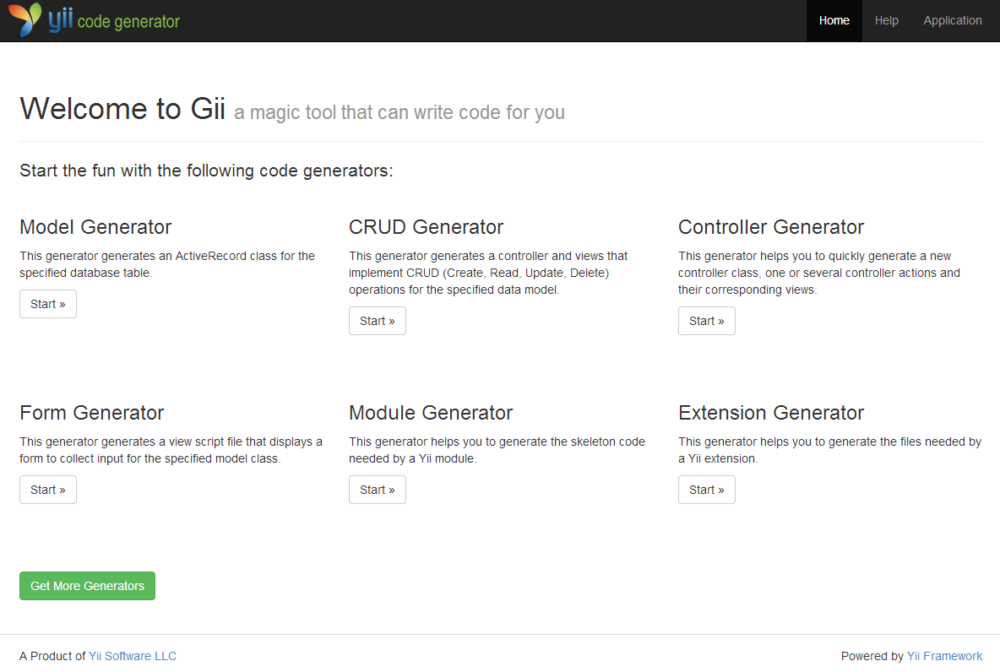
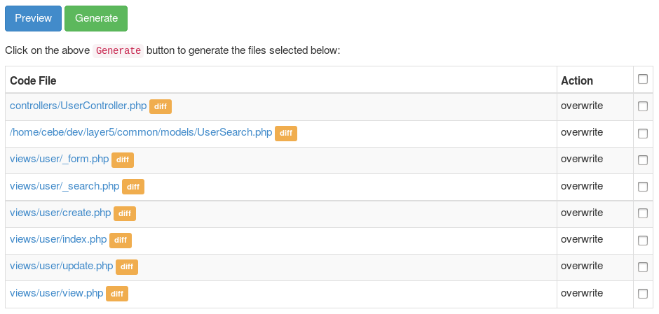

Gii コード生成ツール
====================

> Note|注意: この節はまだ執筆中です。

Yii は、Gii という名前の便利なツールを持っています。
Gii は、よく使用されるコード断片だけでなく、完全な CRUD コントローラを生成することによって、迅速なプロトタイピングの機能を提供するツールです。

Gii はウェブベースのインタフェイスを提供しており、あなたの望みのコードを対話的に生成することが出来ます。
Gii は、また、ほとんどの時間はコンソールウィンドウで仕事をすることを好む人たちのために、コマンドラインのインタフェイスも提供しています。


インストールと構成
------------------

Gii は Yii の公式エクステンションです。
このエクステンションをインストールする望ましい方法は、[composer](http://getcomposer.org/download/) を使うことです。

このコマンドを走らせてください。

```
composer require "yiisoft/yii2-gii:*"
```

または、次のコードをあなたの `composer.json` ファイルの `require` セクションに追加してください。

```
"yiisoft/yii2-gii": "*"
```

Gii エクステンションがインストールされたら、アプリケーションの構成情報ファイルに以下の行を追加して、Gii を有効にします。

```php
return [
    'bootstrap' => ['gii'],
    'modules' => [
        'gii' => 'yii\gii\Module',
        // ...
    ],
    // ...
];
```

そうすると、次の URL で Gii にアクセスすることが出来ます。

```
http://localhost/path/to/index.php?r=gii
```

綺麗な URL を有効にしている場合は、次の URL を使います。

```
http://localhost/path/to/index.php/gii
```

> Note|注意: ローカルホスト以外の IP から Gii にアクセスしようとすると、デフォルトでは、アクセスが拒否されます。
> このデフォルトを回避するためには、許可される IP アドレスを構成情報に追加してください。
>
```php
'gii' => [
    'class' => 'yii\gii\Module',
    'allowedIPs' => ['127.0.0.1', '::1', '192.168.0.*', '192.168.178.20'] // 必要に応じて修正
],
```

コンソールアプリケーションの構成情報において同じように Gii を構成すると、次のようにして、コマンドウィンドウから Gii にアクセスすることが出来ます。

```
# パスをアプリケーションのベースパスに変更
cd path/to/AppBasePath

# Gii に関するヘルプ情報を表示
yii help gii

# Gii のモデルジェネレータに関するヘルプ情報を表示
yii help gii/model

# city テーブルから City モデルを生成
yii gii/model --tableName=city --modelClass=City
```


### ベーシックアプリケーション

ベーシックアプリケーションテンプレートの構成情報の構造は少し違っており、Gii は `config/web.php` の中で構成しなければなりません。

```php
// ...
if (YII_ENV_DEV) {
    // configuration adjustments for 'dev' environment
    $config['bootstrap'][] = 'debug';
    $config['modules']['debug'] = 'yii\debug\Module';

    $config['bootstrap'][] = 'gii';
    $config['modules']['gii'] = 'yii\gii\Module'; // <--- ここ
}
```

従って、IP アドレスを調整するためには、次のようにする必要があります。

```php
if (YII_ENV_DEV) {
    // configuration adjustments for 'dev' environment
    $config['bootstrap'][] = 'debug';
    $config['modules']['debug'] = 'yii\debug\Module';

    $config['bootstrap'][] = 'gii';
    $config['modules']['gii'] = [
        'class' => 'yii\gii\Module',
        'allowedIPs' => ['127.0.0.1', '::1', '192.168.0.*', '192.168.178.20'],
    ];
}
```

どのように使うか
----------------

Gii にアクセスすると、最初に、ジェネレータを選択できるエントリページが開かれます。



デフォルトでは、以下のジェネレータを利用できます。

- **モデルジェネレータ** - このジェネレータは、指定したデータベーステーブルの ActiveRecord クラスを生成します。
- **CRUD ジェネレータ** - このジェネレータは、指定されたデータモデルの CRUD 操作 (作成・読み出し・更新･削除) を実装するコントローラとビューを生成します。
- **コントローラジェネレータ** - このジェネレータは、新しいコントローラのクラスと、一つまたはいくつかのコントローラアクションおよびそれに対応するビューを迅速に生成するのを手助けしてくれます。
- **フォームジェネレータ** - このジェネレータは、指定されたモデルクラスのための、入力を収集するフォームを表示するビュースクリプトを生成します。
- **モジュールジェネレータ** - このジェネレータは、Yii のモジュールが必要とするコードのスケルトンを生成するのを手助けしてくれます。
- **エクステンションジェネレータ** - このジェネレータは、Yii のエクステンションが必要とするファイルの生成を手助けしてくれます。

"Start" ボタンをクリックしてジェネレータを選択すると、ジェネレータのパラメータを構成するためのフォームが表示されます。
あなたの要求を満たすようにフォームに入力して "Preview" ボタンをクリックすると、Gii が生成しようとしているコードのプレビューが出来ます。
選択したジェネレータや、既存のファイルの有無によって多少異なりますが、次の画像で見るのと同じような出力が得られます。



ファイル名をクリックすると、そのファイルのために生成されるコードのプレビューを見ることが出来ます。
ファイルが既に存在する場合は、既存のコードと生成されるコードのどこが異なるかを示す差分ビューも提供されます。
その場合は、どのファイルを上書きし、どのファイルを上書きしないかを選択することも出来ます。

> Tip|ヒント: データベースに変更を加えた後で、モデルジェネレータを使ってモデルを更新したい場合は、Gii のプレビューからコードをコピーして、あなたのコードに変更をマージすることが出来ます。
PHPStorm の [クリップボードと比較](http://www.jetbrains.com/phpstorm/webhelp/comparing-files.html) のような IDE の機能を使うと良いでしょう。
[Aptana Studio](http://www.aptana.com/products/studio3/download) や [Eclipse](http://www.eclipse.org/pdt/) ベースのエディタも [AnyEdit tools plugin](http://andrei.gmxhome.de/anyedit/) を使って [クリップボードと比較](http://andrei.gmxhome.de/anyedit/examples.html) をすることが出来ます。
この機能を使うと、関係のある変更だけを取り込んで、あなた自身のコードを取り消すような他の変更は放っておくことが出来ます。

コードをレビューして、生成すべきファイルを選択し、"Generate" ボタンをクリックするとファイルが生成されます。
すべてうまく行けば、これで終りです。
Gii がファイルを生成できないというエラーが出た場合は、ウェブサーバがファイルを作成してディレクトリに書き込むことが出来るように、ディレクトリのアクセス権限を修正しなければなりません。

> Note|注意: Gii によって生成されるコードは、あなたの要求に従って修正すべきテンプレートに過ぎません。
  Gii は新しいものを素早く作成する手助けをするために存在するものですが、そのまま使用できるコードを作成するようなものではありません。
  Gii によって生成されたモデルを変更せずに、ちょっとした所だけを修正して使っている人をよく見かけます。
  これは、意図されている Gii の使い方ではありません。
  Gii によって生成されるコードは不完全であったり、間違っていたりする可能性があるもので、あなたの要求を満たすように変更して初めて使用できるようになるものです。


あなた自身のテンプレートを作成する
----------------------------------

すべてのジェネレータのフォームには `Code Template` というフィールドがあり、コード生成に使用するテンプレートを選択できるようになっています。
デフォルトでは、Gii は `default` という一つのテンプレートだけを提供しますが、あなたの要求を満たすように修正されたあなた自身のテンプレートを作成することも出来ます。

フォルダ `@app\vendor\yiisoft\yii2-gii\generators` を開くと、ジェネレータのフォルダが 6 つあるのに気づくでしょう。

```
+ controller
- crud
    + default
+ extension
+ form
+ model
+ module
```

これらはジェネレータの名前です。
どれでもフォルダを開くと、その中に `default` というフォルダがあります。
これがテンプレートの名前です。

フォルダ `@app\vendor\yiisoft\yii2-gii\generators\crud\default` を他の場所、例えば、`@app\myTemplates\crud\` にコピーします。
このフォルダを開いて、どれでもテンプレートをあなたの要求に合うように修正します。
例えば、`views\_form.php` に `errorSummary` を追加しましょう。

```php
<?php
//...
<div class="<?= Inflector::camel2id(StringHelper::basename($generator->modelClass)) ?>-form">

    <?= "<?php " ?>$form = ActiveForm::begin(); ?>
    <?= "<?=" ?> $form->errorSummary($model) ?> <!-- これを追加 -->
    <?php foreach ($safeAttributes as $attribute) {
        echo "    <?= " . $generator->generateActiveField($attribute) . " ?>\n\n";
    } ?>
//...
```

次に、Gii に私たちのテンプレートについて教える必要があります。
その設定は構成情報ファイルの中で行います。

```php
// config/web.php for basic app
// ...
if (YII_ENV_DEV) {    
    $config['modules']['gii'] = [
        'class' => 'yii\gii\Module',      
        'allowedIPs' => ['127.0.0.1', '::1', '192.168.0.*', '192.168.178.20'],  
        'generators' => [ // ここ
            'crud' => [ // ジェネレータの名前
                'class' => 'yii\gii\generators\crud\Generator', // ジェネレータクラス
                'templates' => [ //setting for out templates
                    'myCrud' => '@app/myTemplates/crud/default', // テンプレート名 => テンプレートへのパス
                ]
            ]
        ],
    ];
}
```

CRUD ジェネレータを開くと、フォームの `Code Template` のフィールドに、あなた自身のテンプレートが出現するようになっています。

あなた自身のジェネレータを作成する
----------------------------------

どれでもジェネレータのフォルダを開くと、`form.php` と `Generator.php` の二つのファイルがあります。
一つはフォームで、二番目のものがジェネレータクラスです。
あなた自身のジェネレータを作成するためには、このクラスをどこかのフォルダで作成またはオーバーライドする必要があります。
ここでも、前の項でしたのと同じように、構成情報をカスタマイズします。

```php
//config/web.php for basic app
//..
if (YII_ENV_DEV) {    
    $config['modules']['gii'] = [
        'class' => 'yii\gii\Module',      
        'allowedIPs' => ['127.0.0.1', '::1', '192.168.0.*', '192.168.178.20'],  
         'generators' => [
            'myCrud' => [
                'class' => 'app\myTemplates\crud\Generator',
                'templates' => [
                    'my' => '@app/myTemplates/crud/default',
                ]
            ]
        ],
    ];
}
```

```php
// @app/myTemplates/crud/Generator.php
<?php
namespace app\myTemplates\crud;

class Generator extends \yii\gii\Generator
{
    public function getName()
    {
        return 'MY CRUD ジェネレータ';
    }

    public function getDescription()
    {
        return 'My crud ジェネレータ。本来のものと同じだが、云々、、、';
    }
    
    // ...
}
```

Gii モジュールを開くと、新しいジェネレータがその中に出現します。
