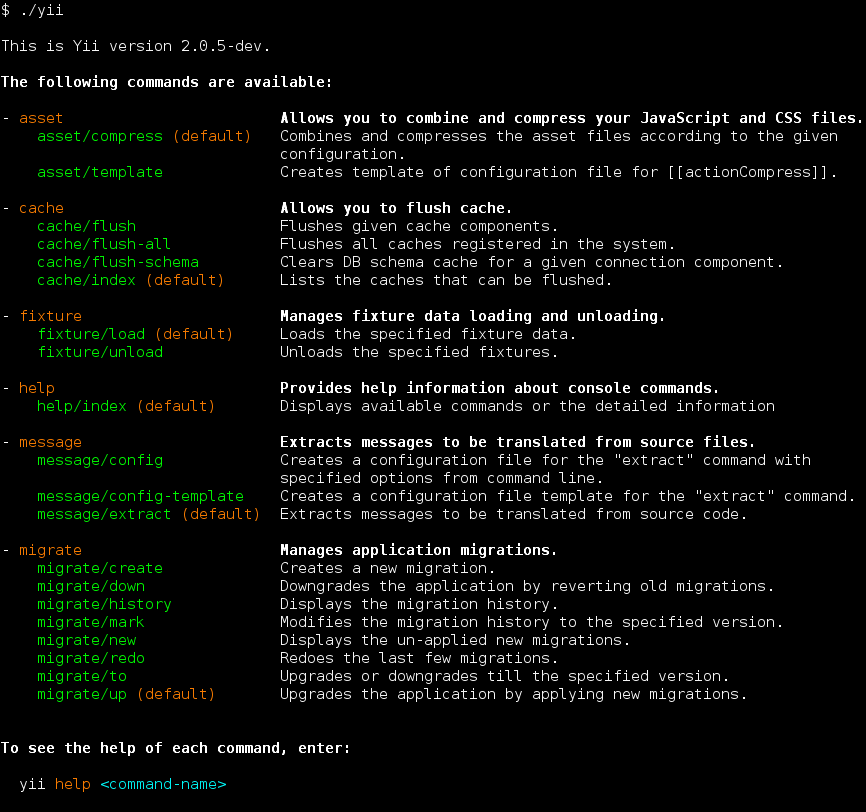

コンソール・アプリケーション
============================

ウェブ・アプリケーションを構築するための豊富な機能に加えて、Yii はコンソール・アプリケーションのためのフル装備のサポートを持っています。
コンソール・アプリケーションは、主として、ウェブ・サイトのために実行する必要のあるバックグラウンドのタスクやメンテナンスのタスクを作成するために使われるものです。

コンソール・アプリケーションの構造は Yii のウェブ・アプリケーションのそれと非常に良く似ています。
コンソール・アプリケーションは一つまたは複数の [[yii\console\Controller]] クラスから構成されます。コントローラはコンソール環境ではしばしば「コマンド」と呼ばれます。
また、各コントローラは、ウェブのコントローラと全く同じように、一つまたは複数のアクションを持つことが出来ます。

プロジェクト・テンプレートは、両方とも、既にコンソール・アプリケーションを持っています。
レポジトリのベース・ディレクトリにある `yii` スクリプトを呼び出すことによって、コンソール・アプリケーションを実行することが出来ます。
このスクリプトは、何もパラメータを追加せずに実行すると、利用できるコマンドの一覧を表示します。



スクリーン・ショットに表示されているように、デフォルトで利用できる一連のコマンドが Yii によって既に定義されています。

- [[yii\console\controllers\AssetController|AssetController]] - JavaScript と CSS ファイルを結合して圧縮することが出来ます。
  このコマンドについては、[アセットのセクション](structure-assets.md#using-the-asset-command) でさらに学習することが出来ます。
- [[yii\console\controllers\CacheController|CacheController]] - アプリケーションのキャッシュをフラッシュすることが出来ます。
- [[yii\console\controllers\FixtureController|FixtureController]] - テストのために、フィクスチャ・データのロードとアンロードを管理します。
  このコマンドについては [テストのフィクスチャのセクション](test-fixtures.md#managing-fixtures) で詳細に説明されています。
- [[yii\console\controllers\HelpController|HelpController]] - コンソール・コマンドについてのヘルプ情報を提供します。
  これがデフォルトのコマンドであり、上のスクリーン・ショットで見た出力を表示するものです。
- [[yii\console\controllers\MessageController|MessageController]] - ソース・ファイルから翻訳すべきメッセージを抽出します。
  このコマンドについてさらに学習するためには、[国際化のセクション](tutorial-i18n.md#message-command) を参照してください。
- [[yii\console\controllers\MigrateController|MigrateController]] - アプリケーションのマイグレーションを管理します。
  データベースのマイグレーションについては、[データベースのマイグレーションのセクション](db-migrations.md) で詳しく説明されています。
- [[yii\console\controllers\ServeController|ServeController]] - PHP の内蔵ウェブ・サーバを走らせることが出来ます。


使用方法 <span id="usage"></span>
--------

コンソールのコントローラ・アクションは次の構文を使って実行します。

```
yii <route> [--option1=value1 ... argument1 argument2 ... --option2=value2]
```

オプションはどの位置で指定しても構いません。

上記において、`<route>` はコントローラ・アクションへのルートを示すものです。
オプション (options) はクラスのプロパティに代入され、引数 (arguments) はアクション・メソッドのパラメータとなります。

例えば、[[yii\console\controllers\MigrateController::$migrationTable|MigrateController::$migrationTable]] として `migrations` を指定し、
マイグレーションの上限を 5 と指定して [[yii\console\controllers\MigrateController::actionUp()|MigrateController::actionUp()]]
を呼び出すためには、次のようにします。

```
yii migrate/up 5 --migrationTable=migrations
```

> Note: コンソールで `*` を使う場合は、`"*"` として引用符号で囲むことを忘れないでください。
> これは、`*` をカレント・ディレクトリの全てのファイル名に置き換えられるシェルのグロブとして実行してしまうことを避けるためです。


エントリ・スクリプト <span id="entry-script"></span>
------------------

コンソール・アプリケーションのエントリ・スクリプトは、ウェブ・アプリケーションで使用されるブートストラップ・ファイル `index.php` に相当するものです。
コンソールのエントリ・スクリプトは通常は `yii` と呼ばれるもので、アプリケーションのルート・ディレクトリに配置されています。
それは次のようなコードを含んでいます。

```php
#!/usr/bin/env php
<?php
/**
 * Yii console bootstrap file.
 */

defined('YII_DEBUG') or define('YII_DEBUG', true);
defined('YII_ENV') or define('YII_ENV', 'dev');

require __DIR__ . '/vendor/autoload.php';
require __DIR__ . '/vendor/yiisoft/yii2/Yii.php';

$config = require __DIR__ . '/config/console.php';

$application = new yii\console\Application($config);
$exitCode = $application->run();
exit($exitCode);
```

このスクリプトはアプリケーションの一部として生成されるものです。あなたの必要を満たすように、自由に編集して構いません。
エラー発生時にスタック・トレースを見たくない、または、全体のパフォーマンスを上げたい、という場合は、`YII_DEBUG` 定数を `false` に設定することが出来ます。
ベーシック・プロジェクト・テンプレートでも、アドバンスト・プロジェクト・テンプレートでも、コンソール・アプリケーションのエントリ・スクリプトは、開発者に優しい環境を提供するために、デフォルトでデバッグを有効にしています。


構成情報 <span id="configuration"></span>
--------

上記のコードで見るように、コンソール・アプリケーションは、`console.php` という名前のそれ自身の構成情報ファイルを使用します。
このファイルの中で、さまざまな [アプリケーション・コンポーネント](structure-application-components.md)、取り分け、コンソール・アプリケーションのためのプロパティを構成しなければなりません。

ウェブ・アプリケーションとコンソール・アプリケーションが構成情報のパラメータと値を数多く共有する場合は、共通の部分を独立したファイルに移動して、
そのファイルを両方のアプリケーション (ウェブとコンソール) の構成情報にインクルードすることを検討しても良いでしょう。
その例をアドバンスト・プロジェクト・テンプレートの中で見ることが出来ます。

> Tip: 場合によっては、エントリ・スクリプトで指定されているのとは異なるアプリケーション構成情報を使って
> コンソール・コマンドを実行したいことがあります。
> 例えば、`yii migrate` コマンドを使ってテストのデータベースをアップグレードするとき、
> データベースが個々のテストスイートの中で構成されているような場合です。
> 構成情報を動的に変更するためには、コマンドを実行するときに `appconfig` オプションを使ってカスタムの構成情報ファイルを指定するだけで大丈夫です。
> 
> ```
> yii <route> --appconfig=path/to/config.php ...
> ```


コンソール・コマンドの補完 <span id="console-command-completion"></span>
--------------------------

シェルで作業をしている場合、コマンド引数の自動補完は便利なものです。
2.0.11 以降、`./yii` コマンドは、内蔵で Bash および ZSH のために補完をサポートしています。

### Bash の補完

bash completion がインストールされていることを確認して下さい。ほとんどの bash のインストレーションでは、デフォルトで利用可能になっています。

補完スクリプトを `/etc/bash_completion.d/` に置いて下さい。

     curl -L https://raw.githubusercontent.com/yiisoft/yii2/master/contrib/completion/bash/yii -o /etc/bash_completion.d/yii

一時的な利用の場合は、ファイルをカレント・ディレクトリに置いて、`source yii` でカレント・セッションに読み込みます。
グローバルにインストールした場合は、ターミナルを再起動するか、`source ~/.bashrc` を実行して、有効化する必要があります。

あなたの環境で補完スクリプトを読み込む他の方法については、
[Bash マニュアル](https://www.gnu.org/software/bash/manual/html_node/Programmable-Completion.html) を参照して下さい。

### ZSH の補完

補完のためのディレクトリ、例えば `~/.zsh/completion/` に補完スクリプトを置いて下さい。

```
mkdir -p ~/.zsh/completion
curl -L https://raw.githubusercontent.com/yiisoft/yii2/master/contrib/completion/zsh/_yii -o ~/.zsh/completion/_yii
```

そのディレクトリを `$fpath` に追加します。例えば `~/.zshrc` に次の記述を追加します。

```
fpath=(~/.zsh/completion $fpath)
```

`compinit` がロードされていることを確認して下さい。そうでなければ、`~/.zshrc` の中でロードします。

```
autoload -Uz compinit && compinit -i
```

そしてシェルをリロードします。

```
exec $SHELL -l
```

あなた自身のコンソール・コマンドを作成する <span id="create-command"></span>
------------------------------------------

### コンソールのコントローラとアクション

コンソール・コマンドは、[[yii\console\Controller]] を拡張するコントローラ・クラスとして定義することが出来ます。
コントローラ・クラスの中で、コントローラのサブ・コマンドに対応する一つまたは複数のアクションを定義します。各アクションの中で、その特定のサブ・コマンドのための適切なタスクを実装するコードを書きます。

コマンドを実行するときは、コントローラのアクションに対するルートを指定する必要があります。
例えば、ルート `migrate/create` は、[[yii\console\controllers\MigrateController::actionCreate()|MigrateController::actionCreate()]]
アクション・メソッドに対応するサブコマンドを呼び出します。
実行時に提供されたルートにアクション ID が含まれない場合は、(ウェブのコントローラの場合と同じように) デフォルトのアクションが実行されます。

### オプション

[[yii\console\Controller::options()]] メソッドをオーバーライドすることによって、コンソール・コマンド (controller/actionID) で利用できるオプションを指定することが出来ます。
このメソッドはコントローラ・クラスのパブリックなプロパティのリストを返さなければなりません。
コマンドを実行するときは、`--OptionName=OptionValue` という構文を使ってオプションの値を指定することが出来ます。
これはコントローラ・クラスの `OptionName` プロパティに `OptionValue` を割り当てるものです。

オプションのデフォルト値が配列型である場合、実行時にこのオプションをセットすると、
オプションの値は、入力文字列をカンマで分離することによって、配列に変換されます。

### オプションのエイリアス

バージョン 2.0.8 以降、コンソールコマンドは、オプションにエイリアスを追加するための
[[yii\console\Controller::optionAliases()]] メソッドを提供しています。

エイリアスを定義するためには、コントローラで [[yii\console\Controller::optionAliases()]] をオーバーライドします。例えば、

```php
namespace app\commands;

use yii\console\Controller;

class HelloController extends Controller
{
    public $message;
    
    public function options($actionID)
    {
        return ['message'];
    }
    
    public function optionAliases()
    {
        return ['m' => 'message'];
    }
    
    public function actionIndex()
    {
        echo $this->message . "\n";
    }
}
```

これで、次の構文を使ってコマンドを走らせることが出来るようになります。

```
./yii hello -m=hello
```

### 引数

オプションに加えてに、コマンドは引数を取ることも出来ます。引数は、リクエストされたサブ・コマンドに対応するアクション・メソッドへのパラメータとして渡されます。
最初の引数は最初のパラメータに対応し、二番目の引数は二番目のパラメータに対応し、以下同様です。
コマンドが呼び出されたときに十分な数の引数が提供されなかったときは、対応するパラメータは、定義されていれば、宣言されているデフォルト値をとります。
デフォルト値が設定されておらず、実行時に値が提供されなかった場合は、コマンドはエラーで終了します。

`array` タイプ・ヒントを使って、引数が配列として扱われるべきことを示すことが出来ます。
配列は入力文字列をカンマで分割することによって生成されます。

次に引数を宣言する方法を示す例を挙げます。

```php
class ExampleController extends \yii\console\Controller
{
    // コマンド "yii example/create test" は "actionCreate('test')" を呼び出す
    public function actionCreate($name) { ... }

    // コマンド "yii example/index city" は "actionIndex('city', 'name')" を呼び出す
    // コマンド "yii example/index city id" は call "actionIndex('city', 'id')" を呼び出す
    public function actionIndex($category, $order = 'name') { ... }

    // コマンド "yii example/add test" は "actionAdd(['test'])" を呼び出す
    // コマンド "yii example/add test1,test2" は "actionAdd(['test1', 'test2'])" を呼び出す
    public function actionAdd(array $name) { ... }
}
```


### 終了コード

終了コードを使うことはコンソール・アプリケーション開発のベスト・プラクティスです。
コマンドは何も問題が無かったことを示すために `0` を返すのが慣例です。コマンドが 1 以上の値を返したときは、何かエラーを示唆するものとみなされます。
返される数値がエラーコードであり、それによってエラーに関する詳細を見出すことが出来る場合もあります。
例えば、`1` は一般的な未知のエラーを示すものとし、`2` 以上の全てのコードは特定のエラー、例えば、入力エラー、ファイルが見つからない、等々を示すものとすることが出来ます。

コンソール・コマンドに終了コードを返させるためには、
単にコントローラのアクション・メソッドで整数を返すようにします。

```php
public function actionIndex()
{
    if (/* 何らかの問題が発生 */) {
        echo "A problem occurred!\n";
        return 1;
    }
    // 何かをする
    return 0;
}
```

いくつか使用できる事前定義された定数があります。それらは [[yii\console\ExitCode]] クラスで定義されています。

```php
public function actionIndex()
{
    if (/* 何らかの問題が発生 */) {
        echo "A problem occurred!\n";
        return ExitCode::UNSPECIFIED_ERROR;
    }
    // 何かをする
    return ExitCode::OK;
}
```

もっと詳細なエラー・コードを必要とする場合は、コントローラで詳細な定数を定義するのが良いプラクティスです。

### 書式設定と色

Yii のコンソール・コマンドは出力の書式設定をサポートしています。
これは、コマンドを走らせている端末がサポートしていない場合は、自動的に書式設定の無い出力にグレードダウンされます。

書式設定された文字列を出力することは簡単です。ボールドのテキストを出力するには、次のようにします。

```php
$this->stdout("Hello?\n", Console::BOLD);
```

複数のスタイルを動的に結合して文字列を構成する必要がある場合は、[[yii\helpers\Console::ansiFormat()|ansiFormat()]] を使うほうが良いでしょう。

```php
$name = $this->ansiFormat('Alex', Console::FG_YELLOW);
echo "Hello, my name is $name.";
```

### 表形式

バージョン 2.0.13 以降、表形式のデータをコンソールに表示するウィジェットが追加されています。次のようにして使うことが出来ます。

```php
echo Table::widget([
    'headers' => ['Project', 'Status', 'Participant'],
    'rows' => [
        ['Yii', 'OK', '@samdark'],
        ['Yii', 'OK', '@cebe'],
    ],
]);
```

詳細については [[yii\console\widgets\Table|API リファレンス]] を参照して下さい。
