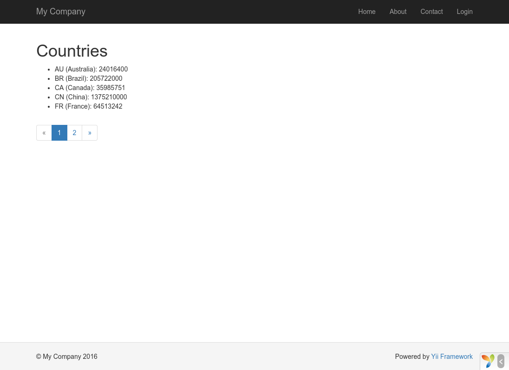

Praca z bazami danych
======================

Ta sekcja opisuje jak utworzyć nową stronę, która będzie wyświetlała dane krajów pobrane z tabeli bazy danych o nazwie `country`.
Aby to osiągnąć, musisz skonfigurować swoje połączenie z bazą danych, utworzyć klasę [Active Record](db-active-record.md), zdefiniować [akcję](structure-controllers.md) oraz utworzyć 
[widok](structure-views.md).

W tej sekcji nauczysz się:

* konfigurowania połączenia z bazą danych,
* tworzenia klasy Active Record,
* tworzenia zapytań o dane przy użyciu klasy Active Record,
* wyświetlania danych w widoku wraz ze stronicowaniem.


Zauważ, że w celu przejścia tej sekcji należy mieć już podstawową wiedzę o bazach danych.
W szczególności powinieneś wiedzieć, jak utworzyć bazę dancyh oraz jak wywołać komendę SQL używając klienta bazy danych.

Przygotowanie bazy danych <span id="preparing-database"></span>
----------------------

Aby rozpocząć, musisz utworzyć bazę danych o nazwie `yii2basic`, z której będziesz pobierał dane do swojej aplikacji.
Możesz utworzyć bazę SQLite, MySQL, PostgreSQL, MSSQL lub Oracle, ponieważ Yii posiada wbudowane wsparcie dla wielu aplikacji bazodanowych. 
Dla uproszczenia w naszym przykładzie wykorzystamy MySQL.

Następnie, utwórz tabelę o nazwie `country` i wstaw przykładowe dane. Możesz użyc poniższej komendy:

```sql
CREATE TABLE `country` (
  `code` CHAR(2) NOT NULL PRIMARY KEY,
  `name` CHAR(52) NOT NULL,
  `population` INT(11) NOT NULL DEFAULT '0'
) ENGINE=InnoDB DEFAULT CHARSET=utf8;

INSERT INTO `country` VALUES ('AU','Australia',24016400);
INSERT INTO `country` VALUES ('BR','Brazil',205722000);
INSERT INTO `country` VALUES ('CA','Canada',35985751);
INSERT INTO `country` VALUES ('CN','China',1375210000);
INSERT INTO `country` VALUES ('DE','Germany',81459000);
INSERT INTO `country` VALUES ('FR','France',64513242);
INSERT INTO `country` VALUES ('GB','United Kingdom',65097000);
INSERT INTO `country` VALUES ('IN','India',1285400000);
INSERT INTO `country` VALUES ('RU','Russia',146519759);
INSERT INTO `country` VALUES ('US','United States',322976000);
```

W tym miejscu masz już utworzoną bazę danych o nazwie `yii2basic`, posiadającą tabelę `country` z trzema kolumnami. Tabela zawiera 10 wierszy danych.

Konfiguracja połączenia z bazą danych <span id="configuring-db-connection"></span>
---------------------------

Przed przystąpieniem do tej części, upewnij się, że masz zainstalowane rozszerzenie [PDO](http://www.php.net/manual/en/book.pdo.php) oraz sterownik PDO dla bazy danych której używasz 
(np. `pdo_mysql` dla MySQL).
Jest to podstawowe wymaganie, jeśli Twoja aplikacja używa relacyjnej bazy danych.

Jeśli posiadasz zainstalowane powyższe rozszerzenia, otwórz plik `config/db.php` i zmień parametry na odpowiednie do Twojej bazy danych. Domyślnie plik zawiera poniższy fragment:

```php
<?php

return [
    'class' => 'yii\db\Connection',
    'dsn' => 'mysql:host=localhost;dbname=yii2basic',
    'username' => 'root',
    'password' => '',
    'charset' => 'utf8',
];
```

Plik `config/db.php` jest typowym narzędziem [konfiguracyjnym](concept-configurations.md) opartym na plikach.
Ten szczególny plik konfiguracyjny określa parametry potrzebne do utworzenia oraz zainicjalizowania instancji [[yii\db\Connection|Connection]], dzięki czemu będziesz mógł wywoływać 
komendy SQL do swojej bazy przez aplikację.

Powyższa konfiguracja może być dostępna z poziomu kodu aplikacji używając wyrażenia `Yii::$app->db`.

> Info: Plik `config/db.php` będzie załączony do głównej konfiguracji aplikacji `config/web.php`, która określa jak instancja [aplikacji](structure-applications.md) powinna zostać 
> zainicjalizowana.
> Po więcej informacji zajrzyj do sekcji [Konfiguracje](concept-configurations.md).


Tworzenie klasy Active Record <span id="creating-active-record"></span>
-------------------------

Do pobrania i reprezentowania danych z tabeli `country` utwórz pochodną klasę [Active Record](db-active-record.md) o nazwie `Country`, kolejnie zapisz ją w pliku `models/Country.php`.

```php
<?php

namespace app\models;

use yii\db\ActiveRecord;

class Country extends ActiveRecord
{
}
```

Klasa `Country` rozszerza klasę [[yii\db\ActiveRecord|ActiveRecord]]. Nie musisz pisać w niej żadnego kodu! Posiadając tylko powyżej podany kod, Yii odgadnie nazwę powiązanej tabeli 
z nazwy klasy.

> Info: Jeśli nie można dopasować tabeli do nazwy klasy, możesz nadpisać metodę [[yii\db\ActiveRecord::tableName()|tableName()]], aby wskazywała na konkretną powiązaną tabelę.

Używając klasy `Country` możesz w łatwy sposób manipulować danymi z tabeli `country`, tak jak pokazano w poniższych przykładach:

```php
use app\models\Country;

// pobiera wszystkie wiersze tabeli `country` i porządkuje je według kolumny "name"
$countries = Country::find()->orderBy('name')->all();

// pobiera wiersz, którego kluczem głównym jest "US"
$country = Country::findOne('US');

// wyświetla "United States"
echo $country->name;

// modyfikuje nazwę kraju na "U.S.A." i zapisuje go do bazy danych
$country->name = 'U.S.A.';
$country->save();
```

> Info: Active Record jest potężnym narzędziem do dostępu i manipulacji danymi w bazie danych w sposób zorientowany obiektowo.
> Więcej szczegółowych informacji znajdziesz w sekcji [Active Record](db-active-record.md). Alternatywnie, do łączenia się z bazą danych możesz użyć niskopoziomowej metody dostępu do 
> danych nazwanej [Data Access Objects](db-dao.md).


Tworzenie akcji <span id="creating-action"></span>
------------------

Aby przedstawić kraje użytkownikowi musisz utworzyć nową akcję. Zamiast umieszczać nową akcję w kontrolerze `site`, tak jak w poprzednich sekcjach, bardziej sensownym rozwiązaniem jest 
utworzenie nowego kontrolera odpowiedzialnego za wszystkie akcje dotyczące danych z tabeli `country`. Nazwij nowy kontroler `CountryController`, a następnie utwórz w nim akcję `index`, 
tak jak na poniższym przykładzie:

```php
<?php

namespace app\controllers;

use yii\web\Controller;
use yii\data\Pagination;
use app\models\Country;

class CountryController extends Controller
{
    public function actionIndex()
    {
        $query = Country::find();

        $pagination = new Pagination([
            'defaultPageSize' => 5,
            'totalCount' => $query->count(),
        ]);

        $countries = $query->orderBy('name')
            ->offset($pagination->offset)
            ->limit($pagination->limit)
            ->all();

        return $this->render('index', [
            'countries' => $countries,
            'pagination' => $pagination,
        ]);
    }
}
```

Zapisz powyższy kod w pliku `controllers/CountryController.php`.

Akcja `index` wywołuje metodę `Country::find()`, pochodzącą z klasy Active Record, która buduje zapytanie bazodanowe i wyszukuje wszystkich danych z tabeli `country`.
Aby ograniczyć liczbę zwracanych krajów w każdym żądaniu, zapytanie jest stronicowane przy pomocy obiektu [[yii\data\Pagination|Pagination]]. Obiekt `Pagination` służy dwóm celom:

* Ustawia klauzule `offset` i `limit` do komend SQL reprezentowanych przez zapytanie tak, aby zwracały tylko jedną stronę na raz (maksymalnie 5 wierszy na stronę),
* Jest używany w widoku do wyświetlania stronicowania jako listy przycisków z numerami stron, co będzie wyjaśnione w kolejnej sekcji.

Na końcu akcja `index` renderuje widok o nazwie `index`, do którego przekazuje dane krajów oraz informacje o ich stronicowaniu.


Tworzenie widoku <span id="creating-view"></span>
---------------

W katalogu `views` utwórz nowy katalog o nazwie `country`. Będzie on używany do przechowywania wszystkich plików widoków renderowanych przez kontroler `country`. W katalogu 
`views/country` utwórz plik o nazwie `index.php` zawierający poniższy kod:

```php
<?php
use yii\helpers\Html;
use yii\widgets\LinkPager;
?>
<h1>Kraje</h1>
<ul>
<?php foreach ($countries as $country): ?>
    <li>
        <?= Html::encode("{$country->name} ({$country->code})") ?>:
        <?= $country->population ?>
    </li>
<?php endforeach; ?>
</ul>

<?= LinkPager::widget(['pagination' => $pagination]) ?>
```


Widok posiada dwie części. Pierwsza część odpowiada za wyświetlenie danych krajów jako nieuporządkowana lista HTML, natomiast druga część renderuje widżet 
[[yii\widgets\LinkPager|LinkPager]] na podstawie dostarczonych mu informacji z akcji.
Widżet `LinkPager` wyświetla listę przycisków z numerami stron. Kliknięcie w którykolwiek z nich zmienia dane z listy na dane odpowiadające wybranej stronie.

Sprawdź jak to działa <span id="trying-it-out"></span>
-------------

Aby zobaczyć jak działa powyższy kod, użyj przeglądarki i przejdź pod podany adres URL:

```
http://hostname/index.php?r=country%2Findex
```



Na początku zobaczysz stronę pokazującą pięć krajów. Poniżej listy znajduje się paginacja z czterema przyciskami.
Jeśli klikniesz przycisk "2", zobaczysz stronę wyświetlającą pięć innych krajów z bazy danych: druga strona wierszy.
Zauważ, że adres URL w przeglądarce również się zmienił na 

```
http://hostname/index.php?r=country%2Findex&page=2
```

Za kulisami, [[yii\data\Pagination|Pagination]] dostarcza wszystkich niezbędnych funkcjonalności do stronicowania zbioru danych: 

* Początkowo [[yii\data\Pagination|Pagination]] prezentuje pierwszą stronę, która odzwierciedla zapytanie "SELECT" tabeli `country` z klauzulą `LIMIT 5 OFFSET 0`.
  W rezultacie pobieranych i wyświetlanych jest pięć pierwszych krajów.
* Widżet [[yii\widgets\LinkPager|LinkPager]] renderuje przyciski stron używając adresów URL tworzonych przez metodę [[yii\data\Pagination::createUrl()|createUrl()]]. 
  Adresy zawierają parametr zapytania `page`, który reprezentuje różne numery stron.
* Jeśli klikniesz przycisk "2", zostanie uruchomione i przetworzone nowe żądanie dla route'a `country/index`.
  [[yii\data\Pagination|Pagination]] odczytuje parametr `query` z adresu URL, a następnie ustawia aktualny numer strony na 2.
  Nowe zapytanie o kraje będzie zawierało klauzulę `LIMIT 5 OFFSET 5` i zwróci pięć kolejnych krajów do wyświetlenia.


Podsumowanie <span id="summary"></span>
-------

W tej sekcji nauczyłeś się jak pracować z bazą danych. Nauczyłeś się również jak pobierać i wyświetlać dane ze stronicowaniem przy pomocy [[yii\data\Pagination|Pagination]] oraz 
[[yii\widgets\LinkPager|LinkPager]].

W następnej sekcji nauczysz się jak używać potężnego narzędzie do generowania kodu nazwanego [Gii](https://github.com/yiisoft/yii2-gii/blob/master/docs/guide/README.md),
aby pomóc Ci w szybki sposób implementować niektóre powszechnie wymagane funkcjonalności, takie jak operacje CRUD dla zadań z danymi w bazie danych.
Kod, który właśnie napisaliśmy, może być w całości automatycznie wygenerowany w Yii przy użyciu narzędzia Gii.
