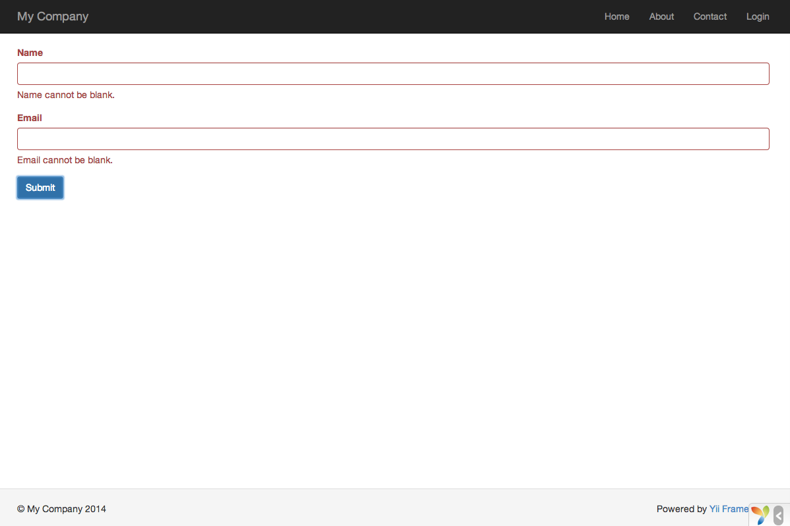

Praca z formularzami
==================

Ta sekcja opisuje jak utworzyć nową stronę z formularzem pobierającym dane od użytkownika.
Strona będzie wyświetlała formularz z dwoma polami do uzupełnienia: `nazwa` oraz `email`.
Po otrzymaniu tych dwóch danych od użytkownika, wyświetlimy z powrotem wprowadzone wartości w celu ich potwierdzenia.

Aby to osiągnąć, oprócz utworzenia [akcji](structure-controllers.md) i dwóch [widoków](structure-views.md), będziesz musiał utworzyć [model](structure-models.md).

W tym poradniku nauczysz się jak:

* utworzyć [model](structure-models.md) reprezentujący dane wprowadzone przez użytkownika przez formularz,
* zadeklarować zasady do sprawdzenia wprowadzonych danych,
* zbudować formularz HTML w [widoku](structure-views.md).


Tworzenie modelu <span id="creating-model"></span>
----------------

Dane które pobierzemy od użytkownika będą reprezentowane przez klasę modelu `EntryForm`, która pokazana jest poniżej. Jest ona zapisana w pliku `models/EntryForm.php`.
Po więcej szczegółów odnośnie konwencji nazewnictwa plików zajrzyj do sekcji[autoładowania klas](concept-autoloading.md)

```php
<?php

namespace app\models;

use Yii;
use yii\base\Model;

class EntryForm extends Model
{
    public $name;
    public $email;

    public function rules()
    {
        return [
            [['name', 'email'], 'required'],
            ['email', 'email'],
        ];
    }
}
```

Klasa `EntryForm` rozszerza [[yii\base\Model|Model]], podstawową klasę dostarczoną przez Yii, głównie używaną do reprezentowania danych z formularzy.

> Info: [[yii\base\Model|Model]] jest używane jako rodzic dla klasy modeli *NIE* powiązanych z tabelą bazy danych.
> [[yii\db\ActiveRecord|ActiveRecord]] jest rodzicem dla klas modeli powiązanych z tabelami bazy danych.

Klasa `EntryForm` zawiera dwa elementy publiczne, `name` oraz `email`, które są używane do przechowania danych wprowadzonych przez użytkownika.
Zawiera również metodę nazwaną `rules()`, która zwraca zestaw zasad do walidacji wprowadzonych danych. Zadeklarowane zasady oznaczają:

* wartości w polach `name` oraz `email są wymagane
* wartość pola `email` musi być prawidłowym adresem email

Jeśli posiadasz uzupełniony obiekt `EntryForm` danymi wprowadzonymi przez użytkownika, możesz wywołać jego funkcję [[yii\base\Model::validate()|validate()]], aby uruchomić procedurę 
sprawdzania poprawności danych.
W przypadku wystąpienia błędów w walidacji, wartość [[yii\base\Model::hasErrors|hasErrors]] zostanie ustawiona na `true`. Możesz zobaczyć jakie błędy wystąpiły za pomocą metody 
[[yii\base\Model::getErrors()|getErrors()]].

```php
<?php
$model = new EntryForm();
$model->name = 'Qiang';
$model->email = 'bad';
if ($model->validate()) {
    // Dobrze!
} else {
    // Źle!
    // Use $model->getErrors()
}
```


Tworzenie akcji <span id="creating-action"></span>
------------------

Następnie musisz utworzyć akcję o nazwie `entry` w kontrolerze `site`,  która użyje Twojego nowego modelu. Proces tworzenia i używania akcji był wytłumaczony w sekcji 
[Witaj świecie](start-hello.md).

```php
<?php

namespace app\controllers;

use Yii;
use yii\web\Controller;
use app\models\EntryForm;

class SiteController extends Controller
{
    // ...obecny kod...

    public function actionEntry()
    {
        $model = new EntryForm();

        if ($model->load(Yii::$app->request->post()) && $model->validate()) {
            // walidacja otrzymanych danych w modelu

            // zrób coś sensownego z modelem

            return $this->render('entry-confirm', ['model' => $model]);
        } else {
            // w przypadku błędów walidacji wyświetlana jest strona z błędami
            return $this->render('entry', ['model' => $model]);
        }
    }
}
```

Akcja tworzy na początku obiekt `EntryForm`. Następnie próbuje uzupełnić model danymi ze zmiennej `$_POST`, dostarczanymi w Yii przez metodę [[yii\web\Request::post()|post()]].
Jeśli model został prawidłowo uzupełniony(np. jeśli użytkownik wysłał formularz HTML), akcja wywoła metodę [[yii\base\Model::validate()|validate()]], aby upewnić się, że wprowadzone 
dane są prawidłowe.

> Info: Wyrażenie `Yii::$app` reprezentuje instancję [aplikacji](structure-applications.md), która jest globalnie dostępnym singletonem.
> Jest również [lokatorem usług](concept-service-locator.md), który dostarcza komponenty takie jak `request`, `response` lub `db` do wsparcia specyficznej funkcjonalności.
> W powyższym kodzie użyty jest komponent `request` aby uzyskać dostęp do danych w zmiennej `$_POST`.

Jeśli wszystko jest w porządku, akcja wyrenderuje widok o nazwie `entry-confirm` w celu potwierdzenia prawidłowego przesłania danych przez użytkownika.
Jeśli nie zostały wysłane żadne dane lub dane zawierają błędy, zostanie wyrenderowany widok `entry`, w którym będzie pokazany formularz HTML wraz z wiadomościami błędów walidacji.

> Note: W tym prostym przykładzie po prostu renderujemy stronę z potwierdzeniem prawidłowego przesłania danych. 
> W praktyce powinieneś rozważyć użycie [[yii\web\Controller::refresh()|refresh()]] lub [[yii\web\Controller::redirect()|redirect()]], aby uniknąć 
> [problemów z ponownym przesłaniem formularza](https://en.wikipedia.org/wiki/Post/Redirect/Get).


Tworzenie widoku <span id="creating-views"></span>
--------------

Na koniec utwórz dwa pliki o nazwach `entry-confirm` oraz `entry`. Będą one renderowane przez akcję `entry`, tak jak to przed chwilą opisaliśmy.

Widok `entry-confirm` wyświelta po prostu dane `name` oraz `email`. Powinien być zapisany w pliku `views/site/entry-confirm.php`.

```php
<?php
use yii\helpers\Html;
?>
<p>Wpisałeś następujące informacje:</p>

<ul>
    <li><label>Nazwa</label>: <?= Html::encode($model->name) ?></li>
    <li><label>Email</label>: <?= Html::encode($model->email) ?></li>
</ul>
```

Widok `entry` wyświetla formularz HTML. Powinien być zapisany w pliku `views/site/entry.php`.

```php
<?php
use yii\helpers\Html;
use yii\widgets\ActiveForm;
?>
<?php $form = ActiveForm::begin(); ?>

    <?= $form->field($model, 'name') ?>

    <?= $form->field($model, 'email') ?>

    <div class="form-group">
        <?= Html::submitButton('Wyślij', ['class' => 'btn btn-primary']) ?>
    </div>

<?php ActiveForm::end(); ?>
```

Widok używa potężnego [widżetu](structure-widgets.md) nazwanego [[yii\widgets\ActiveForm|ActiveForm]] do budowania formularza HTML.
Metody `begin()` oraz `end()` renderują odpowiednio otwierające i zamykające tagi formularza. Pomiędzy wywołaniami tych dwóch metod, pola do wprowadzania są tworzone przez metodę 
[[yii\widgets\ActiveForm::field()|field()]].
Następnie, po polach do wprowadzania danych, wywoływana jest metoda [[yii\helpers\Html::submitButton()|submitButton()]] do wygenerowania przycisku "Wyślij", który wysyła formularz.


Próba <span id="trying-it-out"></span>
-------------

Aby zobaczyć jak to działa, użyj przeglądarki i przejdź pod dany adres:

```
https://hostname/index.php?r=site%2Fentry
```

Zobaczysz stronę wyświetlającą formularz z dwoma polami. Przed każdym polem znajduje się etykieta opisująca to pole. Jeśli klikniesz przycisk "Wyślij" nie wpisując żadnych danych, lub 
jeśli nie wprowadzisz prawidłowego adresu email, zobaczysz wiadomość błędu wyświeloną pod polem którego ona dotyczy.



Po wpisaniu prawidłowej nazwy, adresu email oraz kliknięciu przycisku "Wyślij", zobaczysz nową stronę wyświetlającą dane, które właśnie wprowadziłes.


### "Wyjaśnienie magii" <span id="magic-explained"></span>

Możesz się zastanawiać jak działa ten formularz HTML, ponieważ wydaje się prawie magicznym to, że wyświetla etykietę do każdego pola oraz wyświetla komunikat błędu, jeśli wprowadzisz 
błędne dane, bez przeładowania strony.

Wstępna walidacja jest wykonywana po stronie klienta używając JavaScriptu, kolejnie dopiero po stronie serwera przez PHP.
[[yii\widgets\ActiveForm|ActiveForm]] potrafi wyodrębnić zasady walidacji, które zadeklarowałeś w `EntryForm`, przekształcić je w wykonywalny kod JavaScript oraz użyć go do walidacji 
danych. 
Jeśli zablokowałeś JavaScript w swojej przeglądarce, walidacja wciąż będzie wykonywana po stronie serwera, jak pokazano w metodzie `actionEntry()`. 
Gwarantuje to poprawność danych w każdych okolicznościach.

> Warning: Walidacja po stronie klienta jest opcją, która zapewnia wygodniejszą współpracę aplikacji z użytkownikiem. Walidacja po stronie serwera jest zawsze wymagana, niezależnie, 
czy walidacja po stronie klienta jest włączona, czy też nie.

Etykiety dla pól w formularzu generowane są przy pomocy metody `field()`, używającej nazw właściwości z modelu.
Dla przykładu, etykieta `Name` zostanie wygenerowana dla właściwości `name`.

Możesz dostosowywać etykiety w widoku, używając poniższego kodu:

```php
<?= $form->field($model, 'name')->label('Your Name') ?>
<?= $form->field($model, 'email')->label('Your Email') ?>
```

> Info: Yii dostarcza wiele podobnych widżetów, które pomogą Ci szybko tworzyć złożone i dynamiczne widoki.
> Tak jak nauczysz się później, pisanie nowego widżetu jest ekstremalnie łatwe. 
> Będziesz mógł przekształcić Twój kod widoku na widżet do wielokrotnego użytku, aby uprościć rozwój swoich widoków w przyszłości.


Podsumowanie <span id="summary"></span>
-------

W tej sekcji poradnika dotknęliśmy każdej części struktury MVC. Nauczyłeś się jak utworzyć klasę modelu, aby reprezentowała dane użytkownika oraz je walidowała.

Nauczyłeś się także, jak pobierać dane od użytkowników oraz jak wyświetlać pobrane dane w przeglądarce. 
To zadanie mogłoby zabrać Ci wiele czasu podczas pisania aplikacji, jednak Yii dostarcza wiele widżetów, które bardzo je ułatwiają.

W następnej sekcji nauczysz się pracy z bazą danych, która jest wymagana w niemalże każdej aplikacji.
