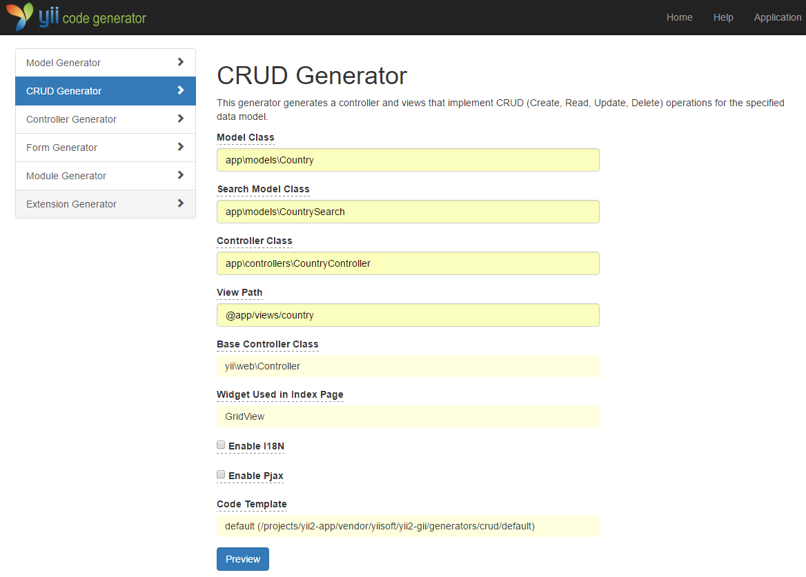
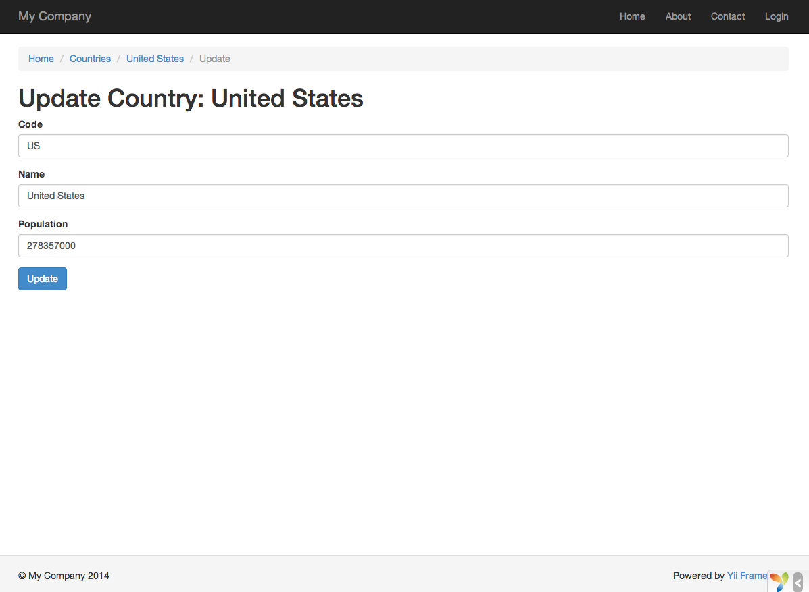

Generowanie kodu za pomocą Gii
========================

Ta sekcja opisuje jak używać [Gii](https://github.com/yiisoft/yii2-gii/blob/master/docs/guide/README.md) do automatycznego generowania kodu, który implementuje podstawowe 
funkcjonalności do aplikacji Web.
Używanie Gii do automatycznego generowania kodu jest po prostu kwestią wprowadzenia odpowiednich informacji w formularzach zgodnie z instrukcjami widocznymi na podstronach Gii.

W tym poradniku nauczysz się:

* aktywować Gii w Twojej aplikacji,
* używać Gii do generowania klas Active Record,
* używać Gii do generowania kodu implementującego operacje CRUD dla tabel bazy danych,
* dostosować kod wygenerowany przez Gii,


Początki z Gii <span id="starting-gii"></span>
------------

[Gii](https://github.com/yiisoft/yii2-gii/blob/master/docs/guide/README.md) jest [modułem](structure-modules.md) dostarczonym przez Yii. 
Możesz aktywować Gii konfigurując właściwość [[yii\base\Application::modules|modules]] aplikacji. Zależnie od tego, jak utworzyłeś swoją aplikację, może się okazać, że poniższy kod jest 
już zawarty w pliku konfiguracyjnym `config/web.php`:

```php
$config = [ ... ];

if (YII_ENV_DEV) {
    $config['bootstrap'][] = 'gii';
    $config['modules']['gii'] = [
        'class' => 'yii\gii\Module',
    ];
}
```

Powyższa konfiguracja sprawdza, czy aplikacja jest w [środowisku rozwojowym](concept-configurations.md#environment-constants) - jeśli tak, dołącza moduł `gii` określając klasę modułu 
[[yii\gii\Module]].

Jeśli sprawdzisz [skrypt wejściowy](structure-entry-scripts.md) `web/index.php` Twojej aplikacji, zauważysz linię kodu, która ustawia `YII_ENV` na wartość `dev`.

```php
defined('YII_ENV') or define('YII_ENV', 'dev');
```

Dzięki temu Twoja aplikacja ustawiana jest w tryb rozwojowy, co uaktywnia moduł Gii. Możesz teraz uzyskać dostęp do Gii przez przejście pod podany adres URL:

```
https://hostname/index.php?r=gii
```

> Note: Jeśli próbujesz dostać się do Gii z maszyny innej niż localhost, dostęp domyślnie będzie zablokowany ze względów bezpieczeństwa.
> Możesz dodać dozwolone adresy IP następująco:
>
```php
'gii' => [
    'class' => 'yii\gii\Module',
    'allowedIPs' => ['127.0.0.1', '::1', '192.168.0.*', '192.168.178.20'] // adjust this to your needs
],
```


Generowanie klasy Active Record <span id="generating-ar"></span>
---------------------------------

Aby użyć Gii do wygenerowania klasy Active Record, wybierz "Model Generator" z odnośników na stronie głównej Gii. Następnie uzupełnij formularz następująco:

* Table Name: `country`
* Model Class: `Country`


Następnie kliknij przycisk "Preview". Powinieneś zauważyć na liście plik `models/Country.php`, który zostanie utworzony. Możesz kliknąć w nazwę pliku aby zobaczyć podgląd 
jego zawartości.

Podczas używania Gii, jeśli posiadałeś już utworzony plik o tej samej nazwie i będziesz chciał go nadpisać, kliknij w przycisk `diff` obok nazwy pliku, aby zobaczyć różnice w kodzie 
pomiędzy wygenerowanym, a już istniejącym plikiem.


Podczas nadpisywania istniejącego już pliku musisz zaznaczyć opcję "overwrite", a następnie kliknąć przycisk "Generate". Jeśli tworzysz nowy plik, wystarczy kliknięcie "Generate".

Następnie zobaczysz stronę potwierdzającą, że kod został pomyślnie wygenerowany. Jeśli nadpisywałeś istniejący już plik, zobaczysz również wiadomość o nadpisaniu go nowo wygenerowanym 
kodem.

Generowanie kodu CRUD <span id="generating-crud"></span>
--------------------

Akronim CRUD pochodzi od słów *tworzenie*, *odczytywanie*, *aktualizowanie* oraz *usuwanie* (Create-Read-Update-Delete) i reprezentuje cztery podstawowe zadania dotyczące obsługi 
danych w większości serwisów internetowych.
Aby utworzyć funkcjonalność CRUD używając Gii, wybierz na stronie głównej Gii "CRUD Generator". Do przykładu "country" uzupełnij formularz następująco:

* Model Class: `app\models\Country`
* Search Model Class: `app\models\CountrySearch`
* Controller Class: `app\controllers\CountryController`



Następnie kliknij przycisk "Preview". Zobaczysz listę plików, które zostaną wygenerowane, tak jak pokazano niżej.


Jeśli wcześniej utworzyłeś pliki `controllers/CountryController.php` oraz `views/country/index.php` (w sekcji baz danych tego poradnika), zaznacz opcję "overwrite", aby je zastąpić 
(poprzednia wersja nie posiada pełnego wsparcia CRUD). 

Sprawdzenie w działaniu <span id="trying-it-out"></span>
-----------------------

Aby zobaczyć, jak działa nowo wygenerowany kod, użyj przeglądarki, aby uzyskać dostęp do podanego adresu URL:

```
https://hostname/index.php?r=country%2Findex
```

Zobaczysz tabelę prezentującą kraje z bazy danych. Możesz sortować tabelę, lub filtrować ją przez wpisanie odpowiednich warunków w nagłówkach kolumn.

Dla każdego wyświetlanego kraju możesz zobaczyć jego szczegóły, zaktualizować go lub usunąć.
Możesz również kliknąć przycisk "Create Country", aby przejść do formularza tworzenia nowego państwa.




Poniżej przedstawiamy listę plików wygenerowanych przez Gii, gdybyś chciał zbadać jak zostały zaimplementowane powyższe funkcjonalności (lub je edytować):

* Kontroler: `controllers/CountryController.php`
* Model: `models/Country.php` and `models/CountrySearch.php`
* Widok: `views/country/*.php`

> Info: Gii zostało zaprojektowane jako wysoce konfiguralne i rozszerzalne narzędzie przeznaczone do generowania kodu.
> Prawidłowe używane może znacznie przyspieszyć szybkość tworzenia Twojej aplikacji. Po więcej szczegółów zajrzyj do sekcji 
> [Gii](https://github.com/yiisoft/yii2-gii/blob/master/docs/guide/README.md).


Podsumowanie <span id="summary"></span>
-------

W tej sekcji nauczyłeś się jak używać Gii do wygenerowania kodu, który implementuje pełną funkcjonalność CRUD dla treści zawartch w tabelach bazy danych.
