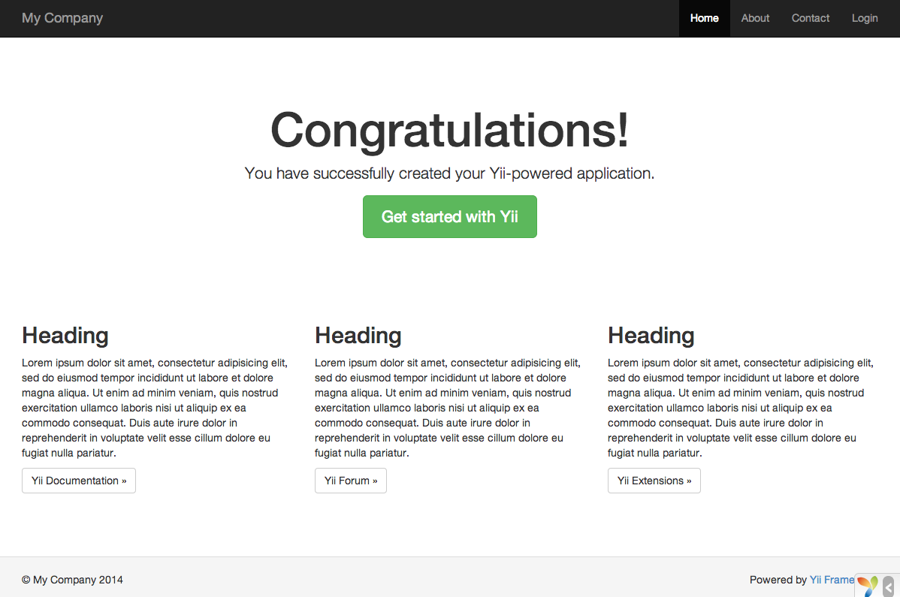

Instalacja Yii
==============

Yii możesz zainstalować na dwa sposoby, korzystając z [Composera](https://getcomposer.org/) lub pobierając plik archiwum.  
Preferowanym sposobem jest ten pierwszy, ponieważ pozwala na instalację i aktualizację dodatkowych 
[rozszerzeń](structure-extensions.md) oraz samego Yii przy użyciu zaledwie jednej komendy.

Standardowa instalacja Yii skutkuje pobraniem i wstępnym skonfigurowaniem frameworka wraz z szablonem projektu.  
Szablon projektu jest aplikacją Yii zawierającą podstawowe funkcjonalności, takie jak logowanie, formularz kontaktowy itp.  
Struktura jego kodu została stworzona w oparciu o zalecany sposób pisania aplikacji opartych na Yii, dlatego może służyć 
jako dobry punkt wyjściowy dla stworzenia Twojego bardziej zaawansowanego projektu.
    
W tej oraz kilku kolejnych sekcjach opiszemy jak zainstalować Yii z tak zwanym "podstawowym szablonem projektu" oraz jak 
zaimplementować w nim nowe funkcjonalności. Oprócz podstawowego, Yii dostarcza również drugi, 
[zaawansowany szablon projektu](https://github.com/yiisoft/yii2-app-advanced/blob/master/docs/guide/README.md), 
przystosowany dla programistów tworzących wielowarstwowe aplikacje.

> Info: Podstawowy szablon projektu jest odpowiedni dla 90% aplikacji webowych. Główną różnicą, w porównaniu do 
  zaawansowanego szablonu projektu, jest organizacja kodu. Jeśli dopiero zaczynasz swoją przygodę z Yii, zalecamy 
  zapoznać się z podstawowym szablonem, ze względu na jego prostotę oraz funkcjonalność.

Instalacja z użyciem Composera <span id="installing-via-composer"></span>
------------------------------

### Instalacja Composera

Jeśli nie posiadasz jeszcze Composera, to możesz go zainstalować korzystając z instrukcji zamieszczonej na stronie 
[getcomposer.org](https://getcomposer.org/download/). W systemach operacyjnych Linux i Mac OS X należy wywołać następujące komendy:

```bash
curl -sS https://getcomposer.org/installer | php
mv composer.phar /usr/local/bin/composer
```

W systemie Windows należy pobrać i uruchomić [Composer-Setup.exe](https://getcomposer.org/Composer-Setup.exe).

W przypadku napotkania jakichkolwiek problemów należy zapoznać się z 
[sekcją Rozwiązywania problemów w dokumentacji Composera](https://getcomposer.org/doc/articles/troubleshooting.md).  
Jeśli dopiero rozpoczynasz przygodę z Composerem, zalecamy przeczytanie przynajmniej [sekcji Podstaw użycia](https://getcomposer.org/doc/01-basic-usage.md) 
w dokumentacji Composera.

W tym przewodniku zakładamy, że Composer został zainstalowany [globalnie](https://getcomposer.org/doc/00-intro.md#globally), 
dzięki czemu jest dostępny z użyciem komendy `composer`. Jeśli jednak zamiast tego używasz pliku `composer.phar` w lokalnym folderze, 
pamiętaj, żeby odpowiednio zmodyfikować podane tu przykładowe komendy.

Jeśli jesteś już posiadaczem Composera, upewnij się, że jest on zaktualizowany do najnowszej wersji (komenda `composer self-update`).

> Note: Podczas instalacji Yii, Composer będzie potrzebował pobrać sporo informacji z API serwisu Github. 
  Ilość zapytań zależy od liczby powiązanych wtyczek, rozszerzeń i modułów, których wymaga Twoja aplikacja, i może być 
  większa niż **limit zapytań API GitHuba**. Jeśli faktycznie tak będzie, Composer może poprosić o Twoje dane logowania 
  w serwisie Github, aby uzyskać token dostępowy API Githuba. Przy szybkim łączu napotkanie limitu może nastąpić szybciej 
  niż Composer jest w stanie obsłużyć zapytania, zatem zalecane jest skonfigurowanie tokenu dostępowego przed instalacją Yii.  
  Instrukcja opisująca jak tego dokonać znajduje się w  
  [dokumentacji Composera dotyczącej tokenów API Githuba](https://getcomposer.org/doc/articles/troubleshooting.md#api-rate-limit-and-oauth-tokens).

### Installing Yii

Teraz możesz przejść już do instalacji samego Yii, wywołując poniższe komendy w katalogu dostępnym z poziomu sieci web:

```bash
composer create-project --prefer-dist yiisoft/yii2-app-basic basic
```

Komenda ta zainstaluje najnowszą stabilną wersję szablonu aplikacji Yii w katalogu `basic`. Możesz oczywiście wybrać 
inną nazwę.

> Info: Jeśli komenda `composer create-project` zwróci błąd, sprawdź, czy przypadkiem nie jest on już opisany
  w [dokumentacji Composera w sekcji Rozwiązywania problemów](https://getcomposer.org/doc/articles/troubleshooting.md). 
  Kiedy uporasz się już z błędem, możesz wznowić przerwaną instalację uruchamiając komendę `composer update` w folderze `basic`.

> Tip: Jeśli chcesz zainstalować najnowszą wersję deweloperską Yii, użyj poniższej komendy, która dodaje 
> [opcję stabilności](https://getcomposer.org/doc/04-schema.md#minimum-stability):
>
> ```bash
> composer create-project --prefer-dist --stability=dev yiisoft/yii2-app-basic basic
> ```
>
> Pamiętaj, że wersja deweloperska Yii nie powinna być używana w wersjach produkcyjnych Twojej aplikacji, ponieważ mogą 
> wystąpić w niej niespodziewane błędy.

Instalacja z pliku archiwum <span id="installing-from-archive-file"></span>
---------------------------

Instalacja Yii z pliku archiwum składa się z trzech kroków:

1. Pobranie pliku archiwum z [yiiframework.com](https://www.yiiframework.com/download/).
2. Rozpakowanie pliku archiwum do katalogu dostępnego z poziomu sieci web.
3. Zmodyfikowanie pliku `config/web.php` przez dodanie sekretnego klucza do elementu konfiguracji `cookieValidationKey`
   (jest to wykonywane automatycznie, jeśli instalujesz Yii używając Composera):

   ```php
   // !!! wprowadź sekretny klucz tutaj - jest to wymagane do walidacji ciasteczek
   'cookieValidationKey' => 'enter your secret key here',
   ```

Inne opcje instalacji <span id="other-installation-options"></span>
---------------------

Powyższe instrukcje pokazują, jak zainstalować Yii oraz utworzyć podstawową, gotową do uruchomienia aplikację web.
To podejście jest dobrym punktem startowym dla większości projektów, zarówno małych jak i dużych. Jest to szczególnie 
korzystne, gdy zaczynasz naukę Yii.

Dostępne są również inne opcje instalacji:

* Jeśli chcesz zainstalować wyłącznie framework i samemu zbudować aplikację, zapoznaj się z rozdziałem 
  [Tworzenie aplikacji od podstaw](tutorial-start-from-scratch.md).
* Jeśli chcesz utworzyć bardziej zaawansowaną aplikację, przystosowaną do programowania dla wielu środowisk, 
  powinienieś rozważyć instalację 
  [zaawansowanego szablonu aplikacji](https://github.com/yiisoft/yii2-app-advanced/blob/master/docs/guide/README.md).


Instalowanie zasobów <span id="installing-assets"></span>
--------------------

Yii używa menadżerów pakietów [Bower](https://bower.io/) i/lub [NPM](https://www.npmjs.com/) do instalacji bibliotek 
zasobów (CSS i JavaScript). Proces pobierania tych bibliotek korzysta z Composera, pozwalając na rozwiązywanie zależności 
pakietów PHP i CSS/JavaScript w tym samym czasie, za pomocą serwisu [asset-packagist.org](https://asset-packagist.org) 
lub wtyczki [composer asset plugin](https://github.com/fxpio/composer-asset-plugin).  
Po więcej informacji sięgnij do sekcji [dokumentacji Zasobów](structure-assets.md).

Możesz, rzecz jasna, również zarządzać swoimi zasobami za pomocą natywnego klienta Bower/NPM, korzystać z CDN, albo też 
całkowicie zrezygnować z instalacji zasobów. Aby zablokować automatyczne pobieranie zasobów podczas używania Composera, 
dodaj poniższe linie w pliku 'composer.json':

```json
"replace": {
    "bower-asset/jquery": ">=1.11.0",
    "bower-asset/inputmask": ">=3.2.0",
    "bower-asset/punycode": ">=1.3.0",
    "bower-asset/yii2-pjax": ">=2.0.0"
},
```

> Note: w przypadku zablokowania instalacji zasobów przez Composera, odpowiedzialność za ich instalację i rozwiązywanie 
  zależności spada na Ciebie. Przygotuj się na potencjalne niezgodności w plikach zasobów pochodzących z różnych rozszerzeń.


Weryfikacja instalacji <span id="verifying-installation"></span>
----------------------

Po zakończeniu instalacji, skonfiguruj swój serwer (zobacz następną sekcję) lub użyj 
[wbudowanego serwera PHP](https://www.php.net/manual/en/features.commandline.webserver.php), 
uruchamiając poniższą komendę w konsoli z poziomu folderu `web` w projekcie:
 
```bash
php yii serve
```

> Note: Domyślnym portem, na którym serwer HTTP nasłuchuje, jest 8080. Jeśli jednak ten port jest już w użyciu lub też 
  chcesz obsłużyć wiele aplikacji w ten sposób, możesz podać inny numer portu, dodając argument --port:

```bash
php yii serve --port=8888
```

Możesz teraz użyć swojej przeglądarki, aby uzyskać dostęp do zainstalowanej aplikacji Yii przechodząc pod adres:

```
http://localhost:8080/
```



Powinienieś zobaczyć stronę z napisem "Congratulations!" ("Gratulacje!"). Jeśli nie, sprawdź, czy zainstalowane elementy 
środowiska spełniają wymagania Yii. Możesz sprawdzić minimalne wymagania na dwa sposoby:

* Skopiuj plik `/requirements.php` do `/web/requirements.php`, a następnie przejdź do przeglądarki i uruchom go 
  przechodząc pod adres `http://localhost/requirements.php`
* Lub też uruchom następujące komendy:

  ```bash
  cd basic
  php requirements.php
  ```

Powinienieś skonfigurować swoją instalację PHP tak, aby spełniała minimalne wymogi Yii. Najważniejszym z nich jest 
posiadanie PHP w wersji 5.4 lub wyższej. Powinienieś również zainstalować 
[rozszerzenie PDO](https://www.php.net/manual/en/pdo.installation.php) oraz odpowiedni sterownik bazy danych 
(np. `pdo_mysql` dla bazy danych MySQL), jeśli Twoja aplikacja potrzebuje bazy danych.


Konfigurowanie serwerów WWW <span id="configuring-web-servers"></span>
---------------------------

> Info: Możesz pominąć tą sekcję, jeśli tylko testujesz Yii, bez zamiaru zamieszczania aplikacji na serwerze produkcyjnym.

Aplikacja zainstalowana według powyższych instrukcji powinna działać bezproblemowo zarówno na 
[serwerze HTTP Apache](https://httpd.apache.org) jak i [serwerze HTTP Nginx](https://nginx.org), na systemie 
operacyjnym Windows, Mac OS X oraz Linux, posiadającym zainstalowane PHP 5.4 lub nowsze. Yii 2.0 jest również kompatybilne 
z [facebookowym HHVM](https://hhvm.com), są jednak przypadki, gdzie Yii zachowuje się inaczej w HHVM niż w natywnym PHP, 
dlatego powinieneś zachować szczególną ostrożność używając HHVM.

Na serwerze produkcyjnym możesz skonfigurować swój host tak, aby aplikacja była dostępna pod adresem 
`https://www.example.com/index.php` zamiast `https://www.example.com/basic/web/index.php`. Taka konfiguracja wymaga wskazania 
głównego katalogu serwera jako katalogu `basic/web`. Jeśli chcesz ukryć `index.php` w adresie URL, skorzystaj z informacji 
opisanych w dziale [routing i tworzenie adresów URL](runtime-routing.md).  
W tej sekcji dowiesz się, jak skonfigurować Twój serwer Apache lub Nginx, aby osiągnąć te cele.

> Info: Ustawiając `basic/web` jako główny katalog serwera, unikasz niechcianego dostępu użytkowników końcowych do 
  prywatnego kodu oraz wrażliwych plików aplikacji, które są przechowywane w katalogu `basic`. Zablokowanie dostępu do 
  tych folderów jest jednym z wymogów bezpieczeństwa aplikacji.

> Info: W przypadku, gdy Twoja aplikacja działa na wspólnym środowisku hostingowym, gdzie nie masz dostępu do modyfikowania 
  konfiguracji serwera, nadal możesz zmienić strukturę aplikacji dla lepszej ochrony. Po więcej informacji zajrzyj do 
  działu [Współdzielone środowisko hostingowe](tutorial-shared-hosting.md).

### Zalecane ustawienia Apache <span id="recommended-apache-configuration"></span>

Użyj następującej konfiguracji serwera Apache w pliku `httpd.conf` lub w konfiguracji wirtualnego hosta.
Pamiętaj, że musisz zamienić ścieżkę `path/to/basic/web` na aktualną ścieżkę do `basic/web` Twojej aplikacji.

```apache
# Ustaw główny katalog na "basic/web"
DocumentRoot "path/to/basic/web"

<Directory "path/to/basic/web">
    # użyj mod_rewrite do wsparcia "ładnych URLi"
    RewriteEngine on

    # jeśli $showScriptName jest ustawione na false w UrlManager, nie pozwalaj na dostęp do URLi za pomocą nazwy skryptu
    RewriteRule ^index.php/ - [L,R=404]

    # Jeśli katalog lub plik istnieje, użyj go bezpośrednio
    RewriteCond %{REQUEST_FILENAME} !-f
    RewriteCond %{REQUEST_FILENAME} !-d

    # W innym przypadku przekieruj żądanie na index.php
    RewriteRule . index.php

    # ...inne ustawienia...
</Directory>
```

### Zalecane ustawienia Nginx <span id="recommended-nginx-configuration"></span>

Aby użyć [Nginx](https://wiki.nginx.org/) powinienieś zainstalować PHP jako [FPM SAPI](https://www.php.net/install.fpm).
Możesz użyć przedstawionej poniżej konfiguracji Nginx, zastępując jedynie ścieżkę `path/to/basic/web` aktualną ścieżką 
do `basic/web` Twojej aplikacji oraz `mysite.test` aktualną nazwą hosta.

```nginx
server {
    charset utf-8;
    client_max_body_size 128M;

    listen 80; ## nasłuchuj ipv4
    #listen [::]:80 default_server ipv6only=on; ## nasłuchuj ipv6

    server_name mysite.test;
    root        /path/to/basic/web;
    index       index.php;

    access_log  /path/to/basic/log/access.log;
    error_log   /path/to/basic/log/error.log;

    location / {
        # Przekieruj wszystko co nie jest prawdziwym plikiem na index.php
        try_files $uri $uri/ /index.php$is_args$args;
    }

    # odkomentuj poniższe aby uniknąć przetwarzania żądań do nieistniejących plików przez Yii
    #location ~ \.(js|css|png|jpg|gif|swf|ico|pdf|mov|fla|zip|rar)$ {
    #    try_files $uri =404;
    #}
    #error_page 404 /404.html;

    # zablokuj dostęp do plików php w folderze /assets
    location ~ ^/assets/.*\.php$ {
        deny all;
    }

    location ~ \.php$ {
        include fastcgi_params;
        fastcgi_param SCRIPT_FILENAME $document_root$fastcgi_script_name;
        fastcgi_pass 127.0.0.1:9000;
        #fastcgi_pass unix:/var/run/php5-fpm.sock;
        try_files $uri =404;
    }

    location ~* /\. {
        deny all;
    }
}
```

W przypadku użycia tej konfiguracji, powinienieś ustawić również `cgi.fix_pathinfo=0` w pliku `php.ini`, 
aby zapobiec wielu zbędnym wywołaniom `stat()`.

Należy również pamiętać, że podczas pracy na serwerze HTTPS musisz dodać `fastcgi_param HTTPS on;`, 
aby Yii prawidłowo wykrywało, że połączenie jest bezpieczne.

### Zalecane ustawienia NGINX Unit <span id="recommended-nginx-unit-configuration"></span>

Możesz uruchomić aplikacje oparte na Yii korzystając z [NGINX Unit](https://unit.nginx.org/) z modułem języka PHP. Poniżej 
znajdziesz przykładową konfigurację.

```json
{
    "listeners": {
        "*:80": {
            "pass": "routes/yii"
        }
    },

    "routes": {
        "yii": [
            {
                "match": {
                    "uri": [
                        "!/assets/*",
                        "*.php",
                        "*.php/*"
                    ]
                },

                "action": {
                    "pass": "applications/yii/direct"
                }
            },
            {
                "action": {
                    "share": "/path/to/app/web/",
                    "fallback": {
                        "pass": "applications/yii/index"
                    }
                }
            }
        ]
    },

    "applications": {
        "yii": {
            "type": "php",
            "user": "www-data",
            "targets": {
                "direct": {
                    "root": "/path/to/app/web/"
                },

                "index": {
                    "root": "/path/to/app/web/",
                    "script": "index.php"
                }
            }
        }
    }
}
```

Możesz również [skonfigurować](https://unit.nginx.org/configuration/#php) swoje środowisko PHP lub przygotować 
spersonalizowany plik `php.ini` w tej samej konfiguracji.

### Konfiguracja IIS <span id="iis-configuration"></span>

Zalecane jest hostowanie aplikacji na wirtualnym hoście (strona Web), gdzie podstawowa ścieżka dokumentów wskazuje na folder 
`path/to/app/web` i strona Web jest skonfigurowana do uruchamiania PHP. W folderze `web` musisz umieścić plik `web.config` 
(`path/to/app/web/web.config`). Zawartość tego pliku powinna wyglądać jak poniżej:

```xml
<?xml version="1.0" encoding="UTF-8"?>
<configuration>
<system.webServer>
<directoryBrowse enabled="false" />
  <rewrite>
    <rules>
      <rule name="Hide Yii Index" stopProcessing="true">
        <match url="." ignoreCase="false" />
        <conditions>
        <add input="{REQUEST_FILENAME}" matchType="IsFile" 
              ignoreCase="false" negate="true" />
        <add input="{REQUEST_FILENAME}" matchType="IsDirectory" 
              ignoreCase="false" negate="true" />
        </conditions>
        <action type="Rewrite" url="index.php" appendQueryString="true" />
      </rule> 
    </rules>
  </rewrite>
</system.webServer>
</configuration>
```
Sprawdź również poniższe oficjalne poradniki firmy Microsoft, opisujące jak poprawnie skonfigurować PHP dla IIS:
1. [Jak uruchomić swoją pierwszą stronę Web na IIS](https://docs.microsoft.com/en-us/iis/manage/creating-websites/scenario-build-a-static-website-on-iis)
2. [Konfiguracja strony Web PHP dla IIS](https://docs.microsoft.com/en-us/iis/application-frameworks/scenario-build-a-php-website-on-iis/configure-a-php-website-on-iis)
