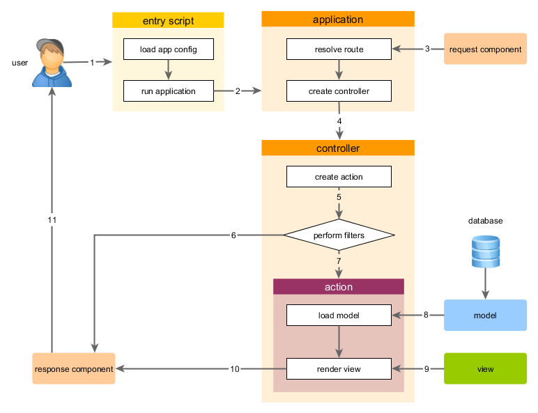

Uruchamianie aplikacji
====================

Po zainstalowaniu Yii posiadasz działającą aplikację Yii dostępną pod adresem `https://hostname/basic/web/index.php` lub `https://hostname/index.php`, zależnie od Twojej konfiguracji.
Ta sekcja wprowadzi Cię do wbudowanych funkcjonalności aplikacji, pokaże jak zorganizowany jest jej kod oraz jak aplikacja obsługuje żądania.

> Info: Dla uproszczenia zakładamy, że ustawiłeś główny katalog serwera na `basic/web`, według poradnika "Instalacja Yii", oraz skonfigurowałeś adres URL tak, aby Twoja aplikacja była 
> dostępna pod adresem `https://hostname/index.php`.
> Dla Twoich potrzeb dostosuj odpowiednio adres URL w naszych opisach.

Należy pamiętać, że w przeciwieństwie do samego frameworka, po zainstalowaniu szablonu projektu należy on w całości do Ciebie. Możesz dowolnie dodawać, modyfikować lub usuwać kod, 
zależnie od Twoich potrzeb.
  
Funkcjonalność <span id="functionality"></span>
-------------

Zainstalowana podstawowa aplikacja posiada cztery strony:

* stronę główną, która jest wyświetlana przy wywołaniu adresu `https://hostname/index.php`,
* strona informacyjna `About`,
* strona kontaktowa `Contact`, gdzie wyświetlany jest formularz kontaktowy, pozwalający użytkownikowi skontaktować się z Tobą przez email,
* strona logowania `Login`, gdzie wyświetlany jest formularz logowania, który może być użyty do uwierzytelniania użytkowników. Zaloguj się danymi "admin/admin", przez co pozycja 
  `Login` z menu zamieni się na `Logout`.

Wszystkie te strony posiadają wspólne nagłówek i stopkę. Nagłówek zawiera główne menu pozwalające na nawigację po innych stronach.

Powinieneś również widzieć pasek narzędzi na dole okna przeglądarki.
Jest to użyteczne [narzędzie do debugowania](https://github.com/yiisoft/yii2-debug/blob/master/docs/guide/README.md) dostarczone przez Yii, zapisujące i wyświetlające wiele informacji, 
takich jak wiadomości logów, statusy odpowiedzi, zapytania do baz danych i wiele innych.

Dodatkowo do aplikacji Web dostarczono skrypt konsolowy nazwany `yii`, który jest ulokowany w głównym katalogu aplikacji.
Skrypt może być użyty do uruchomienia w tle zadań dla aplikacji, które są opisane w sekcji [Komendy konsolowe](tutorial-console.md).

Struktura aplikacji <span id="application-structure"></span>
---------------------

Najważniejsze katalogi oraz pliki w Twojej aplikacji to (zakładając, że główny katalog aplikacji to `basic`):

```
basic/                  bazowa ścieżka aplikacji
    composer.json       plik używany przez Composer, opisuje informacje paczek
    config/             zawiera wszystkie konfiguracje, w tym aplikacji
        console.php     konfiguracja konsoli aplikacji
        web.php         konfiguracja aplikacji Web
    commands/           zawiera klasy komend konsoli
    controllers/        zawiera klasy kontrolerów
    models/             zawiera klasy modeli
    runtime/            zawiera pliki wygenerowane przez Yii podczas pracy, takie jak logi i pliki cache
    vendor/             zawiera zainstalowane paczki Composer'a, w tym framework Yii
    views/              zawiera pliki widoków
    web/                ścieżka aplikacji Web, zawiera dostępne publicznie pliki
        assets/         zawiera opublikowane przez Yii pliki zasobów (javascript oraz css)
        index.php       skrypt wejściowy dla aplikacji
    yii                 skrypt wykonujący komendy konsolowe Yii
```

Ogólnie pliki aplikacji mogą zostać podzielone na dwa typy: pliki w katalogu `basic/web` oraz pliki w innych katalogach.
Dostęp do pierwszego typu można uzyskać przez HTTP (np. przez przeglądarkę), podczas gdy reszta nie może, i nie powinna być, dostępna publicznie.

Yii implementuje wzór architektoniczny [model-widok-kontroler (MVC)](https://wikipedia.org/wiki/Model-view-controller), który jest odzwierciedleniem przedstawionej wyżej organizacji 
katalogów.
Katalog `models` zawiera wszystkie [klasy modeli](structure-models.md), katalog `views` zawiera wszystkie [skrypty widoków](structure-views.md) oraz katalog `controllers` zawiera 
wszystkie [klasy kontrolerów](structure-controllers.md).

Poniższy schemat pokazuje statyczną strukturę aplikacji.


Każda aplikacja zawiera skrypt wejściowy `web/index.php`, który jest jedynym publicznie dostępnym skryptem PHP w aplikacji.
Skrypt wejściowy pobiera przychodzące żądanie i tworzy instancję [aplikacji](structure-applications.md) do przetworzenia tego żądania.
[Aplikacja](structure-applications.md) obsługuje żądanie z pomocą [komponentów](concept-components.md), po czym wysyła żądanie do elementów MVC. 
[Widżety](structure-widgets.md) są używane w [widokach](structure-views.md), aby pomóc zbudować złożone i dynamiczne elementy interfejsu użytkownika.


Cykl życia żądania <span id="request-lifecycle"></span>
-----------------

Poniższy schemat pokazuje jak aplikacja przetwarza żądania.



1. Użytkownik tworzy zapytanie do [skryptu wejściowego](structure-entry-scripts.md) `web/index.php`.
2. Skrypy wejściowy ładuje [konfigurację](concept-configurations.md) aplikacji oraz tworzy instancję [aplikacji](structure-applications.md) w celu przetworzenia żądania.
3. Aplikacja obsługuje żądanie [route'a](runtime-routing.md) z pomocą komponentu [żądania](runtime-requests.md) aplikacji.
4. Aplikacja tworzy instancję [kontrolera](structure-controllers.md) do obsługi żądania.
5. Kontroler tworzy instancję [akcji](structure-controllers.md) i wykonuje filtrowanie dla akcji.
6. Jeśli warunek dowolnego z filtrów nie jest spełniony, akcja jest zatrzymana.
7. W przeciwnym wypadku wywoływana jest akcja.
8. Akcja wczytuje model danych, prawdopodobnie z bazy danych.
9. Akcja renderuje widok, dostarczając mu model danych.
10. Wynik zwracany jest do komponentu [odpowiedzi](runtime-responses.md) aplikacji.
11. Komponent odpowiedzi wysyła wynik do przeglądarki użytkownika.
