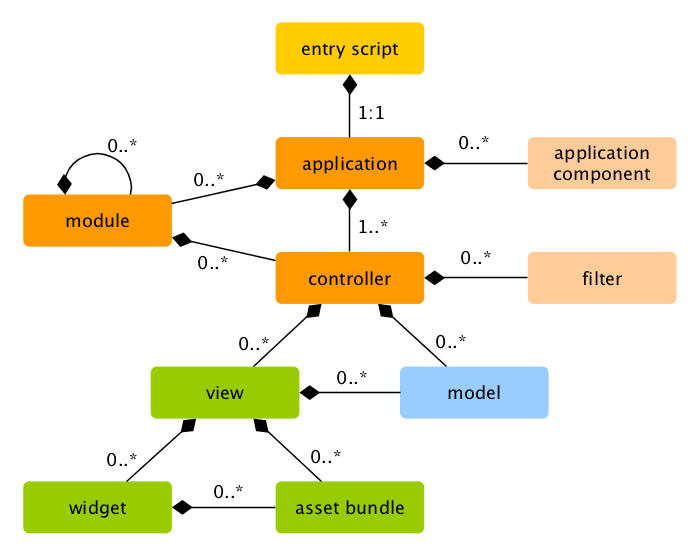

Struktura aplikacji
===================

Aplikacja Yii jest zorganizowana według wzorca architektonicznego [model-widok-kontroler (MVC)](https://pl.wikipedia.org/wiki/Model-View-Controller). 
[Modele](structure-models.md) reprezentują dane, logikę biznesową i zasady walidacji, [widoki](structure-views.md) 
są odpowiedzialne za wyświetlanie informacji związanych z modelami, a [kontrolery](structure-controllers.md) przyjmują dane wejściowe 
i przekształcają je w polecenia dla [modeli](structure-models.md) i [widoków](structure-views.md).

Oprócz MVC, w aplikacjach Yii zdefiniowane są następujące struktury:

* [skrypty wejściowe](structure-entry-scripts.md): skrypty PHP dostępne bezpośrednio dla użytkowników końcowych, 
  odpowiedzialne za uruchomienie obsługi cyklu życia żądania.
* [aplikacje](structure-applications.md): globalnie dostępne obiekty koordynujące działanie i zarządzające komponentami aplikacji.
* [komponenty aplikacji](structure-application-components.md): obiekty zarejestrowane w aplikacji, zapewniające dostępność dedykowanych usług.
* [moduły](structure-modules.md): niezależne pakiety kodu zawierające kompletną wewnętrzną strukturę MVC.
  Aplikacja może być zorganizowana modułowo.
* [filtry](structure-filters.md): reprezentują kod, który musi być wykonany przed i po obsłużeniu każdego z żądań kontrolera.
* [widżety](structure-widgets.md): obiekty, które mogą być dołączone w [widokach](structure-views.md). Mogą zawierać logikę kontrolera 
  i być wykorzystane wielokrotnie w różnych miejscach.

Poniższy diagram ilustruje statyczną strukturę aplikacji:

