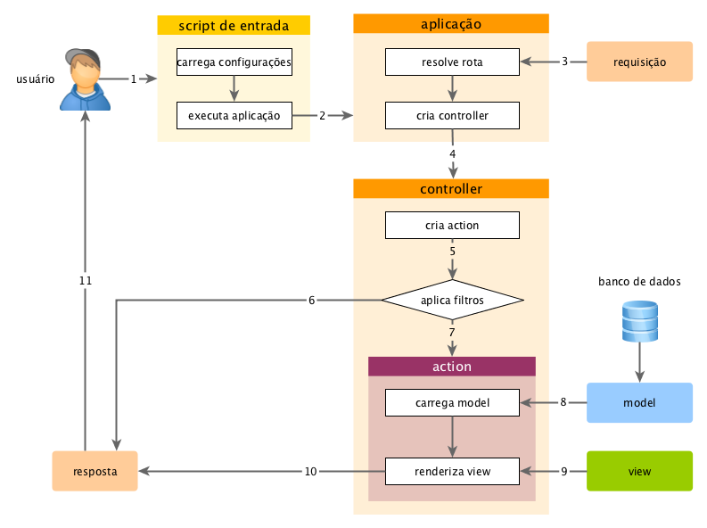

Visão Geral
===========

Cada vez que uma aplicação Yii processa uma requisição, ele passa por um fluxo 
de trabalho parecido como o seguinte:

1. Um usuário faz uma pedido para o [script de entrada](structure-entry-scripts.md) 
   `web/index.php`.
2. O script de entrada carrega a [configuração](concept-configurations.md) da 
   aplicação e cria uma instância da [aplicação](structure-applications.md) para 
   processar o pedido.
3. A aplicação resolve a [rota](runtime-routing.md) solicitada com a ajuda do 
   componente [request](runtime-requests.md) da aplicação.
4. A aplicação cria uma instância do [controller (controlador)](structure-controllers.md) 
   para processar o pedido.
5. O controller (controlador) cria uma instância da [ação](structure-controllers.md) 
   e executar os filtros para a ação.
6. Se qualquer filtro falhar, a ação será cancelada.
7. Se todos os filtros passarem, a ação será executada.
8. A ação carrega os dados do model (modelo), possivelmente a partir de um banco 
   de dados.
9. A ação renderiza uma view (visão), com os dados fornecidos pelo model (modelo).
10. O resultado da renderização é devolvida para o componente [response](runtime-responses.md) 
    da aplicação.
11. O componente response envia o resultado da renderização para o navegador do 
    usuário.

O diagrama a seguir mostra como uma aplicação processa um pedido.

Nesta seção, descreveremos com mais detalhes como alguns destes passos trabalham.
