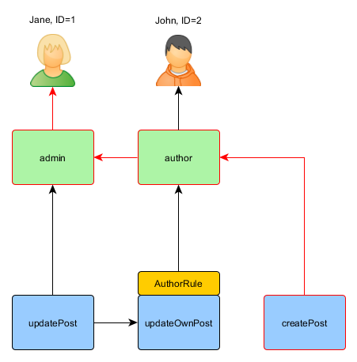

Autorização
=========

Autorização é o processo que verifica se um usuário tem permissão para fazer alguma coisa. O Yii fornece dois métodos de autorização: Filtro de Controle de Acesso (ACF) e Controle de Acesso Baseado em Role (RBAC).


## Filtro de Controle de Acesso <span id="access-control-filter"></span>

O Filtro de Controle de Acesso (ACF) é um método simples de autorização implementado como [[yii\filters\AccessControl]] que é mais indicado para aplicações que só precisam de algum controle de acesso simples. Como o próprio nome indica, ACF é uma ação de [filtro](structure-filters.md) que pode ser usada em um controller (controlador) ou um módulo. Enquanto um usuário faz uma solicitação para executar uma ação, ACF verificará a lista de  [[yii\filters\AccessControl::rules|regras de acesso]] para determinar se o usuário tem permissão para acessar a ação solicitada.

O código a seguir mostra como usar ACF no controller (controlador) `site`:

```php
use yii\web\Controller;
use yii\filters\AccessControl;

class SiteController extends Controller
{
   public function behaviors()
   {
       return [
           'access' => [
               'class' => AccessControl::class,
               'only' => ['login', 'logout', 'signup'],
               'rules' => [
                   [
                       'allow' => true,
                       'actions' => ['login', 'signup'],
                       'roles' => ['?'],
                   ],
                   [
                       'allow' => true,
                       'actions' => ['logout'],
                       'roles' => ['@'],
                   ],
               ],
           ],
       ];
   }
   // ...
}
```

No código acima do ACF é anexado ao controller (controlador) `site` como um behavior (comportamento). Esta é a maneira habitual de utilizar uma ação
filtro. A opção `only` determina que o ACF só deva ser aplicado nas ações `login`, `logout` e `signup`.
Todas as outras ações no controller (controlador) não estão sujeitas ao controle de acesso. A opção `rules` lista as [[yii\filters\AccessRule|regras de acesso]], onde se lê da seguinte forma:

- Permite todos os usuários convidados (ainda não autorizados) acessar as ações `login` e `signup`. A opção `roles` contém um ponto de interrogação `?` que é um token especial que representa "usuários convidados".
- Permite que usuários autenticados acessem a ação `logout`. O caractere `@` é outro token especial que representa "usuários autenticados".

O ACF executa a verificação de autorização examinando as regras de acesso, uma por uma de cima para baixo até encontrar uma regra que corresponda ao contexto de execução atual. O valor da opção `allow` corresponde a regra que irá dizer se o usuário está autorizado ou não. Se nenhuma das regras forem correspondidas, significa que o usuário não está autorizado, e o ACF vai parar a próxima execução.

Quando o ACF determina que um usuário não está autorizado a acessar a ação atual, ele toma a seguinte medida por padrão:

* Se o usuário é convidado, será chamado [[yii\web\User::loginRequired()]] para redirecionar o navegador do usuário para a página de login.
* Se o usuário já está autenticado, ele lançará um [[yii\web\ForbiddenHttpException]].

Você pode personalizar este behavior configurando a propriedade  [[yii\filters\AccessControl::denyCallback]] da seguinte forma:

```php
[
   'class' => AccessControl::class,
   ...
   'denyCallback' => function ($rule, $action) {
       throw new \Exception('Você não está autorizado a acessar esta página');
   }
]
```

As [[yii\filters\AccessRule|regras de acesso]] suporta muitas opções. A seguir, está um resumo das opções suportadas. Você também pode estender [[yii\filters\AccessRule]] para criar suas próprias classes personalizadas de regras de acesso.

* [[yii\filters\AccessRule::allow|allow]]: especifica se é uma regra para "permitir" ou "negar".

* [[yii\filters\AccessRule::actions|actions]]: especifica quais ações essa regra corresponde. Deve ser um array de IDs das ações. A comparação é case-sensitive. Se esta opção estiver vazia ou não definida, isso significa que a regra se aplica a todas as ações.

* [[yii\filters\AccessRule::controllers|controllers]]: especifica que controllers (controlador) esta regra corresponde. Deve ser um array de IDs de controller. A comparação é case-sensitive. Se esta opção estiver vazia ou não definida, isso significa que a regra se aplica a todos controllers.

* [[yii\filters\AccessRule::roles|roles]]: especifica quais roles de usuários que esta regra corresponde. Dois caracteres especiais são reconhecidos, e eles são verificados através [[yii\web\User::isGuest]]:

    - `?`: corresponde a um usuário convidado (ainda não autenticado)
    - `@`: corresponde a um usuário autenticado

  A utilização de outros nomes invocará o método [[yii\web\User::can()]], que requer RBAC permitindo (a ser descrito na próxima subsecção). Se esta opção estiver vazia ou não definida, significa que esta regra se aplica a todas as roles.

* [[yii\filters\AccessRule::ips|ips]]: especifica quais  [[yii\web\Request::userIP|client IP addresses]] esta regra corresponde. Um endereço de ip pode conter o coringa `*` no final para que ele corresponda endereços IP com o mesmo prefixo.
Por exemplo, '192.168.*' corresponde a todos os endereços IPs no seguimento '192.168.'. Se esta opção estiver vazia ou não definida, significa que esta regra se aplica a todos os endereços IPs.

* [[yii\filters\AccessRule::verbs|verbs]]: especifica quais métodos de request (ex. `GET`, `POST`) esta regra corresponde. A comparação é case-insensitive.

* [[yii\filters\AccessRule::matchCallback|matchCallback]]: especifica um PHP callable que deve ser chamado para determinar se esta regra deve ser aplicada.

* [[yii\filters\AccessRule::denyCallback|denyCallback]]: especifica um PHP callable que deve ser chamado quando esta regra negar o acesso.

Abaixo está um exemplo que mostra como fazer uso da opção `matchCallback`, que lhe permite escrever uma lógica arbritária de validação de acesso:


```php
use yii\filters\AccessControl;

class SiteController extends Controller
{
   public function behaviors()
   {
       return [
           'access' => [
               'class' => AccessControl::class,
               'only' => ['special-callback'],
               'rules' => [
                   [
                       'actions' => ['special-callback'],
                       'allow' => true,
                       'matchCallback' => function ($rule, $action) {
                           return date('d-m') === '31-10';
                       }
                   ],
               ],
           ],
       ];
   }

   // Match callback chamada! Esta página pode ser acessado somente a cada 31 de outubro
   public function actionSpecialCallback()
   {
       return $this->render('happy-halloween');
   }
}
```


## Controle de Acesso Baseado em Role (RBAC) <span id="rbac"></span>

Controle de Acesso Baseado em Role (RBAC) fornece um simples porém poderoso controle de acesso centralizado. Por favor, consulte [Wikipedia](http://en.wikipedia.org/wiki/Role-based_access_control) para obter detalhes sobre comparação de RBAC com outros sistemas de controle de acesso mais tradicionais.

Yii implementa um RBAC Hierárquico genérico, conforme [NIST RBAC model](http://csrc.nist.gov/rbac/sandhu-ferraiolo-kuhn-00.pdf). Ele fornece as funcionalidades RBAC através do [componente de aplicação](structure-application-components.md) [[yii\rbac\ManagerInterface|authManager]].

O uso do RBAC divide-se em duas partes. A primeira parte é construir os dados de autorização RBAC, e a segunda parte é usar os dados de autorização para executar verificação de acesso em locais onde ela é necessária.

Para facilitar a próxima descrição, vamos primeiro introduzir alguns conceitos básicos do RBAC.


### Conceitos Básicos <span id="basic-concepts"></span>

Uma role representa uma coleção de *permissões* (ex. criar posts, atualizar posts). Uma role pode ser atribuído a um ou vários usuários. Para verificar se um usuário tem uma permissão especifica, podemos verificar se o usuário está associado a uma role que contém esta permissão.

Associado com cada role ou permissão, pode haver uma *regra*. Uma regra representa uma parte do código que será executado durante verificação de acesso para determinar se a role ou permissão correspondentes se aplicam ao usuário corrente.
Por exemplo, a permissão para "atualizar post" pode ter uma regra que verifica se  o usuário corrente é quem criou o post.
Durante a verificação de acesso, se o usuário NÃO for quem criou o post, ele não terá permissão para "atualizar o post".

Ambos roles e permissões podem ser organizadas numa hierarquia. Em particular, uma role pode constituída de outras roles ou permissões; e uma permissão pode consistir em outras permissões. Yii implementa uma hierarquia de *ordem parcial* que inclui a hierarquia de *árvore* mais especial. Enquanto uma role pode conter uma permissão, o inverso não é verdadeiro.


### Configurando RBAC <span id="configuring-rbac"></span>

Antes de partimos para definir dados de autorização e realizar a verificação de acesso, precisamos configurar o componente de aplicação [[yii\base\Application::authManager|authManager]]. Yii oferece dois tipos de gerenciadores de autorização: [[yii\rbac\PhpManager]] e [[yii\rbac\DbManager]]. O primeiro utiliza um script PHP para armazena os dados de autorização, enquanto o último armazena os dados de autorização no banco. Você pode considerar o uso do primeiro se a sua aplicação não requerer um gerenciamento  muito dinâmico das role e permissões.


#### Usando`PhpManager` <span id="using-php-manager"></span>

O código a seguir mostra como configurar o `authManager` na configuração da aplicação utilizando a classe [[yii\rbac\PhpManager]]:

```php
return [
   // ...
   'components' => [
       'authManager' => [
           'class' => 'yii\rbac\PhpManager',
       ],
       // ...
   ],
];
```

O `authManager` agora pode ser acessado via `\Yii::$app->authManager`.

Por padrão, [[yii\rbac\PhpManager]] armazena os dados RBAC em arquivos sob o diretório `@app/rbac` . Verifique se o diretório e todos os arquivos estão com direito de escrita pelo processo do servidor da Web caso seja necessário realizar alteração on-line.


#### Usando `DbManager` <span id="using-db-manager"></span>

O código a seguir mostra como configurar o `authManager` na configuração da apilcação utilizando a classe [[yii\rbac\DbManager]]:

```php
return [
   // ...
   'components' => [
       'authManager' => [
           'class' => 'yii\rbac\DbManager',
       ],
       // ...
   ],
];
```

`DbManager` usa quatro tabelas de banco de dados para armazenar seus dados:

- [[yii\rbac\DbManager::$itemTable|itemTable]]: tabela para armazenar itens de autorização. O padrão é "auth_item".
- [[yii\rbac\DbManager::$itemChildTable|itemChildTable]]: tabela para armazenar hierarquia de itens de autorização. O padrão é "auth_item_child".
- [[yii\rbac\DbManager::$assignmentTable|assignmentTable]]: tabela para armazenar tarefas de itens de autorização. O padrão é "auth_assignment".
- [[yii\rbac\DbManager::$ruleTable|ruleTable]]: tabela para armazenar as regras. O padrão é "auth_rule". Antes de começar é preciso criar essas tabelas no banco de dados . Para fazer isto, você pode usar o migration armazenado em `@yii/rbac/migrations`:

`yii migrate --migrationPath=@yii/rbac/migrations`

O `authManager` já pode ser acessado via `\Yii::$app->authManager`.


### Construindo Dados de Autorização <span id="generating-rbac-data"></span>

Para construir dados de autorização devem ser realizadas as seguintes tarefas:

- definir roles e permissões;
- estabelecer relações entre roles e permissões;
- definir regras;
- associar regras com roles e permissões;
- atribuir roles a usuários.


Dependendo dos requisitos de flexibilidade de autorização das tarefas acima poderia ser feito de maneiras diferentes.

Se a sua hierarquia de permissões não se altera e você tem um número fixo de usuários pode-se criar um [console command](tutorial-console.md#create-command) que irá iniciar os dados de autorização uma vez através das APIs oferecidas pelo `authManager`:

```php
<?php
namespace app\commands;

use Yii;
use yii\console\Controller;

class RbacController extends Controller
{
   public function actionInit()
   {
       $auth = Yii::$app->authManager;

       // adciona a permissão "createPost"
       $createPost = $auth->createPermission('createPost');
       $createPost->description = 'Create a post';
       $auth->add($createPost);

       // adciona a permissão  "updatePost"
       $updatePost = $auth->createPermission('updatePost');
       $updatePost->description = 'Update post';
       $auth->add($updatePost);

       // adciona a role "author" e da a esta role a permissão "createPost"
       $author = $auth->createRole('author');
       $auth->add($author);
       $auth->addChild($author, $createPost);

       // adciona a role "admin" e da a esta role a permissão "updatePost"
       // bem como as permissões da role "author"
       $admin = $auth->createRole('admin');
       $auth->add($admin);
       $auth->addChild($admin, $updatePost);
       $auth->addChild($admin, $author);

       // Atribui roles para usuários. 1 and 2 são IDs retornados por IdentityInterface::getId()
       // normalmente implementado no seu model User.
       $auth->assign($author, 2);
       $auth->assign($admin, 1);
   }
}
```

Depois de executar o comando com `yii rbac/init` nós vamos chegar a seguinte hierarquia:


Author pode criar post, admin pode atualizar post e fazer tudo que author pode.

Se a sua aplicação permite inscrição de usuários, você precisa atribuir roles a esses novos usuários. Por exemplo, para que todos os usuários inscritos tornem-se authors, no seu template avançado de projeto você precisa modificar o `frontend\models\SignupForm::signup()`
conforme abaixo:

```php
public function signup()
{
   if ($this->validate()) {
       $user = new User();
       $user->username = $this->username;
       $user->email = $this->email;
       $user->setPassword($this->password);
       $user->generateAuthKey();
       $user->save(false);

       // foram adicionadas as seguintes três linhas:
       $auth = Yii::$app->authManager;
       $authorRole = $auth->getRole('author');
       $auth->assign($authorRole, $user->getId());

       return $user;
   }

   return null;
}
```

Para aplicações que requerem controle de acesso complexo com dados de autorização atualizados dinamicamente, interfaces de usuário especiais
(Isto é: painel de administração) pode ser necessário desenvolver usando APIs oferecidas pelo `authManager`.


### Usando Regras <span id="using-rules"></span>

Como já mencionado, regras coloca restrição adicional às roles e permissões. Uma regra é uma classe que se estende de [[yii\rbac\Rule]]. Ela deve implementar o método [[yii\rbac\Rule::execute()|execute()]]. Na hierarquia que criamos anteriormente, author não pode editar seu próprio post. Vamos corrigir isto. Primeiro nós precisamos de uma regra para verificar se o usuário é o autor do post:

```php
namespace app\rbac;

use yii\rbac\Rule;

/**
* Verifica se o authorID corresponde ao usuário passado via  parâmetro
*/
class AuthorRule extends Rule
{
   public $name = 'isAuthor';

   /**
    * @param string|int $user the user ID.
    * @param Item $item the role or permission that this rule is associated with
    * @param array $params parameters passed to ManagerInterface::checkAccess().
    * @return bool a value indicating whether the rule permits the role or permission it is associated with.
    */
   public function execute($user, $item, $params)
   {
       return isset($params['post']) ? $params['post']->createdBy == $user : false;
   }
}
```

A regra acima verifica se o `post` foi criado pelo `$user`. Nós vamos criar uma permissão especial `updateOwnPost` no comando que usamos previamente:

```php
$auth = Yii::$app->authManager;

// adciona a regra
$rule = new \app\rbac\AuthorRule;
$auth->add($rule);

// adciona a permissão "updateOwnPost" e associar a regra com ela.
$updateOwnPost = $auth->createPermission('updateOwnPost');
$updateOwnPost->description = 'Update own post';
$updateOwnPost->ruleName = $rule->name;
$auth->add($updateOwnPost);

// "updateOwnPost" será usado no "updatePost"
$auth->addChild($updateOwnPost, $updatePost);

// autoriza "author"  a atualizar seus próprios posts
$auth->addChild($author, $updateOwnPost);
```

Agora temos a seguinte hierarquia:


### Verificação de Acesso <span id="access-check"></span>

Com os dados de autorização prontos, você pode verificar o acesso simplesmente chamando o método [[yii\rbac\ManagerInterface::checkAccess()]]. Como a maioria das verificações de acesso é sobre o usuário corrente, por conveniência, o Yii fornece um método de atalho [[yii\web\User::can()]], que pode ser usado como a seguir:

```php
if (\Yii::$app->user->can('createPost')) {
   // create post
}
```

Se o usuário corrente é Jane com `ID=1` começaremos com `createPost` e tentaremos chegar à `Jane`:



A fim de verificar se o usuário pode atualizar um post, precisamos passar um parâmetro extra que é requerido por `AuthorRule` descrito abaixo:

```php
if (\Yii::$app->user->can('updatePost', ['post' => $post])) {
   // update post
}
```

Aqui está o que acontece se o usuário atual é John:


Nós começamos com o `updatePost` e passamos por `updateOwnPost`. Para passar pela verificação de acesso, `AuthorRule` deve retornar `true` no seu método `execute()`. O método recebe `$params` da chamada do método `can()` de modo que o valor é `['post' => $post]`. Se tudo estiver correto, vamos chegar a `author` que é atribuído a John.

No caso de Jane é um pouco mais simples, uma vez que ela é um administrador:


### Usando Roles Padrões <span id="using-default-roles"></span>

Uma role padrão é uma role que é *implicitamente* atribuída a *todos* os usuários. A chamada a [[yii\rbac\ManagerInterface::assign()]] não é necessária, e os dados de autorização não contém informação de atribuição.

Uma role padrão é geralmente associada com uma regra que determina se a role aplica-se ao do usuário que está sendo verificado.

Roles padrões são muitas vezes utilizados em aplicações que já têm algum tipo de atribuição de role. Por exemplo, uma aplicação pode ter uma coluna de "grupo" em sua tabela de usuário para representar a que grupo de privilégio cada usuário pertence.
Se cada grupo privilégio pode ser mapeado para uma RBAC role, você pode usar o recurso de role padrão para associar automaticamente cada usuário ao role de RBAC. Vamos usar um exemplo para mostrar como isso pode ser feito.

Suponha que na tabela user, você tem uma coluna `group` que usa 1 para representar o grupo administrator e 2 o grupo author.
Você pretende ter duas roles RBAC `admin` and `author` para representar as permissões para estes dois grupos, respectivamente. Você pode configurar os dados da RBAC da seguinte forma,


```php
namespace app\rbac;

use Yii;
use yii\rbac\Rule;

/**
* Verifica se o grupo de usuário corresponde
*/
class UserGroupRule extends Rule
{
   public $name = 'userGroup';

   public function execute($user, $item, $params)
   {
       if (!Yii::$app->user->isGuest) {
           $group = Yii::$app->user->identity->group;
           if ($item->name === 'admin') {
               return $group == 1;
           } elseif ($item->name === 'author') {
               return $group == 1 || $group == 2;
           }
       }
       return false;
   }
}

$auth = Yii::$app->authManager;

$rule = new \app\rbac\UserGroupRule;
$auth->add($rule);

$author = $auth->createRole('author');
$author->ruleName = $rule->name;
$auth->add($author);
// ... adiciona permissões como filhas de  $author ...

$admin = $auth->createRole('admin');
$admin->ruleName = $rule->name;
$auth->add($admin);
$auth->addChild($admin, $author);
// ... adiciona permissões como filhas de  $admin ...
```

Note que no exemplo acima, porque "author" é adicionado como filho de  "admin", quando você implementar o método `execute()` da classe rule, você também precisa respeitar essa hierarquia. É por isso que quando o nome da role é "author", o método `execute()` retornará  `true` se o grupo de usuário for 1 or 2 (significa que o usuário está no grupo "admin" ou "author").

Em seguida, configure `authManager` listando as duas roles [[yii\rbac\BaseManager::$defaultRoles]]:

```php
return [
   // ...
   'components' => [
       'authManager' => [
           'class' => 'yii\rbac\PhpManager',
           'defaultRoles' => ['admin', 'author'],
       ],
       // ...
   ],
];
```

Agora, se você executar uma verificação de acesso, ambas as roles `admin` e `author` serão verificadas através da avaliação das regras associado com elas. se a regra retornar `true`, isso significa que a role se aplica ao usuário atual. A partir da implementação da regra acima, isto significa que se o valor do ‘grupo’ de um usuário for 1, a role `admin` seria aplicável ao usuário; e se o valor do `grupo` for 2, seria a role `author`.


