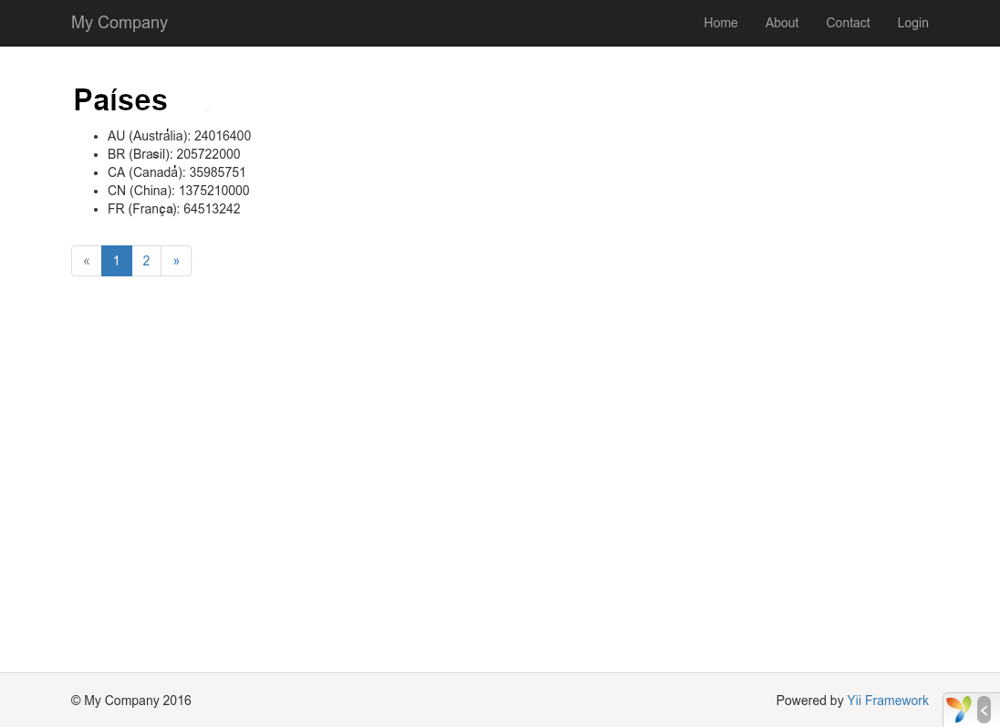

Trabalhando com Bancos de Dados
===============================

Esta seção descreverá como criar uma nova página que exibe dados de países
buscados de uma tabela do banco de dados chamada `country`. Para isso, você
configurará uma conexão com o banco de dados, criará uma classe de
[Active Record](db-active-record.md), definirá uma [action](structure-controllers.md) (ação),
e criará uma [view](structure-views.md) (visão).

Através deste tutorial, você aprenderá como:

* Configurar uma conexão de BD
* Definir uma classe de Active Record
* Consultar dados usando a classe de Active Record
* Exibir dados em uma view de forma paginada

Perceba que para terminar essa seção, você deve ter conhecimento e experiência
básica usando bancos de dados. Em particular, você deveria saber como criar um
banco de dados, e como executar instruções SQL usando uma ferramenta de cliente
de BD.


Preparando o Banco de Dados <span id="preparing-database"></span>
---------------------------

Para começar, crie um banco de dados chamado `yii2basic`, a partir do qual você
buscará os dados em sua aplicação. Você pode criar um banco de dados SQLite, MySQL,
PostgreSQL, MSSQL ou Oracle, já que o Yii tem suporte embutido a muitas aplicações
de bancos de dados. Por questões de simplicidade, será assumido o uso do MySQL
na descrição a seguir.

Em seguida, crie uma tabela chamada `country` no banco de dados, e insira alguns
dados de exemplo. Você pode rodar as seguintes declarações SQL para fazê-lo:

```sql
CREATE TABLE `country` (
  `code` CHAR(2) NOT NULL PRIMARY KEY,
  `name` CHAR(52) NOT NULL,
  `population` INT(11) NOT NULL DEFAULT '0'
) ENGINE=InnoDB DEFAULT CHARSET=utf8;

INSERT INTO `country` VALUES ('AU','Australia',24016400);
INSERT INTO `country` VALUES ('BR','Brazil',205722000);
INSERT INTO `country` VALUES ('CA','Canada',35985751);
INSERT INTO `country` VALUES ('CN','China',1375210000);
INSERT INTO `country` VALUES ('DE','Germany',81459000);
INSERT INTO `country` VALUES ('FR','France',64513242);
INSERT INTO `country` VALUES ('GB','United Kingdom',65097000);
INSERT INTO `country` VALUES ('IN','India',1285400000);
INSERT INTO `country` VALUES ('RU','Russia',146519759);
INSERT INTO `country` VALUES ('US','United States',322976000);
```

Neste ponto, você tem um banco de dados chamado `yii2basic`, e dentro dele uma
tabela `country` com três colunas, contendo dez linhas de dados.

Configurando uma Conexão do BD <span id="configuring-db-connection"></span>
------------------------------

Antes de prosseguir, certifique-se de que você possui instalados tanto a
extensão [PDO](http://www.php.net/manual/en/book.pdo.php) do PHP quanto o driver
do PDO para a base que você está usando (por exemplo, `pdo_mysql` para o MySQL).
Este é um requisito básico se a sua aplicação usa um banco de dados relacional.

Tendo estes instalados, abra o arquivo `config/db.php` e mude os parâmetros para
que estejam corretos para o seu banco de dados. Por padrão, o arquivo contém
o seguinte:

```php
<?php

return [
    'class' => 'yii\db\Connection',
    'dsn' => 'mysql:host=localhost;dbname=yii2basic',
    'username' => 'root',
    'password' => '',
    'charset' => 'utf8',
];
```

O arquivo `config/db.php` é uma ferramenta de [configuração](concept-configurations.md)
típica baseada em arquivos. Este arquivo de configuração em particular especifica
os parâmetros necessários para criar e inicializar uma instância de [[yii\db\Connection]]
através da qual você pode fazer consultas de SQL ao banco de dados subjacente.

A conexão de BD configurada acima pode ser acessada no código da aplicação
através da expressão `Yii::$app->db`.

> Informação: O arquivo `config/db.php` será incluso pela configuração principal da
  aplicação `config/web.php`, que especifica como a instância da [aplicação](structure-applications.md)
  deverá ser inicializada. Para mais informações, por favor consulte a seção sobre [Configurações](concept-configurations.md).


Criando um Active Record <span id="creating-active-record"></span>
------------------------

Para representar e buscar os dados da tabela `country`, crie uma classe que
deriva de [Active Record](db-active-record.md) chamada `Country`, e salve-a
no arquivo `models/Country.php`.

```php
<?php

namespace app\models;

use yii\db\ActiveRecord;

class Country extends ActiveRecord
{
}
```

A classe `Country` estende de [[yii\db\ActiveRecord]]. Você não precisa escrever
nenhum código nela! Só com o código acima, o Yii adivinhará o nome da tabela
associada a partir do nome da classe.

> Informação: Se não houver nenhuma correspondência direta do nome da classe com o nome
  da tabela, você pode sobrescrever o método [[yii\db\ActiveRecord::tableName()]] 
  para especificar explicitamente o nome da tabela associada.

Usando a classe `Country`, você pode manipular facilmente os dados na tabela
`country`, conforme é demonstrado nestes fragmentos:

```php
use app\models\Country;

// obtém todas as linhas da tabela country e as ordena pela coluna "name"
$countries = Country::find()->orderBy('name')->all();

// obtém a linha cuja chave primária é "US"
$country = Country::findOne('US');

// exibe "United States"
echo $country->name;

// altera o nome do país para ser "U.S.A." e o salva no banco de dados
$country->name = 'U.S.A.';
$country->save();
```

> Informação: O Active Record é uma maneira poderosa de acessar e manipular os dados
  do banco de dados de uma forma orientada a objeto. Você pode encontrar informações
  mais detalhadas na seção [Active Record](db-active-record.md). Alternativamente,
  você também pode interagir com o banco de dados usando um método de acesso aos
  dados de baixo nível chamado [Data Access Objects](db-dao.md).


Criando uma Action <span id="creating-action"></span>
------------------

Para expor os dados de países aos usuários finais, você precisaria de uma nova
action. Ao invés de colocar a nova action no controller (controlador) `site`,
como você fez nas seções anteriores, faz mais sentido criar um novo controller
especificamente para todas as actions relacionadas aos dados de países. Chame
este novo controller de `CountryController`, e crie uma action `index` nele,
conforme o exemplo a seguir.

```php
<?php

namespace app\controllers;

use yii\web\Controller;
use yii\data\Pagination;
use app\models\Country;

class CountryController extends Controller
{
    public function actionIndex()
    {
        $query = Country::find();

        $pagination = new Pagination([
            'defaultPageSize' => 5,
            'totalCount' => $query->count(),
        ]);

        $countries = $query->orderBy('name')
            ->offset($pagination->offset)
            ->limit($pagination->limit)
            ->all();

        return $this->render('index', [
            'countries' => $countries,
            'pagination' => $pagination,
        ]);
    }
}
```

Salve o código acima em um arquivo `controllers/CountryController.php`.

A action `index` chama `Country::find()`. Este método do Active Record constrói
uma consulta do BD e retorna todos os dados da tabela `country`. Para limitar o
número de países retornados em cada requisição, a consulta é paginada com a ajuda
de um objeto [[yii\data\Pagination]]. O objeto `Pagination` serve para dois propósitos:

* Definir as cláusulas `offset` e `limit` da declaração SQL representada pela
  consulta de modo que apenas retorne uma única página de dados por vez (no máximo
  5 linhas por página).
* É usado para que a view exiba um paginador que consite de uma lista de botões
  para as páginas, conforme será explicado na próxima sub-seção.

No final do código, a action `index` renderiza uma view chamada `index`, e passa
para ela os dados dos países bem como as informações de paginação.


Criando uma View <span id="creating-view"></span>
----------------

Dentro do diretório `views`, primeiro crie um sub-diretório chamado `country`.
Esta pasta será usada para guardar todas as views renderizadas pelo controller
`country`. Dentro do diretório `views/country`, crie um arquivo `index.php`
contendo o seguinte:

```php
<?php
use yii\helpers\Html;
use yii\widgets\LinkPager;
?>
<h1>Countries</h1>
<ul>
<?php foreach ($countries as $country): ?>
    <li>
        <?= Html::encode("{$country->name} ({$country->code})") ?>:
        <?= $country->population ?>
    </li>
<?php endforeach; ?>
</ul>

<?= LinkPager::widget(['pagination' => $pagination]) ?>
```

A view tem duas seções relativas à exibição dos dados dos países. Na primeira parte,
os dados de países fornecidos são cruzados e renderizados como uma lista do HTML.
Na segunda parte, um widget [[yii\widgets\LinkPager]] é renderizado usando as
informações de paginação passadas pela action. O widget `LinkPager` exibe uma
lista de botões para as páginas. Ao clicar em qualquer um deles atualizará
os dados dos países com a página correspondente.


Testando <span id="trying-it-out"></span>
--------

Para verificar se todo os códigos acima funcionam, use o seu navegador para
acessar a seguinte URL:

```
http://hostname/index.php?r=country/index
```



Primeiramente, você verá uma lista exibindo cinco países. Abaixo dos países,
você verá um paginador com quatro botões. Se você clicar no botão "2", você
verá a página exibindo outros cinco países no banco de dados: a segunda
página de registros. Observe mais cuidadosamente e você perceberá que a URL no
browser mudou para

```
http://hostname/index.php?r=country/index&page=2
```

Por baixo dos panos, [[yii\data\Pagination|Pagination]] está fornecendo toda
a funcionalidade necessária para paginar um conjunto de dados:

* Inicialmente, [[yii\data\Pagination|Pagination]] representa a primeira página,
  que reflete a consulta SELECT de países com a cláusula `LIMIT 5 OFFSET 0`.
  Como resultado, os primeiros cinco países serão buscados e exibidos.
* O widget [[yii\widgets\LinkPager|LinkPager]] renderiza os botões das páginas
  usando as URLs criadas pelo [[yii\data\Pagination::createUrl()|Pagination]].
  As URLs conterão um parâmetro `page`, que representa os diferentes números de
  páginas.
* Se você clicar no botão da página "2", uma nova requisição para a rota
  `country/index` será disparada e tratada. [[yii\data\Pagination|Pagination]] lê
  o parâmetro `page` da URL e define o número da página atual como sendo 2. A nova
  consulta de países então terá a cláusula `LIMIT 5 OFFSET 5` e retornará os
  próximos cinco países para a exibição.


Resumo <span id="summary"></span>
------

Nesta seção, você aprendeu como trabalhar com um banco de dados. Você também
aprendeu como buscar e exibir dados em páginas com a ajuda do
[[yii\data\Pagination]] e do [[yii\widgets\LinkPager]].

Na próxima seção, você aprenderá como usar a poderosa ferramenta geradora de códigos,
chamada [Gii](tool-gii.md), para ajudá-lo a implementar rapidamente algumas
funcionalidades comumente necessárias, tais como as operações CRUD
(Criar-Ler-Atualizar-Excluir) para trabalhar com os dados em uma tabela do
banco de dados. Na verdade, todo o código que você acabou de escrever pode ser
gerado automaticamente no Yii usando a ferramenta Gii.
