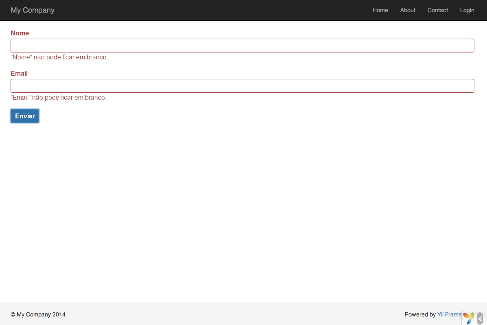
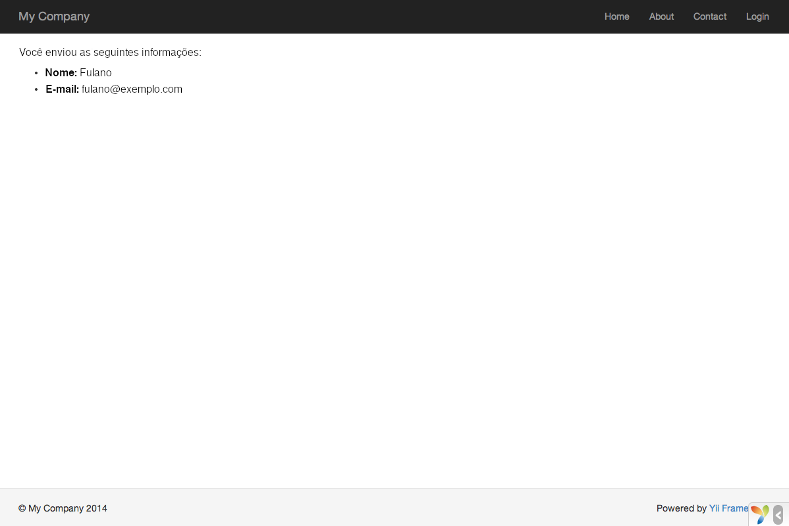

Trabalhando com Formulários
===========================

Esta seção descreve como criar uma nova página com um formulário para receber
dados dos usuários. A página exibirá um formulário com um campo para o nome e outro para o e-mail. Depois de obter essas duas informações do usuário, a página exibirá os valores inseridos de volta para confirmação.

Para alcançar esse objetivo, além de criar uma [action](structure-controllers.md) e
duas [views](structure-views.md), você também criará um [model](structure-models.md).

No decorrer deste tutorial, você aprenderá como:

* criar um [model](structure-models.md) para representar os dados que o usuário insere por meio de um formulário
* declarar regras (rules) para validar os dados inseridos
* criar um formulário HTML em uma [view](structure-views.md)


Criando um Model <span id="creating-model"></span>
----------------

Os dados a serem solicitados do usuário serão representados por uma classe model
`FormularioDeRegistro`, como visto a seguir, que será salva no arquivo `models/FormularioDeRegistro.php`. Por
favor, consulte a seção [Autoloading de Classes](concept-autoloading.md) para mais
detalhes sobre convenção de nomenclatura de arquivos de classes.

```php
<?php

namespace app\models;

use Yii;
use yii\base\Model;

class FormularioDeRegistro extends Model
{
    public $nome;
    public $e_mail;

    public function rules()
    {
        return [
            [['nome', 'e_mail'], 'required'],
            [['e_mail'], 'email'],
        ];
    }
}
```

A classe estende de [[yii\base\Model]], uma classe base fornecida pelo Yii comumente usada para representar dados de formulários.

> Info: [[yii\base\Model]] é usado como pai das classes de models que *não*
são associadas com tabelas de bancos de dados.
Enquanto [[yii\db\ActiveRecord]], como pai das classes de models que correspondem a tabelas de bancos de dados.

A classe `FormularioDeRegistro` contém dois atributos públicos, `nome` e `e_mail`, que são
usados para armazenar os dados fornecidos pelo usuário. Ele também contém um método
chamado `rules()`, que retorna um conjunto de regras para validação dos dados.
As regras de validação declaradas no código acima declaram que:

* tanto o `nome` quanto o `e_mail` são obrigatórios
* o `e_mail` deve ser preenchido com um e-mail sintaticamente válido (por exemplo, um valor sem @ não pode ser considerado válido para um e-mail, etc.)

Se você tem um objeto `FormularioDeRegistro` preenchido com dados fornecidos pelo usuário,
você pode chamar seu método [[yii\base\Model::validate()|validate()]] para iniciar as rotinas de validação dos dados. Se a validação de dados falhar, a propriedade
[[yii\base\Model::hasErrors|hasErrors]] será definida como *true* e você pode
saber quais erros de validação ocorreram por consultar [[yii\base\Model::getErrors|errors]].

```php
<?php
$model = new FormularioDeRegistro();
$model->nome = 'Fulano';
$model->e_mail = 'emailruim';
if ($model->validate()) {
    // Bom!
} else {
    // Falhou!
    // Utilize $model->getErrors()
}
```


Criando uma Action <span id="creating-action"></span>
------------------

Em seguida, você precisará criar uma action `registro` no controller `site` que usará o novo model. O processo de criação e utilização de ações foi explicado na seção
[Dizendo "Olá!"](start-hello.md).

```php
<?php

namespace app\controllers;

use Yii;
use yii\web\Controller;
use app\models\FormularioDeRegistro;

class SiteController extends Controller
{
    // ...código existente...

    public function actionRegistro()
    {
        $model = new FormularioDeRegistro();

        if ($model->load(Yii::$app->request->post()) && $model->validate()) {
            // dados válidos recebidos no $model

            // faça alguma coisa significativa com o $model aqui ...

            return $this->render('confirmar-registro', ['model' => $model]);
        } else {
            // Ou a página esta sendo exibida inicial ou houve algum erro de validação
            return $this->render('registro', ['model' => $model]);
        }
    }
}
```

A primeira action cria um objeto `FormularioDeRegistro`. Ele, então, tenta preencher o model com os dados de `$_POST`, fornecidos no Yii por [[yii\web\Request::post()]].
Se o model for preenchido (observe o método `load()`) com sucesso, ou seja, se o usuário
enviou o formulário HTML, a action chamará o [[yii\base\Model::validate()|validate()]]
para se certificar de que os valores fornecidos são válidos.

> Info: A expressão `Yii::$app` representa a instância da
  [aplicação](structure-applications.md), que é um "singleton" globalmente acessível.
  Ao mesmo tempo, é um [service locator](concept-service-locator.md) que fornece componentes
  tais como `request`, `response`, `db`, etc., para permitir funcionalidades específicas.
  No código acima, o componente `request` da instância da aplicação é usado para acessar os dados do `$_POST`.

Se tudo estiver certo, a action renderizará a view chamada `confirmar-registro` para confirmar ao usuário que os dados foram enviados corretamente. Se nenhum dado foi enviado ou se tiverem erros, a view `registro` será renderizada novamente
e seu formulário HTML voltará a ser exibido mas, dessa vez, juntamente com as mensagens de erro de validação.

> Nota: Neste exemplo muito simples, renderizamos a página de confirmação somente se os dados enviados eram válidos. Na prática, você deve considerar usar [[yii\web\Controller::refresh()|refresh()]] ou [[yii\web\Controller::redirect()|redirect()]]
  para evitar [problemas de reenvio de formulário](https://en.wikipedia.org/wiki/Post/Redirect/Get).


Criando Views <span id="creating-views"></span>
--------------

Por fim, crie dois arquivos de views chamados `confirmar-registro` e `registro`. Essas serão as views renderizadas pela action `registro`, como acabamos de descrever acima.

A view `confirmar-registro` simplesmente exibe os dados dos campos `nome` e `e_mail` e deve ser salva no arquivo `views/site/confirmar-registro.php`.

```php
<?php
use yii\helpers\Html;
?>
<p>Você enviou as seguintes informações:</p>

<ul>
    <li><label>Nome</label>: <?= Html::encode($model->nome) ?></li>
    <li><label>E-mail</label>: <?= Html::encode($model->e_mail) ?></li>
</ul>
```

A view `registro` exibe um formulário HTML e deve ser salva no arquivo `views/site/registro.php`.

```php
<?php
use yii\helpers\Html;
use yii\widgets\ActiveForm;
?>
<?php $form = ActiveForm::begin(); ?>

    <?= $form->field($model, 'nome') ?>

    <?= $form->field($model, 'e_mail') ?>

    <div class="form-group">
        <?= Html::submitButton('Enviar', ['class' => 'btn btn-primary']) ?>
    </div>

<?php ActiveForm::end(); ?>
```

A view usa um poderoso [widget](structure-widgets.md) chamado
[[yii\widgets\ActiveForm|ActiveForm]] para construir o formulário HTML. Os métodos
`begin()` e `end()` do widget renderizam as tags de abertura e de fechamento do formulário.
Entre as duas chamadas de método, campos são criados pelo
método [[yii\widgets\ActiveForm::field()|field()]]. O primeiro campo é para o nome e o segundo é para o e-mail. Após os campos,
o método [[yii\helpers\Html::submitButton()]] é chamado para criar um botão de envio do formulário (submit).


Conferindo <span id="trying-it-out"></span>
-------------

Para ver como funciona, utilize seu navegador para acessar a seguinte URL:

```
https://hostname/index.php?r=site/registro
```

Você verá uma página exibindo um formulário com dois campos. Na frente de cada campo, um *label* indica quais dados devem ser inseridos. Se você clicar
no botão Enviar sem informar nenhum dado, ou se você não fornecer um e-mail
válido, você verá uma mensagem de erro próxima a cada campo com problema.



Após informar um nome e e-mail válidos e clicar no botão de enviar, você verá uma
nova página exibindo os dados informados por você.




### Mágica Explicada <span id="magic-explained"></span>

Você talvez se pergunte como o formulário HTML trabalha por trás das cortinas, já que parece
quase mágica exibir um *label* para cada campo e mostrar mensagens
de erro sem recarregar a página quando você não informa os dados corretamente.

Sim, a validação de dados inicialmente é feita no cliente usando JavaScript e, posteriormente, realizada no servidor via PHP.
O [[yii\widgets\ActiveForm]] é esperto o suficiente para extrair as regras de
validação que você declarou no `FormularioDeRegistro`, transformá-las em código JavaScript executável e usar esse
código JavaScript para realizar a validação de dados. Caso você tenha desabilitado o JavaScript em seu navegador, a validação ainda será realizada no servidor, como mostrado
no método `actionRegistro()`. Isso garante a validade dos dados em todas as circunstâncias.

> Warning: (Alerta!) A validação feita no cliente é uma conveniência que fornece uma melhor
  experiência para o usuário. A validação feita no servidor é sempre necessária, quer a validação no cliente aconteça, quer não.

Os *labels* dos campos são gerados pelo método `field()`, usando os nomes
das propriedades do model.
Por exemplo, um *label* chamado `Nome` será gerado para a propriedade `nome`.

Você pode personalizar um *label* em uma view utilizando o seguinte código:

```php
<?= $form->field($model, 'nome')->label('Seu Nome') ?>
<?= $form->field($model, 'e_mail')->label('Seu E-mail') ?>
```

> Info: O Yii fornece muitos desses widgets para ajudá-lo a construir rapidamente views dinâmicas e complexas.
  Conforme você vai aprender mais tarde, escrever um novo widget também é extremamente fácil.
  Você talvez queira transformar grande parte do código de suas views em widgets reutilizáveis
  para simplificar o desenvolvimento de views no futuro.


Resumo <span id="summary"></span>
-------

Nesta seção do guia, você teve uma introduçao à última parte do padrão de arquitetura MVC. Você aprendeu como criar uma classe model para representar os dados do usuário e validá-los.

Também aprendeu como obter os dados enviados pelos usuários e como exibi-los de
volta no navegador. Essa é uma tarefa que poderia tomar muito tempo ao desenvolver uma aplicação, mas o Yii fornece widgets poderosos que tornam o processo muito simples.

Na próxima seção, você aprenderá como trabalhar com bancos de dados, que são
necessários em quase todas as aplicações.
