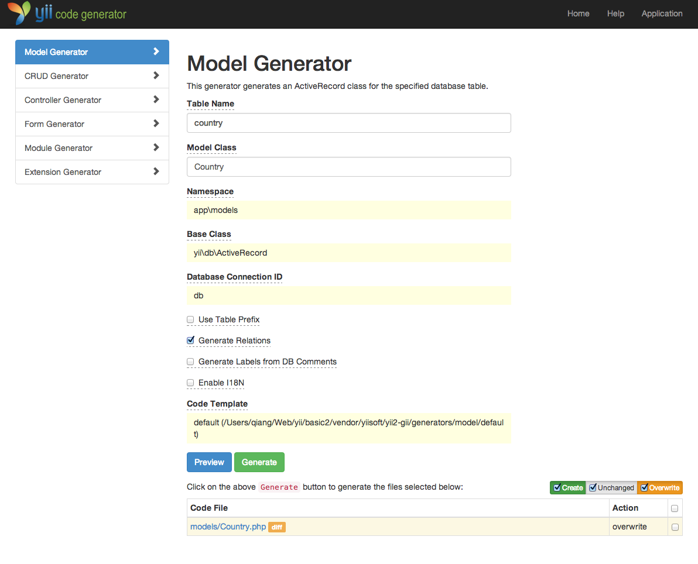

Gerando Código com Gii
========================

Essa seção irá descrever como usar o [Gii](https://github.com/yiisoft/yii2-gii/blob/master/docs/guide-pt-BR/README.md) para  gerar automaticamente código que implementa algumas funcionalidades comuns de sites. Usar o Gii para gerar código é simplesmente uma questão de informar os dados corretos conforme as instruções mostradas nas páginas do Gii.

Através desse tutorial, você irá aprender a:

* habilitar o Gii em sua aplicação,
* usar o Gii para gerar uma classe Active Record,
* usar o Gii para gerar código que implementa as operações CRUD para uma tabela do banco de dados, e
* personalizar o código gerado pelo Gii.


Começando a usar o Gii <span id="starting-gii"></span>
------------

O [Gii](https://github.com/yiisoft/yii2-gii/blob/master/docs/guide-pt-BR/README.md) é fornecido como um [módulo](structure-modules.md) do Yii. Você pode habilitar o Gii ao configurá-lo na propriedade [[yii\base\Application::modules|modules]] da aplicação. Dependendo de como você criou sua aplicação, você pode encontrar o seguinte código já pronto no arquivo de configuração `config/web.php`:

```php
$config = [ ... ];

if (YII_ENV_DEV) {
    $config['bootstrap'][] = 'gii';
    $config['modules']['gii'] = [
        'class' => 'yii\gii\Module',
    ];
}
```

A configuração acima declara que, quando estiver usando o [ambiente de desenvolvimento](concept-configurations.md#environment-constants), a aplicação deve incluir um módulo chamado `gii`, da classe [[yii\gii\Module]].

Se você verificar o [script de entrada](structure-entry-scripts.md) `web/index.php` da sua aplicação, você encontrará a seguinte linha que, basicamente, torna  `YII_ENV_DEV` verdadeira.

```php
defined('YII_ENV') or define('YII_ENV', 'dev');
```

Graças a essa linha, sua aplicação está em modo de desenvolvimento e terá o Gii habilitado, devido a configuração mais acima. Agora você pode acessar o Gii pela URL:

```
https://hostname/index.php?r=gii
```

> Note: Se você está acessando o Gii por um endereço IP que não seja o localhost, o acesso será negado por padrão, por questões de segurança.
> Você pode configurar o Gii adicionando endereços IP permitidos como mostrado a seguir:
>
```php
'gii' => [
    'class' => 'yii\gii\Module',
    'allowedIPs' => ['127.0.0.1', '::1', '192.168.0.*', '192.168.178.20'] // ajuste de acordo com suas necessidades
],
```


Gerando uma classe Active Record <span id="generating-ar"></span>
---------------------------------

Para gerar uma classe Active Record usando o Gii, selecione o "Model Generator" clicando no link na página inicial do Gii. Então, preencha o formulário como indicado abaixo:

* Nome da tabela: `pais`
* Classe do modelo: `Pais`


Em seguida, clique no botão "Preview". Você verá o `models/Pais.php` listado como arquivo a ser criado. Você pode clicar no nome do arquivo para pré-visualizar seu conteúdo.

Ao usar o Gii, se você já havia criado o mesmo arquivo e pretende sobrescrevê-lo, clique no botão `diff` próximo ao nome do arquivo para ver as diferenças entre o código a ser gerado e a versão já existente.



Quando estiver sobrescrevendo um arquivo, marque a caixa próxima a "overwrite" (sobrescrever) e clique no botão "Generate". Se estiver criando um novo arquivo, apenas clique em "Generate".

Em seguida, você verá uma página de confirmação indicando que o código foi gerado com sucesso. Se você já tinha um arquivo, também verá uma mensagem indicando que ele foi sobrescrito pelo novo código.


Gerando código CRUD <span id="generating-crud"></span>
--------------------

CRUD significa a Create, Read, Update, and Delete (criar, ler, atualizar e apagar), representando as quatro tarefas comuns feitas com os dados na maioria das aplicações. Para criar funcionalidades CRUD usando o Gii, selecione "CRUD Generator" clicando no link na página inicial do Gii. Seguindo o exemplo "pais", preencha o formulário com as seguintes informações:

* Model Class: `app\models\Pais`
* Search Model Class: `app\models\PaisSearch`
* Controller Class: `app\controllers\PaisController`


Em seguida, clique no botão "Preview". Você verá uma lista de arquivos a serem gerados, como mostrado abaixo.


Se você criou anteriormente os arquivos `controllers/PaisController.php` e
`views/pais/index.php` (na seção de banco de dados deste guia), marque a caixa "overwrite" para substitui-los. (As versões anteriores não tinham suporte completo às operações CRUD.)


Conferindo <span id="trying-it-out"></span>
-------------

Para ver como ficou, use seu navegador para acessar a seguinte URL:

```
https://hostname/index.php?r=pais/index
```

Você verá uma tabela mostrando os países do seu banco de dados. Você pode ordená-los ou filtrá-los inserindo condições nos cabeçalhos das colunas.

Para cada país exibido na tabela, você pode visualizar detalhes, editar ou excluir.
Você também pode clicar no botão “Create Pais” no topo da tabela para ter acesso a um formulário para cadastrar um novo país.


Esta é uma lista de arquivos gerados pelo Gii, caso você queira investigar como essas funcionalidades estão implementadas ou ajustá-las:

* Controller: `controllers/PaisController.php`
* Modelo: `models/Pais.php` e `models/PaisSearch.php`
* Views: `views/pais/*.php`

> Info: o Gii é projetado para ser uma ferramenta altamente adaptável e extensível. Usando-o sabiamente, você pode acelerar bastante o desenvolvimento de sua aplicação. Para mais detalhes, por favor, consulte a seção [Gii](https://github.com/yiisoft/yii2-gii/blob/master/docs/guide-pt-BR/README.md).


Resumo <span id="summary"></span>
-------

Nessa seção, você aprendeu a usar o Gii para gerar código que implementa todas as operações CRUD para o conteúdo armazenado em uma tabela de banco de dados.
