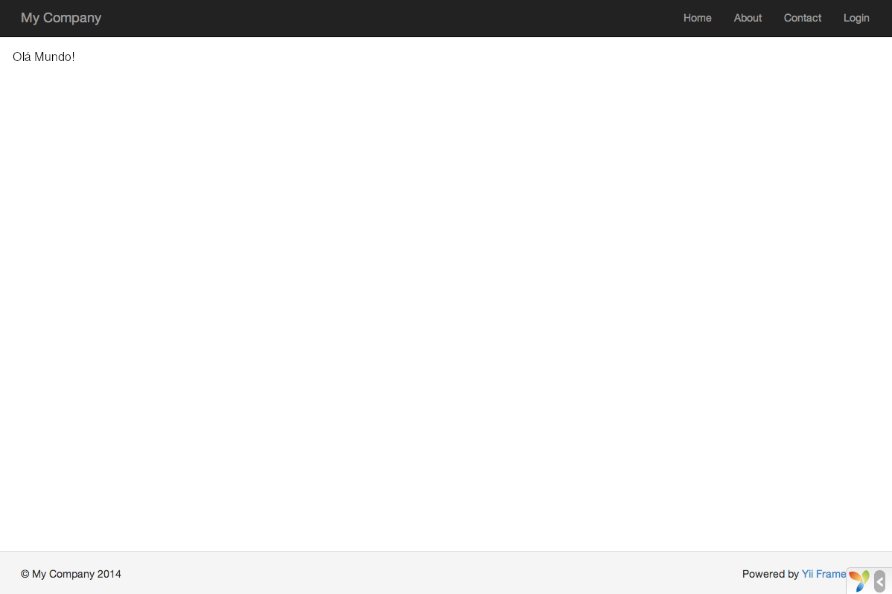

Dizendo "Olá!"
=====================

Esta seção descreve como criar uma nova página de "Olá!" em sua aplicação.
Para atingir este objetivo, você criará uma [action](structure-controllers.md#creating-actions)
e uma [view](structure-views.md):

* A aplicação enviará a requisição de página para a action
* e a action, por sua vez, renderizará a view que mostra a palavra "Olá!" ao usuário final.

Através deste tutorial, você aprenderá três coisas:

1. Como criar uma [action](structure-controllers.md) para responder às requisições,
2. como criar uma [view](structure-views.md) para compor o conteúdo da resposta, e
3. como uma aplicação envia requisições às [actions](structure-controllers.md#creating-actions).


Criando uma Action <span id="creating-action"></span>
----------------

Para a tarefa "Olá!", você criará uma [action](structure-controllers.md#creating-actions)
`cumprimentar` que lê um parâmetro `mensagem` da requisição e exibe essa mensagem de volta
para o usuário. Se a requisição não fornecer um parâmetro `mensagem`, a action exibirá a mensagem padrão "Olá!".

> Info: [Actions](structure-controllers.md#creating-actions) são os objetos que usuários finais podem solicitar diretamente para execução. Actions são
  agrupadas nos [controllers](structure-controllers.md). O resultado da execução de uma action é a resposta que o usuário final receberá.

As actions devem ser declaradas em [controllers](structure-controllers.md). Para manter a simplicidade, você pode declarar a action `cumprimentar` na classe já existente
`SiteController`. Esse controller está definido no arquivo `controllers/SiteController.php`.
Segue aqui o início da nova action:

```php
<?php

namespace app\controllers;

use yii\web\Controller;

class SiteController extends Controller
{
    // ...código existente...

    public function actionCumprimentar($mensagem = 'Olá!')
    {
        return $this->render('cumprimentar', ['mensagem' => $mensagem]);
    }
}
```

No código acima, a action `cumprimentar` está definida como um método chamado `actionCumprimentar`
na classe `SiteController`. O Yii usa o prefixo `action` para diferenciar os métodos
de actions dos métodos que não são de actions em uma classe de controller. O nome após o prefixo `action` é mapeado como o ID da action.

Quando se trata de dar nome às suas actions, você deveria entender como o Yii
trata os IDs de actions. Os IDs de actions são sempre referenciados em minúsculo.
Se o ID de uma action necessitar de múltiplas palavras, elas serão concatenadas
por hífens (por exemplo, `criar-comentario`). Os IDs de actions são convertidos em nomes de actions removendo-se os hífens dos IDs, colocando em maiúscula a
primeira letra de cada palavra, e prefixando o resultado com a palavra `action`. Por exemplo,
o ID de action `criar-comentario` corresponde ao método de action `actionCriarComentario`.

O método da action em nosso exemplo recebe um parâmetro `$mensagem`, cujo valor
padrão é "Olá!" (exatamente da mesma forma que você define um valor padrão para
  qualquer argumento de função ou método no PHP). Quando a aplicação recebe a
requisição e determina que a action `cumprimentar` é responsável por tratar a requisição,
a aplicação vai preencher esse parâmetro com o parâmetro que tiver o mesmo nome
na requisição. Em outras palavras, se a requisição inclui um parâmetro `mensagem`
com o valor `"Adeus!"`, a variável `$mensagem` na action receberá esse valor.

Dentro do método da action, [[yii\web\Controller::render()|render()]] é chamado
para renderizar um arquivo de [view](structure-views.md) chamado `cumprimentar`. O
parâmetro `mensagem` também é passado para a view de modo que ele possa ser usado
por ela. O resultado da renderização da view é retornado pelo método da action. Esse resultado
será recebido pela aplicação e exibido para o usuário final no navegador (como parte de uma página HTML completa).


Criando uma View <span id="creating-view"></span>
-----------------

As [views](structure-views.md) são scripts que você escreve para gerar o conteúdo de uma resposta.
Para a tarefa "Olá!", você criará uma view `cumprimentar` que exibe o parâmetro `mensagem` recebido do método da action:

```php
<?php
use yii\helpers\Html;
?>
<?= Html::encode($mensagem) ?>
```

A view `cumprimentar` deve ser salva no arquivo `views/site/cumprimentar.php`. Quando o método
[[yii\web\Controller::render()|render()]] é chamado em uma action, ele procurará
o arquivo PHP em `views/IDdoController/NomeDaView.php`.

Perceba que no código acima o parâmetro `mensagem` é [[yii\helpers\Html::encode()|codificado como HTML]]
antes de ser impresso. Isso é necessário, já que o parâmetro vem de um usuário final,
tornando-o vulnerável a [ataques de cross-site scripting (XSS)](https://en.wikipedia.org/wiki/Cross-site_scripting)
por embutir código JavaScript malicioso no parâmetro.

Naturalmente, você pode colocar mais conteúdo na view `cumprimentar`. O conteúdo pode consistir
de tags HTML, texto puro, ou até mesmo instruções de PHP. De fato, a view `cumprimentar` é
apenas um script PHP que é executado pelo método [[yii\web\Controller::render()|render()]].
O conteúdo impresso pelo script da view será retornado à aplicação como o resultado
da resposta. A aplicação, por sua vez, retornará esse resultado para o usuário final.


Conferindo <span id="trying-it-out"></span>
--------

Após criar a action e a view, você pode acessar a nova página através da seguinte URL:

```
https://hostname/index.php?r=site/cumprimentar&mensagem=Olá+Mundo!
```



Essa URL resultará em uma página exibindo "Olá Mundo!". Essa página compartilha o mesmo cabeçalho e rodapé das outras páginas da aplicação.

Se você omitir o parâmetro `mensagem` na URL, você verá a página exibindo somente
"Olá!". Isso ocorre por que `mensagem` é passado como um parâmetro para o método `actionCumprimentar()` e,
quando ele é omitido, o valor padrão `"Olá!"` é usado em seu lugar.

> Info: A nova página compartilha o mesmo cabeçalho e rodapé de outras páginas
  porque o método [[yii\web\Controller::render()|render()]] vai automaticamente
  incluir o resultado da view `cumprimentar` em um [layout](structure-views.md#layouts)
  que neste caso está localizado em `views/layouts/main.php`.

O parâmetro `r` na URL acima requer mais explicação. Ele significa [rota](runtime-routing.md),
um ID único e amplo de uma aplicação que se refere a uma action. O formato da rota
é `IDdoController/IDdaAction`. Quando a aplicação recebe uma requisição, ela
verificará esse parâmetro e usará a parte `IDdoController` para determinar qual
classe de controller deve ser instanciada para tratar a requisição. Então o
controller usará a parte `IDdaAction` para determinar qual action deverá ser
instanciada para fazer o trabalho. No caso deste exemplo, a rota `site/cumprimentar` será
resolvida como a classe de controller `SiteController` e a action `cumprimentar`. Como
resultado, o método `SiteController::actionCumprimentar()` será chamado para tratar a requisição.

> Info: Assim como as actions, os controllers também possuem IDs que os identificam
  de maneira única em uma aplicação. IDs de controllers seguem as mesmas regras de nomenclatura dos IDs de actions. Os nomes das classes de controlllers
  derivam dos IDs de controllers removendo-se os hífens dos IDs, convertendo a
  primeira letra de cada palavra em maiúscula, e adicionando o sufixo `Controller`.
  Por exemplo, o ID de controller `comentario-de-artigo` corresponde ao nome de classe
  de controller `ComentarioDeArtigoController`.


Resumo <span id="summary"></span>
------

Nesta seção, você teve uma introdução sobre as partes controller e view do padrão de arquitetura MVC. Você criou uma action como parte de um controller para tratar uma requisição específica.
E você também criou uma view para compor o conteúdo da resposta. Nesse exemplo simples, nenhum modelo (model) foi
utilizado, já que o único dado exibido foi o parâmetro `mensagem`.

Você também aprendeu sobre as rotas no Yii, que agem como a ponte entre as
requisições de usuário e as actions de controllers.

Na próxima seção, você aprenderá como criar um modelo (model) e adicionar uma nova página contendo um formulário HTML.
