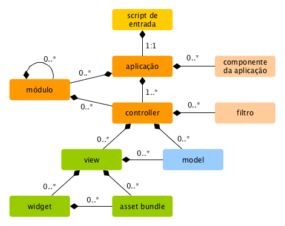

Visão Geral
===========

As aplicações do Yii são organizadas de acordo com o padrão de projeto
[model-view-controller (MVC)](http://pt.wikipedia.org/wiki/MVC)
(modelo-visão-controlador). Os [models](structure-models.md) representam dados,
lógica e regras de negócio; as [views](structure-views.md) são a representação
da saída dos modelos; e os [controllers](structure-controllers.md) recebem entradas
e as convertem em comandos para os [models](structure-models.md) e as [views](structure-views.md).

Além do MVC, as aplicações do Yii também possuem as seguintes entidades:

* [scripts de entrada](structure-entry-scripts.md): são scripts PHP que são
  diretamente acessíveis aos usuários finais. São responsáveis por iniciar o
  ciclo de tratamento de uma requisição.
* [aplicações](structure-applications.md): são objetos globalmente acessíveis que
  gerenciam os componentes da aplicação e os coordenam para atender às requisições.
* [componentes da aplicação](structure-application-components.md): são objetos
  registrados com as aplicações e fornecem vários serviços para atender às
  requisições.
* [módulos](structure-modules.md): são pacotes auto-contidos que contém um MVC
  completo por si sós. Uma aplicação pode ser organizada em termos de múltiplos
  módulos.
* [filtros](structure-filters.md): representam código que precisa ser chamado
  pelos controllers antes e depois do tratamento propriamente dito de cada
  requisição.
* [widgets](structure-widgets.md): são objetos que podem ser embutidos em
  [views](structure-views.md). Podem conter lógica de controller e podem ser
  reutilizados em diferentes views.

O diagrama a seguir demonstra a estrutura estática de uma aplicação:

