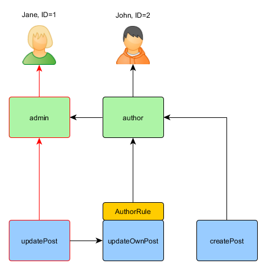

Авторизация
===========

> Примечание: этот раздел находится на стадии разработки.

Авторизация это процесс проверки того, что пользователь имеет достаточно прав чтобы что-то сделать. Yii обеспечивает два
метода авторизации: Фильтры контроля доступа (ACF) и контроль доступа основанный на ролях (RBAC).


Фильтры контроля доступа
------------------------

Фильтры контроля доступа (ACF) являются простым методом, который лучше всего использовать в приложениях с простым
контролем доступа. Как указывает его название, ACF это фильтры, который может присоединяться к контроллеру
или модулю как поведение. ACF проверяет набор [[yii\filters\AccessControl::rules|правил доступа]], чтоб убедится,
что пользователь имеет доступ к запрошенной операции.

Код ниже показывает как использовать ACF реализованный в [[yii\filters\AccessControl]]:

```php
use yii\filters\AccessControl;

class SiteController extends Controller
{
    public function behaviors()
    {
        return [
            'access' => [
                'class' => AccessControl::className(),
                'only' => ['login', 'logout', 'signup'],
                'rules' => [
                    [
                        'allow' => true,
                        'actions' => ['login', 'signup'],
                        'roles' => ['?'],
                    ],
                    [
                        'allow' => true,
                        'actions' => ['logout'],
                        'roles' => ['@'],
                    ],
                ],
            ],
        ];
    }
    // ...
}
```

Код выше показывает ACF связанный с контроллером `site` через поведение. Это типичный способ использования фильтров действий.
Параметр `only` указывает, что фильтр ACF нужно применять только к действиям `login`, `logout` и `signup`.
Параметр `rules` задаёт [[yii\filters\AccessRule|правила доступа]], которые означают следующее:

- Разрешить всем гостям (ещё не прошедшим авторизацию) доступ к действиям `login` и `signup`.
  Опция `roles` содержит знак вопроса `?`, это специальный токен обозначающий "гостя". 
- Разрешить аутентифицированным пользователям доступ к действию `logout`. Символ `@` это другой специальный токен
  обозначающий аутентифицированного пользователя.

Когда ACF проводит проверку авторизации, он проверяет правила по одному сверху вниз пока не найдёт совпадение.
Значение опции `allow` выбранного правила указывает авторизовывать пользователя или нет. Если ни одно из правил
не совпало, то пользователь считается НЕ авторизованным и ACF останавливает дальнейшее выполнение действия.

По умолчанию, ACF, когда у пользователя отсутствует доступ к текущему действию, делает следующее:

* Если пользователь гость, вызывается [[yii\web\User::loginRequired()]], который перенаправляет браузер на страницу входа.
* Если пользователь авторизован, генерируется исключение [[yii\web\ForbiddenHttpException]].

Вы можете переопределить это поведение, настроив свойство [[yii\filters\AccessControl::denyCallback]]:

```php
[
    'class' => AccessControl::className(),
    'denyCallback' => function ($rule, $action) {
        throw new \Exception('У вас нет доступа к этой странице');
    }
]
```

[[yii\filters\AccessRule|Правила доступа]] поддерживают набор свойств. Ниже краткое описание поддерживаемых опций.
Вы также можете расширить [[yii\filters\AccessRule]], чтоб создать свой собственный класс правил доступа.

 * [[yii\filters\AccessRule::allow|allow]]: задаёт какое это правило, "allow" или "deny".

 * [[yii\filters\AccessRule::actions|actions]]: задаёт действия соответствующие этому правилу.
Значение должно быть массивом идентификаторов действий. Сравнение регисрозависимо. Если свойство пустое или не задано,
то правило применяется ко всем действиям.

 * [[yii\filters\AccessRule::controllers|controllers]]: задаёт контроллеры, которым соответствует правило.
Значение должно быть массивом с идентификаторами контроллеров. Сравнение регисрозависимо. Если свойство
пустое или не задано, то правило применяется ко всем действиям.

 * [[yii\filters\AccessRule::roles|roles]]: задаёт роли пользователей соответствующих этому правилу.
   Распознаются две специальные роли, которые проверяются с помощью [[yii\web\User::isGuest]]:

     - `?`: соответствует гостевому пользователю (не аутентифицирован)
     - `@`: соответствует аутентифицированному пользователю

   Использование других имён ролей будет приводить к вызову метода [[yii\web\User::can()]], который требует включения
   RBAC (будет описано дальше). Если свойство пустое или не задано, то правило применяется ко всем ролям.

 * [[yii\filters\AccessRule::ips|ips]]: задаёт [[yii\web\Request::userIP|IP адреса пользователей]], для которых применяется
это правило. IP адрес может содержать `*` в конце, так чтобы он соответствовал IP адресу с таким же префиксом.
Для примера, '192.168.*' соответствует всем IP адресам в сегменте '192.168.'. Если свойство пустое или не задано,
то правило применяется ко всем IP адресам.

 * [[yii\filters\AccessRule::verbs|verbs]]: задаёт http метод (например `GET`, `POST`) соответствующий правилу.
Сравнение регисронезависимо.

 * [[yii\filters\AccessRule::matchCallback|matchCallback]]: задаёт PHP колбек, который вызывается для определения,
что правило должно быть применено.

 * [[yii\filters\AccessRule::denyCallback|denyCallback]]: задаёт PHP колбек, который будет вызван если доступ будет
запрещён при вызове этого правила.

Ниже показан пример, показывающий использование опции `matchCallback`, которая позволяет писать произвольную
логику проверки доступа:

```php
use yii\filters\AccessControl;

class SiteController extends Controller
{
    public function behaviors()
    {
        return [
            'access' => [
                'class' => AccessControl::className(),
                'only' => ['special-callback'],
                'rules' => [
                    [
                        'actions' => ['special-callback'],
                        'allow' => true,
                        'matchCallback' => function ($rule, $action) {
                            return date('d-m') === '31-10';
                        }
                    ],
                ],
            ],
        ];
    }

    // Колбек сработал! Эта страница может быть отображена только 31-ого октября
    public function actionSpecialCallback()
    {
        return $this->render('happy-halloween');
    }
}
```


Контроль доступа на основе ролей (RBAC)
---------------------------------------

Управление доступом на основе ролей (RBAC) обеспечивает простой, но мощный централизованный контроль доступа.
Пожалуйста обратитесь к [Wikipedia](https://ru.wikipedia.org/wiki/%D0%A3%D0%BF%D1%80%D0%B0%D0%B2%D0%BB%D0%B5%D0%BD%D0%B8%D0%B5_%D0%B4%D0%BE%D1%81%D1%82%D1%83%D0%BF%D0%BE%D0%BC_%D0%BD%D0%B0_%D0%BE%D1%81%D0%BD%D0%BE%D0%B2%D0%B5_%D1%80%D0%BE%D0%BB%D0%B5%D0%B9)
для получения более подробного сравнения RBAC с другими, более традиционными, системами контроля доступа.

Yii реализует общую иерархическую RBAC, следуя [NIST RBAC model](http://csrc.nist.gov/rbac/sandhu-ferraiolo-kuhn-00.pdf).
Обеспечивается функциональность RBAC через [компонент приложения](structure-application-components.md) [[yii\rbac\ManagerInterface|authManager]].

Использование RBAC состоит из двух частей. Первая часть - это создание RBAC данных авторизации, и вторая часть - это
использование данных авторизации для проверки доступа в том месте, где это нужно.

Для облегчения последующего описания, мы сначала введём некоторые основные понятия RBAC.


### Основные концепции

Роль представляет собой набор разрешений (*permissions*) (например создание сообщения, обновление сообщения).
Роль может быть назначена на одного или многих пользователей. Чтобы проверить, имеет ли пользователь указанные
разрешения, мы должны проверить назначена ли пользователю роль, которая содержит данное разрешение.

С каждой ролью или разрешением может быть связано правило (*rule*). Правило представляет собой кусок кода, который будет
выполняться в ходе проверки доступа для определения может ли быть применена соответствующая роль или разрешение
к текущему пользователю. Например, разрешение "обновление поста" может иметь правило, которое проверяет является ли
текущий пользователь автором поста. Во время проверки доступа, если пользователь не является автором поста, он/она будет
считаться не имеющими разрешения "обновление поста".

И роли и разрешения могут быть организованы в иерархию. В частности роль может содержать другие роли или разрешения; и
разрешения могут содержать другие разрешения. Yii реализует *частично упорядоченную* иерархию, которая включает в себя
специальные *деревья* иерархии. Роль может содержать разрешение, но обратное не верно.


### Настройка RBAC Manager

Перед определением авторизационных данных и проверкой прав доступа, мы должны настроить компонент приложения
[[yii\base\Application::authManager|authManager]]. Yii предоставляет два типа менеджеров авторизации: 
[[yii\rbac\PhpManager]] и [[yii\rbac\DbManager]]. Первый использует файл с PHP скриптом для хранения данных авторизации,
второй сохраняет данные в базе данных. Вы можете использовать первый если ваше приложение не требует слишком динамичного
управления ролями и разрешениями.

#### настройка authManager с помощью `PhpManager`

Следующий код показывает как настроить в конфигурации приложения `authManager` с использованием класса [[yii\rbac\PhpManager]]:

```php
return [
    // ...
    'components' => [
        'authManager' => [
            'class' => 'yii\rbac\PhpManager',
        ],
        // ...
    ],
];
```

Теперь `authManager` может быть доступен через `\Yii::$app->authManager`.

> Замечание: По умолчанию, [[yii\rbac\PhpManager]] сохраняет данные RBAC в файлах в директории `@app/rbac/`. Убедитесь
  что данная директория и файлы в них доступны для записи Web серверу, если иерархия разрешений должна меняться онлайн.

#### настройка authManager с помощью `DbManager`

Следующий код показывает как настроить в конфигурации приложения `authManager` с использованием класса [[yii\rbac\DbManager]]:

```php
return [
    // ...
    'components' => [
        'authManager' => [
            'class' => 'yii\rbac\DbManager',
        ],
        // ...
    ],
];
```

`DbManager` использует четыре таблицы для хранения данных: 

- [[yii\rbac\DbManager::$itemTable|itemTable]]: таблица для хранения авторизационных элементов. По умолчанию "auth_item".
- [[yii\rbac\DbManager::$itemChildTable|itemChildTable]]: таблица для хранения иерархии элементов. По умолчанию "auth_item_child".
- [[yii\rbac\DbManager::$assignmentTable|assignmentTable]]: таблица для хранения назначений элементов авторизации. По умолчанию "auth_assignment".
- [[yii\rbac\DbManager::$ruleTable|ruleTable]]: таблица для хранения правил. По умолчанию "auth_rule".

Прежде чем вы начнёте использовать этот менеджер, вам нужно создать таблицы в базе данных. Чтобы сделать это,
вы можете использовать миграцию хранящуюся в файле `@yii/rbac/migrations`:

`yii migrate --migrationPath=@yii/rbac/migrations`

Теперь `authManager` может быть доступен через `\Yii::$app->authManager`.

### Создание данных авторизации

Для создания данных авторизации нужно выполнить следующие задачи:

- определение ролей и разрешений;
- установка отношений между ролями и правами доступа;
- определение правил;
- связывание правил с ролями и разрешениями;
- назначение ролей пользователям.

В зависимости от требований к гибкости авторизации перечисленные задачи могут быть выполнены разными путями.

Если иерархия прав не меняется и количество пользователей зафиксировано, вы можете создать
[консольную команду](tutorial-console.md#create-command), которая будет единожды инициализировать данные
через APIs предоставляемое `authManager`:

```php
<?php
namespace app\commands;

use Yii;
use yii\console\Controller;

class RbacController extends Controller
{
    public function actionInit()
    {
        $auth = Yii::$app->authManager;

        // добавляем разрешение "createPost"
        $createPost = $auth->createPermission('createPost');
        $createPost->description = 'Create a post';
        $auth->add($createPost);

        // добавляем разрешение "updatePost"
        $updatePost = $auth->createPermission('updatePost');
        $updatePost->description = 'Update post';
        $auth->add($updatePost);

        // добавляем роль "author" и даём роли разрешение "createPost"
        $author = $auth->createRole('author');
        $auth->add($author);
        $auth->addChild($author, $createPost);

        // добавляем роль "admin" и даём роли разрешение "updatePost"
        // а также все разрешения роли "author"
        $admin = $auth->createRole('admin');
        $auth->add($admin);
        $auth->addChild($admin, $updatePost);
        $auth->addChild($admin, $author);

        // Назначение ролей пользователям. 1 и 2 это IDs возвращаемые IdentityInterface::getId()
        // обычно реализуемый в модели User.
        $auth->assign($author, 2);
        $auth->assign($admin, 1);
    }
}
```

После выполнения команды `yii rbac/init` мы получим следующую иерархию:


Автор может создавать пост, администратор может обновлять пост и делать всё, что может делать автор.

Если ваше приложение позволяет регистрировать пользователей, то вам необходимо сразу назначать роли этим новым пользователям.
Например, для того, чтобы все вошедшие пользователи могли стать авторами в расширенном шаблоне проекта, вы должны изменить
`frontend\models\SignupForm::signup()` как показано ниже:

```php
public function signup()
{
    if ($this->validate()) {
        $user = new User();
        $user->username = $this->username;
        $user->email = $this->email;
        $user->setPassword($this->password);
        $user->generateAuthKey();
        $user->save(false);

        // нужно добавить следующие три строки:
        $auth = Yii::$app->authManager;
        $authorRole = $auth->getRole('author');
        $auth->assign($authorRole, $user->getId());

        return $user;
    }

    return null;
}
```

Для приложений, требующих комплексного контроля доступа с динамически обновляемыми данными авторизации, существуют
специальные пользовательские интерфейсы (так называемые админ-панели), которые могут быть разработаны с 
использованием API, предлагаемого `authManager`


### Использование правил

Как упомянуто выше, правила добавляют дополнительные ограничения на роли и разрешения. Правила это классы, расширяющие
[[yii\rbac\Rule]]. Они должны реализовывать метод [[yii\rbac\Rule::execute()|execute()]]. В иерархии, созданной нами ранее,
автор не можете редактировать свой пост. Давайте исправим это. Во-первых, мы должны создать правило проверяющее,
что пользователь является автором поста:

```php
namespace app\rbac;

use yii\rbac\Rule;

/**
 * Проверяем authorID на соответствие с пользователем переданным через параметры
 */
class AuthorRule extends Rule
{
    public $name = 'isAuthor';

    /**
     * @param string|integer $user the user ID.
     * @param Item $item the role or permission that this rule is associated width
     * @param array $params parameters passed to ManagerInterface::checkAccess().
     * @return boolean a value indicating whether the rule permits the role or permission it is associated with.
     */
    public function execute($user, $item, $params)
    {
        return isset($params['post']) ? $params['post']->createdBy == $user : false;
    }
}
```

Правило выше проверяет, что `post` был создан `$user`. Мы создадим специальное разрешение `updateOwnPost` в команде,
которую мы использовали раньше:

```php
$auth = Yii::$app->authManager;

// add the rule
$rule = new \app\rbac\AuthorRule;
$auth->add($rule);

// добавляем разрешение "updateOwnPost" и привязываем к нему правило.
$updateOwnPost = $auth->createPermission('updateOwnPost');
$updateOwnPost->description = 'Update own post';
$updateOwnPost->ruleName = $rule->name;
$auth->add($updateOwnPost);

// "updateOwnPost" будет использоваться из "updatePost"
$auth->addChild($updateOwnPost, $updatePost);

// разрешаем "автору" обновлять его посты
$auth->addChild($author, $updateOwnPost);
```

Теперь мы имеем следующую иерархию:


### Проверка доступа

С готовыми авторизационными данными, проверка доступа - это просто вызов метода [[yii\rbac\ManagerInterface::checkAccess()]].
Так как большинство проверок доступа относятся к текущему пользователю, для удобства Yii предоставляет сокращённый метод
[[yii\web\User::can()]], который можно использовать как показано ниже:

```php
if (\Yii::$app->user->can('createPost')) {
    // create post
}
```

Если текущий пользователь Jane с ID=1, мы начнём с `createPost` и попробуем добраться до `Jane`:


Для того чтоб проверить может ли пользователь обновить пост, нам надо передать дополнительный параметр,
необходимый для правила `AuthorRule`, описанного ранее:

```php
if (\Yii::$app->user->can('updatePost', ['post' => $post])) {
    // update post
}
```

Вот что происходит если текущим пользователем является John:


Мы начинаем с `updatePost` и переходим к `updateOwnPost`. Для того чтоб это произошло, правило `AuthorRule` должно вернуть
`true` при вызове метода `execute`. Метод получает `$params` переданный при вызове метода `can`, значение которого равно
`['post' => $post]`. Если всё правильно мы увидим, что `author` привязан к John.

В случае Jane это немного проще, потому что она admin:



### Использование роли по умолчанию

Роль по умолчанию - это роль, которая *неявно* присваивается *всем* пользователям. Вызов метода
[[yii\rbac\ManagerInterface::assign()]] не требуется, и авторизационные данные не содержат информации о назначении.

Роль по умолчанию обычно связывают с правилом определяющим к какой роли принадлежит каждый пользователь.

Роли по умолчанию обычно используются в приложениях, которые уже имеют какое-то описание ролей. Для примера, приложение
может иметь столбец "group" в таблице пользователей, и каждый пользователь принадлежит к какой-то группе. Если каждая
группа может быть сопоставлена роли в модели RBAC, вы можете использовать роль по умолчанию для автоматического назначения
каждому пользователю роли RBAC. Давайте используем пример, чтобы понять как это можно сделать.

Предположим что в таблице пользователей у вас есть столбец `group`, в котором значение 1 представляет группу "администратор",
а 2 - группу "автор". Вы планируете иметь две RBAC роли `admin` и `author`, представляющие разрешения для двух
соответствующих групп. Вы можете настроить данные роли как показано ниже.

```php
namespace app\rbac;

use Yii;
use yii\rbac\Rule;

/**
 * Checks if user group matches
 */
class UserGroupRule extends Rule
{
    public $name = 'userGroup';

    public function execute($user, $item, $params)
    {
        if (!Yii::$app->user->isGuest) {
            $group = Yii::$app->user->identity->group;
            if ($item->name === 'admin') {
                return $group == 1;
            } elseif ($item->name === 'author') {
                return $group == 1 || $group == 2;
            }
        }
        return false;
    }
}

$auth = Yii::$app->authManager;

$rule = new \app\rbac\UserGroupRule;
$auth->add($rule);

$author = $auth->createRole('author');
$author->ruleName = $rule->name;
$auth->add($author);
// ... add permissions as children of $author ...

$admin = $auth->createRole('admin');
$admin->ruleName = $rule->name;
$auth->add($admin);
$auth->addChild($admin, $author);
// ... add permissions as children of $admin ...
```

Обратите внимание, так как "author" добавлен как дочерняя роль к "admin", следовательно в реализации метода `execute()`
класса правила вы должны учитывать эту иерархию. Именно по этому для роли "author" метод `execute()` вернёт истину,
если пользователь принадлежит к группам 1 или 2 (это означает, что пользователь находится в группе 
администраторов или авторов)

Далее, настроим `authManager` с помощью перечисления ролей в свойстве [[yii\rbac\BaseManager::$defaultRoles]]:

```php
return [
    // ...
    'components' => [
        'authManager' => [
            'class' => 'yii\rbac\PhpManager',
            'defaultRoles' => ['admin', 'author'],
        ],
        // ...
    ],
];
```

Теперь, если вы выполните проверку доступа, для обоих ролей `admin` и `author` будет выполнена проверка правила
асоциированного с ними. Если правило вернёт истину, это будет означать что роль применяется к текущему пользователю.
На основании правила, реализованного выше, если пользователь входит в группу 1 пользователю будет назначена роль `admin`;
и если значение `group` равно 2 будет применена роль `author`.
