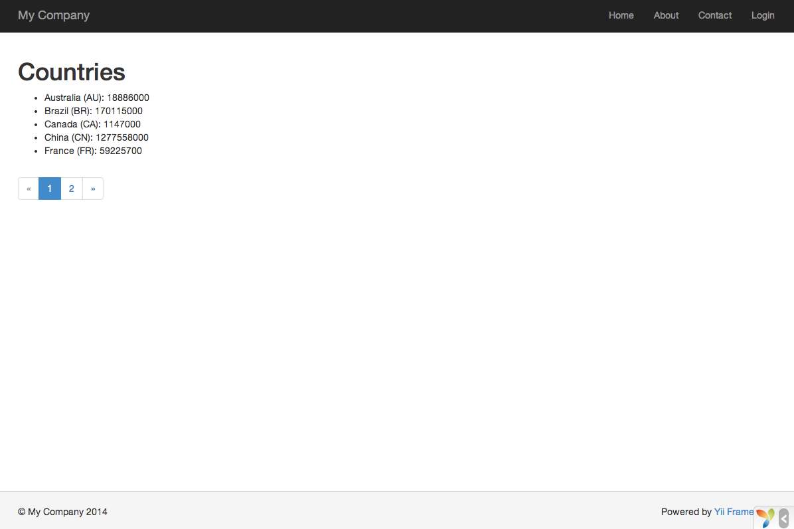

Работа с базами данных
======================

Этот раздел расскажет о том, как создать новую страницу, отображающую данные по странам, полученные из таблицы `countries` базы данных. Для достижения этой цели вам будет необходимо настроить подключение к базе данных, создать класс [Active Record](db-active-record.md), определить [action](structure-controllers.md) и создать [view](structure-views.md).

Изучив эту часть, вы научитесь:

* Настраивать подключение к БД.
* Определять класс Active Record.
* Запрашивать данные, используя класс Active Record.
* Отображать данные во view с использованием пагинации.

Обратите внимание, чтобы усвоить этот раздел, вы должны иметь базовые знания и навыки использования баз данных. 
В частности, вы должны знать, как создать базу данных и как выполнять SQL запросы, используя клиентские инструменты для работы с БД.

Подготавливаем базу данных <span id="preparing-database"></span>
----------------------------------------------------------------

Для начала создайте базу данных под названием `yii2basic`, из которой вы будете получать данные в вашем приложении.
Вы можете создать базу данных SQLite, MySQL, PostgreSQL, MSSQL или Oracle, так как Yii имеет встроенную поддержку для многих баз данных. Для простоты, в дальнейшем описании будет подразумеваться MySQL.

После этого создайте в базе данных таблицу `country` и добавьте в неё немного демонстрационных данных. Вы можете запустить следующую SQL инструкцию, чтобы сделать это:

```sql
CREATE TABLE `country` (
  `code` CHAR(2) NOT NULL PRIMARY KEY,
  `name` CHAR(52) NOT NULL,
  `population` INT(11) NOT NULL DEFAULT '0'
) ENGINE=InnoDB DEFAULT CHARSET=utf8;

INSERT INTO `country` VALUES ('AU','Australia',24016400);
INSERT INTO `country` VALUES ('BR','Brazil',205722000);
INSERT INTO `country` VALUES ('CA','Canada',35985751);
INSERT INTO `country` VALUES ('CN','China',1375210000);
INSERT INTO `country` VALUES ('DE','Germany',81459000);
INSERT INTO `country` VALUES ('FR','France',64513242);
INSERT INTO `country` VALUES ('GB','United Kingdom',65097000);
INSERT INTO `country` VALUES ('IN','India',1285400000);
INSERT INTO `country` VALUES ('RU','Russia',146519759);
INSERT INTO `country` VALUES ('US','United States',322976000);
```

На данный момент у вас есть база данных под названием `yii2basic` и внутри неё таблица `country` с тремя столбцами, содержащими десять строк данных.

Настраиваем подключение к БД <span id="configuring-db-connection"></span>
-------------------------------------------------------------------------

Перед продолжением убедитесь, что у вас установлены PHP-расширение [PDO](http://php.net/manual/ru/book.pdo.php) и драйвер PDO для используемой вами базы данных (например, `pdo_mysql` для MySQL). Это базовое требование в случае использования вашим приложением реляционной базы данных.
После того, как они установлены, откройте файл `config/db.php` и измените параметры на верные для вашей базы данных. По умолчанию этот файл содержит следующее:

```php
<?php

return [
    'class' => 'yii\db\Connection',
    'dsn' => 'mysql:host=localhost;dbname=yii2basic',
    'username' => 'root',
    'password' => '',
    'charset' => 'utf8',
];
```

Файл `config/db.php` — типичный [конфигурационный](concept-configurations.md) инструмент, базирующийся на файлах. Данный конфигурационный файл определяет параметры, необходимые для создания и инициализации экземпляра [[yii\db\Connection]], через который вы можете делать SQL запросы к подразумеваемой базе данных.

Подключение к БД, настроенное выше, доступно в коде приложения через выражение `Yii::$app->db`.

> Info: файл `config/db.php` будет подключен главной конфигурацией приложения `config/web.php`,
  описывающей то, как экземпляр [приложения](structure-applications.md) должен быть инициализирован.
  Для детальной информации, пожалуйста, обратитесь к разделу [Конфигурации](concept-configurations.md).

Если вам необходимо работать с базами данных, поддержка которых не включена непосредственно в фреймворк, стоит обратить
внимание на следующие расширения:

- [Informix](https://github.com/edgardmessias/yii2-informix)
- [IBM DB2](https://github.com/edgardmessias/yii2-ibm-db2)
- [Firebird](https://github.com/edgardmessias/yii2-firebird)


Создаём потомка Active Record <span id="creating-active-record"></span>
-----------------------------------------------------------------------

Чтобы представлять и получать данные из таблицы `country`, создайте класс — потомок [Active Record](db-active-record.md), под названием `Country` и сохраните его в файле `models/Country.php`.

```php
<?php

namespace app\models;

use yii\db\ActiveRecord;

class Country extends ActiveRecord
{
}
```

Класс `Country` наследуется от [[yii\db\ActiveRecord]]. Вам не нужно писать ни строчки кода внутри него! С кодом, приведённым выше, Yii свяжет имя таблицы с именем класса.

> Info: Если нет возможности задать прямую зависимость между именем таблицы и именем класса, вы можете переопределить
  метод [[yii\db\ActiveRecord::tableName()]], чтобы явно задать имя связанной таблицы.

Используя класс `Country`, вы можете легко манипулировать данными в таблице `country`, как показано в этих фрагментах:

```php
use app\models\Country;

// получаем все строки из таблицы "country" и сортируем их по "name"
$countries = Country::find()->orderBy('name')->all();

// получаем строку с первичным ключом "US"
$country = Country::findOne('US');

// отобразит "United States"
echo $country->name;

// меняем имя страны на "U.S.A." и сохраняем в базу данных
$country->name = 'U.S.A.';
$country->save();
```

> Info: Active Record — мощный способ доступа и манипулирования данными БД в объектно-ориентированном стиле.
  Вы можете найти подробную информацию в разделе [Active Record](db-active-record.md). В качестве альтернативы, вы также можете взаимодействовать с базой данных, используя более низкоуровневый способ доступа, называемый [Data Access Objects](db-dao.md).


Создаём Action <span id="creating-action"></span>
-------------------------------------------------

Для того, чтобы показать данные по странам конечным пользователям, вам надо создать новый action. Вместо размещения нового action'a в контроллере `site`, как вы делали в предыдущих разделах, будет иметь больше смысла создать новый контроллер специально для всех действий, относящихся к данным по странам. Назовите новый контроллер `CountryController`, и создайте action `index` внутри него, как показано ниже.

```php
<?php

namespace app\controllers;

use yii\web\Controller;
use yii\data\Pagination;
use app\models\Country;

class CountryController extends Controller
{
    public function actionIndex()
    {
        $query = Country::find();

        $pagination = new Pagination([
            'defaultPageSize' => 5,
            'totalCount' => $query->count(),
        ]);

        $countries = $query->orderBy('name')
            ->offset($pagination->offset)
            ->limit($pagination->limit)
            ->all();

        return $this->render('index', [
            'countries' => $countries,
            'pagination' => $pagination,
        ]);
    }
}
```

Сохраните код выше в файле `controllers/CountryController.php`.

Action `index` вызывает `Country::find()`. Данный метод Active Record строит запрос к БД и извлекает все данные из таблицы `country`.
Чтобы ограничить количество стран, возвращаемых каждым запросом, запрос разбивается на страницы с помощью объекта [[yii\data\Pagination]]. Объект `Pagination` служит двум целям:
* Устанавливает пункты `offset` и `limit` для SQL инструкции, представленной запросом, чтобы она возвращала только одну страницу данных за раз (в нашем случае максимум 5 строк на страницу).
* Он используется во view для отображения пагинатора, состоящего из набора кнопок с номерами страниц, это будет разъяснено в следующем подразделе.

В конце кода action `index` выводит view с именем `index`, и передаёт в него данные по странам вместе c информацией о пагинации.

Создаём View <span id="creating-view"></span>
---------------------------------------------

Первым делом создайте поддиректорию с именем `country` внутри директории `views`. Эта папка будет использоваться для хранения всех view, выводимых контроллером `country`. Внутри директории `views/country` создайте файл с именем `index.php`, содержащий следующий код:

```php
<?php
use yii\helpers\Html;
use yii\widgets\LinkPager;
?>
<h1>Countries</h1>
<ul>
<?php foreach ($countries as $country): ?>
    <li>
        <?= Html::encode("{$country->code} ({$country->name})") ?>:
        <?= $country->population ?>
    </li>
<?php endforeach; ?>
</ul>

<?= LinkPager::widget(['pagination' => $pagination]) ?>
```

View имеет 2 части относительно отображения данных по странам. В первой части предоставленные данные по странам выводятся как неупорядоченный HTML-список.
Во второй части выводится виджет [[yii\widgets\LinkPager]], используя информацию о пагинации, переданную из action во view. Виджет `LinkPager` отображает набор постраничных кнопок. Клик по любой из них обновит данные по странам в соответствующей странице.


Испытываем в действии <span id="trying-it-out"></span>
------------------------------------------------------

Чтобы увидеть, как работает весь вышеприведённый код, перейдите по следующей ссылке в своём браузере:

```
http://hostname/index.php?r=country%2Findex
```



В начале вы увидите страницу, показывающую пять стран. Под странами вы увидите пагинатор с четырьмя кнопками. Если вы кликните по кнопке "2", то увидите страницу, отображающую другие пять стран из базы данных: вторая страница записей.
Посмотрев внимательней, вы увидите, что URL в браузере тоже сменилось на

```
http://hostname/index.php?r=country%2Findex&page=2
```

За кадром [[yii\data\Pagination|Pagination]] предоставляет всю необходимую функциональность для постраничной разбивки набора данных:
* В начале [[yii\data\Pagination|Pagination]] показывает первую страницу, которая отражает SELECT запрос стран с параметрами `LIMIT 5 OFFSET 0`. Как результат, первые пять стран будут получены и отображены.
* Виджет [[yii\widgets\LinkPager|LinkPager]] выводит кнопки страниц используя URL'ы, созданные [[yii\data\Pagination::createUrl()|Pagination]]. Эти URL'ы будут содержать параметр запроса `page`, который представляет различные номера страниц.
* Если вы кликните по кнопке "2", сработает и обработается новый запрос для маршрута `country/index`. Таким образом новый запрос стран будет иметь параметры `LIMIT 5 OFFSET 5` и вернет следующие пять стран для отображения.

Заключение <span id="summary"></span>
-------------------------------------

В этом разделе вы научились работать с базой данных. Также вы научились получать и отображать данные с постраничной разбивкой с помощью [[yii\data\Pagination]] и [[yii\widgets\LinkPager]].

В следующем разделе вы научитесь использовать мощный инструмент генерации кода, называемый [Gii](start-gii.md), чтобы с его помощью быстро осуществлять некоторые часто используемые функции, такие как операции Create-Read-Update-Delete (CRUD) для работы с данными в таблице базы данных. На самом деле код, который вы только что написали, в Yii может быть полностью сгенерирован автоматически с использованием Gii.
