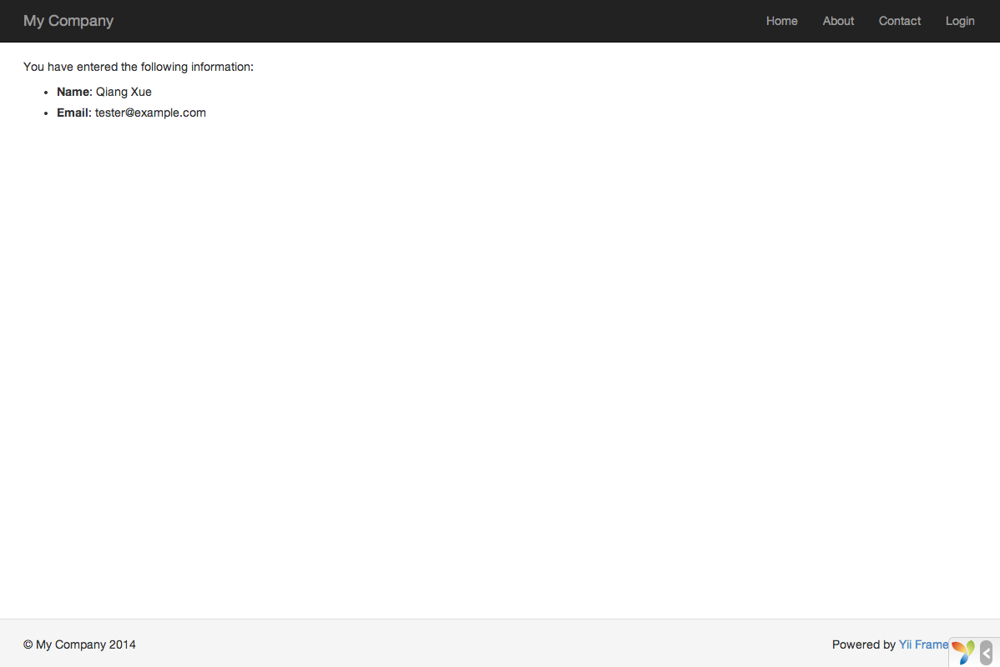

Работа с формами
================

В данном разделе мы обсудим получение данных от пользователя. На странице будет располагаться форма с полями для ввода
имени и email. Полученные данные будут показаны на странице для их подтверждения.

Чтобы достичь этой цели, помимо создания [действия](structure-controllers.md) и двух [представлений](structure-views.md)
вы создадите [модель](structure-models.md).

В данном руководстве вы изучите:

* Как создать [модель](structure-models.md) для данных, введённых пользователем;
* Как объявить правила проверки введённых данных;
* Как создать HTML-форму в [представлении](structure-views.md).


Создание модели <span id="creating-model"></span>
---------------------------------------------

В файле `models/EntryForm.php` создайте класс модели `EntryForm` как показано ниже. Он будет использоваться для
хранения данных, введённых пользователем. Подробно об именовании файлов классов читайте в разделе
«[Автозагрузка классов](concept-autoloading.md)».

```php
<?php

namespace app\models;

use yii\base\Model;

class EntryForm extends Model
{
    public $name;
    public $email;

    public function rules()
    {
        return [
            [['name', 'email'], 'required'],
            ['email', 'email'],
        ];
    }
}
```

Данный класс расширяет класс [[yii\base\Model]], который является частью фреймворка и обычно используется для работы
с данными форм.

Класс содержит 2 публичных свойства `name` и `email`, которые используются для хранения данных, введённых пользователем.
Он также содержит метод `rules()`, который возвращает набор правил проверки данных. Правила, объявленные в коде выше
означают следующее:

* Поля `name` и `email` обязательны для заполнения;
* В поле `email` должен быть правильный адрес email.

Если объект `EntryForm` заполнен пользовательскими данными, то для их проверки вы можете вызвать метод
[[yii\base\Model::validate()|validate()]]. В случае неудачной проверки свойство [[yii\base\Model::hasErrors|hasErrors]]
станет равным `true`. С помощью [[yii\base\Model::getErrors|errors]] можно узнать, какие именно ошибки возникли.


Создание действия <span id="creating-action"></span>
------------------------------------------------

Далее создайте действие `entry` в контроллере `site`, точно так же, как вы делали это ранее.

```php
<?php

namespace app\controllers;

use Yii;
use yii\web\Controller;
use app\models\EntryForm;

class SiteController extends Controller
{
    // ...существующий код...

    public function actionEntry()
    {
        $model = new EntryForm();

        if ($model->load(Yii::$app->request->post()) && $model->validate()) {
            // данные в $model удачно проверены

            // делаем что-то полезное с $model ...
 
            return $this->render('entry-confirm', ['model' => $model]);
        } else {
            // либо страница отображается первый раз, либо есть ошибка в данных
            return $this->render('entry', ['model' => $model]);
        }
    }
}
```

Действие создает объект `EntryForm`. Затем оно пытается заполнить модель данными из массива `$_POST`, доступ
к которому обеспечивает Yii при помощи [[yii\web\Request::post()]]. Если модель успешно заполнена, то есть пользователь
отправил данные из HTML-формы, то для проверки данных будет вызван метод [[yii\base\Model::validate()|validate()]].

Если всё в порядке, действие отобразит представление `entry-confirm`, которое показывает пользователю введенные им данные.
В противном случае будет отображено представление `entry`, которое содержит HTML-форму и ошибки проверки данных, если
они есть.

> Info: `Yii::$app` представляет собой глобально доступный экземпляр-одиночку
[приложения](structure-applications.md) (singleton). Одновременно это [Service Locator](concept-service-locator.md),
дающий доступ к компонентам вроде `request`, `response`, `db` и так далее. В коде выше для доступа к данным из `$_POST`
был использован компонент `request`.


Создание представления <span id="creating-views"></span>
----------------------------------------------------

В заключение создаём два представления с именами `entry-confirm` и `entry`, которые отображаются действием `entry` из
предыдущего подраздела.

Представление `entry-confirm` просто отображает имя и email. Оно должно быть сохранено в файле `views/site/entry-confirm.php`.

```php
<?php
use yii\helpers\Html;
?>
<p>Вы ввели следующую информацию:</p>

<ul>
    <li><label>Name</label>: <?= Html::encode($model->name) ?></li>
    <li><label>Email</label>: <?= Html::encode($model->email) ?></li>
</ul>
```

Представление `entry` отображает HTML-форму. Оно должно быть сохранено в файле `views/site/entry.php`.

```php
<?php
use yii\helpers\Html;
use yii\widgets\ActiveForm;
?>
<?php $form = ActiveForm::begin(); ?>

    <?= $form->field($model, 'name') ?>

    <?= $form->field($model, 'email') ?>

    <div class="form-group">
        <?= Html::submitButton('Отправить', ['class' => 'btn btn-primary']) ?>
    </div>

<?php ActiveForm::end(); ?>
```

Для построения HTML-формы представление использует мощный [виджет](structure-widgets.md) [[yii\widgets\ActiveForm|ActiveForm]].
Методы `begin()` и `end()` выводят открывающий и закрывающий теги формы. Между этими вызовами создаются поля ввода при
помощи метода [[yii\widgets\ActiveForm::field()|field()]]. Первым идёт поле для "name", вторым — для "email".
Далее для генерации кнопки отправки данных вызывается метод [[yii\helpers\Html::submitButton()]].


Попробуем <span id="trying-it-out"></span>
--------------------------------------

Чтобы увидеть всё созданное в работе, откройте в браузере следующий URL:

```
https://hostname/index.php?r=site%2Fentry
```

Вы увидите страницу с формой и двумя полями для ввода. Перед каждым полем имеется подпись, которая указывает, какую
информацию следует вводить. Если вы нажмёте на кнопку отправки без ввода данных или если вы введете email в неверном
формате, вы увидите сообщение с ошибкой рядом с каждым проблемным полем.


После ввода верных данных и их отправки, вы увидите страницу с данными, которые вы только что ввели.




### Как работает вся эта «магия» <span id="magic-explained"></span>

Вы, скорее всего, задаётесь вопросом о том, как же эта HTML-форма работает на самом деле. Весь процесс может показаться
немного волшебным: то как показываются подписи к полям, ошибки проверки данных при некорректном вводе и то, что всё это
происходит без перезагрузки страницы.

Да, проверка данных на самом деле происходит и на стороне клиента при помощи JavaScript, и на стороне сервера.
[[yii\widgets\ActiveForm]] достаточно продуман, чтобы взять правила проверки, которые вы объявили в `EntryForm`,
преобразовать их в JavaScript код и использовать его для проведения проверок. На случай отключения JavaScript в браузере
валидация проводится и на стороне сервера как показано в методе `actionEntry()`. Это даёт уверенность в том, что данные
корректны при любых обстоятельствах.

Подписи для полей генерируются методом `field()`, на основе имён свойств модели. Например, подпись `Name` генерируется
для свойства `name`. Вы можете модифицировать подписи следующим образом:

```php
<?= $form->field($model, 'name')->label('Ваше имя') ?>
<?= $form->field($model, 'email')->label('Ваш Email') ?>
```

> Info: В Yii есть множество виджетов, позволяющих быстро строить сложные и динамичные представления.
  Как вы узнаете позже, разрабатывать новые виджеты очень просто. Многое из представлений можно вынести в виджеты, чтобы
  использовать это повторно в других местах и упростить тем самым разработку в будущем.

Заключение <span id="summary"></span>
-----------------------------

В данном разделе вы попробовали каждую часть шаблона проектирования MVC. Вы изучили как создавать классы моделей
для обработки и проверки пользовательских данных.

Также, вы изучили как получать данные от пользователя и как показать данные пользователю. Это задача может занимать в
процессе разработки значительное время. Yii предоставляет мощные виджеты, которые делают задачу максимально простой.

В следующем разделе вы изучите как работать с базами данных, что требуется в большинстве приложений.

