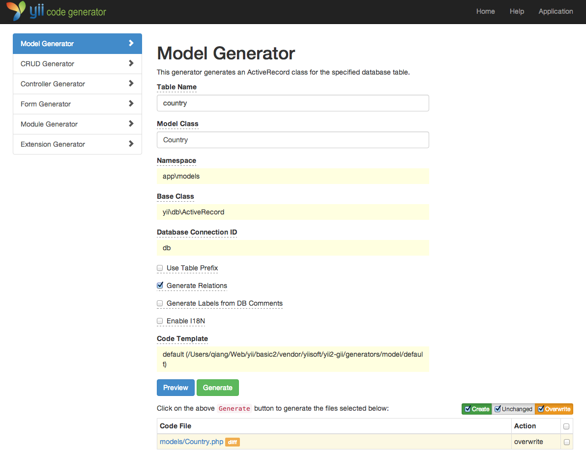
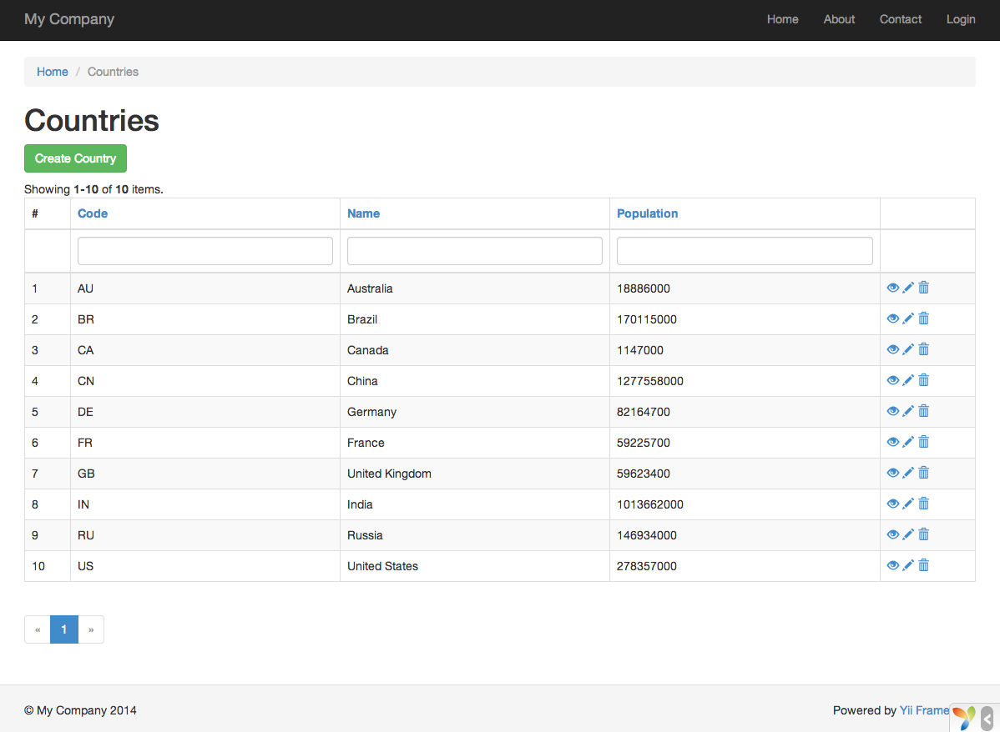

Генерация кода при помощи Gii
========================

В этом разделе мы опишем, как использовать [Gii](https://www.yiiframework.com/extension/yiisoft/yii2-gii/doc/guide) для автоматической генерации кода,
реализующего некоторые общие функции вебсайта. Для достижения этой цели всё, что вам нужно, это просто ввести необходимую информацию в соответствии с инструкциями, отображаемыми на веб-страницах Gii.

В этом руководстве вы узнаете:

* Как активировать Gii в приложении;
* Как использовать Gii для создания Active Record класса;
* Как использовать Gii для генерации кода, реализующего CRUD для таблицы БД.
* Как настроить код, генерируемый Gii.


Запускаем Gii <span id="starting-gii"></span>
------------

[Gii](https://www.yiiframework.com/extension/yiisoft/yii2-gii/doc/guide) представлен в Yii как [модуль](structure-modules.md). Вы можете активировать Gii,
настроив его в свойстве [[yii\base\Application::modules|modules]]. В зависимости от того, каким образом вы создали приложение, вы можете удостовериться в наличии следующего кода в конфигурационном файле `config/web.php`,

```php
$config = [ ... ];

if (YII_ENV_DEV) {
    $config['bootstrap'][] = 'gii';
    $config['modules']['gii'] = [
        'class' => 'yii\gii\Module',
    ];
}
```

Приведенная выше конфигурация показывает, что находясь в [режиме разработки](concept-configurations.md#environment-constants),
приложение должно включать в себя модуль с именем `gii`, который реализует класс [[yii\gii\Module]].

Если вы посмотрите [входной скрипт](structure-entry-scripts.md) `web/index.php` вашего приложения, вы
увидите следующую строку, устанавливающую константу `YII_ENV_DEV` в значение `true`.

```php
defined('YII_ENV') or define('YII_ENV', 'dev');
```

Благодаря этой строке ваше приложение находится в режиме разработки, и Gii уже активирован в соответствии с описанной выше конфигурацией. Теперь вы можете получить доступ к Gii по следующему адресу:

```
https://hostname/index.php?r=gii
```
> Note: Если вы пытаетесь получить доступ к Gii не с локального хоста, по умолчанию, в целях обеспечения безопасности,
> доступ будет запрещён. Вы можете изменить настройки Gii, чтобы добавить разрешённые IP адреса, как указано ниже

```php
'gii' => [
    'class' => 'yii\gii\Module',
    'allowedIPs' => ['127.0.0.1', '::1', '192.168.0.*', '192.168.178.20'] // регулируйте в соответствии со своими нуждами
],
```


Генерация класса Active Record <span id="generating-ar"></span>
---------------------------------

Чтобы использовать Gii для генерации класса Active Record, выберите "Генератор модели" (нажав на ссылку на главной странице Gii). И заполните форму следующим образом:

* Имя таблицы: `country`
* Класс модели : `Country`


Затем нажмите на кнопку "Предварительный просмотр". Вы увидите, что `models/Country.php` перечислен в результатах создаваемых файлов классов. Вы можете нажать на имя файла класса для просмотра его содержимого.

Если вы уже создали такой же файл и хотите перезаписать его, нажмите кнопку `diff` рядом с именем файла, чтобы увидеть различия между генерируемым кодом и существующей версией.



Для перезаписи существующего файла установите флажок рядом с "overwrite" и нажмите кнопку "Generate". Для создания нового файла вы можете просто нажать "Generate".

После этого вы увидите страницу подтверждения, указывающую на то, что код был успешно сгенерирован. Если файл существовал до этого, вы также увидите сообщение о том, что он был перезаписан заново сгенерированным кодом.


Создание CRUD кода <span id="generating-crud"></span>
--------------------

CRUD расшифровывается как Create, Read, Update и Delete, предоставляющий четыре основные функции, выполняемые над данными на большинстве веб-сайтов. Чтобы создать функциональность CRUD используя Gii, выберите "CRUD Генератор" (нажав на ссылку на главной странице Gii). Для нашей таблицы «country» заполните полученную форму следующим образом:

* Model Class: `app\models\Country`
* Search Model Class: `app\models\CountrySearch`
* Controller Class: `app\controllers\CountryController`


Затем нажмите на кнопку "Preview". Вы увидите список файлов, которые будут созданы, как показано ниже.


Если вы уже создали файлы `controllers/CountryController.php` и `views/country/index.php` (в разделе о базах данных), установите флажок "overwrite", чтобы заменить их. (Предыдущие версии не поддерживают CRUD полностью)


Испытываем в действии <span id="trying-it-out"></span>
-------------

Чтобы увидеть как всё это работает, перейдите по следующему URL, используя ваш браузер:

```
https://hostname/index.php?r=country%2Findex
```

Вы увидите таблицу, показывающую страны из таблицы БД. Вы можете сортировать, а также фильтровать данные, указывая условия фильтрации в заголовках столбцов.

Для каждой отображающейся в таблице страны вы можете просмотреть подробную информацию, обновить или удалить её.
Вы также можете нажать на кнопку "Создать страну" в верхней части таблицы для получения формы создания новой страны.




Ниже приведен список файлов, созданных с помощью Gii, в том случае, если вы захотите исследовать реализацию этих функций, или изменить их:

* Контроллер: `controllers/CountryController.php`
* Модели: `models/Country.php` и `models/CountrySearch.php`
* Вид: `views/country/*.php`

> Info: Gii разработан как тонконастраиваемый и расширяемый инструмент генерации кода. Используя его с умом, вы можете значительно ускорить скорость разработки приложений. Для более подробной информации, пожалуйста, обратитесь к разделу [Gii](https://www.yiiframework.com/extension/yiisoft/yii2-gii/doc/guide).


Заключение <span id="summary"></span>
-------

В этом разделе вы узнали, как использовать Gii для генерации кода, реализующего полную функциональность CRUD для данных, хранящихся в таблице базы данных.
