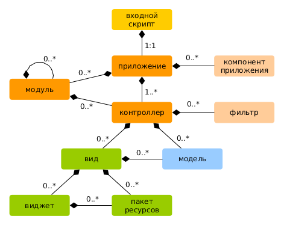
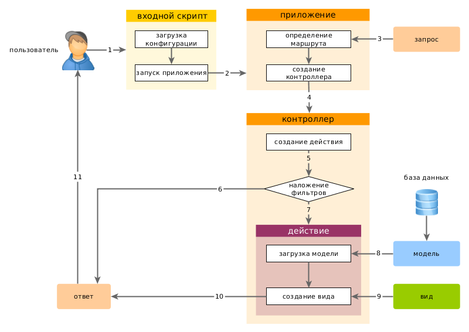

Запуск приложения
====================

 После установки Yii базовое приложение будет доступно либо по URL `http://hostname/basic/web/index.php`, либо по `http://hostname/index.php`, в зависимости от настроек Web сервера. Данный раздел - общее введение в организацию кода, встроенный функционал и обработку обращений приложением Yii.

> Информация: далее в данном руководстве предполагается, что Yii установлен в директорию `basic/web`, которая, в свою очередь, установлена как корневой каталог в настройках Web сервера. В результате, обратившись по URL `http://hostname/index.php`, Вы получите доступ к приложению, расположенному в `basic/web`. Детальнее с процессом начальной настройки можно познакомиться в разделе [Установка Yii](start-installation.md).

Функциональность <span id="functionality"></span>
---------------

Установленный шаблон простого приложения состоит из четырех страниц:

* домашняя страница, отображается при переходе по URL `http://hostname/index.php`
* страница "About" ("О нас")
* на странице "Contact" находится форма обратной связи, на которой пользователь может обратиться к разработчику по e-mail
* на странице "Login" отображается форма авторизации. Попытайтесь авторизоваться с логином/паролем "admin/admin". Обратите внимание на изменение раздела "Login" в главном меню на "Logout".

Эти страницы используют смежный хедер (шапка сайта) и футер (подвал). В "шапке" находится главное меню, при помощи которого пользователь перемещается по сайту. В "подвале" - копирайт и общая информация.

В самой нижней части окна Вы будете видеть системные сообщения Yii - журнал, отладочную информацию, сообщения об ошибках, запросы к базе данных и т.п. Выводом данной информации руководит [встроенный отладчик](tool-debugger.md), он записывает и отображает информацию о ходе выполнения приложения.

В дополнение к веб приложению имеется консольный скрипт с названием `yii`, который находится в базовой директории приложения.
Этот скрипт может быть использован для выполнения фоновых задач и обслуживания приложения. Всё это описано в разделе
[Консольные команды](tutorial-console.md).

Структура приложения Yii <span id="application-structure"></span>
---------------------

Ниже приведен список основных директорий и файлов вашего приложения (считаем, что приложение установлено в директорию `basic`):

```
basic/                  корневой каталог приложения
    composer.json       используется Composer'ом, содержит описание приложения
    config/             конфигурационные файлы
        console.php     конфигурация консольного приложения
        web.php         конфигурация Web приложения
    commands/           содержит классы консольных команд
    controllers/        контроллеры
    models/             модели
    runtime/            файлы, которые генерирует Yii во время выполнения приложения (логи, кэш и т.п.)
    vendor/             содержит пакеты Composer'а и, собственно, сам фреймворк Yii
    views/              виды приложения
    web/                корневая директория Web приложения. Содержит файлы, доступные через Web
        assets/         скрипты, используемые приложением (js, css)
        index.php       точка входа в приложение Yii. С него начинается выполнение приложения
    yii                 скрипт выполнения консольного приложения Yii
```

В целом, приложение Yii можно разделить на две категории файлов: расположенные в `basic/web` и расположенные в других директориях. Первая категория доступна через Web (например, браузером), вторая не доступна из вне и не должна быть доступной т.к. содержит служебную информацию.

В Yii реализована схема проектирования [модель-вид-контроллер (MVC)](http://ru.wikipedia.org/wiki/Model-View-Controller),
которая соответствует структуре директорий приложения. В директории `models` находятся [Модели](structure-models.md),
в `views` расположены [Виды](structure-views.md), а в каталоге `controllers` все [Контроллеры](structure-controllers.md) приложения.

Диаграмма ниже демонстрирует внутреннее устройство приложения.



В каждом приложении Yii есть точка входа в приложение, `web/index.php` это единственный PHP-скрипт доступный для выполнения из Web. Он принимает входящий запрос и создает экземпляр [приложения](structure-applications.md).
[Приложение](structure-applications.md) обрабатывает входящие запросы при помощи [компонентов](concept-components.md) и отправляет запрос контроллеру. [Виджеты](structure-widgets.md) используются в [Видах](structure-views.md) для построения динамических интерфейсов сайта.


Жизненный цикл пользовательского запроса <span id="request-lifecycle"></span>
-----------------

На диаграмме показано как приложение обрабатывает запрос.



1. Пользователь обращается к [точке входа](structure-entry-scripts.md) `web/index.php`.
2. Скрипт загружает конфигурацию [configuration](concept-configurations.md) и создает экземпляр [приложения](structure-applications.md) для дальнейшей обработки запроса.
3. Приложение определяет [маршрут](runtime-routing.md) запроса при помощи компонента приложения  [запрос](runtime-requests.md).
4. Приложение создает экземпляр [контроллера](structure-controllers.md) для выполнения запроса.
5. Контроллер, в свою очередь, создает [действие](structure-controllers.md) и накладывает на него фильтры.
6. Если хотя бы один фильтр дает сбой, выполнение приложения останавливается.
7. Если все фильтры пройдены - приложение выполняется.
8. Действие загружает модель данных. Вероятнее всего из базы данных.
9. Действие генерирует вид, отображая в нем данные (в т.ч. и полученные из модели).
10. Сгенерированный вид приложения передается как компонент [ответ](runtime-responses.md).
11. Компонент "ответ" отправляет готовый результат работы приложения браузеру пользователя.

